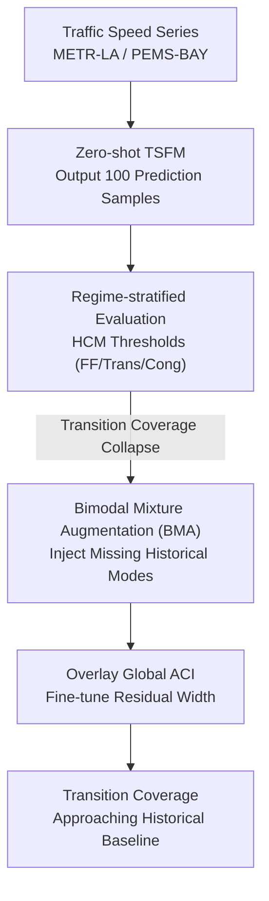

# Do Time Series Foundation Model Benchmarks Hide Regime-Dependent Failures? Evidence from Traffic Speed Forecasting

**Conference**: ICML2026  
**arXiv**: [2606.18367](https://arxiv.org/abs/2606.18367)  
**Code**: To be confirmed  
**Area**: Time Series / Foundation Model Evaluation  
**Keywords**: Time Series Foundation Models, Probabilistic Forecasting, Regime Switching, Benchmarking, Calibration

## TL;DR
This paper argues that Time Series Foundation Models (TSFMs) exhibit a phenomenon of "good average metrics but failure at critical moments" in traffic speed forecasting. By employing regime-stratified evaluation based on traffic states, the authors expose catastrophic failures masked by aggregate metrics and propose BMA (Bimodal Mixture Augmentation), a post-processing method that requires no retraining, to bring prediction interval coverage in "transition regimes" back to levels near historical baselines.

## Background & Motivation
**Background**: TSFMs (e.g., Chronos, Moirai) are positioned as "universal probabilistic forecasters," claiming to provide reliable predictive distributions zero-shot. Mainstream benchmarks (TSFM-Bench, GIFT-Eval) include traffic speed datasets like METR-LA and PEMS-BAY but only stratify by "domain" and "sampling frequency," never by the "operational regime" within the same domain.

**Limitations of Prior Work**: Traffic speed possesses a physical property—it undergoes **abrupt switches** between free-flow (~65 mph) and congestion (~10–20 mph), driven by hard capacity thresholds. In the "transition regime" of state switching, the ground-truth future distribution is **bimodal** (either maintaining high speed or plummeting), but zero-shot TSFMs output **unimodal** intervals with peaks stuck between the two true modes (~30–45 mph)—a speed range that rarely persists.

**Key Challenge**: Free-flow samples constitute the absolute majority of the data, causing aggregate metrics to be inflated by "easy states." A model can appear accurate and well-calibrated on average while failing completely at the transition moments where prediction is most needed. The root cause is not insufficient interval width (a width problem) but a mismatch in **distribution shape**—a unimodal interval cannot cover the 15 mph and 65 mph modes simultaneously, regardless of how much it is widened.

**Goal**: (1) Expose how aggregate metrics mask regime-dependent failures; (2) Develop a diagnostic protocol to make these failures visible; (3) Fix coverage in transition regimes without retraining the TSFM.

**Key Insight**: Leveraging traffic physics, the authors use speed thresholds from the Highway Capacity Manual (HCM) to classify each prediction window into free-flow, congestion, or transition states. They report errors and interval coverage **stratified by regime** rather than relying on a single average.

**Core Idea**: Use "regime-stratified evaluation" to debunk aggregate metric illusions, then apply "Bimodal Mixture Augmentation (BMA)" to inject the missing mode from the historical distribution into TSFM prediction samples, thereby repairing the distribution shape zero-shot.

## Method

### Overall Architecture
The paper does not propose a new forecasting model but rather a combination of an **evaluation protocol + post-processing repair**. The workflow is as follows: first, use HCM thresholds to label the target period of each (window, sensor) with one of three states; evaluate zero-shot TSFM samples stratified by regime to expose the "transition coverage collapse" hidden by averages; then, apply post-processing to the **cached TSFM samples** by supplementing missing bimodal patterns using historical conditional distributions (BMA); finally, optionally overlay Adaptive Conformal Prediction (ACI) to fine-tune residual width. The entire pipeline remains zero-shot for the TSFM backbone; all corrections occur at the output stage.

### Key Designs

**1. Regime-stratified Evaluation: Making Failures Visible**
The problem with aggregate metrics is that free-flow samples dominate, pulling average error and coverage to attractive levels. The authors use Level of Service (LOS) thresholds from the HCM to classify three states: speeds $>55$ mph for all steps are Free-flow (LOS A/B), speeds $<25$ mph for all steps are Congested (LOS E/F), and mixed/intermediate values are Transition (LOS C/D). These thresholds correspond to the bimodal distribution of individual congestion-sensitive sensors—peaks at ~18 mph and ~65 mph, and a trough at 30–40 mph. Stratification reveals the truth: at $h{=}12$ (60 minutes ahead), the overall MAE is only ~5.8 mph, but transition MAE surges to ~10–11 mph. Empirical coverage for a 90% nominal interval is near 90% in free-flow but drops as low as 54.9% in transition (Chronos-Bolt on PEMS-BAY)—a 35-percentage-point gap. This step requires no new models but reveals that "the model is least trustworthy when it is most needed."

**2. Historical Condition Baseline: Measuring the "Shape" Ceiling**
The authors design a "Historical Condition Baseline" without any predictive model: directly estimate the empirical conditional distribution $P(\text{speed}_{t+h} \mid \text{speed}_t)$ from training data and draw 100 samples during testing. While its overall MAE is poor (as it is indexed look-up, not forecasting), its transition coverage reaches 81–82% because it naturally samples from the bimodal historical distribution. This control group demonstrates the "ceiling" of transition coverage achievable purely through distribution shape and shows that TSFMs and historical look-ups are **complementary**—one has point accuracy but wrong shape, the other has correct shape but no accuracy.

**3. Bimodal Mixture Augmentation (BMA): Injecting Missing Modes**
This is the core repair mechanism targeting "shape mismatch" in the transition regime. It pre-calculates the historical transition probability $P(\text{speed}_{t+h} \in R \mid \text{speed}_t)$ for each sensor from training data (for each state $R$ and step $h$). At test time, a small fraction of the 100 TSFM prediction samples is **replaced** with samples drawn from the historical conditional distribution, with the replacement ratio modulated by the transition probability. Essentially, when historical data indicates a significant probability of switching to congestion, the missing mode near 15 mph is injected. The mixing weight $w \in [0.1, 0.5]$ is selected on 10 hold-out windows. Unlike widening intervals, which ACI does, BMA **moves probability mass** to fix missing modes. Because the ratio is modulated by transition probability, replacement is negligible in stable free-flow states ($P(\text{congested}) \approx 0$), preserving their coverage.

**4. BMA + ACI: Fixing Shape, Then Width**
BMA fixes the shape by injecting missing modes, but since the mixing weight $w$ is fixed per configuration, residual over- or under-coverage may remain. A layer of global ACI is then overlaid: it sequentially tracks a miscoverage rate $\alpha_t$, shrinking $\alpha_t$ (widening the interval) when recent observations fall outside the interval. The two are complementary—BMA manages shape (injecting modes), while ACI manages width (scaling intervals to close residual gaps). The authors intentionally use global ACI rather than regime-specific ACI because, once BMA corrects the shape, residual errors are sufficiently uniform across regimes, yielding no extra gain from regime-specific tuning.

### Loss & Training
No models are trained in this study. Three TSFMs (Chronos-T5-Base, Chronos-Bolt-Small, Moirai-1.1-R-Base) are run entirely zero-shot with a 14-hour context, generating 100 distribution samples (Bolt uses quantile interpolation for pseudo-samples). Evaluation is performed on 30 sensors randomly sampled from a pool of 50 congestion-sensitive sensors across three seeds (42/43/44) per dataset, with 50 test windows each. Horizons $h \in \{3, 6, 12\}$ (15/30/60 minutes) are used, reporting MAE and empirical coverage for the 90% interval, with coverage differences measured in percentage points (pp).

## Key Experimental Results

### Main Results
The table below shows MAE (mph) stratified by traffic state at $h{=}12$. TSFM overall MAEs are far better than the historical baseline, proving they provide real forecasting value. However, all methods drop to ~10–11 mph in the transition regime, as predicting the direction of the traffic switch is inherently difficult.

| Dataset | Method | Overall | Free-flow | Transition | Congested |
|---------|--------|---------|-----------|------------|-----------|
| METR-LA | Hist-Cond | 12.90 | — | 9.47 | — |
| METR-LA | Chronos-T5 | 5.77 | 2.13 | 9.83 | 1.19 |
| METR-LA | Moirai | 5.84 | 2.16 | 9.72 | 1.89 |
| PEMS-BAY| Hist-Cond | 3.11 | — | 11.05 | — |
| PEMS-BAY| Chronos-T5 | 3.07 | 1.35 | 11.04 | 2.70 |
| PEMS-BAY| Chronos-Bolt| 3.04 | 1.29 | 11.11 | 2.86 |

### Post-processing Coverage Comparison
The table below shows transition regime empirical coverage (%) at $h{=}12$ for a 90% nominal target. The historical baseline naturally achieves 81–82%. BMA approaches this level while maintaining TSFM point accuracy.

| Dataset | Model | Hist | Raw | Global ACI | Stratified ACI | BMA | +ACI |
|---------|-------|------|-----|------------|----------------|-----|------|
| METR-LA | Chr-T5 | 81.6 | 68.2 | 71.3 | 70.7 | 78.3 | 81.9 |
| METR-LA | Chr-Bolt | 81.6 | 68.6 | 69.7 | 70.2 | 78.7 | 80.3 |
| PEMS-BAY| Chr-T5 | 81.7 | 65.0 | 65.5 | 67.9 | 76.7 | 77.2 |
| PEMS-BAY| Chr-Bolt | 81.7 | 54.9 | 56.1 | 57.5 | 71.2 | 73.6 |

### Key Findings
- **Transition Regimes are the Disaster Zone**: Free-flow coverage stays near 90%, and congestion coverage shows only moderate drops (a width problem). Only transition regimes suffer severe under-coverage (a shape problem); Chronos-Bolt on PEMS-BAY drops to 54.9% (−35 pp). ACI-LR baselines are even worse in transitions (−48 pp), proving that widening intervals cannot fix shape.
- **BMA Provides Largest, Targeted Gains**: BMA improves transition coverage by +2.6 pp (Moirai/PEMS-BAY) to +16.3 pp (Chronos-Bolt/PEMS-BAY). Models with the worst raw coverage benefit most—Chronos-Bolt jumps from 54.9% to 71.2%.
- **Complementary Overlay**: BMA + Global ACI adds another 1–2 pp on top of BMA. The "fix shape, then width" approach yields the best results. BMA is stable for $w \in [0.2, 0.5]$, degrading only when $w < 0.1$.
- **Cost**: Interval width increases by approximately 50–80%. Whether this trade-off of sharpness for coverage is acceptable depends on the application.

## Highlights & Insights
- **Concrete Evidence that "Average Metrics Deceive"**: The paper provides a physics-grounded (bimodal speed distribution) example of how aggregate metrics mask catastrophic failures. This diagnostic logic is transferable to any domain with physical threshold switching, such as electricity prices (normal/spike) or wind power (cut-in speeds).
- **Distinguishing "Width Problems" vs. "Shape Problems"**: Categorizing calibration failure into "intervals too narrow" (congested state, fixable by ACI) and "wrong distribution shape" (transition state, unfixable by ACI) is the paper’s most lucid insight—it explains why conformal methods fail in transition regimes.
- **Clever Handling of the Zero-shot Boundary**: BMA uses per-sensor historical data similar to how conformal methods use historical residuals. The TSFM backbone remains zero-shot, with corrections occurring only at the output, making the method compatible with closed-source models.

## Limitations & Future Work
- The authors acknowledge that the evaluation only used 30 congestion-sensitive sensors and univariate forecasting; spatial information from upstream/downstream sensors could potentially improve both accuracy and coverage.
- BMA mixing weights were tuned on 10 hold-out windows; the authors admit a standard validation set would be more rigorous. The 50–80% increase in interval width is the specific cost of trading sharpness for coverage.
- An open question: Would fine-tuning TSFMs directly on traffic data enable them to produce bimodal predictions natively, thereby closing the gap? The paper does not explore this, though BMA remains valuable when fine-tuning is infeasible or models are closed.
- Individual view: The three-state thresholds (25/55 mph) come from the HCM; applying this to non-traffic domains would require re-calibration of thresholds, limiting "plug-and-play" versatility. Furthermore, the shape mismatch for shorter horizons was not fully discussed.

## Related Work & Insights
- **vs. Adaptive Conformal Inference (ACI & variants)**: ACI, regime-specific ACI, and other conformal methods for regime-switching sequences only adjust interval **width**. They cannot move probability mass to fill missing modes. This paper identifies transition regimes as a shape problem that widening (even to −48 pp) cannot solve.
- **vs. Specialized Traffic Uncertainty Quantification (Wu et al. 2023, Zheng et al. 2025)**: These works focus on uncertainty quantification for deep traffic models but require training domain-specific architectures and do not evaluate zero-shot TSFMs. This paper focuses on diagnosis and post-hoc repair for zero-shot TSFMs.
- **vs. General TSFM Calibration Studies (Adler et al. 2025)**: While they found foundation models are "better calibrated" across six general datasets, they did not include high-frequency traffic data. This paper fills that gap using a high-frequency, abrupt-switching scenario that exposes hidden flaws.

## Rating
- Novelty: ⭐⭐⭐⭐ Not a new model, but a new evaluation perspective + lightweight repair; the "stratified debunking" is highly effective.
- Experimental Thoroughness: ⭐⭐⭐⭐ Solid across two benchmarks, three TSFMs, three-state stratification, and four post-processing comparisons, though sensor count and horizon coverage are narrow.
- Writing Quality: ⭐⭐⭐⭐⭐ Extremely clear explanation of "width vs. shape," with a clean chain of logic.
- Value: ⭐⭐⭐⭐ Significant cautionary implications for TSFM evaluation paradigms; BMA is a useful "plug-and-play" tool for practical deployment.

<!-- RELATED:START -->

## Related Papers

- [\[ICML 2026\] It's TIME: Towards the Next Generation of Time Series Forecasting Benchmarks](its_time_towards_the_next_generation_of_time_series_forecasting_benchmarks.md)
- [\[AAAI 2026\] A Unified Shape-Aware Foundation Model for Time Series Classification](../../AAAI2026/time_series/a_unified_shape-aware_foundation_model_for_time_series_class.md)
- [\[AAAI 2026\] ProbFM: Probabilistic Time Series Foundation Model with Uncertainty Decomposition](../../AAAI2026/time_series/probfm_probabilistic_time_series_foundation_model_with_uncertainty_decomposition.md)
- [\[ICML 2026\] Mix, Don't Pick: Why Synthetic Corpus Composition Matters for Time Series Foundation Model Pretraining](mix_dont_pick_why_synthetic_corpus_composition_matters_for_time_series_foundatio.md)
- [\[ICLR 2026\] Adapt Data to Model: Adaptive Transformation Optimization for Domain-shared Time Series Foundation Models](../../ICLR2026/time_series/adapt_data_to_model_adaptive_transformation_optimization_for_domain-shared_time_.md)

<!-- RELATED:END -->
