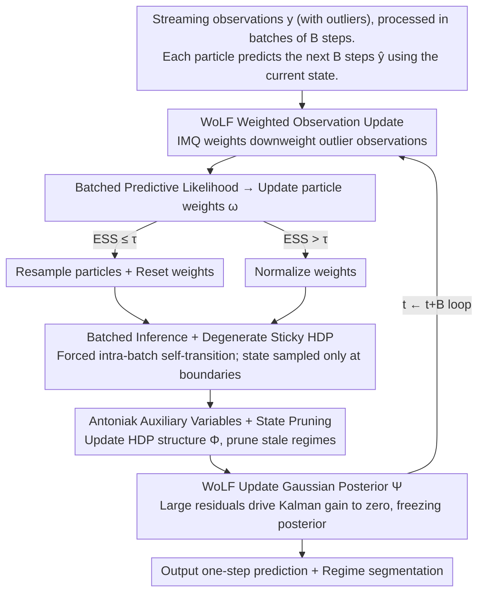

# Doubly Outlier-Robust Online Infinite Hidden Markov Model

**Conference**: ICML 2026  
**arXiv**: [2604.14322](https://arxiv.org/abs/2604.14322)  
**Code**: None  
**Area**: Time Series / Bayesian Online Learning / Regime Switching  
**Keywords**: Infinite Hidden Markov Model, Online Inference, Robust Bayes, Outliers, Posterior Influence Function

## TL;DR
This paper proposes BR-iHMM, which combines "robust observation updates (WoLF)" with "batched state inference (degenerate sticky HDP prior)." It provides bounded Posterior Influence Functions (PIFs) in both the observation and state spaces for online infinite Hidden Markov Models. On streaming data containing outliers—including financial order books, electricity loads, and synthetic regressions—it reduces one-step-ahead prediction RMSE by up to 67%.

## Background & Motivation

**Background**: There are two main paradigms for handling non-stationary streaming data. Bayesian Changepoint Detection (BOCD) and Kalman filtering "reset or forget" whenever a changepoint is detected, failing to reuse historical regimes. Online iHMMs (HDP-iHMM) maintain a reusable regime library, allowing rapid return when historical regimes recur, making them more suitable for scenarios like finance, power grids, and continual learning where "old regimes reappear + occasional new regimes occur."

**Limitations of Prior Work**: The flexibility of iHMM is a double-edged sword. An outlier simultaneously (i) pollutes the parameter posterior of the current regime, degrading subsequent predictions; and (ii) misleads the model into assuming a new regime has emerged, creating spurious states that damage interpretability and accuracy. Existing robust methods either focus only on the observation space (Robust KF/WoLF) or involve offline iHMM pruning in the state space, failing to address both simultaneously in an online setting.

**Key Challenge**: Within the HDP-iHMM framework, "observation robustness" and "state robustness" are **independent** PIF dimensions. The authors prove Theorem 4.1: even if the observation side uses WoLF to ensure a bounded PIF$_{\theta_t}$, the state-side PIF$_{s_t}$ can still be driven to infinity by outliers (as large residuals make a "new regime" under the HDP prior appear most attractive).

**Goal**: (1) Formally define the double robustness of online iHMM; (2) design an algorithm that simultaneously bounds PIF$_{\theta_t}$ and PIF$_{s_t}$; (3) maintain online real-time performance without sacrificing computational complexity.

**Key Insight**: The observation side reuses the WoLF framework under generalized Bayes (downweighting outlier likelihood using IMQ weights). The state side draws inspiration from batch inference—**a single outlier is insufficient to create a new regime; consistent evidence from multiple consecutive observations is required**.

**Core Idea**: A "degenerate sticky HDP prior" is used to force state transitions to batch boundaries (intra-batch self-transition probability $\kappa_t=\infty$, inter-batch $\kappa_t=0$), requiring a new regime to accumulate sufficient evidence within a window of length $B$. This also provides a tunable robustness-adaptivity trade-off parameter $B$.

## Method

### Overall Architecture
BR-iHMM aims to make online iHMM resistant to outliers in **both** observation and state spaces. The inference is performed using Particle Learning (SMC) in batches of $B$ steps. Within each batch, each particle uses its state $s_t^{(i)}$ to predict the next $B$ steps $\hat y_{t+1:t+B}$. Observations are then downweighted using IMQ weights $w_{l,t}^{(i)} = W(y_{t+b}, \hat y_{l,t+b|t})$ to calculate the batched predictive likelihood as particle weights $\omega$. If ESS is too low, resampling is performed. Then, the entire state path is sampled once using a batched posterior $\nu(s_{1:t+B})$ that only allows state transitions at batch boundaries. Finally, HDP structural parameters $\Phi$ are updated using Antoniak auxiliary variables, and the Gaussian posterior $\Psi$ of active states is updated via WoLF. The key lies in forcing internal self-transitions so that state sampling occurs only once per batch, avoiding the exponential path explosion caused by batch length $B$.

### Key Designs

**1. WoLF Weighted Observation Update: Hard-capping the influence of a single extreme observation on the parameter posterior**

The PIF of standard Bayesian updates under a linear Gaussian model is unbounded—an arbitrarily large residual can bias the posterior, allowing a single extreme observation to pollute the current regime's parameters. WoLF replaces the likelihood with a weighted likelihood $P(y_t\mid\theta,x_t)^{W(y_t,\hat y_{s_t})^2}$, where the weight takes an IMQ form $W(y,\hat y)^2 = 1/(1 + c^{-2}\|y-\hat y\|_{R_t}^2)$. It maintains conjugacy under linear Gaussian emissions; the closed-form update simply replaces the covariance $S_{s_t}$ in the Kalman gain with $S_{s_t} = f(x_t)\Sigma_{s_t}f(x_t)^\top + R_t/w_{s_t,t|t-1}^2$. As residuals increase, $w^2 \to 0$ and $S_{s_t}\to\infty$, causing the Kalman gain to approach 0 and the posterior to freeze. This locks the PIF$_{\theta_t}$ without losing the online efficiency provided by conjugacy.

**2. Batched Inference + Degenerate Sticky HDP: Requiring consecutive evidence for the birth of a "new regime"**

Observation robustness alone is insufficient—Theorem 4.1 proves that even if PIF$_{\theta_t}$ is bounded, the state-side PIF$_{s_t}$ can still be driven to infinity by outliers because large residuals make "starting a new regime" the most attractive option under the HDP prior. BR-iHMM shifts state decisions to the batch level by defining a batched log posterior $\log\nu(s_{1:t+B}) = \sum_{b=1}^B w_{s_{t+b},t+b|t}^2\log P(y_{t+b}\mid\dots) + \log\sum_{s_{1:t}}P(s_{1:t}|D)P(s_{t+1}|s_t,\Phi_t)\prod_{b=2}^B\mathbb{1}(s_{t+b-1}=s_{t+b})$. The self-transition bias $\kappa_t$ of a sticky HDP is taken to its limit—intra-batch $\kappa_t=\infty$ (forcing state consistency) and inter-batch $\kappa_t=0$. This generalizes the PIF from "single-point perturbation" to "short-sequence perturbation" (batched PIF). The path posterior will only switch if multiple observations within a batch consistently support a new regime. Parameter $B$ thus becomes an interpretable robustness-adaptivity knob—larger $B$ increases resistance to persistent noise but increases the delay in detecting real transitions.

**3. Antoniak Auxiliary Variables + State Pruning: Constant streaming bookkeeping under the nominal infinite state model**

Although iHMM nominally allows infinite states, without pruning, the counting matrix $\mathbf{N}_t \in \mathbb{N}^{t\times t}$ would explode over time. In each batch, BR-iHMM uses $\mathbf{M}_t \sim \text{Antoniak}(\mathbf{N}_t,\alpha,\beta)$ to sample auxiliary variables for updating the HDP global weights $\hat\beta_t$. For particles exceeding MAX_STATES, stale regimes are removed using heuristics based on frequency and recency. This keeps the number of states at a constant level, while Propositions D.1/D.2 guarantee that the complexity of the batched mechanism remains $O(1)$ state samplings per batch—ensuring that scalability does not conflict with double robustness.

### Loss & Training
- No NN training; pure Bayesian online inference. Implemented in JAX on an RTX 3090.
- Hyperparameters $B$, IMQ threshold $c$, ESS threshold $\tau_{\text{ESS}}$, and particle count $N$ are tuned via bayesian-optimization on training partitions.
- Concentration parameters $\hat\alpha_0,\hat\gamma_0\sim\text{Gam}(1,1)$ use non-informative priors with Escobar–West conjugate updates.

## Key Experimental Results

### Main Results
One-step-ahead prediction RMSE (mean ± stdev of 100 runs):

| Model | Synthetic ($d=100$, 1% outlier) | Electricity | OFI |
|------|------|------|------|
| BOCD | 123.12 ± 0.014 | 0.80 ± 0.11 | 0.733 |
| iHMM | 101.7 ± 0.026 | 0.57 ± 0.03 | 0.620 ± 0.080 |
| WoLF-iHMM | 103.8 ± 0.012 | 0.63 ± 0.03 | 0.623 ± 0.089 |
| **BR-iHMM (ours)** | **46.1 ± 0.003** | **0.47 ± 0.04** | **0.616 ± 0.082** |
| offline-iHMM (oracle) | 2.9 | 0.32 | 0.552 |

On the Synthetic task, BR-iHMM reduces RMSE by approximately 55% compared to iHMM and 63% compared to BOCD. On electricity data, BR-iHMM is the only online model to identify the regime switch caused by COVID-19 in March 2020; both iHMM and WoLF-iHMM remained trapped in a single regime.

### Ablation Study

| Configuration | Synthetic RMSE | Failure Mode |
|------|------|------|
| iHMM (Baseline) | 101.7 | 30+ spurious regimes; every outlier triggers a new state |
| WoLF-iHMM (Observation robustness only) | 103.8 | Parameter posterior stable but state still fragments; **slightly worse than pure iHMM** |
| BR-iHMM (B=1) | ≈100 | Equivalent to WoLF-iHMM |
| **BR-iHMM (B>1)** | **46.1** | Stable after short-term calibration; recovers the true 3 regimes |

### Key Findings
- **Single Robustness is Insufficient**: WoLF-iHMM performs slightly worse than iHMM, validating Theorem 4.1—making only the observations robust allows the PIF$_{s_t}$ to dominate the failure mode.
- **B is the Critical Trade-off Parameter**: $B$ balances robustness to short-term noise against detection delay for real switches. OFI (finance) prefers a smaller $B$, while Electricity prefers a larger one.
- **Complexity Advantage**: In standard iHMM, allowing arbitrary transitions within a batch leads to an exponential number of paths in $B$. Degenerate sticky HDP reduces this to a single state sampling per batch, making complexity independent of $B$.
- **Win-Win for Prediction and Segmentation**: BR-iHMM also outperforms DSM-BOCD and iHMM on changepoint detection metrics.

## Highlights & Insights
- **Theory-Driven**: The work rigorously defines "robustness" as a bounded PIF and uses Theorems 4.1/4.2 to prove that double robustness is a necessary condition.
- **Batch-PIF Concept**: Generalizing PIF from single points to sequences provides the interpretable parameter $B$. This "batched robustness" can be transferred to other online Bayesian models like GPs or streaming VI.
- **Dual use of Degenerate Sticky HDP**: It serves both as a mathematical contraction of the state space (limit of $\kappa_t\in\{0,\infty\}$) and a computational tool to eliminate exponential path explosion.
- **Counter-intuitive Discovery in Theorem 4.1**: Simply strengthening observation robustness can worsen state inference (as compressed residuals increase the relative likelihood of a "new regime"), serving as a warning for future work.

## Limitations & Future Work
- Full derivations are only provided for LG emissions; extension to exponential families is claimed but not empirically validated.
- $B$ is a fixed-a-priori hyperparameter requiring BayesOpt; adaptive $B$ (e.g., based on SNR) is a natural extension.
- Pruning heuristics (frequency + recency) are relatively coarse and might accidentally delete long-tail regimes; there is no theoretical guarantee that pruning preserves PIF bounds.
- The maximum dimensionality tested is $d=100$; the efficacy of IMQ weights in ultra-high-dimensional scenarios (e.g., image features) is unverified.
- The offline oracle still significantly outperforms BR-iHMM, indicating a substantial online-offline gap due to SMC particle limits and burn-in constraints.

## Related Work & Insights
- **vs. Standard iHMM (Beal et al. 2001; Teh et al. 2006)**: Adds double robustness with negligible computational overhead.
- **vs. WoLF (Duran-Martin et al. 2024)**: WoLF only handles robustness for single-state LG models; this work embeds it into the multi-state HDP-iHMM framework with state-space robustness.
- **vs. DSM-BOCD (Altamirano et al. 2023)**: BOCD lacks regime reuse; this work maintains both robustness and reuse.
- **vs. Offline iHMM (Van Gael et al. 2008)**: The latter uses MCMC beam sampling to reach oracle performance but requires 1,000 iterations; BR-iHMM achieves results in a single online pass.

## Rating
- Novelty: ⭐⭐⭐⭐ Combination of "double robustness" formalization and batched degenerate sticky HDP is highly novel.
- Experimental Thoroughness: ⭐⭐⭐⭐ Synthetic, electricity, and order book data with 100 repeats, though dimensions are relatively low.
- Writing Quality: ⭐⭐⭐⭐ PIF definitions, theorem proofs, and pseudocode are clearly organized.
- Value: ⭐⭐⭐⭐ Provides a complete toolchain for scenarios requiring both historical regime reuse and outlier resistance.

<!-- RELATED:START -->

## Related Papers

- [\[ICML 2026\] DistMatch: Adaptive Binning via Distribution Matching for Robust Sequential Conformal](distmatch_adaptive_binning_via_distribution_matching_for_robust_sequential_confo.md)
- [\[ICML 2026\] Divide and Contrast: Learning Robust Temporal Features Without Augmentation](divide_and_contrast_learning_robust_temporal_features_without_augmentation.md)
- [\[ICLR 2026\] Online Time Series Prediction Using Feature Adjustment](../../ICLR2026/time_series/online_time_series_prediction_using_feature_adjustment.md)
- [\[ICLR 2026\] ST-HHOL: Spatio-Temporal Hierarchical Hypergraph Online Learning for Crime Prediction](../../ICLR2026/time_series/st-hhol_spatio-temporal_hierarchical_hypergraph_online_learning_for_crime_predic.md)
- [\[ICLR 2026\] Delta-XAI: A Unified Framework for Explaining Prediction Changes in Online Time Series Monitoring](../../ICLR2026/time_series/delta-xai_a_unified_framework_for_explaining_prediction_changes_in_online_time_s.md)

<!-- RELATED:END -->
