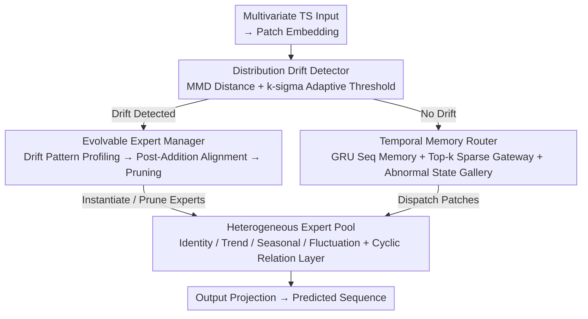

# Dynamic-TMoE: A Drift-Aware Dynamic Mixture of Experts Framework for Non-Stationary Time Series

**Conference**: ICML 2026  
**arXiv**: [2605.20678](https://arxiv.org/abs/2605.20678)  
**Code**: TBD  
**Area**: Time Series / Mixture of Experts  
**Keywords**: Time Series Forecasting, Dynamic Experts, Distribution Drift Detection, Mixture-of-Experts (MoE), Non-stationary Data

## TL;DR
By utilizing **MMD to detect distribution drifts** and dynamically expanding a heterogeneous expert pool combined with a **Temporal Memory Router** to ensure selection consistency, Dynamic-TMoE achieves new SOTA results across nine time-series benchmarks—reducing MSE by 10.4% and MAE by 7.8% on average compared to all baselines.

## Background & Motivation

**Background**: Time series forecasting is a cornerstone for critical decision-making systems ranging from energy management to healthcare monitoring. However, real-world time series are inherently non-stationary, characterized by continuous distribution drifts and evolving temporal dependencies.

**Limitations of Prior Work**: Existing methods primarily fall into two categories: input-level normalization (RevIN, SAN, IN-Flow), which maps non-stationary inputs to stable distributions via a remove-predict-restore paradigm but often discards non-stationary signals crucial for prediction; and in-model adaptation (Non-stationary Transformer, Koopa, TimeStacker), which redesigns attention or utilizes physical/spectral dynamics to capture evolving features, yet suffers from a lack of modularity in monolithic architectures. Recent MoE approaches (TFPS, Time-MoE) employ static expert pools and memoryless routing, failing to adapt to abrupt distribution drifts.

**Key Challenge**: MoE frameworks face two fundamental issues—(1) **Temporal Rigidity**: Fixed expert pools cannot accommodate new patterns arising from severe distribution drifts, and memoryless gateways ignore temporal continuity, leading to unstable selection; (2) **Insufficient Specialization**: Homogeneous experts lack functional diversity and cannot decouple different drift components (trend vs. seasonality).

**Goal**: To design an MoE framework capable of adapting to evolving distributions while maintaining selection consistency.

**Key Insight**: (1) Distribution drifts can be quantified via MMD to trigger expert pool evolution; (2) temporal continuity can be maintained through a GRU router with historical memory; (3) heterogeneous expert designs can specialize in different temporal patterns.

**Core Idea**: Dynamically expand and prune a heterogeneous expert pool during the learning phase (based on drift detection) while ensuring context-aware stable selection using a temporal memory router supported by an abnormal state gallery.

## Method

### Overall Architecture
Dynamic-TMoE targets two weaknesses of existing MoE in non-stationary time series: fixed expert pools failing to house new distributions and memoryless routing ignoring temporal continuity. It structures the framework as a "perception-decision-adaptation" loop. After patch embedding, the distribution drift detector first senses changes (perception). The temporal memory router then stably selects experts (decision). The evolvable expert manager expands or prunes the expert pool upon detecting drifts (adaptation). The underlying layer is a heterogeneous expert pool: Identity, Trend, Seasonal, and Fluctuation experts are permanent, while drift experts are instantiated on demand. Patch embedding and output projection serve as the structural scaffolding.

### Key Designs

**1. MMD Drift Detection + Adaptive Threshold: Monitoring distribution changes via kernel methods with dynamic noise-level thresholds**

In non-stationary time series, distributions change abruptly. Fixed-threshold residual monitoring is either too insensitive or mistakes noise for drift. Dynamic-TMoE calculates the MMD distance between a reference window and the current window using an RBF kernel: $\mathcal{D}_{\text{mmd}}^2 = \frac{1}{N_r^2}\sum_{i,j}k(x_i^{\text{ref}},x_j^{\text{ref}}) - \frac{2}{N_r N_c}\sum_{i,j}k(x_i^{\text{ref}},x_j) + \frac{1}{N_c^2}\sum_{i,j}k(x_i,x_j)$. This captures complex distribution shifts better than simple residuals. The threshold is dynamically set via the k-sigma rule: $\epsilon = \mu_\mathcal{H} + \lambda\sigma_\mathcal{H}$, triggering the expert manager only when $\mathcal{D}_{\text{mmd}}^2 > \epsilon$. This allows the model to ignore time-varying noise while capturing sudden changes, with generalization bounds proving that increased MMD directly raises the upper bound of target prediction risk.

**2. Temporal Memory Router + Abnormal State Gallery: Context-aware and stable selection over an evolving expert pool**

Memoryless routing causes experts to oscillate between adjacent patches, breaking temporal continuity, while recurring drifts require redundant "cold-start" adaptations. Dynamic-TMoE utilizes a GRU to maintain hidden states $\mathbf{h}_t = \text{GRU}(\phi(\mathbf{x}_{p,t}),\mathbf{h}_{t-1})$, which are projected into expert logits for a Top-k sparse gateway. The GRU's sequential memory ensures smooth selection. The abnormal state gallery $\mathcal{A}$ stores hidden states from previous drifts; during routing, relevant history is retrieved via cosine similarity and fused using a learnable gateway $\tilde{\mathbf{h}}_t = \alpha\mathbf{h}_t + (1-\alpha)\mathbf{h}_{\text{ref}}$. This allows the model to recall old states for accelerated adaptation when a known drift recurs.

**3. Evolvable Expert Manager: Purposeful pool expansion and discreet pruning upon drift detection**

Drifts should not trigger blind expert addition—incorrect types are useless, and excessive numbers slow down inference. The evolvable expert manager treats the pool as a dynamic system with a lifecycle (conducted during training). It employs three components: ① The Drift Pattern Profiler diagnoses exactly what pattern the model missed by calculating trend scores ($R^2$ of residual linear regression), seasonal scores (spectral energy concentration), and fluctuation scores (high-frequency ratio) to instantiate the best-matching expert type. ② Post-Addition Alignment addresses cold-start perturbations by freezing existing experts and the router backbone, fine-tuning only the new expert and router heads on concatenated drift data ($\mathcal{W}^{\text{ref}}$ and $\mathcal{W}^{\text{cur}}$). ③ The Expert Usage Tracker handles pruning by monitoring average routing weights over a window, using a patience constraint $L$ to avoid accidental deletion.

**4. Heterogeneous Expert Design + Cyclic Relation Layer: Decoupling temporal components and explicitly modeling inter-variable correlations**

Homogeneous experts fail to separate coexisting yet heterogeneous components like trend and seasonality. Dynamic-TMoE assigns specific architectures with different inductive biases: Identity experts $E_{\text{id}} = \text{Linear}(\mathbf{X}_p)$ preserve information and stabilize gradients; Trend experts $E_{\text{trend}} = \text{MLP}(\text{AvgPool}(\mathbf{X}_p))$ use average pooling as a low-pass filter; Seasonal experts operate in the frequency domain $\mathbf{Z} = \text{iFFT}(\text{MLP}(\text{FFT}(\mathbf{X}_p)))$ with $\sin/\cos$ activations; Fluctuation experts use causal convolutions + GLU for local high-frequency captures. On top, a Cyclic Relation Layer models inter-variable correlations by maintaining a learnable cyclic prototype $\mathcal{R}_{\text{cycle}}$ and adding MLP-corrected residuals: $\mathcal{R}_{\text{final}} = \mathcal{R}_{\text{cycle}}[t] + \text{MLP}(\mathcal{R}_{\text{cur}} - \mathcal{R}_{\text{cycle}}[t])$.

## Key Experimental Results

### Main Results

| Dataset | Metric | **Dynamic-TMoE** | TFPS | ST-MTM | RAFT | Gain vs TFPS |
|--------|------|-------------|------|--------|------|------------|
| Weather | MSE | **0.240** | 0.241 | 0.262 | 0.271 | ↓0.4% |
| Exchange | MSE | **0.351** | 0.395 | 0.408 | 0.432 | ↓11.1% |
| ETTh1 | MSE | **0.429** | 0.448 | 0.432 | 0.432 | ↓4.2% |
| Electricity | MSE | **0.170** | 0.183 | 0.208 | 0.184 | ↓7.1% |
| ILI | MSE | **1.981** | 2.642 | 2.820 | 5.916 | ↓25.0% |

Of 18 metrics, Ours ranked in the top 2 sixteen times (11 first place, 5 second place).

### Ablation Study

| Config | Drift-Aware | Temp. Memory | Gallery | ETTh1 MSE | Weather MSE |
|------|--------|--------|-------|-----------|-------------|
| ① Full | ✓ | GRU | ✓ | **0.429** | **0.240** |
| ② W/o Drift | ✗ | GRU | ✓ | 0.436 | 0.246 |
| ③ Linear Router | ✓ | Linear | ✓ | 0.436 | 0.247 |
| ④ MLP Router | ✓ | MLP | ✓ | 0.438 | 0.245 |
| ⑤ W/o Gallery | ✓ | GRU | ✗ | 0.438 | 0.246 |
| Hetero. → Homo. | ✓ | GRU | ✓ | 0.440 | 0.246 |

### Key Findings
- Both drift awareness and temporal continuity are necessary for non-stationarity; removing either leads to significant degradation.
- GRU routing improves performance by 1.6%-2.1% over static routing, proving sequential memory is vital for expert allocation.
- Heterogeneous experts provide a 2.5% gain over homogeneous designs by decoupling complex distributions.
- The Relation Layer (cyclic correlation) improves results by 2.8%.
- The Abnormal State Gallery provides a smaller gain (< 1%) but significantly improves stability on datasets with periodic drifts.

## Highlights & Insights
- **The Trinity of Dynamic-Heterogeneous-Memory**: The framework unifies architecture evolution (dynamic experts), functional diversity (heterogeneous design), and temporal consistency (memory routing).
- **MMD as a Drift Signal**: Kernel methods capture complex distribution changes more effectively than fixed thresholds or simple residuals; the k-sigma adaptive threshold prevents over-sensitivity.
- **Engineering Wisdom in Cold-Start Alignment**: Freezing existing parameters and fine-tuning only the new expert on drift data prevents catastrophic forgetting during knowledge integration.
- **Frequency Domain Design for Seasonality**: The FFT-MLP-iFFT path combined with periodic activation provides a reusable pattern for time-series decomposition.

## Limitations & Future Work
- Computational overhead: Specific data on MMD calculation, GRU inference, and expert addition costs in large-scale data are not fully explored.
- Hyperparameter sensitivity: Analyses for the drift threshold $\lambda$ and fusion coefficient $\alpha$ are mostly relegated to supplementary materials.
- Generalization boundaries: Theoretical characterization of which drift patterns remain manageable is not fully established.
- Future work: Online learning paradigms, adaptive hyperparameters, and memory/indexing efficiency for ultra-long sequences.

## Related Work & Insights
- **vs RevIN / IN-Flow**: These seek distribution invariance but discard signals; Dynamic-TMoE retains and utilizes these signals via heterogeneous experts.
- **vs Non-stationary Transformer**: Monolithic architectures struggle to specialize in coexisting patterns; this work decomposes complexity via MoE.
- **vs TFPS / Time-MoE**: Previous MoEs use static homogeneous pools and stateless routing; Dynamic-TMoE introduces dynamic heterogeneous pools and temporal memory.
- **vs Koopa / DERITS**: While these use global frequency processing, the seasonal experts here refine frequency data back into the time domain for more flexible strategies.

## Rating
- Novelty: ⭐⭐⭐⭐⭐ Extending MoE from static to dynamic, homogeneous to heterogeneous, and stateless to memory-based.
- Experimental Thoroughness: ⭐⭐⭐⭐⭐ 9 datasets, multiple baselines, full ablation, and multiple prediction lengths.
- Writing Quality: ⭐⭐⭐⭐ Clear logic and detailed methods, though some details are in the appendix.
- Value: ⭐⭐⭐⭐⭐ Addresses the core issues of non-stationary TS forecasting (drift and continuity) with high industrial potential (finance, energy, healthcare).

<!-- RELATED:START -->

## Related Papers

- [\[ICML 2026\] Parametric Prior Mapping Framework for Non-stationary Probabilistic Time Series Forecasting](parametric_prior_mapping_framework_for_non-stationary_probabilistic_time_series_.md)
- [\[AAAI 2026\] Task-Aware Retrieval Augmentation for Dynamic Recommendation](../../AAAI2026/time_series/task-aware_retrieval_augmentation_for_dynamic_recommendation.md)
- [\[ICML 2026\] Learning Long Range Spatio-Temporal Representations over Continuous Time Dynamic Graphs with State Space Models](learning_long_range_spatio-temporal_representations_over_continuous_time_dynamic.md)
- [\[AAAI 2026\] Towards Non-Stationary Time Series Forecasting with Temporal Stabilization and Frequency Differencing](../../AAAI2026/time_series/towards_non-stationary_time_series_forecasting_with_temporal_stabilization_and_f.md)
- [\[AAAI 2026\] M2FMoE: Multi-Resolution Multi-View Frequency Mixture-of-Experts for Extreme-Adaptive Time Series Forecasting](../../AAAI2026/time_series/m2fmoe_multi-resolution_multi-view_frequency_mixture-of-experts_for_extreme-adap.md)

<!-- RELATED:END -->
