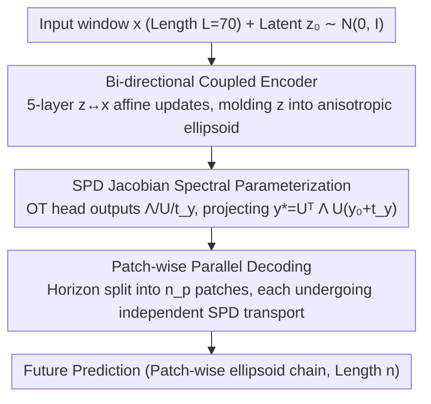

# Ellipsoidal Time Series Forecasting

**Conference**: ICML 2026  
**arXiv**: [2505.17370](https://arxiv.org/abs/2505.17370)  
**Code**: None  
**Area**: Time Series Forecasting / Optimal Transport / Dynamical Systems  
**Keywords**: Long-term Forecasting, SPD Jacobian, Brenier’s Theorem, Ellipsoidal Transport, Non-stationary Robustness

## TL;DR
Fern reformulates long-term time series forecasting (LTSF) as "optimal transport from a fixed Gaussian source to a data-dependent ellipsoid." By leveraging Brenier’s Theorem, it restricts the search space to the Symmetric Positive Definite (SPD) Jacobian class. Utilizing low-rank spectral decomposition via Householder reflections, it reduces computational complexity from $O(n^3)$ to $O(Rn)$ and achieves up to a 790× stability improvement over baselines like DLinear and Koopa in non-stationary shock scenarios.

## Background & Motivation

**Background**: The LTSF community has produced strong baselines such as PatchTST, DLinear, Koopa, and iTransformer. Mainstream approaches either employ channel-independent (CI) linear heads to fit conditional means or use channel-dependent (CD) Transformers to mix multiple channels. Performance benchmarks have become highly competitive, with ongoing debate between CI and CD architectures.

**Limitations of Prior Work**: The authors argue that existing evaluations mask model fragility in non-stationary scenarios. Most benchmarks (Electricity, Traffic, Weather) feature mild drifts; however, in the presence of regime shifts, chaotic shocks, or true stochastic noise, strong baselines collapse rapidly. Point metrics like MSE fail to identify specific failure segments. Furthermore, traditionally "modeling the Jacobian" in an $n$-dimensional horizon requires $n^2$ components, and eigen-decomposition incurs $O(n^3)$ costs, making it computationally prohibitive.

**Key Challenge**: Effective long-term forecasting needs to preserve **local geometric structure** (spectral information indicating where the system stretches most) while remaining within **computational budgets**. Searching for an arbitrary $n \times n$ matrix is both expensive and lacks necessary structure.

**Goal**: (1) Develop a predictor that is both data-dependent and geometry-aware; (2) treat spectral structure as "intrinsic parameters" rather than "post-hoc byproducts"; (3) design evaluation protocols that expose model fragility under non-stationary conditions.

**Key Insight**: The authors shift the perspective from "$x \to y$ temporal evolution" to "transport from a fixed Gaussian source $\mathcal{N}(0, I)$ to the target distribution." When the target is restricted to a Gaussian, Brenier’s Theorem states that the optimal transport map is uniquely affine (SPD scaling + translation), naturally constraining the Jacobian to the SPD cone.

**Core Idea**: Instead of learning an implicit non-linear mapping and then calculating its Jacobian, the model directly parameterizes an SPD matrix $A = U^\top \Lambda U$ using Householder reflections and diagonal spectra as the optimal transport map. This allows spectral information (eigenvalues, eigenvectors) to serve as built-in explainable diagnostics.

## Method

### Overall Architecture
The Fern pipeline is a compact model featuring "bi-directional coupled encoding + SPD projection." The input is a univariate time series window $x$ of length $L$ (e.g., 70), and the output is a future patch prediction of length $n$ (e.g., 24). Long horizons are decoded in parallel via patching. Intermediate states include a low-dimensional Gaussian latent variable $z \sim \mathcal{N}(\mu(x), \Sigma(x))$ and a fixed noise source $y_0 \sim \mathcal{N}(0, I)$. The final prediction $y^* = U^\top \Lambda U (y_0 + t_y)$ "molds" the noise into the target ellipsoid.

The architecture follows the channel-independent principle: each channel is processed separately. Based on Takens' Embedding Theorem, single-channel time-delay embeddings are topologically sufficient to reconstruct the attractor, obviating the need for explicit cross-channel mixing. The workflow consists of three steps:

### Key Designs

**1. Bi-directional Coupled Encoder: Compressing Context into Anisotropic Ellipsoids via Latent Variables**
To connect with the SPD projection, a low-dimensional Gaussian summarizing the window's geometry is required. Direct estimation via formulas like $s(x) \odot x$ causes gradient explosion. Inspired by ANFs, Fern introduces latent variable $z$ and 5 layers of affine coupling blocks. Each layer uses a head to generate four vectors $(s^i_x, t^i_x, s^i_z, t^i_z)$, iteratively updating $z^{i+1} = s^i_z \odot z^i + t^i_z$ and $x^{i+1} = s^i_x \odot x^i + t^i_x$. This transforms initial isotropic $z \sim \mathcal{N}(0, I)$ into an anisotropic ellipsoid. This intermediate channel stabilizes training and ensures attractor information from Takens' embedding is compressed into the Gaussian via diffeomorphism.

**2. Spectral Parameterization of SPD Jacobian: Directly Formulating Transport as Spectral Factors**
Modeling the Jacobian directly for an $n$-dimensional horizon requires $n^2$ components and $O(n^3)$ decomposition. Fern circumvents this using Brenier’s Theorem: since the transport between Gaussians is an affine SPD map, the Jacobian must lie in the SPD cone. The mapping is parameterized as $A = U^\top \Lambda U$, where $\Lambda$ is a diagonal vector of non-negative eigenvalues and $U$ is an orthogonal matrix composed of $R$ Householder reflections $I - 2vv^\top$. The cost for $\Lambda$ is $O(n)$, and for $R$ reflection vectors, it is $O(Rn)$, totaling $O(Rn)$. $R=n$ provides full capacity. This eliminates $O(n^3)$ decomposition and makes eigenvalues "comparable across patches," serving as diagnostic signals for local stability.

**3. Patch-wise Parallel Decoding: Turning the Dimension Curse into a Dividend**
Searching for an $n$-dimensional SPD directly for long horizons is expensive and hard to parallelize. Since Brenier’s Theorem holds for any dimension, Fern splits the horizon $n$ into $n_p$ patches (e.g., 14 patches of 24 dimensions). Each patch undergoes independent SPD transport prediction. The cost per patch is $O(R \cdot p)$, maintaining a total cost of $O(R \cdot n)$. Since patches do not depend on previous outputs, they are fully parallelizable. This "patch-wise ellipsoid chain" is significantly more efficient than a single high-dimensional search.

### Loss & Training
The model uses a standard Huber loss for point prediction supervision and **no direct supervision on eigenvalues**. Despite this, in Lorenz-63 experiments, the learned maximum eigenvalues spontaneously increase in high-velocity regions (outer loops) and decrease at bottlenecks. Spectral structure emerges as a diagnostic signal from MSE training rather than as a manual prior.

## Key Experimental Results

### Main Results

| Dataset Type | Metric | Fern | Best Baseline | Gain |
|--------------|--------|------|---------------|------|
| Non-stationary Synthetic Shock | EPT (Effective Prediction Time) | Significantly Lead | DLinear / Koopa | **Up to 790×** |
| Lorenz-63 Single Channel | Attractor Reconstruction | Geometrically Consistent | Mainstream LTSF | Qualitatively Superior |
| Real Stationary Benchmarks | MSE | Competitive with SOTA | PatchTST, etc. | At Par |

### Ablation Study

| Configuration | Key Finding | Description |
|---------------|-------------|-------------|
| Full Fern | Ellipsoidal Prediction + Spectral Diagnostics | Complete model |
| w/o SPD Parameterization | Cost $O(n^3)$, non-scalable | Confirms necessity of SPD constraint |
| w/o Coupled Encoding | Gradient Explosion | Confirms stabilizing role of latent $z$ |
| Single Patch vs Patch-wise | Patch-wise reduces cost significantly | 14 small patches are cheaper than 1 large block |

### Key Findings
- **Spectral Emergence**: Under MSE supervision, the maximum eigenvalue aligns with the velocity field of Lorenz-63, proving structure itself is a diagnostic metric superior to probabilistic scores like CRPS.
- **CI remains superior to CD**: The authors re-explain this via Takens' Theorem and Mori-Zwanzig formalism—single-channel TDE topologically covers the full state; thus, mixing channels often dilutes the manifold with noise.
- **Benchmark Blind Spots**: Traditional LTSF benchmarks are dominated by mild drifts without true regime shifts, masking the fragility of linear baselines like DLinear. The proposed EPT metric measures how long a model maintains geometric accuracy.

## Highlights & Insights
- **Geometrically Constrained Search Space**: Brenier’s Theorem provides the existence of affine SPD transport for Gaussian targets, allowing the search space to be reduced from $n^2$ to the SPD cone and finally to $O(Rn)$ Householder representations, yielding exponential computational benefits.
- **Spectral Factors as Explainable Byproducts**: Direct parameterization of $\Lambda, U$ makes eigenvalues comparable across patches (linked by the same Gaussian source), an attribute impossible for methods that calculate Jacobians after learning non-linear maps.
- **Reframing CI vs CD Theory**: Integrating dynamical systems theory (Takens / Mori-Zwanzig) into LTSF discussions suggests CI is a theoretical consequence rather than an engineering coincidence.

## Limitations & Future Work
- Restricted to Gaussian targets; non-Gaussian tails (heavy-tailed or bimodal) require more general OT tools currently not covered by Fern.
- Primarily focused on univariate point prediction; probabilistic evaluation (NLL / CRPS) and true multivariate scenarios are deferred to future work.
- The EPT metric and synthetic shock benchmarks are newly proposed; their broad adoption by the community remains to be seen.
- The number of Householder reflections $R$ is a key hyperparameter; while the trade-off between $R=2$ and $R=n$ is discussed, an automatic selection mechanism is missing.

## Related Work & Insights
- **vs DLinear / PatchTST**: While they fit conditional means via linear heads or Transformers, Fern explicitly models the Jacobian spectral structure, matching them on stationary benchmarks and outperforming them on non-stationary ones.
- **vs Koopa (Koopman Operators)**: Koopa seeks to linearize dynamical systems using global operators; Fern uses local, data-dependent SPD mappings, proving more robust against regime shifts.
- **vs Neural ODE / Flow Matching**: These utilize OT concepts but require solving ODEs/SDEs for Jacobians; Fern provides spectral parameters in closed form.
- **vs Probabilistic Forecasting (CRPS/NLL)**: The authors advocate for "Structure = Diagnosis," shifting uncertainty quantification from probabilistic scores to geometric spectra.

## Rating
- Novelty: ⭐⭐⭐⭐⭐ First systematic application of Brenier’s Theorem in LTSF; spectral parameterization is unique.
- Experimental Thoroughness: ⭐⭐⭐⭐ Three-tier validation (Synthetic Shock, Lorenz-63, Real Data), though lacking some probabilistic metrics.
- Writing Quality: ⭐⭐⭐⭐ Clear theoretical derivation; successfully weaves dynamical systems into an engineering context.
- Value: ⭐⭐⭐⭐⭐ Provides a new baseline and reshapes the theoretical narrative of CI vs CD.

<!-- RELATED:START -->

## Related Papers

- [\[NeurIPS 2025\] Fern: Chaining Spectral Pearls — Ellipsoidal Forecasting Beyond Trajectories for Time Series](../../NeurIPS2025/time_series/friren_beyond_trajectories_--_a_spectral_lens_on_time.md)
- [\[ICML 2026\] Time-series Forecasting Through the Lens of Dynamics](time-series_forecasting_through_the_lens_of_dynamics.md)
- [\[ICML 2026\] From Observations to States: Latent Time Series Forecasting](from_observations_to_states_latent_time_series_forecasting.md)
- [\[ICML 2026\] Nested Spatio-Temporal Time Series Forecasting](nested_spatio-temporal_time_series_forecasting.md)
- [\[ICML 2026\] It's TIME: Towards the Next Generation of Time Series Forecasting Benchmarks](its_time_towards_the_next_generation_of_time_series_forecasting_benchmarks.md)

<!-- RELATED:END -->
