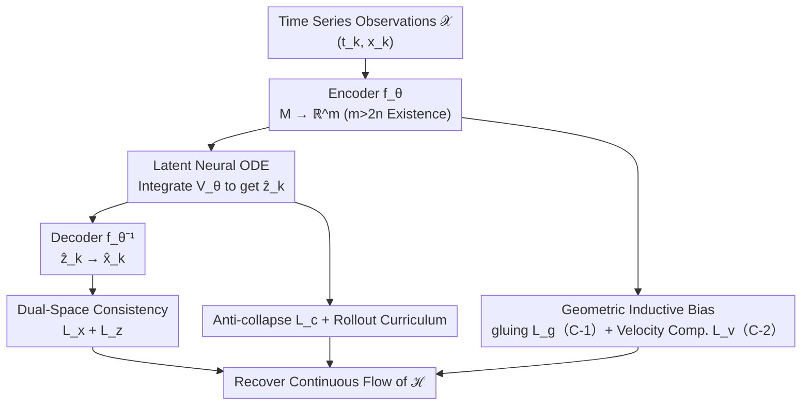

# Embedding Hybrid Systems into Continuous Latent Vector Fields

**Conference**: ICML2026  
**arXiv**: [2606.10596](https://arxiv.org/abs/2606.10596)  
**Code**: https://github.com/SangliTeng/Continuous-Hybrid-System-Learning  
**Area**: Time Series / Learning Dynamical Systems  
**Keywords**: Hybrid Systems, Neural ODE, Latent Space Embedding, Whitney Embedding Theorem, Transversality

## TL;DR
This paper first proves an existence theorem—stating that as long as the latent space dimension $m>2n$, an essentially **discontinuous** $n$-dimensional hybrid system can be embedded into $m$-dimensional Euclidean space with a **continuous** vector field on its image. Based on this, it designs the latent Neural ODE framework CHyLL++, which recovers hybrid system flows across various geometries and topologies with high precision from time series data alone.

## Background & Motivation
**Background**: Hybrid automata describe numerous physical and cyber-physical processes (legged locomotion, collisions, task planning) using "continuous-time vector fields + discrete state resets." While expressive, these systems exhibit **instantaneous jumps** at state resets (on the guard surface $S$), resulting in discontinuous flows that are highly unfriendly to gradient-based differentiable optimization.

**Limitations of Prior Work**: Three mainstream approaches for learning hybrid systems from data have significant drawbacks. ① Segmentation methods (poli2021neural, liu2025discrete) partition trajectories into modes, but mode selection suffers from **combinatorial explosion** and the number of modes may be unknown. ② Event function methods (Neural Event ODE, chen2020learning) attempt to differentiate through reset/event functions, but randomly initialized event functions are often **ill-conditioned**, making simulation difficult. ③ Continuous representation of hybrid dynamics—hybrifold theory (simic2005towards) indicates that reset maps induce an equivalence relation that "glues" piecewise state spaces into a continuous manifold. The author's previous work, CHyLL (teng2025chyll), used the Whitney Embedding Theorem to reconstruct this singularity-free latent manifold from time series.

**Key Challenge**: However, simic2005towards and CHyLL only guarantee a **continuous latent manifold**, **not** a **continuous vector field** on that manifold—the latter being what differentiable optimization truly requires. Thus, the core problem becomes: "Does a provably continuous latent embedding exist for hybrid systems such that the induced vector field is also continuous?"

**Goal**: (1) Theoretically answer the above question by providing existence conditions for continuous extrinsic representations; (2) Algorithmatically implement this theorem as a latent Neural ODE that can be learned from time series.

**Key Insight**: The authors leverage **transversality**, a powerful tool for proving "generic properties" of dynamical systems. The intuition is: bad cases (degenerate embeddings, discontinuous vector fields) correspond to a low-dimensional "set to be avoided" $Z$. By ensuring $\dim f^{-1}(Z)<0$, bad cases "almost never happen," making good embeddings dense in the function space.

**Core Idea**: Trade "extra degrees of freedom" for continuity—by embedding an $n$-dimensional system into a higher $m>2n$ dimensional space, the additional dimensions allow for aligning both position (C-1) and velocity (C-2) on both sides of the reset surface, thereby erasing intrinsic discontinuities to obtain an extrinsic continuous representation.

## Method

### Overall Architecture
The method consists of two layers. **Theoretical layer**: Proves Theorem 6—for a hybrid system $\mathcal{H}=(M,S,V,r)$ satisfying compactness and other assumptions, if $m>2n$, there generically exists an encoder $f\in C^k(M, \mathbb{R}^m)$ satisfying three conditions: (C-1) $f(x)=f(r(x))$ (positions coincide in latent space before and after reset), (C-2) $Df(x)V(x)=Df(r(x))V(r(x))$ (velocities coincide in latent space before and after reset), and (C-3) $f$ embeds the hybrifold $M_\mathcal{H}$ into $\mathbb{R}^m$. Corollary 1 follows: the vector field of the latent trajectory $z(t)=f(x(t))$ is $C^0$ and the trajectory is $C^1$—making differentiable optimization well-defined.

**Algorithmic layer**: Represetns $f_\theta$ (encoder), $V_\theta$ (latent vector field), and $f_\theta^{-1}$ (decoder) as MLPs to form the latent Neural ODE framework **CHyLL++**. Given time series $\mathcal{X}=\{(t_k, x_k)\}$, the initial value is encoded as $z_0=f_\theta(x_0)$. The latent trajectory $\hat{z}_k$ is obtained by integrating $V_\theta$ via Neural ODE, then decoded back to state space $\hat{x}_k$. Training relies on a **dual-space consistency loss**, plus three geometric/stability inductive biases, integrated with a rollout curriculum.

### Key Designs

**1. Existence Theorem for Continuous Extrinsic Representation ($m>2n$): Trading extra dimensions for continuity**

This is the theoretical cornerstone. The intrinsic vector field of a hybrid system is not guaranteed to be continuous—on the reset surface, it might be that $Dr(x)V(x)\ne V(r(x))$, meaning the velocity direction before and after reset is inconsistent (Figure 2, Left). Theorem 6 proves: if the latent dimension $m>2n$, there generically exists an encoder $f$ that embeds the hybrifold into $\mathbb{R}^m$ while satisfying (C-1) and (C-2) on $S\cup r(S)$, rendering the latent vector field $\dot z=Df(x)V(x)$ globally $C^0$. The proof constructs $f$ under collar coordinates: first using the Whitney Embedding Theorem (Theorem 5) to pick $g:S\to\mathbb{R}^m$ to embed both sides of the guard surface as $f_S=g$ and $f_R=g\circ r^{-1}$ to satisfy (C-1); then using first-order Taylor extrapolation $\bar f_S(x,t)=f_S(x)+t\,g_S(x)$, uniquely determining $g_R$ via (C-2); finally using the **Parametric Transversality Theorem** (Theorem 4) to prove that for $m>2n$, generic choices of $g, g_S$ make the extrapolation both injective and full rank, extending local properties to the entire $M$. The $2n$ threshold is precisely the dimension condition of the Whitney Embedding Theorem—the extra degrees of freedom are the "cost" paid to eliminate discontinuities.

**2. CHyLL++ Latent Neural ODE + Dual-Space Consistency Loss: Implementing the existence theorem as learnable MLPs**

The existence theorem only states that "$f$ exists." To find it from data, $f_\theta, V_\theta,$ and $f_\theta^{-1}$ are parameterized as MLPs. The latent flow is given by Neural ODE: $\hat z_k=\int_{t_0}^{t_k}V_\theta(z(t))\,dt+f_\theta(x_0)$. The primary training signals are two MSE consistency losses: $\mathcal{L}_x=\mathrm{MSE}(f_\theta^{-1}(\hat z_k), x_k)$ in state space to align decoded states with ground truth, and $\mathcal{L}_z=\mathrm{MSE}(\hat z_k, f_\theta(x_k))$ in latent space to align integrated latent states with encoded latent states. Writing $V_\theta$ as an MLP with a finite Lipschitz constant naturally guarantees the uniqueness and continuity of the latent flow—fulfilling the theorem's requirement for a "continuous vector field." Ablations show that **dual-space** consistency (rather than single-space) is key to accurately recovering flows of hybrid systems with varying topologies.

**3. Gluing and Velocity Compatibility Losses: Explicitly encoding (C-1) and (C-2) into training objectives**

MLP continuity alone is insufficient to guarantee strict alignment at the reset surface, so the theorem's conditions are formulated as explicit inductive biases. The **gluing loss** $\mathcal{L}_g=\mathrm{MSE}(f_\theta(x_k), f_\theta(x_{k+1})),\ k\in\mathcal{I}$ directly enforces (C-1)—making points before and after reset overlap in latent space. The index set $\mathcal{I}$ is automatically identified by thresholding the empirical Lipschitz constant $\|\frac{x_{k+1}-x_k}{t_{k+1}-t_k}\|$ of data points (this avoids combinatorial explosion by not requiring mode selection). The **velocity compatibility loss** $\mathcal{L}_v=\mathrm{MSE}(\dot z_k^-, \dot z_k^+)$ enforces (C-2)—ensuring latent velocities before and after reset (approximated via finite differences) are equal. Previous work CHyLL only had gluing (C-1); $\mathcal{L}_v$ is introduced here specifically to bridge the missing "continuous vector field" gap.

**4. Anti-collapse Covariance Loss + Rollout Curriculum: Preventing latent degradation and long-term divergence**

High-dimensional latent spaces risk collapse (points crowding into a low-dimensional subspace, losing embedding properties). The covariance loss $\mathcal{L}_c=\sum_{i=1}^m\mathrm{ReLU}(\Lambda-\mathrm{Cov}(f_\theta(x_k)_i))$ forces the variance of each latent coordinate to be above a threshold $\Lambda$. The total loss $\mathcal{L}(\theta)=w_x\mathcal{L}_x+w_z\mathcal{L}_z+w_g\mathcal{L}_g+w_v\mathcal{L}_v+w_c\mathcal{L}_c$ is a weighted sum. Training further employs a **rollout curriculum** (curriculum $\{T_1<\dots<T_\ell\}$): starting with short trajectories and gradually increasing the integration window to mitigate error accumulation and divergence in long-range Neural ODE integration—crucial for systems with strong discontinuities like collisions (square-wave velocities).

### A Complete Example
The paper provides a 1D analytical example to illustrate the mechanism: a 1D discontinuous vector field $V(x)=1\ (x\in[0,1)),\ 2\ (x\in[2,3))$, where a reset map glues $1\sim2$ and $3\sim0$ into a circle. It is intrinsically discontinuous—at $x^-=1$, $(Dr\,V(x^-), V(r(x^-)))=(1, 2)$, with unequal velocities on both sides. The authors construct $f(x)=A_i\,[\cos, \sin]^\top$ using sine functions. Setting $f(1)=f(2), f(3)=f(0)$ per (C-1) and equating latent velocities per (C-2) yields $A_1=\begin{bmatrix}0&1\\1&0\end{bmatrix}, A_2=\begin{bmatrix}0&-0.5\\1&0\end{bmatrix}$. This results in a 1D continuous manifold embedded in 2D with a globally $C^0$ extrinsic vector field $\dot f$, and the decoder restores states using $\mathrm{atan2}$. An essentially discontinuous system thus gains a globally continuous extrinsic representation.

## Key Experimental Results

### Main Results
Evaluation on five hybrid systems with different geometries/topologies. MSE (mean of 5 runs, lower is better) compared against baselines.

| System (Topology/Physics) | CHyLL++ (Ours) | CHyLL (Prev.) | Other Baselines Performance |
|------------------|----------------|---------------|--------------|
| Bouncing Ball | **0.158** | 0.237 | Neural ODE/Latent ODE high penetration; Koopman diverges; Event ODE ill-conditioned |
| Torus | **0.00367** | 0.0164 | Most baselines "mode error"/diverge/ill-conditioned |
| Klein Bottle | **0.00587** | 0.0220 | Same as above |
| Three-Link Walker (6D) | **0.0952** | 0.234 | Neural ODE 0.275, Latent ODE 0.253, Koopman diverges |
| 3D Bouncing Ball (6D) | **0.162** | Collapses to $z$ | Latent ODE 0.524, others diverge/ill-conditioned |

Ours significantly outperforms the previous CHyLL across all five cases and is the only method to stably handle the most difficult 3D Bouncing Ball—where horizontal velocity is a square wave, presenting a extreme challenge for differentiable optimization.

### Ablation Study
Ablation of activation functions (sine vs. ReLU) and loss combinations (Table 2).

| Configuration | Description |
|------|------|
| $\sin,\ \mathcal{L}_{x,z}$ | Dual-space consistency only + Sine activation |
| $\sin,\ \mathcal{L}_{x,z,c}$ | Added anti-collapse covariance loss |
| $\mathrm{ReLU},\ \mathcal{L}_{x,z}$ | ReLU activation (used in main table for fairness) |
| $\mathrm{ReLU},\ \mathcal{L}_{x,z,c}$ | ReLU + Covariance loss |

### Key Findings
- **Dual-space consistency is the lifeline**: Consistency in a single space is insufficient for recovering flows of variable-topology systems; simultaneous constraints in state and latent spaces are required.
- **Geometric inductive biases (gluing + velocity comp.) close the gap**: Neural ODE/Latent ODE/Koopman without these biases generally diverge, suffer mode errors, or penetrate boundaries on systems with resets.
- **Sine activation outperforms ReLU**: Ablations show sine activation yields better results, though ReLU was used for consistency in the main table—indicating the framework's strength lies in the architecture, not just activation tricks.
- **Covariance loss prevents latent collapse**: In the 3D Bouncing Ball case, the previous work collapsed into the $z$-direction, while CHyLL++ succeeded by expanding the latent space via $\mathcal{L}_c$.

## Highlights & Insights
- **"Increasing dimension for continuity" is a clean and profound idea**: Discharging intrinsic discontinuities into extrinsic extra degrees of freedom, using the $m>2n$ threshold from the Whitney Embedding Theorem, aligns theory and algorithm beautifully.
- **Generic existence via transversality**: Proving that bad cases "almost never happen" using $\dim f^{-1}(Z)<0$ is a standard and elegant approach in dynamical systems to prove generic properties, worthy of transfer to other problems involving well-behaved representations.
- **Automatic reset detection via Lipschitz thresholds** bypasses the combinatorial explosion of mode selection—a practical and reusable trick when implementing theory.
- **Theoretical conditions map directly to loss terms** (C-1 $\leftrightarrow$ gluing, C-2 $\leftrightarrow$ velocity comp.), providing clear rationale for each loss component instead of heuristic regularization.

## Limitations & Future Work
- The existence result is **generic**, guaranteeing that "almost all" choices work, but it does not provide a constructive optimal lower bound for $m$ for specific systems; $m$ still requires empirical tuning.
- Experimental systems are relatively low-dimensional (up to 6D); scalability to higher dimensions or complex contact sequences (e.g., multi-contact quadrupeds) has not been fully tested.
- The velocity compatibility loss relies on finite difference approximations of latent velocity, which may be unstable for noisy or sparsely sampled time series.
- The index set $\mathcal{I}$ depends on empirical Lipschitz thresholding; threshold selection may be sensitive to noisy or fast-changing data, which is not extensively discussed.

## Related Work & Insights
- **vs. CHyLL (teng2025chyll, Prev. Work)**: CHyLL only guarantees latent **manifold** continuity (gluing/C-1). This work proves and enforces latent **vector field** continuity (adding velocity comp./C-2), resulting in significantly lower MSE across all five cases.
- **vs. Neural Event ODE (chen2020learning)**: It differentiates through event/reset functions directly, but random initialization leads to ill-conditioning. This work bypasses the need for discontinuous derivatives via a continuous extrinsic representation.
- **vs. Segmentation/Mode-selector methods (poli2021neural, liu2025discrete)**: These require complex mode selection with potentially unknown mode counts. This work identifies reset points via Lipschitz thresholds, avoiding mode selection.
- **vs. Standard Neural ODE / Latent ODE / Deep Koopman**: These lack geometric inductive biases and generally diverge or experience mode errors on systems with resets, highlighting the necessity of the (C-1) and (C-2) biases proposed here.

## Rating
- Novelty: ⭐⭐⭐⭐⭐ First proof of the existence of continuous extrinsic vector field representations for hybrid systems ($m>2n$) with a learnable framework.
- Experimental Thoroughness: ⭐⭐⭐⭐ Covers multiple topologies (Torus/Klein Bottle) and 6D physical systems, though dimensionality could be higher and baseline comparison broader.
- Writing Quality: ⭐⭐⭐⭐⭐ Excellent mapping between theoretical conditions and loss terms; the 1D analytical example is highly illustrative.
- Value: ⭐⭐⭐⭐⭐ Establishes a theoretical foundation for differentiable learning of hybrid systems, with practical implications for contact dynamics in robotics and control.

<!-- RELATED:START -->

## Related Papers

- [\[ICML 2026\] QuITE: Query-based Irregular Time Series Embedding](quite_query-based_irregular_time_series_embedding.md)
- [\[ICLR 2026\] Detection of Unknown Unknowns in Autonomous Systems](../../ICLR2026/time_series/detection_of_unknown_unknowns_in_autonomous_systems.md)
- [\[ICML 2026\] From Observations to States: Latent Time Series Forecasting](from_observations_to_states_latent_time_series_forecasting.md)
- [\[ICML 2026\] Latent Laplace Diffusion for Irregular Multivariate Time Series](latent_laplace_diffusion_for_irregular_multivariate_time_series.md)
- [\[ICML 2026\] HELIX: Hybrid Encoding with Learnable Identity and Cross-dimensional Synthesis for Time Series Imputation](helix_hybrid_encoding_with_learnable_identity_and_cross-dimensional_synthesis_fo.md)

<!-- RELATED:END -->
