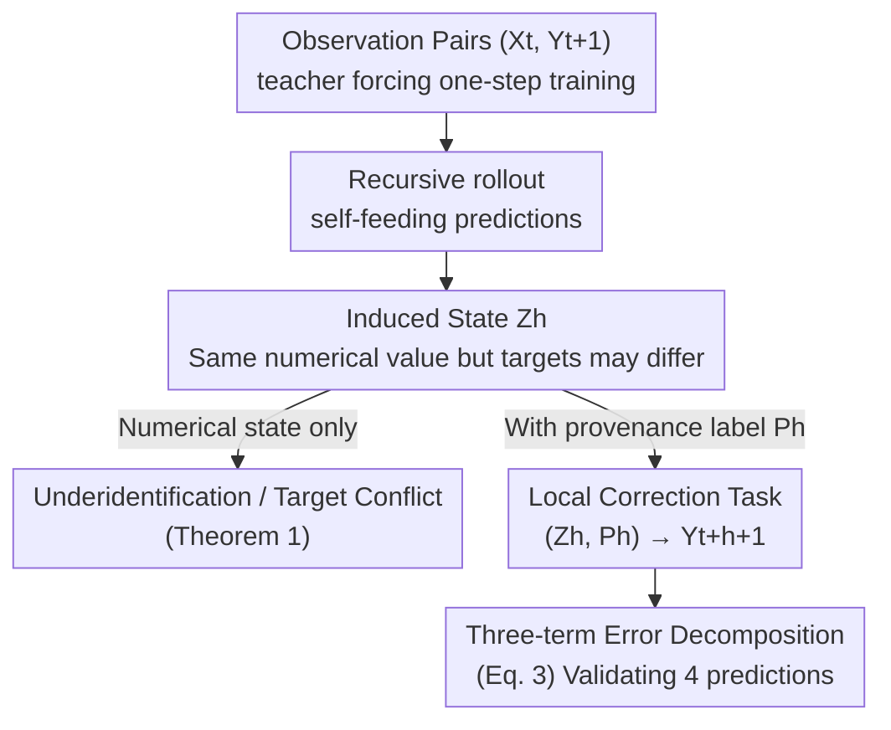

# Exposure Bias as Epistemic Underidentification in Recursive Forecasting

**Conference**: ICML2026 (EIML@ICML 2026 Workshop)  
**arXiv**: [2606.12990](https://arxiv.org/abs/2606.12990)  
**Code**: To be confirmed  
**Area**: Time Series / Theory of Recursive Forecasting  
**Keywords**: Exposure Bias, Recursive Forecasting, Epistemic Underidentification, Induced States, Provenance Information  

## TL;DR
This paper provides a theoretical reinterpretation of "exposure bias" in recursive multi-step forecasting: it is not merely a **distribution shift** between training (teacher forcing) and deployment (self-feeding rollouts). Under partial observability or state truncation, it becomes a problem of **epistemic underidentification**. One-step supervision identifies model behavior only on the observed context, leaving it undetermined what the rollout should output on self-generated "induced states." The authors formalize this using "induced state $Z$ + provenance variable $P$," providing an error decomposition and experimental validation.

## Background & Motivation
**Background**: Autoregressive sequence forecasting (from language generation to dynamical systems) typically utilizes teacher forcing during training—feeding ground-truth history at every step. However, deployment relies on **recursive rollouts**, where the model feeds its own predictions back as inputs. Errors from earlier steps perturb subsequent inputs and accumulate over the forecast horizon, a phenomenon known as the classic "exposure bias."

**Limitations of Prior Work**: Exposure bias has long been framed as a **train-test covariate shift**: training occurs on observed prefixes, while deployment occurs on self-generated states, causing compounding errors. This framework has led to methods like scheduled sampling, DAgger-style aggregation, Professor Forcing, and mixed training regimes that "train on learner-induced states." However, this leaves a more fundamental question unanswered: **Once a rollout begins, what prediction problem is the model actually solving?**

**Key Challenge**: The authors point out that under **partial observability, noise, or state truncation**, the represented state $X_t$ **is insufficient to determine the next target, even if the latent dynamics are deterministic**. This implies that one-step supervision only constraints the model on the observed context. Rollouts query "induced states" that may share the same numerical value but require different correct local targets—the one-step Bayes optimal predictor **simply does not identify** the behavior on these states. Thus, recursive failure arises not just from "novel inputs" (distribution shift), but from **missing information in the states fed to the predictor**, linking exposure bias to **epistemic uncertainty arising from under-representation** (rather than irreducible noise).

**Goal**: Rather than proposing a new correction method, this work aims to **clarify the mechanism of recursive forecasting failure**—answering three "whens": when rollouts enter an induced state region distinct from the observed distribution; when prediction on fixed induced states constitutes a different local correction task; and when correction works by altering the states visited during rollout.

**Key Insight**: A minimal counterexample of a delayed system is used to challenge the old framework: the same numerical state $(0,1)$ appears both as an observed state (target $-1$) and as a rollout state self-generated by a Bayes-optimal one-step predictor (local target $+1$). A predictor viewing only the numerical state inevitably conflates the two.

**Core Idea**: By supplementing the state with a **provenance label** $P$ (e.g., binary "observed/generated" or rollout depth), which tracks "how this state was formed," one can separate observed and induced regions to resolve target conflicts. Exposure bias is thus restated as "reasoning under self-generated epistemic uncertainty."

## Method

### Overall Architecture
This paper presents theoretical analysis and diagnostic experiments rather than a new algorithm. The logic chain is as follows: first, prove that "one-step Bayes optimality cannot identify recursive rollouts" (mechanism); next, introduce two variables, **induced state $Z_h$ + provenance $P_h$**, to formalize recursive deployment as a **local correction problem** $(Z_h,P_h)\mapsto Y_{t+h+1}$; then, decompose the error into three terms; finally, use four experimental predictions to verify the theory on real-world time-series data. The conceptual flow is illustrated below:

### Key Designs

**1. One-step Bayes Optimality "Underidentifies" Recursive Rollout: Exposure Bias is more than Distribution Shift**

Addressing the limitation that "the old framework only treats exposure bias as covariate shift," the authors define closed-loop updates and two-step recursive prediction: for state $x=(x_1,\dots,x_{\hat p})$, define $T_g(x):=(g(x),x_1,\dots,x_{\hat p-1})$ (feeding the prediction back) and the two-step prediction $\Phi_g(x):=g(T_g(x))$. **Theorem 1** states: Let $g^\star$ be the one-step Bayes optimal predictor under squared loss. If there exists $x$ in the observed support $M$ such that $T_{g^\star}(x)\notin M$ (rollout leaves the support in one step), then the one-step objective only identifies the predictor on $M$. Consequently, there exist two predictors $g_1, g_2$ that satisfy $g_1(X_t)=g_2(X_t)=g^\star(X_t)$ almost everywhere (identical one-step Bayes risk) but yield different recursive multi-step predictions $\Phi_{g_1}(x)\neq\Phi_{g_2}(x)$.

The authors emphasize this is **not** the classic observation that "one-step optimal $\neq$ multi-step optimal." The sharper point is: **among recursive predictors with identical one-step Bayes risk**, the rollout itself is unidentified. A first-order expansion reveals: let $\delta(x):=g_1(x)-g_2(x)$, then

$$\Phi_{g_1}(x)-\Phi_{g_2}(x)=(g_1-g_2)(T_{g_2}(x))+\partial_1 g_1(T_{g_2}(x))\,\delta(x)+o(|\delta(x)|).$$

The first term represents "divergence on induced states queried by the rollout"—this is the underidentification mechanism; the second term is the Jacobian amplification of the recursive composite map. Recursive failure thus stems from both dynamic composition and **the underidentification of local behavior on self-generated states**.

**2. Induced State $Z$ and Provenance $P$: Formalizing Deployment as a Local Correction Task**

Theorem 1 exposes the problem, but a variable for "how the state was formed" is needed for operationalization. For a fixed rollout depth $h$, define the induced numerical state $Z_h=\psi_h(X_t)$ and provenance information $P_h=\pi_h(X_t)$ (both deterministic functions of $X_t$; $P_h$ describes the state's formation, e.g., rollout depth or which coordinates are observed vs. generated). Recursive deployment is then not a direct $X_t\mapsto Y_{t+h}$ task, but a **local next-step correction problem** $(Z_h,P_h)\mapsto Y_{t+h+1}$. **Theorem 2** gives the value of provenance (under squared loss):

$$R_h^\star(Z_h)-R_h^{\mathrm{prov},\star}(Z_h,P_h)=\mathbb{E}\big[\operatorname{Var}(\mathbb{E}[Y_{t+h+1}\mid Z_h,P_h]\mid Z_h)\big]\ge 0.$$

Essentially, "conditioning on provenance never increases Bayes risk," and risk decreases strictly if and only if $\mathbb{E}[Y_{t+h+1}\mid Z_h,P_h]\neq\mathbb{E}[Y_{t+h+1}\mid Z_h]$ on a set of positive probability. The intuition is key: **provenance does not create information out of thin air**; it only recovers information lost in the $X_t\mapsto Z_h$ mapping. In the $(0,1)$ counterexample, a binary "observed/generated" label separates the observed region (target $-1$) from the induced region (target $+1$), resolving conflicts that standard rollout-mixing (like scheduled sampling) cannot distinguish.

**3. Three-term Error Decomposition for Induced States: Dissecting Why Correction Sometimes Fails**

To be more specific than "tasks are different," the authors decompose the risk difference between a teacher-forced predictor $g_{\mathrm{TF}}$ on induced states and the provenance-optimal risk into three non-negative terms (Eq. 3):

$$R_h^{Z}(g_{\mathrm{TF}})-R_h^{\mathrm{prov},\star}=\underbrace{R_h^{Z}(g_{\mathrm{TF}})-\inf_{q\in\mathcal{Q}}R_h^{Z}(q)}_{\text{teacher-forcing/rollout mismatch}}+\underbrace{\inf_{q\in\mathcal{Q}}R_h^{Z}(q)-R_h^\star(Z_h)}_{\text{representation–function class gap}}+\underbrace{R_h^\star(Z_h)-R_h^{\mathrm{prov},\star}}_{\text{provenance information gap}}.$$

The first term measures how poorly the teacher-forced predictor transfers to the induced state task. The second is the function class approximation gap on the induced representation. The third is the recoverable information lost by omitting provenance. This decomposition explains why "retraining on induced states" yields varying benefits across datasets: the relative magnitudes of these terms depend on the induced representation, target, estimator class, and dataset.

### Mechanism: Target Conflict in a Delayed System
In a minimal delayed-system toy example, the numerical state $(0,1)$ appears with two identities: as an **observed state**, the correct target is $-1$; as a **rollout induced state** generated by a Bayes-optimal one-step predictor, the local target is $+1$. A predictor using only the numerical state must collapse these to a single value and will inevitably be wrong for both; adding a binary "observed/generated" provenance label separates them, allowing correct targets for each.

## Key Experimental Results

### Four Experimental Predictions and Verification
The theory yields four verifiable predictions, which the authors test on **MG, ETTh1, and Weather** time-series datasets (using MLPs in the main text; GRUs in the appendix show similar results):

| Prediction | Experimental Design | Result |
|-----------|------------------|--------|
| ① Rollout enters state regions distinct from observations | Linear probes distinguishing observed $X_t$ vs. induced $Z_h$ | Accuracy rises with depth: Strongest on ETTh1, moderate on MG, weak on Weather (Fig 2) |
| ② Fixed induced states constitute different local tasks | Freeze $Z_h$, compare TF / $Z$-only / $Z+P$ probes | Highly dataset-dependent: Re-training matches/beats TF on MG/Weather, but is significantly worse on ETTh1 (Fig 3) |
| ③ Provenance sometimes improves correction | Compare $Z+P$ vs. $Z$-only | Under binary encoding, $Z+P$ is close to $Z$; gains are limited and conditional |
| ④ Closed-loop correction partly works by changing visited states | Deployment rollout MSE (SS, SSP vs. TF) | Frozen-state gains and deployment gains decouple, proving some gains come from state-region shifts |

### Main Results (Table 1, Normalized relative to TF, <1 is better)

| Horizon Bin | Dataset | SS/TF | SSP/TF |
|------------|---------|-------|--------|
| Early | ETTh1 | 1.040 | **0.861** |
| Mid | ETTh1 | 1.071 | **0.905** |
| Late | ETTh1 | 1.059 | **0.957** |
| Mid | MG | **0.925** | **0.979** |
| Late | MG | **0.887** | **0.870** |
| Early | Weather | 1.002 | 1.580 |

SSP (provenance-aware scheduled sampling) outperforms TF on all ETTh1 bins where SS fails; both SS and SSP improve later stages on MG; results on Weather are mixed with high SSP variance.

### Key Findings
- **Rollouts indeed leave the observed region**: Probe accuracy increases with depth, confirming the premise of Theorem 1, though the degree is highly dataset-dependent (ETTh1 ≫ Weather).
- **Induced states represent truly different tasks**: If exposure bias were merely about "fitting a better local regressor on self-generated inputs," retraining on frozen states should consistently help. Instead, it is worse on ETTh1, suggesting that induced states define problems whose difficulty is determined by representation, target, and estimator.
- **Provenance gains are conditional and non-uniform**: With current binary encoding and limited probes, only a fraction of the theoretical Bayes gap is recovered. Recovery depends on whether the encoding exposes target-relevant structures.
- **Closed-loop gains stem partly from changing state regions**: SSP-induced states result in lower next-step errors for TF and SS models in deep rollouts, showing that correction modifies not just the "predictor used on induced states" but the "induced state region itself."

## Highlights & Insights
- **Conceptual re-framing is impactful**: Moving from "distribution shift" to "epistemic underidentification" explains why scheduled sampling methods sometimes face target conflicts.
- **Provenance variable $P$ is a transferable design**: Theorem 2's assertion that conditioning on provenance never increases risk can be applied to any autoregressive system (including LLMs) by adding meta-information about state origin.
- **The three-term decomposition provides a diagnostic tool**: This allows recursive failure to be dissected into mismatch, approximation, and provenance gaps, making "why correction fails" a measurable question rather than an assumption.
- **A clean causal split**: The experimental design comparing decoupled frozen-state retraining versus closed-loop deployment elegantly distinguishes between local re-fitting and shift in state visitation.

## Limitations & Future Work
- **Scale and Scope**: As a workshop paper, it relies on three numerical datasets and MLP/GRU architectures; the strong dataset dependency suggests limited current universality.
- **Simplified Provenance Encoding**: The use of a simple binary label may recover only a small fraction of the theoretical provenance gap. More expressive encodings (rollout depth, coordinate-level masks) remain unexplored.
- **Mechanism over Method**: The paper deliberately clarifies mechanisms rather than proposing an "SOTA" algorithm; SSP is used only as a diagnostic probe.
- **Theory-Practice Gap**: Theorem 2 is a Bayes-level statement; actual gains under restricted estimator classes depend on the efficiency of the encoding.

## Related Work & Insights
- **Vs. Taieb & Atiya (One-step optimal $\neq$ Multi-step optimal)**: Both discuss suboptimality in recursive forecasting, but this paper focuses on the **unidentifiability of recursive predictors with identical one-step targets** due to representation gaps.
- **Vs. Scheduled Sampling / DAgger**: These aggregate data but often ignore the distinction between observed and generated sources for the same numerical state, leading to potential target conflicts.
- **Vs. Predictive/Information State Perspectives**: This work aligns with the view that effective state abstracts must preserve information for future prediction; recursive rollouts act as a testbed for partial observability.
- **Vs. Green et al. 2025a (Epistemic Bias-Variance)**: While that work decomposes Jacobian error amplification, this paper focuses on the **nature of the prediction problem created by the rollout itself**.

## Rating
- Novelty: ⭐⭐⭐⭐⭐ (Re-framing exposure bias as epistemic underidentification is a significant theoretical shift.)
- Experimental Thoroughness: ⭐⭐⭐ (Well-designed diagnostic tests, though small-scale and results are dataset-dependent.)
- Writing Quality: ⭐⭐⭐⭐ (Logical progression from counterexamples to theorems and error decomposition is clear.)
- Value: ⭐⭐⭐⭐ (Provides a new theoretical lens and diagnostic tools for recursive/autoregressive systems.)

<!-- RELATED:START -->

## Related Papers

- [\[ICLR 2026\] Learning Recursive Multi-Scale Representations for Irregular Multivariate Time Series Forecasting](../../ICLR2026/time_series/learning_recursive_multi-scale_representations_for_irregular_multivariate_time_s.md)
- [\[ICML 2026\] Ellipsoidal Time Series Forecasting](ellipsoidal_time_series_forecasting.md)
- [\[ICML 2026\] Nested Spatio-Temporal Time Series Forecasting](nested_spatio-temporal_time_series_forecasting.md)
- [\[ICML 2026\] From Observations to States: Latent Time Series Forecasting](from_observations_to_states_latent_time_series_forecasting.md)
- [\[ICML 2026\] Time-series Forecasting Through the Lens of Dynamics](time-series_forecasting_through_the_lens_of_dynamics.md)

<!-- RELATED:END -->
