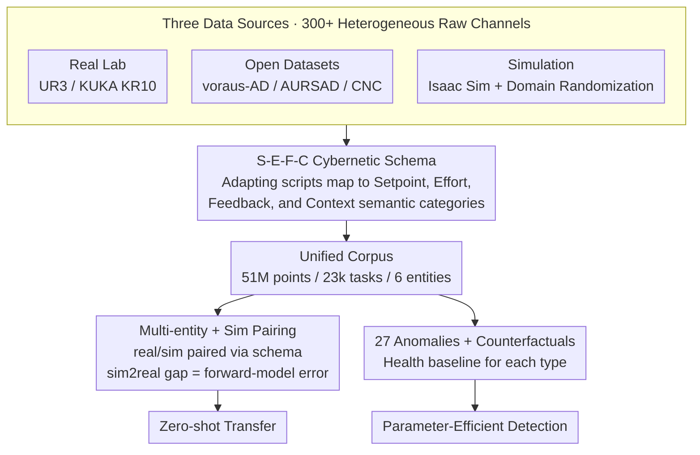

# FactoryNet: A Large-Scale Dataset toward Industrial Time-Series Foundation Models

**Conference**: ICML 2026  
**arXiv**: [2605.09081](https://arxiv.org/abs/2605.09081)  
**Code**: https://github.com/Forgis-Labs/FactoryNet  
**Area**: Time-Series Anomaly Detection / Industrial Time-Series Foundation Models / Datasets  
**Keywords**: Industrial Time-Series, Anomaly Detection, Cross-Entity Transfer, S-E-F-C Pattern, Predictive Maintenance  

## TL;DR
FactoryNet is the first large-scale industrial time-series dataset with a unified control-loop structure—51 million data points / 23k end-to-end task executions (13.3k real + 9,800 simulated) across 6 machine entities, aligning all signals according to the Setpoint-Effort-Feedback-Context (S-E-F-C) cybernetic classification; 27 types of labeled anomalies + health baselines + counterfactual pairs enable zero-shot cross-entity transfer and parameter-efficient anomaly detection.

## Background & Motivation

**Background**: Manufacturing accounts for approximately 15% of global GDP and relies on the continuous operation of complex machines; while foundation models have revolutionized vision/language, industrial time-series foundation models do not exist—industrial AI still relies on single-machine customized deployments.

**Limitations of Prior Work**: (1) Existing anomaly detection/prediction datasets (NASA C-MAPSS, CWRU, PHM 2010, etc.) only record sensor results without separating "command intent" from "measurement response"; to learn transfer dynamics for actuated systems, the complete control loop (target trajectory → execution effort → physical state) must be observed; (2) Dataset scales are small and single-machine—voraus-AD (2,122 episodes), AURSAD (2,045 episodes), which are insufficient for training foundation models; (3) Heterogeneous datasets lack a unified schema, making alignment difficult; (4) General time-series AD benchmarks record overall system states without command-measurement decomposition.

**Key Challenge**: Training industrial foundation models requires (a) large scale (millions of data points); (b) cross-entity (various machines); (c) control-loop structure (distinguishing intent from outcomes); no existing dataset satisfies all three.

**Goal**: (1) Release the first large-scale multi-entity industrial time-series dataset with a unified schema; (2) Propose the S-E-F-C schema to map any actuated system to common representations; (3) Prove feasibility of zero-shot transfer and efficient detection; (4) Provide a growing dataset for the community.

**Key Insight**: Categorizing signals by Setpoint, Effort, Feedback, and Context (S-E-F-C) based on control theory—a natural extension of IEC 81346; S-E-F-C allows direct analysis where "sim-to-real mismatch = forward-model error under matched inputs."

**Core Idea**: The S-E-F-C schema encodes all actuated systems into a unified format → cross-entity transfer and detection become schema-aligned operations → providing an "ImageNet" level corpus for industrial foundation models.

## Method

### Overall Architecture

FactoryNet's core contribution is an organizational method that "welds" control-loop structures into the data: all signals are aligned by S-E-F-C cybernetic classification and presented as paired real + simulated corpus. Dataset composition:

- 51M data points / 23k tasks
- 13.3k real + 9.8k Isaac Sim simulation
- 6 machine entities (UR3e, cobots, CNC, etc.)
- 27 labeled anomaly types + health baselines + counterfactual pairs
- 3 manipulation tasks

Signals map to S-E-F-C: Setpoint (commands), Effort (execution output), Feedback (sensor response), Context (environment/load). Sim-real pairing quantifies the sim2real gap as "forward-model error."

### Key Designs

**1. S-E-F-C Cybernetic Schema: Mapping heterogeneous machine signals to unified physical coordinates**

Industrial datasets have long been fragmented—raw channels for a UR3e and a CNC do not match on a data level. FactoryNet uses IEC 81346 functional classification to label every channel as Setpoint, Effort, Feedback, or Context. Models consume combinations of these types rather than raw channels. This abstraction makes command-measurement decomposition explicit, allowing comparative analysis like "sim-to-real mismatch = forward-model error" and making cross-entity transfer a standard schema-aligned operation.

**2. Multi-entity + Sim Pairing: Real for fidelity, Sim for volume, Pairing for quantification**

Pure real data cannot scale, and pure simulation has sim2real gaps. FactoryNet aligns 13.3k real and 9.8k simulation episodes under the S-E-F-C schema with (real, sim) pairs for identical tasks. Models learn a forward model (given setpoint/context, what should effort/feedback look like); the real-sim difference under identical input becomes a measurable forward-model error.

**3. 27 Anomaly Types + Counterfactual Pairs: Upgrading to universal spectra and learnable causality**

Previous datasets were single-fault (e.g., CWRU for bearings). FactoryNet provides 27 types spanning mechanical (wear, misalignment), electrical (power), control (PID instability), and process (collisions). Each anomaly includes a health baseline. Counterfactual pairs support contrastive learning and causal attribution, answering "which component failed relative to health."

## Key Experimental Results

### Main Results

| Dataset | Year | Machine Type | Episodes | Setpoint? | Effort? |
|------|-----|-----|------|------|------|
| CWRU | 2000 | Bearings | 480 | ✗ | ✗ |
| PHM 2010 | 2010 | CNC | 315 | Partial | ✓ |
| AURSAD | 2021 | UR3e | 2,045 | ✓ | ✓ |
| voraus-AD | 2023 | Cobot | 2,122 | ✓ | ✓ |
| **FactoryNet** | 2026 | Multi-machine | **23,000** | ✓ Required | ✓ Required |

### Main Results (Transfer)

| Source → Target | bias-aware accuracy | High-dim baseline (all channels) |
|----------|------------------|---------------|
| UR3e → CNC | 0.84 | 0.71 (Poor) |
| UR3e → Collaborative | 0.81 | 0.74 |
| CNC → UR3e | 0.79 | 0.65 |
| Real → Sim (forward model) | 0.92 | – |

### Ablation Study

| Model | Parameters | F1 (27 Anomaly Classes) |
|------|------|----------|
| Anomaly-Transformer (high-dim) | 7M | 0.71 |
| TimesFM Pretrained + Fine-tune | 200M | 0.74 |
| Chronos | 60M | 0.73 |
| **FactoryNet pretrained + 24 signals** | **2M** | **0.76** |

### Key Findings
- **S-E-F-C schema improves transfer**: Cross-entity performance improves by 10+ points over raw high-dim channels.
- **Small model + good schema > Large model + raw**: 2M parameters outperform 200M general foundation models.
- **Real-Sim pairing**: Quantifies the sim2real gap as a diagnostic metric.

## Highlights & Insights
- **First industrial time-series dataset with a true "control-loop structure"**: Reorganizing by control theory is a paradigm shift.
- **S-E-F-C as a Unified Representation**: Becomes the "RGB of industrial data," enabling an Industrial ImageNet.
- **Sim2Real Tooling**: Aligned pairing makes the sim2real gap measurable rather than mysterious.
- **Parameter Efficiency**: 2M parameters beating 200M proves that clean schema and inductive bias are better than brute scale for industrial edge deployment.

## Limitations & Future Work
- Entity count (6) is still small; multimodal schemas (vision + TS) are unexplored.
- Anomaly labeling is manual; future scaling requires automated generation.
- S-E-F-C assumes clean classification, but some signals share categories.
- Limited data on gradual long-term degradation.

## Related Work & Insights
- **vs CWRU / PHM / voraus-AD**: Shifts from single-machine/fault to multi-entity/multi-anomaly structures.
- **vs Open X-Embodiment / DROID**: Equivalent foundation for industrial actuated systems.
- **Insight**: S-E-F-C style dataset design is applicable across all actuated systems (automotive, aerospace, energy).

## Rating
- Novelty: ⭐⭐⭐⭐⭐ Control-loop structure is a fundamental contribution.
- Experimental Thoroughness: ⭐⭐⭐⭐ Strong transfer and scaling results; lacks long-term aging.
- Writing Quality: ⭐⭐⭐⭐ Clear cybernetic framing.
- Value: ⭐⭐⭐⭐⭐ Paves the way for industrial foundation models.

<!-- RELATED:START -->

## Related Papers

- [\[ICLR 2026\] Omni-iEEG: A Large-Scale, Comprehensive iEEG Dataset and Benchmark for Epilepsy Research](../../ICLR2026/time_series/omni-ieeg_a_large-scale_comprehensive_ieeg_dataset_and_benchmark_for_epilepsy_re.md)
- [\[ICLR 2026\] FeDaL: Federated Dataset Learning for General Time Series Foundation Models](../../ICLR2026/time_series/fedal_federated_dataset_learning_for_general_time_series_foundation_models.md)
- [\[ICML 2026\] Building Social World Models with Large Language Models](building_social_world_models_with_large_language_models.md)
- [\[ICML 2026\] OLIVIA: Harmonizing Time Series Foundation Models with Power Spectral Density](olivia_harmonizing_time_series_foundation_models_with_power_spectral_density.md)
- [\[ICLR 2026\] Multi-Scale Hypergraph Meets LLMs: Aligning Large Language Models for Time Series Analysis](../../ICLR2026/time_series/multi-scale_hypergraph_meets_llms_aligning_large_language_models_for_time_series.md)

<!-- RELATED:END -->
## Related Papers

- [\[ICLR 2026\] Omni-iEEG: A Large-Scale, Comprehensive iEEG Dataset and Benchmark for Epilepsy Research](../../ICLR2026/time_series/omni-ieeg_a_large-scale_comprehensive_ieeg_dataset_and_benchmark_for_epilepsy_re.md)
- [\[ICLR 2026\] FeDaL: Federated Dataset Learning for General Time Series Foundation Models](../../ICLR2026/time_series/fedal_federated_dataset_learning_for_general_time_series_foundation_models.md)
- [\[ICML 2026\] OLIVIA: Harmonizing Time Series Foundation Models with Power Spectral Density](olivia_harmonizing_time_series_foundation_models_with_power_spectral_density.md)
- [\[NeurIPS 2025\] Multi-Scale Finetuning for Encoder-based Time Series Foundation Models](../../NeurIPS2025/time_series/multi-scale_finetuning_for_encoder-based_time_series_foundation_models.md)
- [\[ICML 2026\] Generalizing Multi-scale Time-Series Modeling with a Single Operator](generalizing_multi-scale_time-series_modeling_with_a_single_operator.md)

<!-- RELATED:END -->
