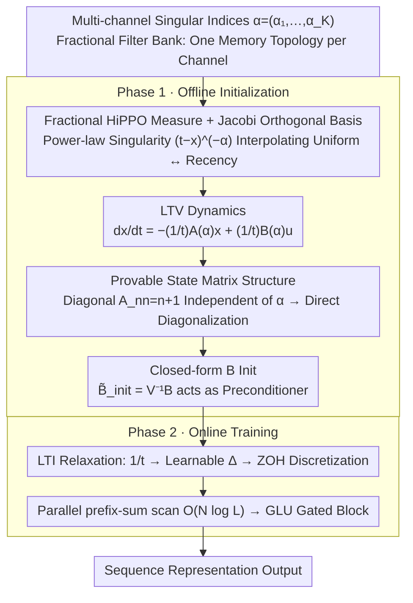

# FRACTAL: State Space Model with Fractional Recurrent Architecture for Computational Temporal Analysis of Long Sequences

**Conference**: ICML 2026  
**arXiv**: [2605.08833](https://arxiv.org/abs/2605.08833)  
**Code**: None  
**Area**: Sequence Modeling / State Space Models (SSM)  
**Keywords**: HiPPO, Fractional Calculus, State Space Models, Long Range Dependency, Long Range Arena

## TL;DR
This paper generalizes the probability measures behind the HiPPO framework to fractional power-law measures with an adjustable singular index $\alpha$, achieving "full history retention + recency sensitivity + scale invariance" for the first time. This theory is implemented as an LTI diagonalized SSM—FRACTAL—which ties S5 with an 87.11% average score on Long Range Arena and achieves 61.85% on ListOps.

## Background & Motivation
**Background**: Modern SSMs (S4 / S4D / DSS / S5 / Mamba) are almost all built upon the "online polynomial projection + probability measure" framework of HiPPO. While architectures have iterated through structured matrices, diagonalization, and time-varying selective SSMs, the choice of the underlying measure used to weight history has remained unchanged for years.

**Limitations of Prior Work**: The classic triad of measures each faces a dead end: LegS (uniform) preserves full history and scale invariance but dilutes recent signals by $1/t$; LagT (exponential) emphasizes recency but fixes the time scale, failing when time is slowed/accelerated; LegT (sliding window) offers high local resolution but suffers from complete forgetting outside the window. Table 1 contrasts these three measures against the three properties, explicitly naming it the "Impossible Trinity."

**Key Challenge**: Integer-order differential equations inherently cannot simultaneously achieve "memory extending infinitely far," "sufficient sensitivity to recent inputs," and "robustness to signal scaling." They either spread memory uniformly or decay it exponentially.

**Goal**: To find a class of measures that satisfies all three properties without abandoning the HiPPO "online polynomial projection + closed-form dynamics" framework, and implement it as a parallelizable LTI diagonal SSM.

**Key Insight**: Fractional calculus naturally describes non-local, heavy-tailed memory. Replacing the "indicator function" in the measure with a power-law singularity like $(t-x)^{-\alpha}$ allows the singular index $\alpha\in[0,1)$ to continuously interpolate between LegS ($\alpha=0$) and a near-delta distribution ($\alpha\to 1$).

**Core Idea**: Replace the uniform/exponential measures of HiPPO with a power-law singular measure. This is equivalent to generalizing the basis from Legendre to Jacobi polynomials $P_n^{(-\alpha,0)}$ while retaining closed-form derivable SSM coefficients.

## Method

### Overall Architecture
FRACTAL consists of two phases. **Phase 1 (Offline Initialization)**: Given multi-channel singular indices $\boldsymbol{\alpha}=(\alpha_1,\dots,\alpha_K)$, the fractional measure is defined as $\mu^{(t)}(x)=(1-\alpha)t^{\alpha-1}(t-x)^{-\alpha}\mathbb{I}_{[0,t]}(x)$ (Def. 3.1). Its orthogonal basis (normalized Jacobi polynomials) is substituted into the HiPPO projection equation to derive LTV dynamics $\dot{x}=-\frac{1}{t}A(\alpha)x+\frac{1}{t}B(\alpha)u$. Eigendecomposition of $A(\alpha)$ yields $\Lambda$, and a closed-form formula provides the physically meaningful initialization $\tilde{B}_{\text{init}}=V^{-1}B$. **Phase 2 (Online Training)**: The $1/t$ in the LTV system is relaxed into a learnable time scale $\Delta$ to obtain an LTI system, then discretized via ZOH and scanned using a parallel prefix-sum in $O(N\log L)$ time. Finally, the SSM output is wrapped in a GLU to form a standard gated SSM block.

### Key Designs

**1. Fractional HiPPO Measure: Continuous Interpolation via a Singular Index**

The classic measure triad has inherent failures—LegS preserves history and scale invariance but dilutes recency by $1/t$; LagT highlights recency but locks the time scale; LegT has high local resolution but forgets everything outside the window. None can solve the "Impossible Trinity" of "full history + recency sensitivity + scale invariance." FRACTAL solves this by replacing the indicator function with a power-law singularity: $\mu^{(t)}(x)=(1-\alpha)t^{\alpha-1}(t-x)^{-\alpha}\mathbb{I}_{[0,t]}(x)$. The normalization factor is derived from $\int_0^t(t-x)^{-\alpha}dx=t^{1-\alpha}/(1-\alpha)$. As $\alpha=0$ it degrades to LegS, and as $\alpha\to 1$ it tends toward $\delta_t$. By mapping the domain $[0,t]$ to $[-1,1]$ via $y=2x/t-1$, the weight becomes the Jacobi weight $(1-y)^{-\alpha}$, making Jacobi polynomials $P_n^{(-\alpha,0)}$ the natural basis. The singularity provides heavy-tailed long-range memory and high recency response, while the normalized form of $\mu$ remains invariant under $t\mapsto\lambda t$, satisfying scale invariance and breaking the trinity.

**2. Provable State Matrix Structure: Decoupling Diagonal Elements from $\alpha$**

To implement this measure in a parallelizable diagonal SSM, $A(\alpha)$ must be diagonalizable and spectrally stable. Through Galerkin projection $\mathcal{L}[P_n]=P_n+(1+\eta)P_n'$ using the normalized Jacobi basis, the paper proves $A(\alpha)$ is strictly lower triangular, and the diagonal elements $A_{nn}=n+1$ are entirely independent of $\alpha$. Non-diagonal elements $A_{nk}$ ($k<n$) are given by $\langle\mathcal{L}[P_n^{(-\alpha,0)}],P_k^{(-\alpha,0)}\rangle_w/\|P_k\|_w^2$, which degrades to $\sqrt{(2n+1)(2k+1)}$ only when $\alpha=0$; otherwise, they are computed via Gauss–Jacobi numerical integration. The $B$ term has a closed form $B_n=\sqrt{(2n+1-\alpha)/(1-\alpha)}\binom{n-\alpha}{n}$. The invariant diagonal $1, \dots, N$ is the crucial stability guarantee: regardless of $\alpha$, the eigenvalues remain fixed while only eigenvectors rotate, allowing direct diagonalization $A=V\Lambda V^{-1}$ without complex NPLR approximations or spectral drift.

**3. Fractional Filter Bank Architecture: Decoupling Time Scales via Multi-channel $\alpha_k$**

Experiments show that tasks like ListOps require both long-range bracket matching and local numerical values, which a single $\alpha$ cannot balance. FRACTAL splits the state dimension $H$ into $K$ blocks, each assigned an $\alpha_k$. Low $\alpha$ channels act as low-pass filters to preserve global context and denoise, while high $\alpha$ channels act as band-pass/high-pass filters to highlight local transitions. The output projection $C$ learns to combine these temporal bases. Here, $\Delta$ controls "how far to look" (resolution) and $\alpha$ controls "how to look" (memory topology), cleanly decoupling the two. Treating different $\alpha$ as a filter bank across frequency bands provides a multi-scale inductive bias, which is the primary driver of FRACTAL's gains on ListOps.

### Loss & Training
No new loss functions were introduced; standard CE or BCE from LRA tasks were used. $\alpha_k$ values are linearly spaced in the $[0, 0.9]$ range and fixed (learnable $\alpha$ is cited as future work). Other hyperparameters are consistent with S5 for fair comparison.

## Key Experimental Results

### Main Results: Long Range Arena (Table 2)

| Model | ListOps | Text | Retrieval | Image | Pathfinder | Path-X | Avg |
|------|---------|------|-----------|-------|------------|--------|-----|
| Transformer | 36.37 | 64.27 | 57.46 | 42.44 | 71.40 | ✗ | – |
| S4 | 59.60 | 86.82 | 90.90 | 88.65 | 94.20 | 96.35 | 86.09 |
| S4D | 60.47 | 86.18 | 89.46 | 88.19 | 93.06 | 91.95 | 84.89 |
| DSS | 57.60 | 84.80 | 87.60 | 84.40 | 85.00 | 85.00 | 80.73 |
| S5 (Reproduced) | 61.10 | 88.72 | 91.27 | 87.59 | 95.04 | 98.62 | 87.04 |
| **FRACTAL** | **61.85** | **89.10** | 91.19 | 87.30 | 94.80 | 98.39 | **87.11** |

### Ablation Study

| Setting | Key Metric | Description |
|------|----------|------|
| $\alpha=0$ (Degrades to LegS / S4-like) | Similar to S4 | Verifies framework generalizes prior methods |
| Single $\alpha$ (No filter bank) | Significant Drop on ListOps | Single scale cannot capture both global brackets and local digits |
| Random $B$ vs. Analytical $\tilde{B}_{\text{init}}$ | Similar Final Acc, Lower Early Loss | Analytical formula acts as a preconditioner (Remark 4.1) |
| Numerical Verification $A_{nn}=n+1$ | Constant across all $\alpha$ | Perfectly matches Theorem 3.4; no spectral drift on long sequences |

### Key Findings
- FRACTAL outperforms S5 by 0.75pt and S4 by 2.25pt on ListOps, where hierarchical and heavy-tailed structures are most prominent. On Image/Pathfinder, which rely more on local dependencies, it performs on par with S5. This aligns with the theory: power-law measures excel in long-range + multi-scale tasks.
- On Path-X (length 16K), FRACTAL maintains 98.39%, proving that the singularity does not destabilize gradients on extremely long sequences—validating the spectral stability of $A_{nn}=n+1$.
- While strict scale invariance is lost when moving from LTV to LTI, the filter bank retains multi-scale inductive biases, making the engineering version more practical than a "perfectly scale-invariant but hard-to-train" LTV system.

## Highlights & Insights
- The narrative transition from the "Impossible Trinity" to "Fractional Unlocking" is very clean. The authors categorize SSM progress into "Architecture vs. Measure" and point out that the measure dimension has been neglected. This "revisiting implicit assumptions" research pattern is applicable to many fields (e.g., attention normalization, diffusion noise scheduling).
- The spectral invariance where the diagonal is independent of $\alpha$ is a beautiful byproduct. It means $\alpha$ can be treated as a learnable hyperparameter (or even per-token adaptive) without breaking numerical stability, opening the door for "data-driven $\alpha$ selection."
- Using a filter bank to treat different $\alpha$ as frequency bands could be adapted to non-SSM models (like linear attention or RNN-style models). By treating the kernel decay shape as an adjustable "band," multi-channel structures can gain multi-scale inductive biases.

## Limitations & Future Work
- Strict scale invariance only holds under LTV (retaining $1/t$). To enable parallel scanning, the authors sacrificed this property, making the engineered version "spectrally multi-scale" rather than "truly scale-invariant." Designing an LTV-friendly scan algorithm is needed for real scale invariance in physical/biological signals.
- $\alpha_k$ values are currently fixed at linear intervals; since optimal $\alpha$ spectra vary by task, end-to-end learnability is an obvious next step.
- Evaluation is limited to LRA. The paper positions itself as a "train-from-scratch LTI" and does not compare with Mamba-style selective SSMs on large-scale language tasks; thus, conclusions on language modeling quality require cautious extrapolation.

## Related Work & Insights
- **vs. S4 / S4D**: S4 treats HiPPO-LegS as a static initialization followed by NPLR engineering; FRACTAL makes the measure a design parameter and uses spectral invariance for direct diagonalization.
- **vs. DSS / S5**: While DSS/S5 argue that spectral structure matters more than precise matrix structure, FRACTAL extends this by *designing* the spectral structure according to measure laws rather than using random/approximate init.
- **vs. Mamba / Selective SSMs**: Mamba introduces data dependency via input-dependent matrices; FRACTAL remains LTI but focuses on measure-based inductive biases. The two are orthogonal and could be combined (input-dependent $\alpha$).
- **vs. LMU / Voelker 2019**: LMU utilizes sliding-window Legendre (LegT); FRACTAL generalizes this to adjustable $\alpha$, essentially making LMU a special case.

## Rating
- Novelty: ⭐⭐⭐⭐⭐ First to bring fractional measures into the HiPPO framework with derivable structures.
- Experimental Thoroughness: ⭐⭐⭐ Matches S5 on LRA and leads on ListOps, but lacks large-scale language modeling benchmarks.
- Writing Quality: ⭐⭐⭐⭐ Strong logical flow from the "Impossible Trinity" to FRACTAL; self-contained appendix proofs.
- Value: ⭐⭐⭐⭐ Provides a forgotten design dimension for SSMs with clear guidance for long-range signal modeling.

<!-- RELATED:START -->

## Related Papers

- [\[ICML 2026\] Learning Long Range Spatio-Temporal Representations over Continuous Time Dynamic Graphs with State Space Models](learning_long_range_spatio-temporal_representations_over_continuous_time_dynamic.md)
- [\[ICML 2026\] HiPPO Zoo: Explicit Memory Mechanisms for Interpretable State Space Models](hippo_zoo_explicit_memory_mechanisms_for_interpretable_state_space_models.md)
- [\[ICML 2025\] A Generalizable Physics-Enhanced State Space Model for Long-Term Dynamics Forecasting in Complex Environments](../../ICML2025/time_series/a_generalizable_physics-enhanced_state_space_model_for_long-term_dynamics_foreca.md)
- [\[ICLR 2026\] Weight-Space Linear Recurrent Neural Networks](../../ICLR2026/time_series/weight-space_linear_recurrent_neural_networks.md)
- [\[NeurIPS 2025\] WaLRUS: Wavelets for Long-range Representation Using SSMs](../../NeurIPS2025/time_series/walrus_wavelets_for_long-range_representation_using_ssms.md)

<!-- RELATED:END -->
