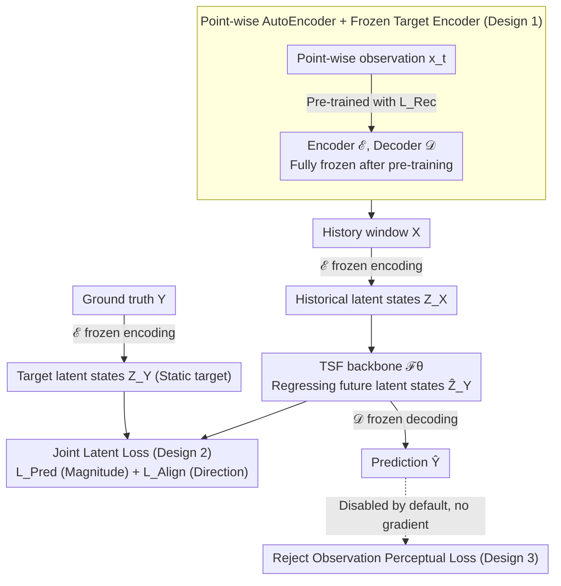

# From Observations to States: Latent Time Series Forecasting

**Conference**: ICML 2026  
**arXiv**: [2602.00297](https://arxiv.org/abs/2602.00297)  
**Code**: https://github.com/Muyiiiii/LatentTSF (Available)  
**Area**: Time Series Forecasting / Representation Learning  
**Keywords**: Time Series Forecasting, Latent State Space, Latent Chaos, Representation Alignment, Mutual Information

## TL;DR
The authors discover that existing TSF models often exhibit "Latent Chaos"—where the latent space is temporally disordered despite high prediction accuracy. They propose LatentTSF: using an AutoEncoder to compress observations into a high-dimensional latent state space, allowing any mainstream backbone to perform future predictions within this space (using a dual Pred + Align loss), and finally decoding back to the observation space. This approach consistently reduces MSE/MAE across 6 standard benchmarks and restores the temporal locality and spectral structure of latent representations.

## Background & Motivation

**Background**: Modern TSF almost exclusively adopts the "observation space regression" paradigm: given a historical window $\mathbf{X} \in \mathbb{R}^{C \times L}$, an RNN / CNN / MLP / Transformer learns a mapping $\mathcal{F}_\theta: \mathbb{R}^{C \times L} \to \mathbb{R}^{C \times T}$ to directly predict future observations $\mathbf{Y}$ by minimizing MSE / MAE.

**Limitations of Prior Work**: The authors perform multi-view representation-level diagnostics on strong backbones like iTransformer, uncovering a surprising paradox—the same model achieves low MAE in the observation space, yet its internal latent representations are "temporally chaotic." Embeddings of adjacent time steps do not cluster, continuous trajectories no longer form on t-SNE, and the frequency spectrum is destroyed. On the Electricity dataset, the average Euclidean distance between adjacent latent states surges from an original 12.94 to 94.03, and dominant periodic signals nearly vanish.

**Key Challenge**: The authors attribute this phenomenon to two fundamental issues. **(i) Systemic**: Real observations $\mathbf{X}$ are "noise + partial projections" of an underlying high-dimensional dynamical system. Critical latent variables are invisible in the observation space; minimizing observation MSE encourages the model to learn shortcuts—capturing shallow statistics like mean reversion, periodicity, and autocorrelation rather than true generative dynamics. **(ii) Optimization**: Point-level MAE/MSE losses have no inductive bias for "temporal continuity," so models do not naturally learn temporally coherent latent spaces.

**Goal**: Construct a new training paradigm that explicitly learns temporal dynamics within a "structured latent state space" rather than just optimizing observation space accuracy. The paradigm should (a) be compatible with any existing backbone and (b) be more robust than the standard paradigm on noisy, partially observable real-world data.

**Key Insight**: Instead of modifying backbone architectures, the training paradigm itself is changed—transforming the "observation → observation" objective into a four-step pipeline: "observation → latent state → latent state prediction → decoding back to observation," with all supervision applied in the latent space.

**Core Idea**: A pre-trained and frozen AutoEncoder encodes each time step independently into a high-dimensional latent state $\mathbf{Z}$. The backbone learns future latent states $\widehat{\mathbf{Z}}_Y$ within the $\mathbf{Z}$ space. The supervision signals consist of a "latent space prediction loss $\mathcal{L}_\text{Pred}$ + latent space alignment loss $\mathcal{L}_\text{Align}$." Finally, a frozen decoder maps back to the observation space to obtain $\widehat{\mathbf{Y}}$.

## Method

### Overall Architecture
A two-stage pipeline: (1) **Latent state space construction**: A point-wise AutoEncoder $\mathcal{E}, \mathcal{D}$ maps $\mathbf{x}_t \in \mathbb{R}^C$ to $\mathbf{z}_t \in \mathbb{R}^D$ (where $D$ can be larger or smaller than $C$; the focus is "suitability for dynamics modeling"). It is pre-trained with MAE reconstruction loss and then **frozen**. (2) **Latent state prediction**: Any TSF backbone $\mathcal{F}^\mathbf{Z}_\theta$ takes $\mathbf{Z}_X = \mathcal{E}(\mathbf{X})$ as input and outputs $\widehat{\mathbf{Z}}_Y$, which is then decoded by the frozen $\mathcal{D}$ to $\widehat{\mathbf{Y}} = \mathcal{D}(\widehat{\mathbf{Z}}_Y)$. During training, losses are no longer calculated on $\widehat{\mathbf{Y}}$; instead, $\widehat{\mathbf{Z}}_Y$ and the ground-truth latent state $\mathbf{Z}_Y = \mathcal{E}(\mathbf{Y})$ are aligned in the latent space. The following diagram illustrates this pipeline along with the three key designs.

### Key Designs

**1. Point-wise AutoEncoder + Frozen Target Encoder: Creating a smooth latent space for dynamics and providing a static target**

The observation space is a "noise + partial projection" of underlying dynamics; direct regression encourages shortcut learning. Furthermore, if the regression target is non-stationary, representation collapse can occur. LatentTSF's AutoEncoder encodes each time step **independently** (no convolution/attention along the time dimension). After pre-training with $\mathcal{L}_\text{Rec} = \frac{1}{L}\sum_t \|\mathbf{x}_t - \mathcal{D}(\mathcal{E}(\mathbf{x}_t))\|_1$, it is **frozen**, making $\mathbf{Z}_Y = \mathcal{E}(\mathbf{Y})$ a static target for the backbone. The freezing and point-wise nature serve specific roles: freezing structurally prevents collapse—as long as the AE maps different inputs to different latent points, a constant solution cannot be optimal (proven in Remark 3.1 + App. C.3), eliminating the need for stop-gradient or EMA techniques like SimSiam/BYOL. The point-wise nature ensures the backbone receives pure latent states rather than sequences already smoothed by the AE, which would make dynamics modeling trivial.

**2. Joint Latent Space Loss $\mathcal{L}_\text{Pred} + \mathcal{L}_\text{Align}$: Ensuring correct magnitude and direction**

Simply pulling latent states close in value is insufficient; the direction (i.e., the trajectory of dynamics) is equally critical. The total loss is $\mathcal{L}_\text{Total} = \alpha\cdot\|\mathbf{Z}_Y - \widehat{\mathbf{Z}}_Y\|_F^2 + \beta\cdot(1 - \cos(\mathbf{Z}_Y,\widehat{\mathbf{Z}}_Y))$. The Frobenius norm ($\mathcal{L}_\text{Pred}$) strictly constrains magnitude, while the cosine similarity ($\mathcal{L}_\text{Align}$) constrains direction. The authors provide an information-theoretic explanation: $\mathcal{L}_\text{Pred}$ is a variational lower bound for maximizing $I(\mathbf{Z}_Y;\widehat{\mathbf{Z}}_Y)$ (under Gaussian assumptions), and $\mathcal{L}_\text{Align}$ is a practical proxy for maximizing $I(\mathbf{Y};\widehat{\mathbf{Z}}_Y)$ via a simplified InfoNCE. Ablations confirm both are necessary, with consistent rankings of "full > w/o Align > w/o Pred ≈ baseline." Default weights $\alpha=10, \beta=15$ are robust across a wide range.

**3. Complete Rejection of Observation Space Loss (Perceptual Loss): Locking supervision in the latent space**

Intuitively, adding an MSE loss in the decoded observation space alongside latent supervision might seem more stable. However, the authors found that adding $\mathcal{L}_\text{Perc} = \|\widehat{\mathbf{Y}} - \mathbf{Y}\|^2$ actually destroys the stable latent space. Since the frozen decoder is non-linear, small deviations in the latent space are amplified into large reconstruction errors, feeding noisy gradients back to the backbone. Therefore, the final recipe **disables** $\mathcal{L}_\text{Perc}$ by default. This challenges the intuition that "an extra observation loss can't hurt" and serves as strong empirical evidence that latent space supervision alone is sufficient for TSF.

### Loss & Training
Two stages. **Stage 1**: Pre-train the AutoEncoder with $\mathcal{L}_\text{Rec}$ (MAE reconstruction, point-wise); once complete, freeze all parameters. **Stage 2**: Train the backbone with $\mathcal{L}_\text{Total} = 10 \cdot \mathcal{L}_\text{Pred} + 15 \cdot \mathcal{L}_\text{Align}$, taking $\mathbf{Z}_X$ as input and outputting $\widehat{\mathbf{Z}}_Y$, which is decoded by the frozen $\mathcal{D}$. Uses AdamW + cosine scheduler + early stopping (patience=5).

## Key Experimental Results

### Main Results
Full comparisons across 6 standard benchmarks (ETTh1/h2/m1/m2, Traffic, Electricity) × 6 backbones (CMoS, DLinear, PatchTST, TimeBase, TimeXer, iTransformer), comparing "Original" vs. "+LatentTSF" training.

| Dataset | Metric | Best Original | +LatentTSF | Gain |
|--------|------|----------|------------|------|
| Electricity | MSE (PatchTST) | 0.389 | 0.207 | -0.182 (-47%) |
| Electricity | MSE (iTransformer) | 0.268 | 0.194 | -0.074 (-28%) |
| Traffic | MSE (TimeXer) | 1.270 | 0.636 | -0.634 (-50%) |
| Traffic | MSE (PatchTST) | 0.982 | 0.719 | -0.263 (-27%) |
| ETTh1 | MSE (TimeXer) | 0.485 | 0.432 | -0.053 (-11%) |
| ETTm2 | MSE (PatchTST) | 0.261 | 0.247 | -0.014 (-5%) |

LatentTSF reduces error in almost all backbone × dataset combinations. **The higher the variable dimension and the longer the horizon, the greater the gain.** On Electricity (321 variables), the MSE of PatchTST is effectively halved. Improvements on low-dimensional data like ETTm2 (7 variables) are more modest but still positive.

### Ablation Study

| Configuration | ETTh1 CKA ↓ | Eff. Rank ↑ | TTC ↑ | Description |
|------|-------------|-------------|-------|------|
| Observation Space | – | 2.86 | 0.913 | Standard Paradigm |
| LatentTSF Space | 0.015 | 3.36 | 0.983 | Non-trivial mapping + ~7% temporal consistency gain |
| Electricity Obs. | – | 7.89 | 0.894 | – |
| Electricity LatentTSF | 0.023 | 34.90 | 0.967 | Effective Rank 4.4×, TTC +7% |

| Configuration | Electricity MSE | Description |
|------|-----------------|------|
| DLinear baseline | 0.201 | Original observation space |
| LatentTSF (full) | 0.182 | Full version |
| w/o $\mathcal{L}_\text{Align}$ | 0.183 | Pred is the main driver (-8.8% vs baseline) |
| DLinear + Align on obs | ≈baseline | Align alone on observations is ineffective/harmful |
| LatentTSF + Perceptual | < full | Observation supervision perturbs latent space |

### Key Findings
- $\mathcal{L}_\text{Pred}$ is the **main driver** of gains (removing Align still preserves 90% of the improvement), but $\mathcal{L}_\text{Align}$ is only effective in the latent space; it fails when moved to the observation space—strongly supporting the argument that latent space supervision is key.
- Under noise $\sigma \in \{0, 0.1, 0.2, 0.5\}$ or missing rates of 0%–30% on ETTh1, LatentTSF maintains a lower MSE than observation space training at every level of perturbation, indicating that the structured latent space enhances noise robustness.
- AE learning rate scans show that even with perceptual loss for joint fine-tuning of the encoder/decoder, results are inferior to **frozen AE + latent loss only**—reaffirming that frozen target encoders are the source of stability.
- In long horizons ($T=720$), LatentTSF's advantage is amplified, as it converts "error accumulation" into "drift on a stable manifold," essentially avoiding the chain amplification of first-order errors in the observation space.

## Highlights & Insights
- **"Latent Chaos" is a noteworthy phenomenon**: The authors use t-SNE, spectral analysis, and adjacent Euclidean distance to verify the counterintuitive reality that "accurate prediction $\neq$ learning temporal structure." This serves as a warning to the TSF community that future evaluations must look beyond MSE/MAE to the geometric and dynamical properties of representations.
- **Structural avoidance of collapse via frozen target encoders**: Unlike SimSiam/BYOL which rely on engineering hacks like stop-gradients or EMA, this paper proves that as long as $\mathcal{E}$ is frozen and discriminative, cosine alignment cannot reach an optimum with a constant solution. This theoretical observation is valuable for self-supervised representation learning.
- **Contrast between Training Paradigm and Architecture Innovation**: Without changing a single line of backbone code, the paper pushes 6 different backbones to SOTA simply by changing the training space. This clearly demonstrates that "Paradigm > Architecture," providing a reflection for TSF research currently fixated on minor Transformer modifications.

## Limitations & Future Work
- Default weights ($\alpha=10, \beta=15$) were chosen as "universal values" after extensive scanning; they are robust but may not be optimal for every dataset, such as extreme horizons or ultra-high dimensions.
- The AE is encoded point-wise, meaning it does not utilize temporal information—this is intentional but limits the "richness" of the latent space. Future inclusion of lightweight temporal structures (e.g., short-range convs) could improve latent state quality.
- Experiments are limited to multivariate numerical forecasting and do not address probability forecasting, long-tail distributions, or irregular sampling.
- Lacks comparison with some very strong recent backbones (e.g., newest TimeMixer++, TimeXer) or large-scale TSF foundation models.

## Related Work & Insights
- **vs. Representation Regularization (Glocal-IB / TimeAlign)**: These methods still train the backbone in the observation space, using the latent space for regularization; LatentTSF is more radical, **moving the entire backbone into the latent space**.
- **vs. Patch-wise loss**: The latter refines local supervision in the observation space but fails to address the "noisy observation space" itself; LatentTSF changes the battlefield entirely.
- **vs. SimSiam / BYOL**: Similar use of cosine alignment and non-contrastive learning, but this paper replaces learnable targets with **pre-trained and frozen AE targets**, avoiding collapse structurally—a concise adaptation for supervised learning.
- **vs. InfoNCE**: The authors derive that InfoNCE is a strict MI lower bound, but simplifying it by removing negative samples results in cosine alignment, which loses strictness but retains utility—a trade-off reference for similar settings (small batch, frozen target).

## Rating
- Novelty: ⭐⭐⭐⭐ Moving TSF to the latent space is conceptually clear, and the naming of "Latent Chaos" along with theoretical guarantees for frozen encoders adds significant research value.
- Experimental Thoroughness: ⭐⭐⭐⭐⭐ Comprehensive coverage across 6 backbones × 6 datasets × multiple horizons × numerous ablations + noise robustness tests.
- Writing Quality: ⭐⭐⭐⭐⭐ The logical flow—from diagnostic to mechanism analysis to theoretical framework to empirical validation—is very clear, with excellent formula derivations and intuitive explanations.
- Value: ⭐⭐⭐⭐ A paradigm-level contribution that can be used as a plug-in for nearly any TSF backbone, possessing high potential for community impact.

<!-- RELATED:START -->

## Related Papers

- [\[ICML 2026\] Latent Laplace Diffusion for Irregular Multivariate Time Series](latent_laplace_diffusion_for_irregular_multivariate_time_series.md)
- [\[ICML 2026\] Ellipsoidal Time Series Forecasting](ellipsoidal_time_series_forecasting.md)
- [\[NeurIPS 2025\] OmniCast: A Masked Latent Diffusion Model for Weather Forecasting Across Time Scales](../../NeurIPS2025/time_series/omnicast_a_masked_latent_diffusion_model_for_weather_forecasting_across_time_sca.md)
- [\[ICML 2026\] Time-series Forecasting Through the Lens of Dynamics](time-series_forecasting_through_the_lens_of_dynamics.md)
- [\[ICML 2026\] Nested Spatio-Temporal Time Series Forecasting](nested_spatio-temporal_time_series_forecasting.md)

<!-- RELATED:END -->
