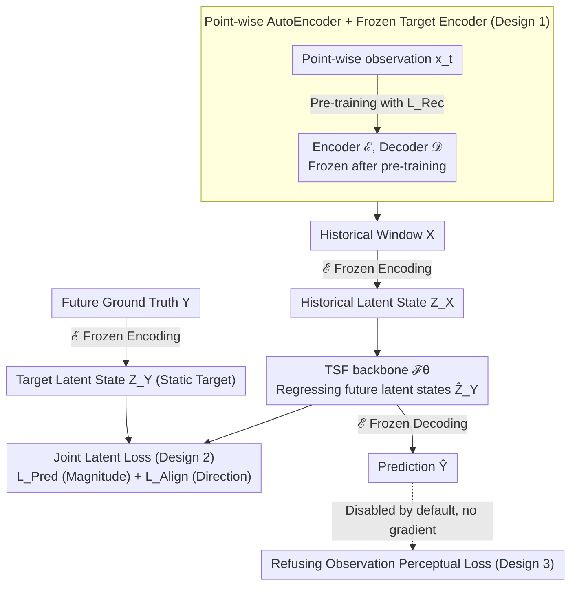

# From Observations to States: Latent Time Series Forecasting

**Conference**: ICML 2026  
**arXiv**: [2602.00297](https://arxiv.org/abs/2602.00297)  
**Code**: https://github.com/Muyiiiii/LatentTSF (Available)  
**Area**: Time Series Forecasting / Representation Learning  
**Keywords**: Time Series Forecasting, Latent State Space, Latent Chaos, Representation Alignment, Mutual Information

## TL;DR
The authors discover that existing TSF models, despite high prediction accuracy, often exhibit "Latent Chaos" in their latent spaces. They propose LatentTSF—which first compresses observations into a high-dimensional latent state space using an AutoEncoder, then allows any mainstream backbone to perform future prediction within this space (using a dual Pred + Align loss), and finally decodes back to the observation space. This approach consistently reduces MSE/MAE across six standard benchmarks and restores the temporal locality and spectral structure of latent representations.

## Background & Motivation

**Background**: Modern TSF almost exclusively adopts the "observation space regression" paradigm: given a historical window $\mathbf{X} \in \mathbb{R}^{C \times L}$, a mapping $\mathcal{F}_\theta: \mathbb{R}^{C \times L} \to \mathbb{R}^{C \times T}$ is learned via RNN / CNN / MLP / Transformer to directly predict future observations $\mathbf{Y}$ by minimizing MSE / MAE.

**Limitations of Prior Work**: Through multi-view representation-level diagnostics on strong backbones like iTransformer, the authors identify a surprising paradox—the same model achieves low MAE in the observation space, yet its internal latent representations suffer from "Latent Chaos": embeddings of adjacent time steps do not cluster, continuous trajectories no longer form in t-SNE, and spectral structures are destroyed. On the Electricity dataset, the average Euclidean distance between adjacent latent states surges from 12.94 to 94.03, and dominant periodic signals almost disappear.

**Key Challenge**: The authors attribute this phenomenon to two fundamental issues. **(i) System Theory**: Real-world observations $\mathbf{X}$ are "noise + partial projections" of an underlying high-dimensional dynamical system. Critical latent variables are invisible in the observation space; minimizing observation MSE encourages models to learn shortcuts—capturing shallow statistics like mean reversion, periodicity, and autocorrelation rather than true generative dynamics. **(ii) Optimization**: Point-level MAE/MSE losses have no inductive bias for "temporal continuity," so models do not naturally learn temporally coherent latent spaces.

**Goal**: Construct a new training paradigm that enables models to explicitly learn temporal dynamics within a "structured latent state space" rather than solely optimizing observation space accuracy. The paradigm must be (a) compatible with any existing backbone and (b) more robust than the standard paradigm on noisy, partially observable real-world data.

**Key Insight**: Instead of modifying backbone architectures, the training paradigm itself is overhauled—changing the "observation → observation" target into a four-step pipeline: "observation → latent state → latent state prediction → decoding back to observation," where all supervision is applied in the latent space.

**Core Idea**: A pre-trained and frozen AutoEncoder independently encodes each time step into a high-dimensional latent state $\mathbf{Z}$. The backbone then learns to predict future latent states $\widehat{\mathbf{Z}}_Y$ within the $\mathbf{Z}$ space. The supervision signals consist of a "latent space prediction loss $\mathcal{L}_\text{Pred}$ + latent space alignment loss $\mathcal{L}_\text{Align}$," with the frozen decoder finally mapping back to the observation space to obtain $\widehat{\mathbf{Y}}$.

## Method

### Overall Architecture
A two-stage pipeline: (1) **Latent State Space Construction**: A point-wise AutoEncoder $\mathcal{E}, \mathcal{D}$ maps $\mathbf{x}_t \in \mathbb{R}^C$ to $\mathbf{z}_t \in \mathbb{R}^D$ ($D$ can be larger or smaller than $C$, emphasizing a space "more suitable for dynamics modeling"), pre-trained with MAE reconstruction loss and subsequently **frozen**. (2) **Latent State Prediction**: Any TSF backbone $\mathcal{F}^\mathbf{Z}_\theta$ takes $\mathbf{Z}_X = \mathcal{E}(\mathbf{X})$ as input and outputs $\widehat{\mathbf{Z}}_Y$, which is then decoded via the frozen $\mathcal{D}$ to $\widehat{\mathbf{Y}} = \mathcal{D}(\widehat{\mathbf{Z}}_Y)$. During training, losses are no longer calculated on $\widehat{\mathbf{Y}}$; instead, $\widehat{\mathbf{Z}}_Y$ is pulled closer to the ground-truth latent state $\mathbf{Z}_Y = \mathcal{E}(\mathbf{Y})$ in the latent space. The following diagram illustrates the "observation → latent state → latent state prediction → decode back to observation" pipeline along with three key designs.

### Key Designs

**1. Point-wise AutoEncoder + Frozen Target Encoder: Creating a smooth latent space suitable for dynamics with a static regression target**

The observation space is a "noisy partial projection" of the underlying dynamics; direct regression encourages models to rely on shallow statistics. Moreover, if the regression target is non-stationary, representation collapse can occur. In LatentTSF, the AutoEncoder encodes each time step **independently** (no convolution or attention along the time dimension). It is pre-trained using $\mathcal{L}_\text{Rec} = \frac{1}{L}\sum_t \|\mathbf{x}_t - \mathcal{D}(\mathcal{E}(\mathbf{x}_t))\|_1$ and then **frozen**, making $\mathbf{Z}_Y = \mathcal{E}(\mathbf{Y})$ a static target for the backbone. Freezing and point-wise encoding serve specific purposes: freezing structurally prevents collapse—as long as the AE encodes different inputs to different latent points, a constant solution cannot be optimal (formalized in Remark 3.1 + App. C.3), eliminating the need for stop-gradients or EMA as seen in SimSiam/BYOL. Point-wise encoding ensures the backbone receives pure latent states rather than sequences already smoothed by an AE, which would trivialize dynamics modeling.

**2. Joint Latent Loss $\mathcal{L}_\text{Pred} + \mathcal{L}_\text{Align}$: Ensuring correct magnitude and direction for predicted latent states**

Simply pulling latent states numerically close is insufficient; the direction (i.e., the trajectory of dynamics) is equally critical. The total loss is defined as $\mathcal{L}_\text{Total} = \alpha\cdot\|\mathbf{Z}_Y - \widehat{\mathbf{Z}}_Y\|_F^2 + \beta\cdot(1 - \cos(\mathbf{Z}_Y,\widehat{\mathbf{Z}}_Y))$: the Frobenius norm strongly constrains magnitude, while the cosine term constrains direction. The authors provide an information-theoretic interpretation—$\mathcal{L}_\text{Pred}$ is a variational lower bound for maximizing $I(\mathbf{Z}_Y;\widehat{\mathbf{Z}}_Y)$ (collapsing to squared error under Gaussian assumptions), while $\mathcal{L}_\text{Align}$ is a practical proxy for maximizing $I(\mathbf{Y};\widehat{\mathbf{Z}}_Y)$ via simplified InfoNCE. Ablations show both are indispensable, with the ranking consistently being "full > w/o Align > w/o Pred ≈ baseline." Default weights $\alpha=10, \beta=15$ reside on a broad performance plateau and are not sensitive.

**3. Refusal of Observation Space Loss (Perceptual Loss): Locking supervision signals entirely within the latent space**

Intuitively, adding an MSE loss in the decoded observation space alongside latent supervision might seem more stable. However, the authors found that adding $\mathcal{L}_\text{Perc} = \|\widehat{\mathbf{Y}} - \mathbf{Y}\|^2$ actually degrades the stable latent space. Since the frozen decoder is non-linear, small deviations in the latent space are amplified into large reconstruction errors, introducing significant gradient noise back to the backbone. Consequently, the final recipe **disables** $\mathcal{L}_\text{Perc}$ by default. This challenges the conventional wisdom that "adding an extra observation loss cannot hurt" and serves as strong empirical support for the central thesis that latent space supervision is sufficient for TSF.

### Loss & Training
The process involves two stages. **Stage 1**: The AutoEncoder is pre-trained using $\mathcal{L}_\text{Rec}$ (point-wise MAE reconstruction), after which all parameters are frozen. **Stage 2**: The backbone is trained using $\mathcal{L}_\text{Total} = 10 \cdot \mathcal{L}_\text{Pred} + 15 \cdot \mathcal{L}_\text{Align}$, taking $\mathbf{Z}_X$ as input to produce $\widehat{\mathbf{Z}}_Y$, which is decoded by the frozen $\mathcal{D}$. Training uses AdamW with a cosine scheduler and early stopping (patience=5).

## Key Experimental Results

### Main Results
Full comparisons were conducted on 6 standard benchmarks (ETTh1/h2/m1/m2, Traffic, Electricity) across 6 backbones (CMoS, DLinear, PatchTST, TimeBase, TimeXer, iTransformer), comparing "Original" vs. "with LatentTSF" training.

| Dataset | Metric | Prev. SOTA | +LatentTSF | Gain |
|--------|------|----------|------------|------|
| Electricity | MSE (PatchTST) | 0.389 | 0.207 | -0.182 (-47%) |
| Electricity | MSE (iTransformer) | 0.268 | 0.194 | -0.074 (-28%) |
| Traffic | MSE (TimeXer) | 1.270 | 0.636 | -0.634 (-50%) |
| Traffic | MSE (PatchTST) | 0.982 | 0.719 | -0.263 (-27%) |
| ETTh1 | MSE (TimeXer) | 0.485 | 0.432 | -0.053 (-11%) |
| ETTm2 | MSE (PatchTST) | 0.261 | 0.247 | -0.014 (-5%) |

LatentTSF reduces error across nearly all backbone × dataset combinations. **The higher the variable dimension and the longer the horizon, the larger the gain.** For Electricity (321 variables), the PatchTST MSE is nearly halved; for lower-dimensional data like ETTm2 (7 variables), improvements are more modest but still positive.

### Ablation Study

| Configuration | ETTh1 CKA ↓ | Eff. Rank ↑ | TTC ↑ | Description |
|------|-------------|-------------|-------|------|
| Observation Space | – | 2.86 | 0.913 | Standard paradigm |
| LatentTSF Space | 0.015 | 3.36 | 0.983 | Non-trivial mapping + ~7% temporal consistency gain |
| Electricity Obs. Space | – | 7.89 | 0.894 | – |
| Electricity LatentTSF | 0.023 | 34.90 | 0.967 | Effective Rank 4.4×, TTC +7% |

| Configuration | Electricity MSE | Description |
|------|-----------------|------|
| DLinear baseline | 0.201 | Original observation space |
| LatentTSF (full) | 0.182 | Complete version |
| w/o $\mathcal{L}_\text{Align}$ | 0.183 | Pred is the primary driver (-8.8% vs baseline) |
| DLinear + Align on observation | ≈baseline | Align alone is ineffective or harmful in obs space |
| LatentTSF + Perceptual | Worse than full | Observation supervision perturbs latent space |

### Key Findings
- $\mathcal{L}_\text{Pred}$ is the **main driver** of gains (removing Align still retains 90% of the improvement), but $\mathcal{L}_\text{Align}$ is only effective in the latent space; it fails when applied to observations. This strongly supports the argument that latent space supervision is fundamental.
- Under input noise $\sigma \in \{0, 0.1, 0.2, 0.5\}$ or missing rates of 0%-30% on ETTh1, LatentTSF maintains lower MSE than observation space training at every perturbation level, indicating that the structured latent space enhances noise robustness.
- AE learning rate scans show that even with perceptual loss for joint fine-tuning of the encoder/decoder, performance is inferior to **freezing the AE and using only latent loss**. This confirms that a frozen target encoder is the source of stability.
- The advantages of LatentTSF are amplified at long horizons ($T=720$), as it transforms the "error accumulation" problem into a "drift on a stable manifold" problem, essentially avoiding the chain amplification of first-order errors in the observation space.

## Highlights & Insights
- **"Latent Chaos" is a noteworthy concept**: By simultaneously validating through t-SNE, spectral analysis, and adjacent Euclidean distance that "accurate prediction ≠ learning temporal structure," the authors provide an important warning to the TSF community—future evaluations should look beyond MSE/MAE to the geometric and dynamical properties of representations.
- **Frozen target encoder structurally prevents collapse**: Unlike SimSiam/BYOL which rely on engineering hacks like stop-gradients or EMA, this work proves that as long as $\mathcal{E}$ is frozen and can distinguish inputs, the cosine alignment loss cannot reach an optimum at a constant solution. This theoretical observation is valuable for self-supervised representation learning.
- **Training Paradigm vs. Architectural Innovation**: The paper achieves SOTA across six backbones without changing a single line of backbone code. By demonstrating that "Paradigm > Architecture," it provides a reflective perspective for researchers focused solely on modifying Transformer variants for TSF.

## Limitations & Future Work
- The default weights ($\alpha=10, \beta=15$) were selected as "universal values" from extensive scans; while robust, they may not be optimal for every dataset, particularly in extreme long-horizon or extremely high-dimensional scenarios.
- The AE is independently encoded per time step, meaning it does not utilize temporal information. While intentional, this limits the "richness" of the latent space; adding lightweight temporal structures (e.g., short-range convolutions) might further enhance latent state quality.
- Experiments are restricted to multivariate numerical time series forecasting; they do not address probabilistic forecasting, long-tail distributions, or irregular sampling.
- Comparisons against some recent strong backbones (e.g., latest TimeMixer++, TimeXer) and large-scale TSF foundation models are currently missing.

## Related Work & Insights
- **vs. Representation Regularization (Glocal-IB / TimeAlign)**: These methods still train the backbone in the observation space using latent terms as regularization; LatentTSF is more radical by **moving the backbone entirely into the latent space**.
- **vs. Patch-wise loss**: The latter refines local supervision in the observation space but fails to address the inherent noise of the observation space itself; LatentTSF changes the coordinate system.
- **vs. SimSiam / BYOL**: While sharing cosine alignment and non-contrastive learning, this work replaces learnable targets with **pre-trained and frozen AE targets**, which is a concise adaptation for supervised learning scenarios that structurally avoids collapse.
- **vs. InfoNCE**: The authors derive InfoNCE as a strict MI lower bound, noting that simplifying out negative samples results in cosine alignment. This loses strictness but gains utility—a relevant trade-off for similar settings (small batch, frozen target).

## Rating
- Novelty: ⭐⭐⭐⭐ Moving TSF to the latent space is conceptually simple yet clear; the "Latent Chaos" terminology and theoretical guarantees for frozen encoders provide strong research value.
- Experimental Thoroughness: ⭐⭐⭐⭐⭐ 6 backbones × 6 datasets × multiple horizons × extensive ablations + noise robustness tests represent very thorough coverage.
- Writing Quality: ⭐⭐⭐⭐⭐ The logical progression from diagnostic analysis to mechanism, theoretical framework, and empirical validation is exceptionally clear.
- Value: ⭐⭐⭐⭐ A paradigm-level work that can be applied as a plug-in to almost any TSF backbone, with significant potential for community impact.

<!-- RELATED:START -->

## Related Papers

- [\[ICML 2026\] Latent Laplace Diffusion for Irregular Multivariate Time Series](latent_laplace_diffusion_for_irregular_multivariate_time_series.md)
- [\[ICML 2026\] Ellipsoidal Time Series Forecasting](ellipsoidal_time_series_forecasting.md)
- [\[NeurIPS 2025\] OmniCast: A Masked Latent Diffusion Model for Weather Forecasting Across Time Scales](../../NeurIPS2025/time_series/omnicast_a_masked_latent_diffusion_model_for_weather_forecasting_across_time_sca.md)
- [\[ICML 2026\] Embedding Hybrid Systems into Continuous Latent Vector Fields](embedding_hybrid_systems_into_continuous_latent_vector_fields.md)
- [\[ICML 2026\] Time-series Forecasting Through the Lens of Dynamics](time-series_forecasting_through_the_lens_of_dynamics.md)

<!-- RELATED:END -->
