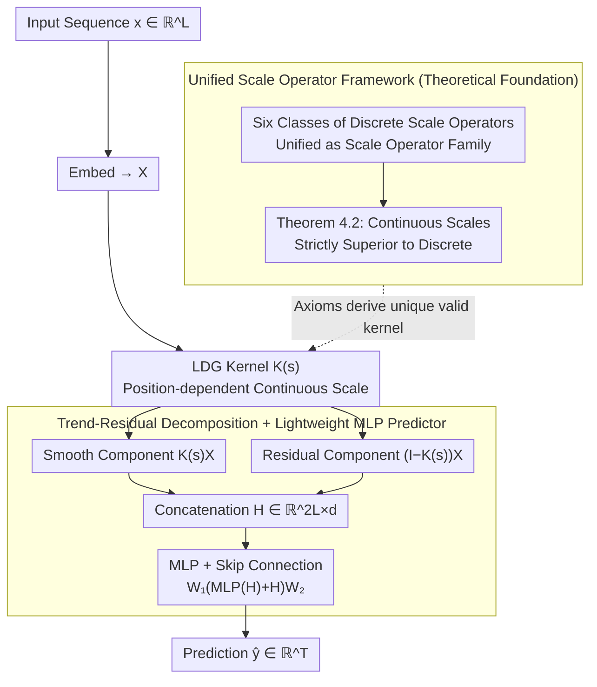

# Generalizing Multi-scale Time-Series Modeling with a Single Operator

**Conference**: ICML 2026  
**arXiv**: [2605.31129](https://arxiv.org/abs/2605.31129)  
**Code**: To be confirmed  
**Area**: Time Series Forecasting / Multi-scale Modeling  
**Keywords**: Time Series Forecasting, Multi-scale Modeling, Gaussian Kernel, Scale-space Theory

## TL;DR
The Sigma framework unifies existing discrete multi-scale operators by learning **Learnable Discrete Gaussian (LDG) kernels** with **continuous, distance-aware scale parameters**. It achieves SOTA performance on both long-term and short-term forecasting tasks while significantly reducing computational costs (5.3× faster training, 3.8× less VRAM).

## Background & Motivation

**Background**: Multi-scale modeling has proven to be an effective design principle for time series forecasting, improving prediction performance by capturing temporal dynamics across multiple resolutions. Existing methods include diverse strategies such as hierarchical decomposition (downsampling), frequency domain transforms (wavelet decomposition), and scale aggregation.

**Limitations of Prior Work**: Existing multi-scale methods rely on **fixed, discrete scale parameters** applied uniformly to all time steps. However: (1) physical time scales (e.g., dominant frequencies, decay rates) of real time series vary continuously rather than discretely; (2) the optimal scale may vary across different time steps, which discrete operators cannot accommodate.

**Key Challenge**: Discrete scale parameters introduce implicit boundaries in the representation space, preventing models from smoothly representing temporal dynamics across resolutions. The "predictability gap" theory (Theorem 4.2) proves that even optimal discrete scales cannot reach the performance of continuous scale spaces.

**Goal**: Establish a mathematical foundation for multi-scale time series modeling and design a unified framework capable of learning continuous, dynamic scale parameters.

**Key Insight**: Starting from scale-space theory (derived from computer vision), this work adopts **Learnable Discrete Gaussian (LDG) kernels** as an instance of a generalized family of scale operators.

**Core Idea**: Replace multiple discrete scale operators with a single learnable Gaussian kernel operator. This uses $L$ position-dependent continuous scale parameters $\mathbf{s}$ to dynamically control the degree of smoothing at each time step.

## Method

### Overall Architecture
Sigma addresses the question of why multi-scale modeling must be constructed from a collection of discrete operators. The approach transitions from a mathematical foundation to a minimalist architecture. First, common operations like average pooling, max pooling, moving averages, downsampling, patching, and wavelet decomposition are abstracted into a "family of scale operators" defined by two axioms. This discrete family is then extended to a continuous version $\mathcal{F} = \{f(\mathbf{x} \mid \mathbf{s}) \mid \mathbf{s} \in \mathbb{R}_+^M\}$ to ensure consistency and differentiability. Finally, this is implemented using a learnable Gaussian kernel and an MLP with skip connections, deliberately avoiding the multi-stage downsampling and complex cross-scale interactions found in AMD or TimeMixer. The data flow is short: the input sequence is embedded, passed through the LDG kernel to obtain smooth and residual components, concatenated, and output via a single MLP. The scale operator theory operates "behind the scenes" to justify why the LDG kernel is the necessary choice.

### Key Designs

**1. Unified Framework of Scale Operator Families: Defining a Valid Scale Operation**

While multi-scale methods are diverse, their shared essence has remained unclear, and the cost of using "discrete scales" has not been proven. Sigma defines two mathematical properties that a scale operator family $\mathcal{F}$ must satisfy: non-expansivity (the operator introduces no new information) and energy-diminishing property (coarser scales contain no more energy than finer scales). Theorem 3.2 proves that the six aforementioned operations satisfy these, while trivial operations like scalar multiplication or permutation do not. Crucially, Theorem 4.2 proves that optimality in continuous scale space is **strictly greater** than in the discrete version. Discrete scale parameters leave implicit boundaries in the representation space that cannot reach the continuous upper bound, transforming the intuition for learning continuous scales into a theorem.

**2. Learnable Discrete Gaussian (LDG) Kernel: Localized Smoothing Control**

Since discrete scales have a performance ceiling, an operator that can express continuous, position-dependent scales is required. Sigma utilizes the Learnable Discrete Gaussian kernel: the element $(i,j)$ of the kernel matrix is $[\mathbf{K}(\mathbf{s})]_{i,j} = e^{-s_d} I_d(s_d)$, where $d = |i-j|$ is the temporal distance and $I_d(\cdot)$ is the modified Bessel function of the first kind. The scale parameter $\mathbf{s} \in \mathbb{R}_+^L$ is **position-dependent**, where each position $i$ has its own $s_i$ to control the intensity of neighborhood aggregation. This is supported by two guarantees: Theorem 4.3 ensures the LDG kernel family falls within the generalized scale operator family, and Theorem 4.4 proves it is the **unique** symmetric kernel satisfying discrete scale-space axioms. Thus, LDG is not just an arbitrary choice but the unique solution derived from axioms.

**3. Trend-Residual Decomposition + Lightweight MLP Predictor: Efficient Representation Extraction**

With the LDG representation, the final step is prediction. While many methods introduce multi-layer interaction modules, Sigma maintains simplicity. The embedding $\mathbf{X} = \text{Embed}(\mathbf{x})$ is decomposed into a smooth component $\mathbf{K}(\mathbf{s})\mathbf{X}$ and a residual component $(\mathbf{I} - \mathbf{K}(\mathbf{s}))\mathbf{X}$, concatenated into $\mathbf{H} \in \mathbb{R}^{2L \times d}$. The output is generated via an MLP with skip connections: $\hat{\mathbf{y}} = \mathbf{W}_1(\text{MLP}(\mathbf{H}) + \mathbf{H})\mathbf{W}_2$. This trend-residual split echoes classical time series decomposition, while skip connections stabilize optimization and preserve scale-specific information. This design moves multi-scale complexity into the learnable kernel, leaving only an MLP externally, which results in 5.3× faster training and 3.8× lower memory usage.

## Key Experimental Results

### Main Results: Long-term Forecasting

| Dataset | Metric | **Sigma** | AMD | WPMixer | TimeMixer |
|--------|------|-------|-----|---------|-----------|
| Weather | MSE | 0.247 | 0.263 | 0.255 | 0.246 |
| Electricity | MSE | **0.175** | 0.208 | 0.198 | 0.185 |
| Traffic | MSE | **0.458** | 0.546 | 0.497 | 0.501 |
| Exchange | MSE | **0.353** | 0.358 | 0.387 | 0.384 |
| ETTm2 | MSE | **0.276** | 0.285 | 0.283 | 0.281 |

Ours wins in 13 out of 16 settings, with significant advantages on high-dimensional datasets.

### Ablation Study

| Configuration | MSE | MAE | Description |
|------|-----|-----|------|
| Sigma Full | **0.480** | **0.468** | Baseline |
| ① Replace MLP with TimeMixer mixing | 0.486 | 0.467 | +0.6% Error |
| ② Single scale parameter LDG | 0.489 | 0.473 | +1.9% Error, position-dependence matters |
| ③ Sample-level scale parameters | 0.490 | 0.474 | +2.1% Error, excessive flexibility adds noise |
| ④ No scale operator, raw input only | 0.492 | 0.475 | +2.5% Error |
| ⑤ Replace LDG with Moving Average | 0.493 | 0.474 | +2.7% Error, learnability is key |
| ⑥ Unconstrained Conv (Non-scale family) | 0.524 | 0.492 | +9.2% Error, **Worst** |

### Efficiency Analysis

| Metric | Sigma | AMD | Gain |
|------|-------|-----|------|
| Training Time | — | — | **5.3× Faster** |
| Memory Usage | — | — | **3.8× Less** |

### Key Findings
- The position-dependence, learnability, and constraints of the LDG kernel as a generalized scale operator family are all critical.
- Even when replaced with other multi-scale strategies (Variant ①), the simplicity of the MLP remains effective.
- Arbitrary convolutions violating scale operator axioms (Variant ⑥) lead to performance collapse, confirming the necessity of the theoretical foundation.
- M4 Short-term Forecasting: Sigma wins in 11 out of 15 cases.

## Highlights & Insights
- **First Rigorous Application of Scale-space Theory**: Establishes a mathematical foundation for multi-scale time series modeling, unifying six existing methods under the "scale operator family" concept.
- **Multi-scale Modeling via Continuous Optimization**: The core insight shifts "optimal scale" from a problem parameter to a **learnable parameter**. By proving continuous space optimality is strictly superior to discrete, it theoretically explains why learning $\mathbf{s} \in \mathbb{R}_+^L$ is better.
- **Minimalist and Efficient Architecture**: Sigma achieves SOTA using only an LDG kernel and an MLP, offering more elegance than methods requiring multi-layer interactions.
- **Alignment of Theory and Practice**: The sharp drop in performance for Variant ⑥ (unconstrained convolution) directly validates the necessity of the "scale operator family" constraints.

## Limitations & Future Work
- Dataset-level scale parameter limits: When training samples are insufficient, shared $\mathbf{s}$ learning is difficult, causing average performance on the M4 "Others" class (< 5% of data).
- LDG Kernel Computational Complexity: Current implementation uses dense matrix multiplication with $O(L^2)$ complexity. Given the Toeplitz structure, this could theoretically be reduced to $O(L \log L)$ via FFT or truncated convolutions.
- Multivariate Interactions: The model assumes channel independence, potentially ignoring inter-variable dependencies.

## Related Work & Insights
- **vs TimeMixer / AMD**: All are multi-scale methods, but TimeMixer fixes discrete scales while AMD uses complex cross-scale mixing. Sigma achieves better performance with a simpler architecture through learnable continuous parameters and mathematical constraints.
- **vs Scale-space Theory (CV)**: Sigma represents the first rigorous application of classical Witkin and Lindeberg scale-space ideas to time series.
- **vs Wavelet Decomposition**: Sigma’s LDG is theoretically more general (the scale operator family contains wavelets as a special case) and possesses stronger learning capabilities.

## Rating
- Novelty: ⭐⭐⭐⭐⭐ First rigorous formalization of scale-space theory for time series; significant theoretical contribution.
- Experimental Thoroughness: ⭐⭐⭐⭐⭐ Long-term forecasting (8 datasets × 4 lengths) + Short-term (M4) + Efficiency analysis + Deep ablation.
- Writing Quality: ⭐⭐⭐⭐⭐ Clear logical chain (Motivation → Definition → Theorem → Design → Experiment).
- Value: ⭐⭐⭐⭐⭐ Establishes a mathematical foundation while refreshing SOTA with high efficiency, ensuring strong practical utility.

<!-- RELATED:START -->

## Related Papers

- [\[AAAI 2026\] FreqCycle: A Multi-Scale Time-Frequency Analysis Method for Time Series Forecasting](../../AAAI2026/time_series/freqcycle_a_multi-scale_time-frequency_analysis_method_for_time_series_forecasti.md)
- [\[ICLR 2026\] Learning Recursive Multi-Scale Representations for Irregular Multivariate Time Series Forecasting](../../ICLR2026/time_series/learning_recursive_multi-scale_representations_for_irregular_multivariate_time_s.md)
- [\[NeurIPS 2025\] Multi-Scale Finetuning for Encoder-based Time Series Foundation Models](../../NeurIPS2025/time_series/multi-scale_finetuning_for_encoder-based_time_series_foundation_models.md)
- [\[ICML 2026\] IMPACT: Influence Modeling for Open-Set Time Series Anomaly Detection](impact_influence_modeling_for_open-set_time_series_anomaly_detection.md)
- [\[ICML 2026\] FactoryNet: A Large-Scale Dataset toward Industrial Time-Series Foundation Models](factorynet_a_large-scale_dataset_toward_industrial_time-series_foundation_models.md)

<!-- RELATED:END -->
