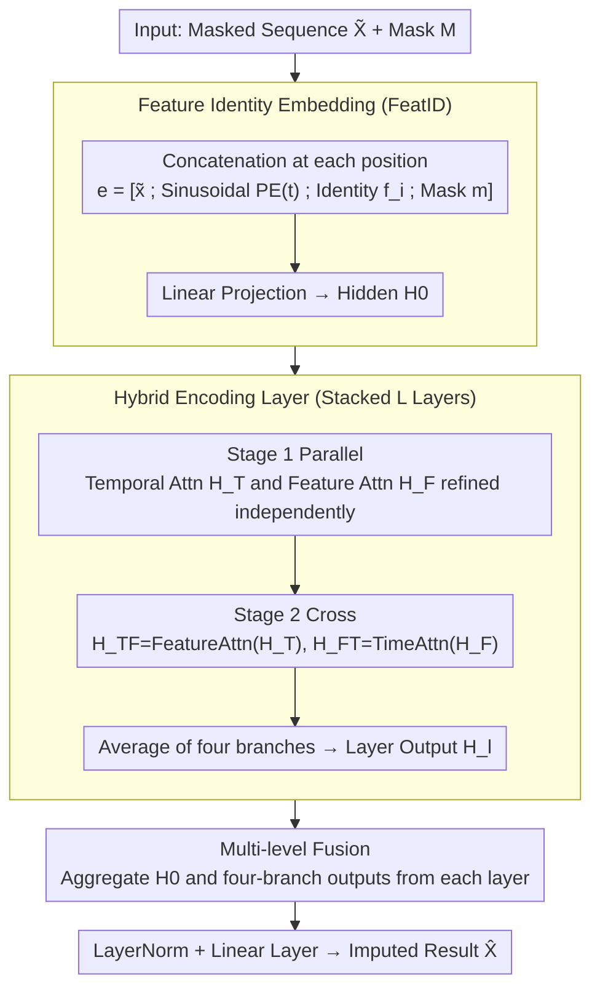

# HELIX: Hybrid Encoding with Learnable Identity and Cross-dimensional Synthesis for Time Series Imputation

**Conference**: ICML 2026 Spotlight  
**arXiv**: [2605.02278](https://arxiv.org/abs/2605.02278)  
**Code**: https://github.com/milaogou/HELIX (Integrated into PyPOTS)  
**Area**: Time Series / Imputation / Transformer  
**Keywords**: Feature Identity Embedding, Time Series Imputation, Spatio-Temporal Transformer, Dual-Helix Encoding

## TL;DR
A "Feature Identity Embedding" is learned for each feature as a persistent semantic anchor. Combined with a temporal-feature dual-helix attention mechanism, this approach achieved first place across all 21 missing scenarios on 5 public multivariate time series datasets, outperforming the runner-up ImputeFormer with over 25% additional MAE reduction on datasets such as ETT-h1.

## Background & Motivation

**Background**: Multivariate time series (MVTS) imputation is a critical preprocessing step for downstream tasks in healthcare, meteorology, and transportation. Mainstream methods are categorized into three types: RNN-based (BRITS, GRU-D), Transformer-based (SAITS, ImputeFormer), and Diffusion-based (CSDI, PriSTI). Recently, GNN methods (GRIN, SPIN) have also attempted to explicitly model inter-feature dependencies.

**Limitations of Prior Work**: (1) Existing attention-based methods "re-discover" inter-feature relationships in every layer, lacking cross-layer consistent anchors—leading to the collapse of feature relationships under heavy missingness; (2) GNN methods rely on predefined graph topologies and assume homogeneous features (e.g., all spatial sensors of the same type), making them unable to handle scenarios with mixed feature types; (3) Learning an adjacency matrix incurs $O(F^2)$ overhead and remains susceptible to data missingness; (4) Bi-directional attention methods like Crossformer rely solely on numerical patch embeddings, where cross-feature attention degrades when values are entirely missing.

**Key Challenge**: To perform "cross-feature reasoning," a model requires each token to possess both temporal and feature identities simultaneously. However, existing solutions only provide persistent anchors on one axis (either temporal PE or graph topology), while the other axis must be dynamically inferred from numerical values—causing the entire inference mechanism to fail when those values are missing.

**Goal**: (1) Provide each feature with a cross-layer stable semantic identity; (2) Design an encoding structure with sufficient bi-directional interaction between time and features; (3) Maintain stable cross-feature reasoning even under severe missingness.

**Key Insight**: The authors treat token embedding as a "soft prompt" in NLP—learning a $d_f$-dimensional vector $f_i$ for each feature as a "feature-specific prompt." Regardless of whether the numerical value at that position is missing, the feature identity information persists. A "parallel then cross" dual-helix attention is then designed to process temporal and feature dimensions alternately.

**Core Idea**: The embedding for each $(t, i)$ position is formulated as $e_{t,i} = [\tilde x_{t,i}; \text{PE}(t); f_i; m_{t,i}]$, where $f_i$ is a learnable identity embedding. Through $L$ layers of "dual-helix" encoding (where each layer first performs parallel temporal and feature attention, then cross feature and temporal attention), information flows sufficiently across both dimensions.

## Method

### Overall Architecture
Input $\tilde X \in \mathbb{R}^{T \times F}$ and a missingness mask $M$. Each position constructs $e_{t,i} \in \mathbb{R}^{d_e}$ (value + sinusoidal PE + identity + mask), which is projected via a linear layer to a hidden dimension $d$ to obtain $H^{(0)}$. This is followed by $L$ Hybrid Encoding Layers, where each layer outputs four branches $H_T^{(l)}, H_F^{(l)}, H_{TF}^{(l)}, H_{FT}^{(l)}$ that are averaged to produce $H^{(l)}$. Finally, a multi-level fusion $\tilde H = \frac{1}{1+4L}(H^{(0)} + \sum_l \text{sum of branches})$ is performed, passed through LayerNorm + a linear layer to obtain $\hat X$.

### Key Designs

**1. FeatID as a soft adjacency prior for cross-feature attention: Issuing a permanent ID card to every feature**

Existing attention-based imputation methods re-discover inter-feature relationships in each layer and lack cross-layer consistent anchors. Once numerical values are heavily missing, cross-feature attention collapses due to the lack of computable inputs. GNN methods rely on predefined graphs and assume homogeneity. HELIX borrows the "soft prompt" concept from NLP, learning a $d_f$-dimensional vector $f_i$ as a "feature-specific prompt" concatenated into $e_{t,i} = [\tilde x_{t,i}; \text{PE}(t); f_i; m_{t,i}]$—feature identity remains even if values do not. The attention score $s_{ij}^{(t)} = e_{t,i}^\top A e_{t,j}$ can be decomposed into an identity prior $f_i^\top A_{ff} f_j$, identity-context cross terms, and dynamic context $r_{t,i}^\top A_{rr} r_{t,j}$. When $x_{t,i}$ and $x_{t,j}$ are both missing, the dynamic term degrades, but the identity prior maintains cross-feature compatibility. It requires no graph prior and maintains anchoring under heavy missingness—removing FeatID on BeijingAir caused the Subseq-50% MAE to jump from 0.166 to 0.398, proving it is a critical component.

**2. Hybrid Encoding Layer (Parallel then Cross): Allowing temporal and feature dimensions to refine independently and exchange info across dimensions**

Pure sequential Time→Feature→Time encoding compresses information from one dimension until after the previous stage is complete, creating an information bottleneck, particularly detrimental for long gaps. Each HELIX layer has two stages: Stage 1 performs parallel $H_T = \text{TimeMHA}(H^{(l-1)})$ and $H_F = \text{FeatMHA}(H^{(l-1)})$ for independent optimization; Stage 2 performs sequential crossing $H_{TF} = \text{FeatMHA}(H_T)$ and $H_{FT} = \text{TimeMHA}(H_F)$. The final output is averaged across four branches $H^{(l)} = \frac{1}{4}(H_T + H_F + H_{TF} + H_{FT})$, named for its DNA-like double-helix structure. The efficiency of the parallel + cross bi-directional flow is most evident in long-gap scenarios—removing Hybrid dropped performance by only 2% on Point-50% but by 77% on Subseq-50%, indicating that internal dimension convection is key to imputation when context is severely missing.

**3. Multi-level Fusion: Averaging outputs from every layer to prevent deep abstractions from washing out shallow details**

Imputation requires fine-grained pixel-level reconstruction at $(t,i)$, but using only the final layer might lose original signal details preserved in shallower layers. HELIX aggregates outputs from all branches across all layers (including the level-0 embedding): $\tilde H = \frac{1}{1+4L}(H^{(0)} + \sum_{l=1}^L (H_T^{(l)} + H_F^{(l)} + H_{TF}^{(l)} + H_{FT}^{(l)}))$, intentionally omitting $H^{(l)}$ to avoid double-counting since it is an average of the branches. This aligns with ResNet's findings that direct connections are superior—shallow signals are often more useful for filling gaps than high-level abstractions. Ablations show simple averaging is more stable than learnable gating.

### Loss & Training
Uses the dual-stage loss from SAITS: observed reconstruction loss $\mathcal{L}_{ORT}$ + masked imputation loss $\mathcal{L}_{MIT}$, with equal weights $\mathcal{L} = \mathcal{L}_{ORT} + \mathcal{L}_{MIT}$. Hyperparameters: $d_{pe} \in [6, 24], d_f \in [6, 32], d \in [32, 576], L \in [2, 3]$.

## Key Experimental Results

### Main Results

| Model | Avg Rank ↓ | Remarks |
|------|-------------|------|
| **HELIX (Ours)** | **1.00** | 1st in all 21/21 scenarios |
| ImputeFormer | 3.29 | KDD'24 SOTA |
| SAITS | 3.76 | 88M parameters |
| StemGNN | 5.71 | GNN |
| Linear Interpolation | 6.67 | Naive baseline ranked 5th |
| PatchTST | 7.24 | — |

MAE across missing patterns on ETT-h1 (Avg of 5 runs ± Std Dev):

| Pattern | HELIX | ImputeFormer | SAITS | Linear Interp. |
|------|-------|--------------|-------|--------------|
| Point-10% | **0.128 ± 0.005** | 0.202 ± 0.044 | 0.150 ± 0.007 | 0.197 |
| Point-50% | **0.189 ± 0.012** | 0.296 ± 0.036 | 0.208 ± 0.009 | 0.267 |
| Block-50% | **0.372 ± 0.015** | 0.404 ± 0.021 | 0.422 ± 0.019 | 0.527 |
| Subseq-50% | **0.489 ± 0.014** | 0.520 ± 0.017 | 0.620 ± 0.016 | 0.722 |

Parameter count is 803K, roughly 100x smaller than SAITS (88M). Wilcoxon significance $p < 0.001$.

### Ablation Study (BeijingAir)

| Configuration | Point-50% | Block-50% | Subseq-50% |
|------|-----------|-----------|------------|
| Full HELIX | **0.102 ± 0.005** | **0.131 ± 0.005** | **0.166 ± 0.009** |
| w/o Fusion | 0.104 | 0.147 | 0.173 |
| w/o Sinusoidal | 0.108 | 0.142 | 0.173 |
| w/o Hybrid | 0.104 | 0.137 | 0.294 (Collapsed) |
| w/o FeatEmb | 0.144 | 0.223 | 0.398 (Major Collapse) |

### Key Findings
- **FeatID is critical**: Performance degraded significantly across all missing patterns without it, especially on Subseq-50% (collapsing to 0.398), proving persistent identity anchors are irreplaceable for long gaps.
- **Dual-helix shines in long gaps**: Removing Hybrid dropped performance by only 2% on Point-50% but by 77% on Subseq-50%, showing bi-directional cross-dimensional flow is vital for severe context loss.
- **Identity dimension scales sub-linearly**: PeMS with 862 features only needs $d_f = 32$ (27:1 compression), while ETT-h1 with 7 features requires $d_f = 12$ (0.6:1 expansion)—with fewer features, the "intrinsic structure" relies more on FeatID.
- **Feature attention aligns with physical topology**: On BeijingAir, the correlation between feature attention and geographic proximity of 12 weather stations rose from 0.589 (Layer 0) to 0.712 (Layer 2), representing unsupervised discovery of spatial structure.
- **Structure utilization enhances with correlation**: HELIX's Gain over ImputeFormer increased from 16.5% in low-correlation groups to 22.1% in high-correlation groups, proving FeatID truly leverages structure rather than just surface fitting.

## Highlights & Insights
- **The "Persistent Token Identity" Concept**: Transposing the NLP soft prompt idea to time series by issuing a permanent ID card to every feature allows cross-feature attention to perform compatibility reasoning even when data is entirely missing. This idea is generalizable to any "column-sparse" tabular or multi-modal scenario.
- **Triangulated Evidence**: The necessity of FeatID is supported by three independent lines of evidence: performance degradation in ablations, unsupervised discovery of spatial structures, and progressive cross-layer attention alignment.
- **Small Models Outperforming Large Ones**: 803K parameters outperformed 88M (SAITS) and 109M (MOMENT) models, proving that "embedding design" is more important than "parameter stacking" in time series tasks.
- **Physical Metaphor of the Double Helix**: The parallel-then-cross structure immediately evokes DNA replication, linking the architecture to the motivation and aiding the paper's memorability.

## Limitations & Future Work
- Feature identity embeddings are learned per-dataset, making cross-dataset transfer difficult—e.g., transferring FeatID from BeijingAir to PeMS is meaningless. Foundation models will require different strategies.
- For features $F > 10^3$, cross-feature attention $O(TF^2)$ remains a bottleneck; the authors acknowledge this scalability issue.
- Visualization of the initial alignment under heavy missingness was only performed on BeijingAir; generalization to other spatio-temporal data requires more empirical evidence.
- While a single-point comparison on BeijingAir was provided (HELIX 0.073 vs CSDI 0.102, a 28.4% improvement), a systematic comparison against diffusion-based models like CSDI was not included.

## Related Work & Insights
- **vs ImputeFormer** (KDD 2024): ImputeFormer learns static feature embeddings but has no interaction with mask status; HELIX concatenates the mask into the embedding to link identity with missingness state.
- **vs SPIN** (NeurIPS 2022): SPIN uses predefined graphs; HELIX learns soft adjacency end-to-end without requiring spatial priors.
- **vs SAITS** (ESWA 2023): SAITS was a state-of-the-art attention-based imputer; HELIX outperforms it across all 21 settings with 100x fewer parameters.
- **vs Crossformer** (ICLR 2023): Both use two-stage temporal-feature attention, but Crossformer tokens are derived from patch values; the inclusion of explicit FeatID in HELIX is the key differentiator.

## Rating
- Novelty: ⭐⭐⭐⭐ "Persistent feature identity embedding" is a clear addition, and dual-helix encoding is a novel combination.
- Experimental Thoroughness: ⭐⭐⭐⭐⭐ Ranked 1st across 5 datasets × 5 missing patterns = 21 settings. 16 baselines, 5-seed mean/std reported, and extensive visualization.
- Writing Quality: ⭐⭐⭐⭐⭐ Clear narrative covering ablation, interpretability, and cross-domain visualization; the DNA analogy enhances readability.
- Value: ⭐⭐⭐⭐⭐ Integrated into the PyPOTS open-source toolkit for immediate use; the FeatID concept has broad utility for high-dimensional multivariate time series tasks.

<!-- RELATED:START -->

## Related Papers

- [\[ICLR 2026\] T1: One-to-One Channel-Head Binding for Multivariate Time-Series Imputation](../../ICLR2026/time_series/t1_one-to-one_channel-head_binding_for_multivariate_time-series_imputation.md)
- [\[NeurIPS 2025\] Statistical Guarantees for High-Dimensional Stochastic Gradient Descent](../../NeurIPS2025/time_series/statistical_guarantees_for_high-dimensional_stochastic_gradient_descent.md)
- [\[AAAI 2026\] HydroDCM: Hydrological Domain-Conditioned Modulation for Cross-Reservoir Inflow Prediction](../../AAAI2026/time_series/hydrodcm_hydrological_domain-conditioned_modulation_for_cross-reservoir_inflow_p.md)
- [\[CVPR 2026\] SATTC: Structure-Aware Label-Free Test-Time Calibration for Cross-Subject EEG-to-Image Retrieval](../../CVPR2026/time_series/sattc_structure-aware_label-free_test-time_calibration_for_cross-subject_eeg-to-.md)
- [\[ICML 2025\] Risk and Cross Validation in Ridge Regression with Correlated Samples](../../ICML2025/time_series/risk_and_cross_validation_in_ridge_regression_with_correlated_samples.md)

<!-- RELATED:END -->
