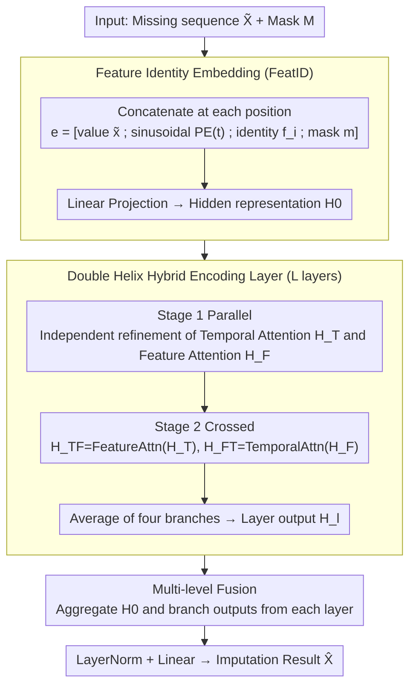

# HELIX: Hybrid Encoding with Learnable Identity and Cross-dimensional Synthesis for Time Series Imputation

**Conference**: ICML 2026 Spotlight  
**arXiv**: [2605.02278](https://arxiv.org/abs/2605.02278)  
**Code**: https://github.com/milaogou/HELIX (Integrated into PyPOTS)  
**Area**: Time Series / Missing Value Imputation / Transformer  
**Keywords**: Feature Identity Embedding, Time Series Imputation, Spatio-Temporal Transformer, Double Helix Encoding  

## TL;DR
Ours learns a "feature identity embedding" for each feature as a persistent semantic anchor. Combined with time-feature double helix attention, it achieved first place across all 21 missing scenarios in 5 public multivariate time series datasets, with an MAE reduction of over 25% compared to the runner-up ImputeFormer on datasets such as ETT-h1.

## Background & Motivation

**Background**: Multivariate time series imputation is a key preprocessing step for downstream tasks in healthcare, meteorology, and transportation. Mainstream methods are divided into three categories: RNN-based (BRITS, GRU-D), Transformer-based (SAITS, ImputeFormer), and Diffusion-based (CSDI, PriSTI). Recently, GNN methods (GRIN, SPIN) have also attempted to explicitly model inter-feature dependencies.

**Limitations of Prior Work**: (1) Existing attention methods "rediscover" inter-feature relationships at every layer, lacking consistent anchors across layers—leading to the collapse of feature relationships under heavy missingness; (2) GNN methods rely on predefined graph topologies and assume feature homogeneity (e.g., same type of spatial sensors), failing to handle mixed feature types; (3) Learning adjacency matrices incurs an $O(F^2)$ cost and remains affected by data missingness; (4) Bi-dimensional attention methods like Crossformer rely solely on numerical patch embedding, causing cross-feature attention to degrade when values are entirely missing.

**Key Challenge**: To perform "cross-feature reasoning," a model requires each token to possess both temporal and feature identities simultaneously. However, existing solutions only provide a persistent anchor on one axis (either temporal PE or graph topology), while the other must be dynamically inferred from values—rendering the inference invalid when values are missing.

**Goal**: (1) Provide a stable semantic identity across layers for each feature; (2) Design an encoding structure with full interaction between temporal and feature dimensions; (3) Maintain stable cross-feature reasoning even under heavy missingness.

**Key Insight**: The authors treat token embedding like a soft prompt in NLP—learning a $d_f$-dimensional vector $f_i$ for each feature as a "feature-specific prompt." Regardless of whether the value at that position is missing, the feature identity information always exists. A "parallel-then-crossed" double helix attention is then designed to alternate processing between temporal and feature dimensions.

**Core Idea**: The embedding for each $(t, i)$ position is defined as $e_{t,i} = [\tilde x_{t,i}; \text{PE}(t); f_i; m_{t,i}]$, where $f_i$ is a learnable identity embedding. This is followed by $L$ layers of "double helix" encoding (each layer first performs parallel temporal and feature attention, then crossed feature and temporal attention) to allow information flow between both dimensions.

## Method

### Overall Architecture
Input $\tilde X \in \mathbb{R}^{T \times F}$ and missing mask $M$. Each position constructs $e_{t,i} \in \mathbb{R}^{d_e}$ (value + sinusoidal PE + identity + mask), projected to hidden dimension $d$ as $H^{(0)}$ via a linear layer. This is followed by $L$ Hybrid Encoding Layers, where each layer outputs four branches $H_T^{(l)}, H_F^{(l)}, H_{TF}^{(l)}, H_{FT}^{(l)}$ which are averaged to obtain $H^{(l)}$. Finally, multi-level fusion $\tilde H = \frac{1}{1+4L}(H^{(0)} + \sum_l \text{sum of branches})$ is performed, passing through LayerNorm and a linear layer to obtain $\hat X$.

### Key Designs

**1. FeatID as a soft adjacency prior: Assigning an ever-present ID card to each feature**

Existing attention-based imputation methods "rediscover" inter-feature relationships per layer and lack consistent anchors, causing cross-feature attention to collapse under heavy missingness. GNN methods rely on predefined topologies and assume homogeneity. HELIX borrows the soft prompt concept from NLP, learning a $d_f$-dimensional vector $f_i$ as a "feature-specific prompt" concatenated into $e_{t,i} = [\tilde x_{t,i}; \text{PE}(t); f_i; m_{t,i}]$. Feature identity remains even if numerical values are absent. The attention score $s_{ij}^{(t)} = e_{t,i}^\top A e_{t,j}$ decomposes into an identity prior $f_i^\top A_{ff} f_j$, identity-context cross terms, and a dynamic context $r_{t,i}^\top A_{rr} r_{t,j}$. When $x_{t,i}$ and $x_{t,j}$ are missing, the identity prior maintains cross-feature compatibility. Without FeatID on BeijingAir (Subseq-50%), MAE surged from 0.166 to 0.398, proving its critical role.

**2. Double Helix Hybrid Encoding Layer: Synchronous refinement and cross-dimensional information exchange**

Purely serial Time→Feature→Time encoding creates information bottlenecks by compressing one dimension before the other, which is detrimental during long missing gaps. HELIX divides each layer into two stages: Stage 1 performs parallel $H_T = \text{TimeMHA}(H^{(l-1)})$ and $H_F = \text{FeatMHA}(H^{(l-1)})$ for independent optimization; Stage 2 performs crossed $H_{TF} = \text{FeatMHA}(H_T)$ and $H_{FT} = \text{TimeMHA}(H_F)$. The final output is averaged: $H^{(l)} = \frac{1}{4}(H_T + H_F + H_{TF} + H_{FT})$. This bi-directional flow is vital for long gaps—removing Hybrid only dropped performance by 2% on Point-50% but by 77% on Subseq-50%.

**3. Multi-level Fusion: Aggregating all layer outputs to preserve shallow details**

Imputation requires fine-grained $(t,i)$ reconstruction. Using only the final layer risks losing raw signal details from shallow layers. HELIX aggregates multi-branch outputs from every layer (including embedding $H^{(0)}$): $\tilde H = \frac{1}{1+4L}(H^{(0)} + \sum_{l=1}^L (H_T^{(l)} + H_F^{(l)} + H_{TF}^{(l)} + H_{FT}^{(l)}))$. This aligns with ResNet findings that direct connections are beneficial; shallow raw signals are often more useful for filling gaps than deep abstractions.

### Loss & Training
Uses the two-part loss from SAITS: observed reconstruction $\mathcal{L}_{ORT}$ and masked imputation $\mathcal{L}_{MIT}$ with equal weights $\mathcal{L} = \mathcal{L}_{ORT} + \mathcal{L}_{MIT}$. Hyperparameters: $d_{pe} \in [6, 24], d_f \in [6, 32], d \in [32, 576], L \in [2, 3]$.

## Key Experimental Results

### Main Results

| Model | Avg Rank ↓ | Notes |
|------|-------------|------|
| **HELIX (Ours)** | **1.00** | 1st in all 21/21 scenarios |
| ImputeFormer | 3.29 | KDD'24 SOTA |
| SAITS | 3.76 | 88M Parameters |
| StemGNN | 5.71 | GNN |
| Linear Interpolation | 6.67 | Naive baseline ranked 5th |
| PatchTST | 7.24 | — |

MAE on ETT-h1 across missing patterns (mean of 5 runs ± std):

| Pattern | HELIX | ImputeFormer | SAITS | Linear Interp. |
|------|-------|--------------|-------|--------------|
| Point-10% | **0.128 ± 0.005** | 0.202 ± 0.044 | 0.150 ± 0.007 | 0.197 |
| Point-50% | **0.189 ± 0.012** | 0.296 ± 0.036 | 0.208 ± 0.009 | 0.267 |
| Block-50% | **0.372 ± 0.015** | 0.404 ± 0.021 | 0.422 ± 0.019 | 0.527 |
| Subseq-50% | **0.489 ± 0.014** | 0.520 ± 0.017 | 0.620 ± 0.016 | 0.722 |

Parameter count is 803K, 100x smaller than SAITS (88M). Wilcoxon significance $p < 0.001$.

### Ablation Study (BeijingAir)

| Configuration | Point-50% | Block-50% | Subseq-50% |
|------|-----------|-----------|------------|
| Full HELIX | **0.102 ± 0.005** | **0.131 ± 0.005** | **0.166 ± 0.009** |
| w/o Fusion | 0.104 | 0.147 | 0.173 |
| w/o Sinusoidal | 0.108 | 0.142 | 0.173 |
| w/o Hybrid | 0.104 | 0.137 | 0.294 |
| w/o FeatEmb | 0.144 | 0.223 | 0.398 |

### Key Findings
- **FeatID is essential**: Removing it leads to significant degradation across all patterns, proving persistent anchors are irreplaceable for long gaps.
- **Double Helix excels in long gaps**: Only a 2% drop on Point-50% without Hybrid, but a 77% drop on Subseq-50%, showing bi-directional cross-flow is critical for severe context loss.
- **Sub-linear scaling of FeatID**: PeMS (862 features) only needs $d_f = 32$ (27:1 compression), while ETT-h1 (7 features) requires $d_f = 12$. Fewer features rely more on FeatID to supplement internal structure.
- **Topology alignment**: Feature attention correlation with geographic proximity in BeijingAir increased from 0.589 (Layer 0) to 0.712 (Layer 2), indicating unsupervised spatial structure discovery.
- **Correlation-based gain**: Ours' improvement over ImputeFormer grows with feature correlation, proving FeatID effectively leverages structure.

## Highlights & Insights
- **Persistent Token Identity**: Adapting the NLP soft prompt concept to time series by providing an unmissable ID card to features ensures compatibility reasoning even with missing data.
- **Robust Evidence**: The necessity of FeatID is supported by ablation, unsupervised structure discovery, and progressive layer alignment.
- **Efficiency**: 803K parameters outperform SAITS (88M) and MOMENT (109M), proving embedding design's importance over parameter scale in time series.
- **Metaphorical Architecture**: The parallel-then-cross structure resembles DNA, effectively linking the architecture to its motivation.

## Limitations & Future Work
- FeatID is learned per-dataset, making cross-dataset transfer difficult; foundation model applications require further research.
- Feature attention $O(TF^2)$ remains a bottleneck for $F > 10^3$.
- Visualizations of initial alignment are limited to BeijingAir; more empirical evidence is needed for other spatio-temporal data.
- Lacks systematic comparison with diffusion models like CSDI, though a single-point comparison on BeijingAir showed Ours (0.073) outperformed CSDI (0.102).

## Related Work & Insights
- **vs ImputeFormer** (KDD 2024): ImputeFormer learns static embeddings without mask interaction; HELIX concatenates masks into embeddings for dynamic identity.
- **vs SPIN** (NeurIPS 2022): SPIN uses predefined graphs; HELIX learns soft adjacency end-to-end without spatial priors.
- **vs SAITS** (ESWA 2023): HELIX outperforms SAITS across all 21 settings with 100x fewer parameters.
- **vs Crossformer** (ICLR 2023): Both use two-stage attention, but Crossformer relies on patch values, whereas HELIX uses explicit FeatID.

## Rating
- Novelty: ⭐⭐⭐⭐ Persistent feature identity embedding is a clear addition; double helix is a novel combination. 
- Experimental Thoroughness: ⭐⭐⭐⭐⭐ 21 test settings with 1st place in all, 16 baselines, and comprehensive visualization.
- Writing Quality: ⭐⭐⭐⭐⭐ Clear narrative with extensive ablation and interpretability studies.
- Value: ⭐⭐⭐⭐⭐ Open-sourced in PyPOTS; the FeatID concept is widely applicable to various multivariate tasks.

<!-- RELATED:START -->

## Related Papers

- [\[ICLR 2026\] T1: One-to-One Channel-Head Binding for Multivariate Time-Series Imputation](../../ICLR2026/time_series/t1_one-to-one_channel-head_binding_for_multivariate_time-series_imputation.md)
- [\[ICML 2026\] Embedding Hybrid Systems into Continuous Latent Vector Fields](embedding_hybrid_systems_into_continuous_latent_vector_fields.md)
- [\[ICML 2026\] Spatiotemporal Imputation with Graph-Informed Flow Matching](spatiotemporal_imputation_with_graph-informed_flow_matching.md)
- [\[ICLR 2026\] Are Global Dependencies Necessary? Scalable Time Series Forecasting via Local Cross-Variate Modeling](../../ICLR2026/time_series/are_global_dependencies_necessary_scalable_time_series_forecasting_via_local_cro.md)
- [\[NeurIPS 2025\] Statistical Guarantees for High-Dimensional Stochastic Gradient Descent](../../NeurIPS2025/time_series/statistical_guarantees_for_high-dimensional_stochastic_gradient_descent.md)

<!-- RELATED:END -->
