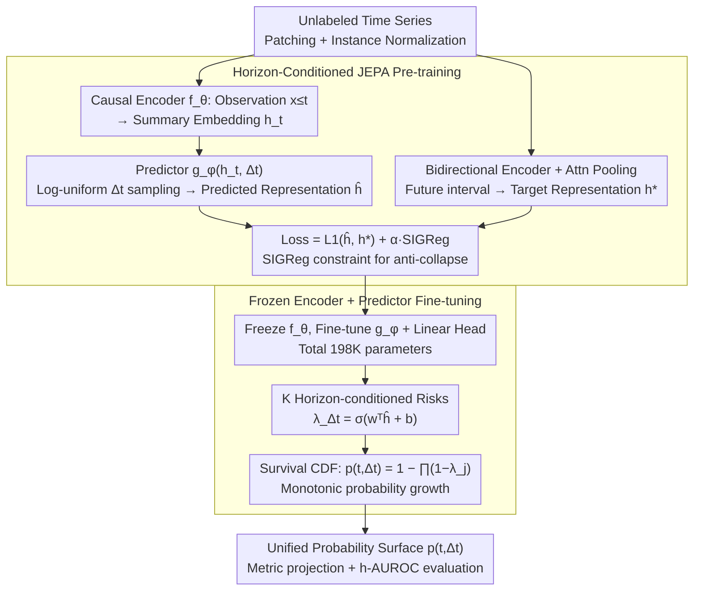

# HEPA: A Self-Supervised Horizon-Conditioned Event Predictive Architecture for Time Series

**Conference**: ICML 2026 Spotlight  
**arXiv**: [2605.11130](https://arxiv.org/abs/2605.11130)  
**Code**: To be confirmed  
**Area**: Time Series / Self-Supervised Learning / Event Prediction  
**Keywords**: Event Prediction, JEPA, Self-Supervised Pre-training, Label Efficiency, Survival Analysis

## TL;DR
HEPA learns predictable dynamics in time series through **horizon-conditioned JEPA self-supervised pre-training**. By freezing the encoder and fine-tuning only the predictor, it outperforms multiple SOTA methods across 14 benchmarks in 11 domains using a single architecture and fixed hyperparameters, achieving 92% performance with only 2% labeled data.

## Background & Motivation

**Background**: Event prediction tasks such as turbine failure prediction, arrhythmia detection, anomaly detection, and RUL (Remaining Useful Life) prediction are scattered across different communities, each using its own benchmarks, metrics, and model architectures. Although these tasks are structurally the same problem—"given observations at time $t$, estimate $P(\text{event occurs within } \Delta t)$"—the methodology remains heavily fragmented.

**Limitations of Prior Work**:
- Value prediction methods (whether supervised or pre-trained) shape the encoder to capture all signal variations, including noise irrelevant to downstream events.
- Existing self-supervised methods using JEPA for classification require labels, while those for anomaly detection are only tuned for specific tasks.
- No single architecture is universal across domains; each application requires domain-specific parameter adjustments.

**Key Challenge**: How to enable the encoder to learn "predictable" temporal dynamics (rather than all variations) while completing downstream event prediction tasks with minimal labels?

**Goal**: Build a universal event prediction system with a unified architecture and fixed hyperparameters that can handle various types of events across multiple domains (from mechanical wear to cardiac abnormalities).

**Key Insight**: Instead of having the encoder predict future values (which contain noise), it should predict future representations (retaining only the predictable parts)—this is the core idea of JEPA.

**Core Idea**: (1) Pre-train the encoder using horizon-conditioned JEPA, forcing it to learn dynamics across multiple time scales; (2) Freeze the encoder and fine-tune only the predictor and event head, using a survival CDF to output a monotonically increasing event probability surface.

## Method

### Overall Architecture
HEPA aims to unify tasks like turbine failure, arrhythmia, anomaly detection, and RUL—all of which structurally involve "estimating the probability of an event within $\Delta t$"—using one architecture and one set of fixed hyperparameters. It consists of two stages: In the pre-training stage, a causal Transformer encoder learns temporal dynamics from unlabeled data, while the predictor learns to predict future **representations** (retaining only predictable parts and filtering noise) given a horizon $\Delta t$. In the downstream fine-tuning stage, the encoder is frozen, and only the predictor and a lightweight event head are tuned to output a discrete-time survival CDF. This CDF naturally ensures monotonic event probabilities as $\Delta t$ increases. Finally, metrics for all domains are projected from the same probability surface, using h-AUROC as a unified cross-domain measure.

### Key Designs

**1. Horizon-Conditioned JEPA Pre-training: Learning "Predictable Dynamics" instead of all variations**
Value prediction (supervised or self-supervised) forces the encoder to capture all signal changes, including noise irrelevant to downstream events, resulting in cluttered representations. HEPA predicts future representations instead: a causal encoder $f_\theta$ maps observations $\mathbf{x}_{\leq t}$ to a summary embedding $\mathbf{h}_t$, and a predictor $g_\phi$ takes $\mathbf{h}_t$ and a horizon $\Delta t$ to predict the future interval representation $\hat{\mathbf{h}}_{(t,t+\Delta t]}$. The target $\mathbf{h}^*_{(t,t+\Delta t]}$ is obtained via a bidirectional encoder and attention pooling. During training, $\Delta t$ is sampled from a log-uniform distribution $[1, \Delta t_{\max}]$, forcing the encoder to understand dynamics across scales. The loss $\mathcal{L} = (1-\alpha)\|\hat{\mathbf{h}} - \mathbf{h}^*\|_1 + \alpha\mathcal{L}_{\text{SIG}}$ uses SIGReg to constrain predictions toward an isotropic Gaussian distribution, replacing EMA momentum in standard JEPA to prevent collapse. This combination forces understanding of long-term dependencies, and SIGReg is more stable with fewer hyperparameters than EMA.

**2. Frozen Encoder + Predictor Fine-tuning: Preserving knowledge with 198K parameters**
End-to-end fine-tuning for downstream tasks with 2.16M parameters risks overfitting and catastrophic forgetting of JEPA features; however, a pure linear probe lacks expressivity. HEPA takes a middle ground: it freezes the encoder and fine-tunes only the predictor and linear event head (198K parameters total). For $K$ discrete horizons $\Delta t = 1, \dots, K$, the predictor outputs conditional risks $\lambda_{\Delta t}(t) = \sigma(\mathbf{w}^\top\hat{\mathbf{h}}_{(t,t+\Delta t]} + b)$. The discrete-time survival CDF $p(t, \Delta t) = 1 - \prod_{j=1}^{\Delta t}(1-\lambda_j(t))$ ensures monotonicity. The fine-tuning loss $\mathcal{L}_{\text{FT}} = \sum_{\Delta t=1}^K w^+\text{BCE}(p(t,\Delta t), y(t,\Delta t))$ uses $w^+ = N_{\text{neg}}/N_{\text{pos}}$ to handle class imbalance.

**3. Unified Probability Surface + h-AUROC Evaluation: One surface for all domain metrics**
The 11 domains have disparate metrics (RMSE for RUL, PA-F1 for anomaly detection). Modeling each separately leads to fragmentation. HEPA makes the model output a probability for every observation time $t$ and horizon $\Delta t$, forming a unified probability surface $p(t, \Delta t)$. All domain-specific metrics are projected from this surface, while h-AUROC (average AUROC across horizons) serves as the cross-domain unified metric. This allows 14 datasets across 11 domains to share the same model and hyperparameters.

## Key Experimental Results

### Main Results

| Dataset | Domain | h-AUROC (Ours) | h-AUROC (PatchTST) | h-AUROC (iTransformer) | Leading? |
|--------|------|-----------------|-------------------|----------------------|--------|
| C-MAPSS-1 | Turbine | **0.81 ± 0.03** | 0.80 | 0.70 | ✓ |
| C-MAPSS-3 | Turbine | **0.84 ± 0.01** | 0.79 | 0.76 | ✓ |
| TEP | Chemical | **1.00** | 0.99 | 0.93 | ✓ |
| Weather | Climate | **0.89** | 0.88 | 0.83 | ✓ |
| GECCO | Water | **0.88** | 0.65 | 0.64 | ✓ |
| MBA | Cardiac | 0.75 | 0.68 | **0.84** | ✗ |

Ours leads in 10 out of 14 benchmarks while tuning only 198K parameters (11x fewer than PatchTST).

### Ablation Study

| Configuration | C-MAPSS-1 h-AUROC | C-MAPSS-3 h-AUROC | Description |
|------|------------------|------------------|------|
| Full Model (100% labels) | 0.786 | 0.853 | Full HEPA |
| 10% labels | 0.772 | 0.830 | Retains 98% / 97% performance |
| 5% labels | 0.730 | 0.709 | Retains 93% / 83% performance |
| **2% labels (2-5 engines)** | **0.724** | **0.635** | **Retains 92% / 74% performance** |
| 1% labels | 0.670 | 0.513 | Significant performance drop |

### Theoretical Support (Proposition 1: Event Information Retention Bound)
$I(H_t; E_{t + \Delta t}) \geq I(H^*; E_{t + \Delta t}) - C_\eta L^2 \varepsilon$, with $C_\eta = (2 \underline{\eta} (1 - \overline{\eta}))^{-1}$. Lower pre-training loss leads to higher downstream h-AUROC (validated across C-MAPSS-1/3 and MBA, Spearman $\rho = -0.67/-0.64/-0.49, p < 0.05$).

### Key Findings
- On datasets with long-duration precursors, HEPA maintains high performance with minimal labels—C-MAPSS-1 achieves 92% of full-label performance with only 2% labels (2 engines).
- This validates the theoretical prediction of Proposition 1: low pre-training loss $\varepsilon$ correlates with high downstream performance.

## Highlights & Insights
- **Innovative use of Horizon-Conditioning**: While standard JEPA for images ignores time scales, HEPA forces the encoder to learn multi-scale dynamics via log-uniform $\Delta t$ sampling—particularly effective for rare events preceded by long-term drift signals.
- **Predictor Fine-tuning vs. Linear Probing**: Linear probing uses only 198 parameters but loses horizon-condition capability; end-to-end tuning requires 2.16M parameters. Predictor fine-tuning uses an MLP to reshape horizon-conditioned outputs, matching performance with 1/11th the parameters.
- **Monotonic Constraint via Survival CDF**: By combining discrete risks $\lambda_j$ into a survival function $\prod_j (1 - \lambda_j)$, the cumulative event probability is guaranteed to be strictly monotonic, avoiding internal model contradictions.
- **Universal Generalizability**: The same model achieves competitive results across vastly different domains (turbines, cardiac, chemicals), demonstrating design robustness.

## Limitations & Future Work
- **Disadvantage in localized sensor events**: On MBA (arrhythmia) and BATADAL (cyber-attacks), Ours is lower than iTransformer/PatchTST because event information is concentrated in a few sensor channels, which HEPA's patch tokenization dilutes.
- **Instability in short-window anomalies**: The label efficiency advantage diminishes on datasets like GECCO with short anomaly windows.
- **Cross-domain theoretical gap**: While bounds are validated within datasets, pre-training loss and h-AUROC do not correlate across datasets ($r = -0.05$) due to fluctuations in Lipschitz constants.

## Related Work & Insights
- **vs TS2Vec / TNC / TimesURL**: Contrastive methods are sensitive to noise and negative sample construction; JEPA directly predicts representations, avoiding these complexities.
- **vs PatchTST / SimMTM**: Value prediction and masked reconstruction learn all signal changes, including downstream-irrelevant noise; HEPA is more efficient by focusing on predictable dynamics.
- **vs Chronos-2 / MOMENT**: Large-scale foundation models gain universality through vast external corpora; HEPA pre-trains per dataset (< 1 min) and achieves deployment readiness through its fixed universal recipe.
- **vs MTS-JEPA / TS-JEPA**: MTS-JEPA adds codebook regularization for anomaly detection; HEPA uses SIGReg to replace EMA, avoiding hyperparameter tuning and outperforming MTS-JEPA on 8 out of 9 reproduced datasets.

## Rating
- Novelty: ⭐⭐⭐⭐⭐  Hybrid of horizon-conditioned JEPA and predictor fine-tuning; Proposition 1 validates the design.
- Experimental Thoroughness: ⭐⭐⭐⭐⭐  14 benchmarks, 11 domains, 5 baselines, ablation studies, theoretical validation, and label efficiency curves.
- Writing Quality: ⭐⭐⭐⭐⭐  Clear structure with both formal definitions and intuitive explanations.
- Value: ⭐⭐⭐⭐⭐  Unified framework, minimal parameter tuning, and high label efficiency provide significant industrial deployment value.

<!-- RELATED:START -->

## Related Papers

- [\[ICML 2026\] Self-Supervised Dynamical System Representations for Physiological Time-Series](self-supervised_dynamical_system_representations_for_physiological_time-series.md)
- [\[NeurIPS 2025\] Towards Self-Supervised Foundation Models for Critical Care Time Series](../../NeurIPS2025/time_series/towards_self-supervised_foundation_models_for_critical_care_time_series.md)
- [\[AAAI 2026\] Detecting the Future: All-at-Once Event Sequence Forecasting with Horizon Matching](../../AAAI2026/time_series/detecting_the_future_all-at-once_event_sequence_forecasting_with_horizon_matchin.md)
- [\[NeurIPS 2025\] Universal Spectral Tokenization via Self-Supervised Panchromatic Representation Learning](../../NeurIPS2025/time_series/universal_spectral_tokenization_via_self-supervised_panchromatic_representation_.md)
- [\[ICML 2025\] TimePoint: Accelerated Time Series Alignment via Self-Supervised Keypoint and Descriptor Learning](../../ICML2025/time_series/timepoint_accelerated_time_series_alignment_via_self-supervised_keypoint_and_des.md)

<!-- RELATED:END -->
