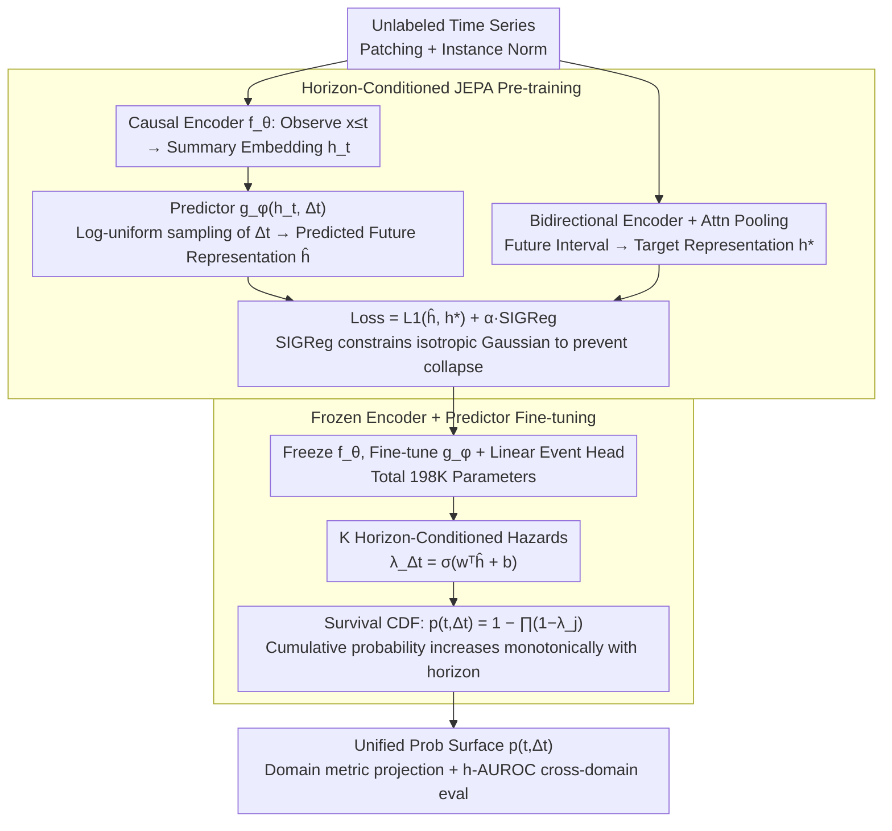

# HEPA: A Self-Supervised Horizon-Conditioned Event Predictive Architecture for Time Series

**Conference**: ICML 2026 Spotlight  
**arXiv**: [2605.11130](https://arxiv.org/abs/2605.11130)  
**Code**: TBD  
**Area**: Time Series / Self-Supervised Learning / Event Prediction  
**Keywords**: Event Prediction, JEPA, Self-Supervised Pre-training, Label Efficiency, Survival Analysis

## TL;DR
HEPA learns predictable dynamics in time series through **horizon-conditioned JEPA self-supervised pre-training**. By freezing the encoder and fine-tuning only the predictor, it outperforms multiple SOTA methods across 14 benchmarks in 11 domains using a single architecture and fixed hyperparameters, achieving 92% performance with only 2% of labeled data.

## Background & Motivation

**Background**: Event prediction tasks such as turbine failure prediction, arrhythmia detection, anomaly detection, and RUL (Remaining Useful Life) prediction are scattered across different communities, each using its own benchmarks, metrics, and model architectures. Although these tasks are structurally the same problem—"given observations at time $t$, estimate $P(\text{event occurs within } \Delta t)$"—methodologies remain highly fragmented.

**Limitations of Prior Work**:
- Value-prediction methods (whether supervised or pre-trained) shape the encoder to capture all signal variations, including noise irrelevant to downstream events.
- Existing self-supervised methods using JEPA for classification require labels, while those for anomaly detection are tuned for specific tasks.
- A single architecture cannot generalize across domains, requiring domain-specific parameter adjustments for every application.

**Key Challenge**: How to enable the encoder to learn "predictable" temporal dynamics (rather than all variations) while completing downstream event prediction tasks with minimal labels?

**Goal**: Construct a universal event prediction system with a unified architecture and fixed hyperparameters that can handle different types of events across multiple domains (from mechanical wear to cardiac abnormalities).

**Key Insight**: Instead of making the encoder predict future values (which contain noise), it should predict future representations (retaining only predictable parts)—this is the core idea of JEPA.

**Core Idea**: (1) Pre-train the encoder with horizon-conditioned JEPA, forcing it to learn dynamics across multiple time scales; (2) Freeze the encoder and fine-tune only the predictor and event head, using a survival CDF to output a monotonically increasing event probability surface.

## Method

### Overall Architecture
HEPA aims to address various tasks like turbine failure, arrhythmia, anomaly detection, and RUL—which are structurally about "estimating the probability of an event within $\Delta t$"—using a single architecture and a fixed set of hyperparameters. It consists of two stages: In the pre-training stage, a causal Transformer encoder learns temporal dynamics from unlabeled data, and a predictor learns to predict future **representations** (retaining only predictable parts and filtering noise) given a horizon $\Delta t$. In the downstream fine-tuning stage, the encoder is frozen, and only the predictor and a lightweight event head are tuned to output a discrete-time survival CDF. This CDF naturally ensures that event probability increases monotonically with $\Delta t$. Finally, metrics for all domains are projected from the same probability surface, using h-AUROC as a unified cross-domain measure.

### Key Designs

**1. Horizon-Conditioned JEPA Pre-training: Learning predictable dynamics instead of all variations**

Value prediction (supervised or pre-trained) forces the encoder to capture all signal variations, including noise irrelevant to downstream events, resulting in cluttered representations. HEPA predicts future representations instead: a causal encoder $f_\theta$ maps observations $\mathbf{x}_{\leq t}$ to a summary embedding $\mathbf{h}_t$, and a predictor $g_\phi$ takes $\mathbf{h}_t$ and a horizon $\Delta t$ to predict the future interval representation $\hat{\mathbf{h}}_{(t,t+\Delta t]}$. The target representation $\mathbf{h}^*_{(t,t+\Delta t]}$ is obtained via a bidirectional encoder and attention pooling. During training, $\Delta t$ is sampled from a log-uniform distribution $[1, \Delta t_{\max}]$, forcing the encoder to understand dynamics across multiple time scales. The loss is $\mathcal{L} = (1-\alpha)\|\hat{\mathbf{h}} - \mathbf{h}^*\|_1 + \alpha\mathcal{L}_{\text{SIG}}$, where SIGReg constrains the predicted representation to an isotropic Gaussian distribution, replacing the EMA momentum in standard JEPA to prevent collapse. The benefits are: horizon conditioning forces long-term dependency understanding, SIGReg is more stable than EMA with fewer hyperparameters, and L1 is more robust to outliers than L2.

**2. Frozen Encoder + Predictor Fine-tuning: Retaining knowledge with 198K parameters**

If downstream event prediction is fine-tuned end-to-end, the 2.16M parameters are prone to overfitting and catastrophic forgetting of JEPA knowledge; however, a pure linear probe lacks expressiveness and loses horizon-conditioned capability. HEPA takes a middle ground—freezing the encoder and jointly fine-tuning only the predictor and a linear event head (total 198K parameters). For $K$ discrete horizons $\Delta t = 1, \dots, K$, the predictor outputs conditional hazards for each segment $\lambda_{\Delta t}(t) = \sigma(\mathbf{w}^\top\hat{\mathbf{h}}_{(t,t+\Delta t]} + b)$. The discrete-time survival CDF $p(t, \Delta t) = 1 - \prod_{j=1}^{\Delta t}(1-\lambda_j(t))$ ensures monotonicity. The fine-tuning loss $\mathcal{L}_{\text{FT}} = \sum_{\Delta t=1}^K w^+\text{BCE}(p(t, \Delta t), y(t, \Delta t))$ uses $w^+ = N_{\text{neg}}/N_{\text{pos}}$ to compensate for class imbalance. The multiplicative form of the survival CDF also solves the internal contradiction where event probability might fluctuate under long horizons—the cumulative probability must increase monotonically.

**3. Unified Probability Surface + h-AUROC Evaluation: Projecting domain metrics from a single surface**

The 11 domains have different metrics (RMSE for RUL, PA-F1 for anomaly detection). Modeling each domain separately would lead back to fragmentation. HEPA makes the model output a probability for every observation time $t$ and horizon $\Delta t$, forming a unified probability surface $p(t, \Delta t)$. All domain-specific metrics are projected from this surface, while the cross-domain unified metric is h-AUROC (average of AUROC at each horizon). Because the output converges into a single surface, 14 datasets across 11 domains can share the same model and hyperparameters, while the surface representation preserves complete predictive information.

## Key Experimental Results

### Main Results

| Dataset | Domain | h-AUROC (HEPA) | h-AUROC (PatchTST) | h-AUROC (iTransformer) | Gain? |
|--------|------|-----------------|-------------------|----------------------|--------|
| C-MAPSS-1 | Turbine | **0.81 ± 0.03** | 0.80 | 0.70 | ✓ |
| C-MAPSS-3 | Turbine | **0.84 ± 0.01** | 0.79 | 0.76 | ✓ |
| TEP | Chemical | **1.00** | 0.99 | 0.93 | ✓ |
| Weather | Climate | **0.89** | 0.88 | 0.83 | ✓ |
| GECCO | Water | **0.88** | 0.65 | 0.64 | ✓ |
| MBA | Cardiac | 0.75 | 0.68 | **0.84** | ✗ |

HEPA leads in 10 out of 14 benchmarks while tuning only 198K parameters (11x fewer than PatchTST).

### Ablation Study & Label Efficiency

| Configuration | C-MAPSS-1 h-AUROC | C-MAPSS-3 h-AUROC | Description |
|------|------------------|------------------|------|
| Full Model (100% Labels) | 0.786 | 0.853 | Full HEPA |
| 10% Labels | 0.772 | 0.830 | Retains 98% / 97% performance |
| 5% Labels | 0.730 | 0.709 | Retains 93% / 83% performance |
| **2% Labels (2-5 engines)** | **0.724** | **0.635** | **Retains 92% / 74% performance** |
| 1% Labels | 0.670 | 0.513 | Significant performance drop |

### Theory (Proposition 1: Event Information Preservation Bound)
$I(H_t; E_{t + \Delta t}) \geq I(H^*; E_{t + \Delta t}) - C_\eta L^2 \varepsilon$, where $C_\eta = (2 \underline{\eta} (1 - \overline{\eta}))^{-1}$. Lower pre-training loss leads to higher downstream h-AUROC (validated on C-MAPSS-1/3 and MBA across different domains, Spearman $\rho = -0.67/-0.64/-0.49$, p < 0.05).

### Key Findings
- On lifecycle datasets with long-duration precursors, HEPA maintains high performance with very few labels—C-MAPSS-1 achieves 92% of full-label performance with only 2% labels (2 engines).
- This confirms Theoretical Prediction 1: low pre-training loss $\varepsilon$ correlates positively with high downstream performance.

## Highlights & Insights
- **Innovative Application of Horizon-Conditioning**: Standard JEPA for images ignores time scales. HEPA forces the encoder to learn multi-scale dynamics by log-uniformly sampling $\Delta t$—especially effective in applications needing rare event prediction from long-term drift signals.
- **Expressiveness Trade-off in Predictor Fine-tuning**: Linear probes use only 198 parameters but lack horizon-conditioned expressiveness; end-to-end requires 2.16M parameters. Predictor fine-tuning cleverly reshapes horizon-conditioned outputs using an MLP, achieving equivalent performance with 1/11 parameters.
- **Monotonic Constraint in Survival CDF**: By combining discrete hazards $\lambda_j$ into a survival function $\prod_j (1 - \lambda_j)$, the cumulative event probability is guaranteed to be strictly monotonic with respect to the horizon—avoiding internal model contradictions.
- **Cross-Domain Generality vs Domain-Specific Metrics**: The same model achieves competitive or superior performance across turbine, cardiac, and anomaly domains, demonstrating robust design.

## Limitations & Future Work
- **Disadvantage in Sensor-Localized Events**: Performance on MBA (arrhythmia) and BATADAL (cyber-attack) is lower than iTransformer and PatchTST because event information is concentrated in few sensor channels, which HEPA's patch tokenization dilutes.
- **Unstable Performance on Short-Window Anomaly Datasets**: The label efficiency advantage vanishes on datasets with short anomaly windows like GECCO.
- **Cross-Domain Invalidation of Pre-training Loss and Performance**: While validated within single datasets, pre-training loss and h-AUROC do not correlate across datasets (r = -0.05), as Lipschitz constants vary significantly between datasets.

## Related Work & Insights
- **vs TS2Vec / TNC / TimesURL**: Contrastive learning methods learn through positive/negative pairs and are sensitive to noise; HEPA’s JEPA directly predicts representations, avoiding the complexity of pair construction.
- **vs PatchTST / SimMTM**: Value prediction and masked reconstruction methods learn all signal changes, including downstream-irrelevant noise; HEPA is more efficient by focusing on predictable dynamics.
- **vs Chronos-2 / MOMENT**: Large-scale pre-trained foundation models gain generality via vast external corpora; HEPA pre-trains per dataset (< 1 minute), and although it doesn't share weights across domains, it achieves practical deployability through a fixed universal fine-tuning recipe.
- **vs MTS-JEPA / TS-JEPA**: MTS-JEPA adds codebook regularization for anomaly detection; HEPA replaces EMA with SIGReg to avoid hyperparameter tuning and wins in 8 out of 9 reproduced datasets.

## Rating
- Novelty: ⭐⭐⭐⭐⭐  The combination of horizon-conditioned JEPA + predictor fine-tuning for time series; Proposition 1 validates design principles.
- Experimental Thoroughness: ⭐⭐⭐⭐⭐  14 benchmarks + 11 domains + 5 baselines + ablation tables + theoretical validation + label efficiency curves + representation visualization.
- Writing Quality: ⭐⭐⭐⭐⭐  Clear structure; Method section provides both formal notation and intuitive explanations.
- Value: ⭐⭐⭐⭐⭐  Unified framework, minimal parameter tuning, and high label efficiency provide real industrial deployment value; the combination of theory and experiment guides designers on when the method is effective.

<!-- RELATED:START -->

## Related Papers

- [\[NeurIPS 2025\] Towards Self-Supervised Foundation Models for Critical Care Time Series](../../NeurIPS2025/time_series/towards_self-supervised_foundation_models_for_critical_care_time_series.md)
- [\[AAAI 2026\] Detecting the Future: All-at-Once Event Sequence Forecasting with Horizon Matching](../../AAAI2026/time_series/detecting_the_future_all-at-once_event_sequence_forecasting_with_horizon_matchin.md)
- [\[NeurIPS 2025\] Universal Spectral Tokenization via Self-Supervised Panchromatic Representation Learning](../../NeurIPS2025/time_series/universal_spectral_tokenization_via_self-supervised_panchromatic_representation_.md)
- [\[ECCV 2024\] OmniSat: Self-Supervised Modality Fusion for Earth Observation](../../ECCV2024/time_series/omnisat_self-supervised_modality_fusion_for_earth_observation.md)
- [\[ICML 2025\] TimePoint: Accelerated Time Series Alignment via Self-Supervised Keypoint and Descriptor Learning](../../ICML2025/time_series/timepoint_accelerated_time_series_alignment_via_self-supervised_keypoint_and_des.md)

<!-- RELATED:END -->
