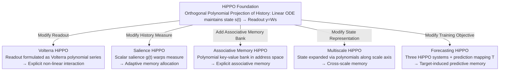

# HiPPO Zoo: Explicit Memory Mechanisms for Interpretable State Space Models

**Conference**: ICML 2026  
**arXiv**: [2602.21340](https://arxiv.org/abs/2602.21340)  
**Code**: To be confirmed  
**Area**: Time Series / Interpretability / State Space Models  
**Keywords**: HiPPO, State Space Models, Interpretable Memory, Polynomial Bases

## TL;DR
This work **explicates** the implicit memory mechanisms in modern SSMs (such as Mamba) by extending the HiPPO framework into the "HiPPO Zoo" (consisting of 5 variants). Each variant implements specific modern SSM capabilities—non-linearity, adaptive memory, associative memory, multiscale representation, and predictive target constraints—using interpretable polynomial representations, achieving 100% accuracy on selective copying and associative recall tasks.

## Background & Motivation

**Background**: State Space Models (SSMs) have gained significant attention in sequence modeling due to their efficiency and long-range dependency capabilities. Models from S4 to Mamba have introduced features such as input-dependent state updates, adaptive memory allocation, non-linear interactions, and implicit associative memory.

**Limitations of Prior Work**: Despite their strong performance, the internal mechanisms by which modern SSMs represent, prioritize, and transform historical information remain a "black box." These capabilities are implicitly encoded in learned state dynamics, making them difficult to analyze or interpret directly.

**Key Challenge**: The HiPPO framework provides explicit and interpretable historical representations via orthogonal polynomial projections, but the original HiPPO lacks the critical capabilities found in modern SSMs—creating a gap between interpretability and expressivity.

**Goal**: Map the implicit capabilities of modern SSMs back into the HiPPO framework to make them explicit while retaining the interpretable polynomial structure of HiPPO.

**Key Insight**: Many modern SSM capabilities can be achieved through explicit modifications to HiPPO’s historical measures, polynomial coefficient dynamics, or objective function constraints.

**Core Idea**: Design the "HiPPO Zoo"—five extended variants of HiPPO, each explicitly implementing a modern SSM capability in an interpretable manner. This transforms memory mechanisms from "learned black-box state transitions" into "visualizable and analyzable polynomial structures."

## Method

### Overall Architecture
The core of HiPPO is projecting signal history onto orthogonal polynomial (OP) bases to form a readable coefficient vector. Given an input signal $f(t)$, the HiPPO state $\mathbf{s}(t)$ at time $t$ satisfies a linear ODE $\dot{\mathbf{s}}(t) = A \mathbf{s}(t) + \mathbf{b} f(t)$, with the output generated via readout $y(t) = W\mathbf{s}(t)$. This paper maps five capabilities of modern SSMs to explicit modifications of **specific components** of this foundation: modifying the readout (Volterra), modifying the historical measure (Salience), adding an independent associative memory bank (Associative Memory), modifying the state representation (Multiscale), and modifying the training objective (Forecasting). Collectively called the "HiPPO Zoo," these variants share the same interpretable polynomial structure, exposing implicit mechanisms through polynomial coefficients, measures, or targets.

### Key Designs

**1. Volterra HiPPO: Linear state dynamics with visualizable non-linearity via polynomial readout**

Contemporary SSMs compress non-linear interactions into black-box MLP readouts, making it unclear which historical interactions were learned. Volterra HiPPO maintains linear state dynamics but formulates the readout as a Volterra series of orthogonal polynomial products: $y(t) = \beta^{(0)} + \sum_{k=1}^K \sum_{i_1, \ldots, i_k} \beta_{i_1, \ldots, i_k}^{(k)} s_{i_1}(t) \cdots s_{i_k}(t)$. Each coefficient tensor $\beta^{(k)}$ directly encodes $k$-th order interaction strength. This makes the interaction structure readable from polynomial coefficients rather than hidden in MLP weights. In second-order Volterra tasks, it converges faster than a single-layer MLP and accurately recovers the true Volterra kernel.

**2. Salience HiPPO: Explicitly warping historical measures with a scalar salience signal**

Selective SSMs like Mamba implicitly adjust memory allocation via high-dimensional gating, which is hard to visualize. Salience HiPPO collapses this into a scalar by multiplying the HiPPO ODE by a time-varying salience signal $g(t)$, resulting in $\dot{\mathbf{s}}(t) = g(t) [A \mathbf{s}(t) + \mathbf{b} f(t)]$. Via time transformation $t_1 = \varphi(t_0) = \int_0^{t_0} g(s) ds$, this is equivalent to running standard HiPPO in "warped time"—explicitly distorting the historical measure using a readable scalar signal to allocate more memory resources to critical time periods. In selective copying tasks, salience visibly spikes at key locations, achieving 100% accuracy (compared to 81% for S4D, 60.8% for LSTM, and 22.1% for Transformer).

**3. Associative Memory HiPPO: Explicitly visualizable key-value access via polynomial bases**

Associative behavior in modern SSMs is performed via implicit state-dependent updates. Associative Memory HiPPO splits this into two explicit components: a standard HiPPO system generating states $S_t$, and an independent associative memory bank with $d_{\text{model}}$ channels, where each channel $m_j(x)$ is a polynomial function defined on address space $x \in [0, 1]$. Write operations use minimum-norm updates at address $x_{\text{key}}$ such that $m_j(x_{\text{key}}) = y_t[j]$. Read operations evaluate the polynomial at $x_{\text{query}}$ to retrieve value vectors. This replicates Transformer-style KV mechanisms using polynomial kernels while keeping bindings fully visible. It achieves 100% accuracy in associative recall, while S4D, LSTM, and Transformer remain near the random baseline of 33%.

**4. Multiscale HiPPO: Polynomial-in-scale states for universal time-scale memory**

Standard HiPPO historical measures correspond to a single time scale. Modern SSMs must stack multiple layers to implicitly construct multiscale memory for short-term details and long-term trends. Multiscale HiPPO makes this explicit: instead of a fixed scale, the HiPPO state is treated as a function $\mathbf{s}(u)$ of an inverse time-scale parameter $u \triangleq \log g \in [\log\epsilon, 0]$, expanded via orthogonal polynomials. A single Multiscale HiPPO system can maintain history across four orders of magnitude ($10^1$ to $10^4$). Its reconstruction error matches or exceeds a bank of single-scale HiPPOs while providing a compact, continuous representation.

**5. Forecasting HiPPO: Characterizing "predictive memory" using three HiPPO systems**

Sequence models are typically trained with one-step-ahead prediction loss, which implicitly determines what historical information is preserved, but this causal link is rarely visualized. Forecasting HiPPO makes this explicit using three systems: System 1 uses Leg-T to represent the recent window $[t-H, t]$ to estimate lagged signals $u(t) \approx f(t-H)$; System 2 takes $u(t)$ as input to represent earlier history; a linear mapping $T$ is learned to predict System 1's state from System 2's state. This target induces a quadratic form $Q = T^\top W T$ (the "predictive history metric") in coefficient space, defining the geometry of "how similar two histories are in a predictive sense." Projecting history onto the principal subspace of $Q$ reveals the "predictive memory": short-horizon predictors emphasize details at low delays, while long-horizon predictors retain smooth long-term structures.

## Key Experimental Results

### Main Results

| Model | Params | Selective Copy Acc. | Assoc. Recall Acc. | Note |
|-------|--------|---------------------|--------------------|------|
| Vanilla HiPPO | 25k | 27.6% | 22.8% | Baseline without extensions |
| Vanilla + MLP | 25k | 27.7% | 20.4% | Poor performance with MLP readout |
| **Salience HiPPO** | 25k | **100.0%** | 27.1% | Salience adaptation |
| **Assoc. Memory HiPPO** | 25k | 65.7% | **100.0%** | Explicit associative memory |
| S4D (1-layer) | 26k | 81.0% | 33.2% | General SSM baseline |
| LSTM (1-layer) | 25k | 60.8% | 32.7% | RNN baseline |
| Transformer (1-layer) | 27k | 22.1% | 33.9% | Attention baseline |

### Performance Trade-offs

| Dataset | HiPPO+MLP PPL | Mamba PPL | Performance Gap |
|---------|---------------|-----------|-----------------|
| WikiText-2 (Char) | 6.80 | 5.54 | 23% Decrease |
| Salience HiPPO | 7.52 | 5.54 | 36% Decrease |
| Assoc. Memory | 20.41 | 5.54 | 268% Decrease |

The paper explicitly notes that HiPPO Zoo prioritizes interpretability over raw performance. While variants excel in synthetic tasks aligned with their mechanisms, they perform below modern SSMs in general sequence modeling.

### Key Findings
- **Multiscale Reconstruction**: A single Multiscale HiPPO system matches or beats reconstruction errors of multiple single-scale systems across scales from $10^1$ to $10^4$.
- **Predictive Memory**: Short-horizon predictors emphasize small-delay details, while long-horizon predictors retain smooth long-term structures, revealing how training objectives shape the SSM memory structure.

## Highlights & Insights
- **Deep Trade-off Between Interpretability and Performance**: Rather than claiming superiority, the paper systematically demonstrates how to design transparent memory mechanisms for applications where interpretability is paramount (e.g., scientific computing, online learning), serving as a meaningful supplement to performance-driven research.
- **Unified Framework for Modular SSM Structure**: The five variants decompose modern SSM capabilities into orthogonal dimensions (measure, dynamics, readout), providing a foundation for future hybrid architecture design and theoretical analysis.
- **Power of Polynomial Bases**: Through Volterra projections, OP reproducing kernels, and multiscale expansions, the paper shows that while HiPPO is linear, its polynomial structure can implement non-linear effects in an explicit manner.
- **Deriving Memory from Objectives**: The insight that the forecasting objective $Q = T^\top W T$ defines the geometry of history space is profound, suggesting that different downstream tasks should learn distinct historical representations.

## Limitations & Future Work
- General sequence modeling performance drops significantly (23%-36%) on WikiText-2, indicating that interpretability comes at a substantial cost to expressivity.
- The continuous address strategy in Associative Memory HiPPO performs poorly on autoregressive language prediction (20.41 PPL), suggesting not all explicit mechanisms are universal.
- Computational costs vary: Volterra HiPPO reaches $O(N^k)$ complexity for higher orders; Multiscale HiPPO requires $O(N M^2)$ per step.
- Future Directions: Low-rank tensor approximations could reduce Volterra complexity to $O(k N r)$; hybrid architectures (embedding interpretable components in expressive SSMs) might achieve a better balance between performance and interpretability.

## Related Work & Insights
- **vs S4 / Mamba**: S4 uses HiPPO for initialization but learns general linear dynamics, losing explicitness; Mamba adds selectivity but increases black-box complexity. This work "reverse-engineers" these capabilities into explicit variants.
- **vs Transformer Attention**: Associative Memory HiPPO achieves KV-like mechanisms with fewer parameters (25k vs 27k Transformer) and higher synthetic accuracy (100% vs 33.9% on Recall).
- **vs Interpretable ML**: This work addresses deficiencies in "post-hoc" methods (LIME, SHAP) by baking "ante-hoc" interpretability directly into the architecture.

## Rating
- Novelty: ⭐⭐⭐⭐⭐ The approach of mapping modern SSM capabilities back to an explicit polynomial framework is highly innovative.
- Experimental Thoroughness: ⭐⭐⭐⭐ Synthetic tasks expertly isolate mechanisms with strong visualization; however, general sequence modeling is only tested on char-level WikiText-2.
- Writing Quality: ⭐⭐⭐⭐⭐ Clear logic, flowing from limitations to solutions; precise mathematical formulations.
- Value: ⭐⭐⭐⭐⭐ Direct utility for scientific computing and regulated fields requiring interpretability; offers new tools for SSM theoretical analysis.

<!-- RELATED:START -->

## Related Papers

- [\[ICML 2026\] FRACTAL: State Space Model with Fractional Recurrent Architecture for Computational Temporal Analysis of Long Sequences](fractal_ssm_with_fractional_recurrent_architecture_for_computational_temporal_an.md)
- [\[ICML 2026\] Learning Long Range Spatio-Temporal Representations over Continuous Time Dynamic Graphs with State Space Models](learning_long_range_spatio-temporal_representations_over_continuous_time_dynamic.md)
- [\[NeurIPS 2025\] Structured Sparse Transition Matrices to Enable State Tracking in State-Space Models](../../NeurIPS2025/time_series/structured_sparse_transition_matrices_to_enable_state_tracking_in_state-space_mo.md)
- [\[NeurIPS 2025\] Parallelization of Non-linear State-Space Models: Scaling Up Liquid-Resistance Liquid-Capacitance Networks for Efficient Sequence Modeling](../../NeurIPS2025/time_series/parallelization_of_non-linear_state-space_models_scaling_up_liquid-resistance_li.md)
- [\[ICML 2025\] A Generalizable Physics-Enhanced State Space Model for Long-Term Dynamics Forecasting in Complex Environments](../../ICML2025/time_series/a_generalizable_physics-enhanced_state_space_model_for_long-term_dynamics_foreca.md)

<!-- RELATED:END -->
