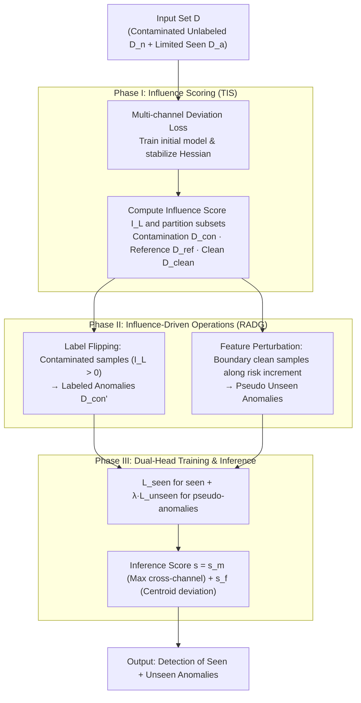

# IMPACT: Influence Modeling for Open-Set Time Series Anomaly Detection

**Conference**: ICML 2026  
**arXiv**: [2603.29183](https://arxiv.org/abs/2603.29183)  
**Code**: https://github.com/mala-lab/IMPACT  
**Area**: Time Series Anomaly Detection / Open-Set Anomaly Detection  
**Keywords**: Influence Functions, Pseudo-Anomaly Generation, Label Flipping, Contamination Correction, Open-Set Time Series Detection  

## TL;DR
IMPACT utilizes the "Influence Function" as both a searchlight and a scalpel—first training an initial model with a multi-channel deviation loss to calculate the influence score of each training sample on the validation risk. Under theoretical guarantees of risk reduction, it flips high-influence contaminated unlabeled samples into labeled anomalies and perturbs "boundary normal samples" (those with minimal risk contribution) along the gradient direction to create "unseen pseudo-anomalies." Finally, a dual-head network learns both seen and unseen anomaly classes, consistently surpassing over ten unsupervised and open-set baselines across eight real-world time-series benchmarks.

## Background & Motivation

**Background**: Time Series Anomaly Detection (TSAD) has long been dominated by unsupervised methods—reconstruction, one-class SVM, self-supervised prediction, and diffusion models—assuming a pure normal training set. Recently, Open-Set Anomaly Detection (OSAD) has gained popularity, allowing for a small number of labeled seen anomaly classes with the expectation of identifying both "seen + unseen" anomalies. Representative methods include DRA, AHL, DPDL, MOSAD, and InvAD.

**Limitations of Prior Work**: While OSAD works reasonably well in images, it faces two major obstacles in time series. First is **contamination**: the unlabeled training subset almost certainly contains unknown anomalies, which existing methods treat as normal samples, thus polluting the supervision signal. Second is **pseudo-anomaly generation**: common image augmentations like rotation, Cutout, CutPaste, and Mixup break temporal sequentiality—horizontally flipping an ECG fragment violates cardiac physiology, and short-window moving averages fail to eliminate long-period seasonality. Consequently, the decision boundary is skewed by both types of noise.

**Key Challenge**: The challenge is to simultaneously perform "training set cleaning" and "representative pseudo-anomaly generation" without knowing which unlabeled samples are noise or what unseen anomalies look like, while provably ensuring that both steps reduce test risk rather than introducing new biases.

**Goal**: The problem is decomposed into three sub-problems: (i) designing a loss suitable for multi-channel time series that integrates with influence functions; (ii) automatically identifying contaminated samples and "boundary normal samples with lowest risk contribution" using influence scores; (iii) proving that both "label flipping" and "feature perturbation along influence directions" reduce test risk.

**Key Insight**: The authors revisit the influence function of Koh & Liang, $\mathcal{I}_L(\bm z_i,\bm z_t)=-\nabla_\theta L(\bm z_t,\hat\theta)^\top H_{\hat\theta}^{-1}\nabla_\theta L(\bm z_i,\hat\theta)$. It not only indicates a sample's marginal contribution to predictions but also acts as a steering wheel for two operations: the risk changes for label flipping ($\bm z_i\mapsto\bm z_{i\mathbf 1}$) and feature perturbation ($\bm w_i\mapsto\bm w_i+\zeta_i$) can both be expressed in closed form using its second-order derivatives.

**Core Idea**: Use influence functions to drive both "contamination correction" and "pseudo-anomaly generation." The former flips samples with $\mathcal{I}_L(\bm z_i)>0$ into anomalies, while the latter perturbs boundary samples with the smallest absolute values in $\mathcal{I}_L(\bm z_i)<0$ along the $\nabla_\varphi\nabla_{\theta_h}L$ direction to generate unseen anomalies, unified within a risk-reduction framework.

## Method

The IMPACT pipeline consists of three stages: Stage I (Influence Scoring Module, TIS) trains an initial model using multi-channel deviation loss and computes influence scores to partition the data into a contaminated set $\mathcal{D}_{con}$, a reference normal set $\mathcal{D}_{ref}$, and a remaining clean set $\mathcal{D}_{clean}$. Stage II (Rectification-Augmentation Module, RADG) performs "label flipping + feature perturbation" guided by influence scores to construct the flipped set $\mathcal{D}_{con}'$ and perturbed feature set $\mathcal{W}_{per}'$. Stage III adds an unseen anomaly learning head for joint training with $L_{seen}+\lambda L_{unseen}$. During inference, the final score is the maximum cross-channel anomaly score plus the feature deviation from the reference normal centroid.

### Overall Architecture
The input is a time-series set $\mathcal{D}=\mathcal{D}_n\cup\mathcal{D}_a$, where each sample $\bm x_i\in\mathbb{R}^D\times L$ ($D$ channels, $L$ steps). The model consists of two parts: a feature extractor $\bm\varphi_i=\phi(\bm x_i, \theta_\phi)$ (multivariate time-series encoder) and an anomaly scoring head $h(\bm\varphi_i, \theta_h)\in\mathbb{R}^r$ (outputting $r$-channel anomaly scores). The training uses multi-channel deviation loss followed by influence-function-based resampling, and finally appends an unseen anomaly head $h'(\cdot, \theta_{h'})$.

### Key Designs

**1. Multi-channel Deviation Loss: Expanding Representational Power and Stabilizing Gradient Structure**

Influence functions require the loss to be twice differentiable with respect to parameters and the Hessian to be invertible. Traditional deviation loss is single-channel and loses variance information, making $H_{\hat\theta}^{-1}\nabla_\theta L$ unstable. IMPACT implements it as multi-channel—aligning $r$-channel anomaly scores of normal samples with the mean $\bm\mu_r$ of an isotropic Gaussian prior $\mathcal{N}(\bm\mu, \bm\Sigma)$, while pushing anomalies away by at least $a$. The deviation is measured by the Mahalanobis distance $\mathit{dev}(\bm x_i) = \sqrt{(f(\bm x_i, \theta)-\bm\mu_r)^\top\bm\Sigma_r^{-1}(f(\bm x_i, \theta)-\bm\mu_r)}$. The loss is defined as $L(\bm z_i, \theta) = \tfrac{1}{r}\sum_{j=1}^r[(1-y_i)\mathit{dev}(\bm x_i)_j + y_i\max(0, a-\mathit{dev}(\bm x_i)_j)]$. Theorem 1 proves this is equivalent to minimizing the entropy of the latent variable distribution $\mathcal{H}(S) \propto \log\sigma^2$, providing an information-theoretic basis for the "compact normal + pushed anomalies" intuition.

**2. Influence-Driven Dual Operations: Rectifying Contamination and Generating Unseen Anomalies**

IMPACT treats Koh & Liang's influence function $\mathcal{I}_L(\bm z_i,\bm z_t)$ as a steering wheel for two modifications. First is **Label Flipping**: for the contaminated set $\mathcal{D}_{con} = \{\bm z_i\in\mathcal{D}_n\mid\mathcal{I}_L(\bm z_i)>0\}$, it is proven that flipping labels necessarily reduces risk (Theorem 2). Second is **Feature Perturbation**: for boundary samples in the clean set $\mathcal{D}_{per} = \{\bm z_i\in(\mathcal{D}_n\cap\mathcal{D}_{clean})\mid\mathcal{I}_L(\bm z_i)<0\}$, features are perturbed along the direction $\mathcal{I}_{per}(\bm w_i) = -\nabla_{\theta_h}L(\mathcal{V},\hat\theta_h)^\top H_{\hat\theta_h}^{-1}[\nabla_\varphi\nabla_{\theta_h}L(\bm w_i,\hat\theta_h)]$. This generates pseudo-anomalies that are provably outside the known distribution but still useful for learning (Theorem 3/4).

**3. Dual-Head Training and Inference: Decoupling Unseen Learning**

To prevent pseudo-anomaly gradients from hurting the backbone representation of seen classes, IMPACT uses $L_{re} = L_{seen} + \lambda L_{unseen}$. $L_{seen}$ covers original labels, flipped anomalies, and clean normal samples, while $L_{unseen}$ feeds perturbed features to an independent unseen head $h'$. During inference, scores are fused: $s = s_m + s_f$, where $s_m$ is the maximum cross-channel score and $s_f$ is the feature deviation from the reference normal centroid.

### Loss & Training
The training follows two phases: Stage I trains the initial model $\hat\theta$ on the full set $\mathcal{D}$, approximates the Hessian inverse using LiSSA, and computes $\mathcal{I}_L$ to partition sets. Stage II retrains with $L_{re}$. Hyperparameters $\alpha$ and $\lambda$ control perturbation intensity and loss balance, respectively.

## Key Experimental Results

### Main Results
IMPACT was evaluated against 7 unsupervised methods (e.g., TranAD, GPT4TS, DCdetector) and multiple open-set methods (e.g., DRA, AHL, DPDL, InvAD) across 8 benchmarks (UCR, ASD, PSM, SMD, CT, SAD, PTBXL, TUSZ).

| Setting / Dataset | Ours (IMPACT) | Prev. SOTA | Gain Trend |
|--------|------|----------|------|
| Open-Set Avg AUC (8 datasets) | **Highest** | DRA / AHL / DPDL | Consistently surpasses baselines |
| Unsupervised Comparison (UCR / TUSZ) | — | GPT4TS 54.60 / 66.31 | High-margin improvement over unsupervised |
| Contamination Rates (0%–10%) | Most Robust | Baselines drop sharply | IMPACT remains stable |
| Seen Anomaly Ratio | Most Robust | Baselines sensitive to ratio | Validates unseen head effectiveness |

### Ablation Study
| Configuration | Key Metric Change | Explanation |
|------|---------|------|
| Full IMPACT | Baseline AUC | TIS + RADG + Dual-head |
| w/o Label Flipping | Decrease (more at high noise) | Validates correction gain (Theorem 2) |
| w/o Feature Perturbation | Decrease on unseen classes | Validates generation gain (Theorem 4) |
| Manual Augmentation (CutPaste) | Decrease | Influence-guided exceeds heuristics |
| Single-channel loss ($r=1$) | Decrease & Unstable Hessian | Multi-channel is essential for stability |
| w/o Unseen Head $h'$ | Decrease | Decoupled heads prevent backbone pollution |

### Key Findings
- **Label Flipping + Feature Perturbation** yield a "1+1>2" effect, addressing orthogonal problems (supervision contamination vs. representational limits).
- IMPACT exhibits exceptional robustness; as contamination increases from 0% to 10%, most baselines' AUC drops monotonically while IMPACT remains horizontal.
- As the ratio of seen anomalies decreases towards 0% (approaching fully unseen), IMPACT shows the smallest decline, proving the unseen head learns a boundary orthogonal to seen classes.

## Highlights & Insights
- Elevates the **Influence Function** from a diagnostic tool to a "training-time steering wheel," driving both label flipping and feature perturbation.
- **Label Flipping** replaces manual queries in active learning with statistical influence, which is applicable to any weak-supervision task where the unlabeled set contains target classes.
- **Feature Perturbation** along $\mathcal{I}_{per}(\bm w_i)$ reverses the logic of adversarial perturbations; while adversarial attacks move toward misclassification, IMPACT moves toward "risk increment" to simulate unknown distributions provably.
- The triple equivalence of **Multi-channel Deviation Loss**, isotropic Gaussian priors, and entropy minimization provides an elegant unification of geometric, statistical, and information-theoretic perspectives.

## Limitations & Future Work
- Computing the Hessian inverse and LiSSA approximations remains computationally heavy for massive time-series sets; more memory-efficient second-order approximations like K-FAC could be explored.
- The convexity assumption of influence functions may be violated in deep Transformer backbones, leading to estimation errors.
- The hard threshold $\mathcal{I}_L(\bm z_i)>0$ for flipping could be replaced with a soft weight based on the absolute influence value.
- Performance on long-term point-level anomalies or streaming scenarios requires further design for the reference set $\mathcal{V}$ update strategy.

## Related Work & Insights
- **vs. DRA / AHL / DPDL (OSAD)**: These use limited labels but rely on heuristic augmentations; IMPACT upgrades this to provable influence-guided generation and adds contamination correction.
- **vs. CutAddPaste / COE (TS Augmentation)**: These use heuristic temporal transforms; IMPACT bypasses the difficulty of preserving temporal semantics by perturbing directly in the feature space.
- **vs. GammaGMM / ExCeeD (Contamination Estimation)**: These estimate contamination at inference; IMPACT rectifies it during training to remove the noise at its source.

## Rating
- Novelty: ⭐⭐⭐⭐⭐ First OSAD framework to use influence functions for dual correction/generation with theoretical risk reduction proofs.
- Experimental Thoroughness: ⭐⭐⭐⭐ 8 real-world datasets and extensive sensitivity analysis; lacks a runtime comparison for very large-scale sequences.
- Writing Quality: ⭐⭐⭐⭐ Complete loop from motivation to theory and experiment.
- Value: ⭐⭐⭐⭐⭐ Provides a theoretically grounded and open-sourced new benchmark for open-set detection.

<!-- RELATED:START -->

## Related Papers

- [\[ICML 2026\] AnomSeer: Reinforcing Multimodal LLMs to Reason for Time-Series Anomaly Detection](anomseer_reinforcing_multimodal_llms_to_reason_for_time-series_anomaly_detection.md)
- [\[ICML 2026\] Generalizing Multi-scale Time-Series Modeling with a Single Operator](generalizing_multi-scale_time-series_modeling_with_a_single_operator.md)
- [\[ACL 2026\] Time-RA: Towards Time Series Reasoning for Anomaly Diagnosis with LLM Feedback](../../ACL2026/time_series/time-ra_towards_time_series_reasoning_for_anomaly_diagnosis_with_llm_feedback.md)
- [\[NeurIPS 2025\] Channel Matters: Estimating Channel Influence for Multivariate Time Series](../../NeurIPS2025/time_series/channel_matters_estimating_channel_influence_for_multivariate_time_series.md)
- [\[ICML 2026\] QuITE: Query-based Irregular Time Series Embedding](quite_query-based_irregular_time_series_embedding.md)

<!-- RELATED:END -->
