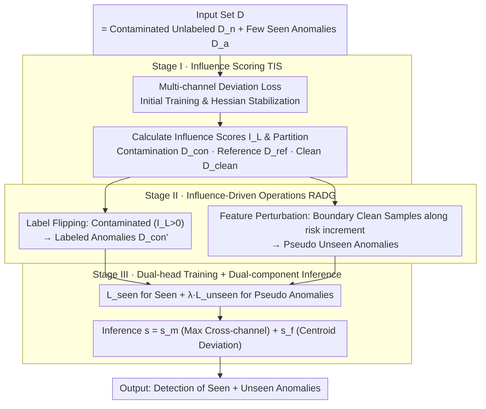

# IMPACT: Influence Modeling for Open-Set Time Series Anomaly Detection

**Conference**: ICML 2026  
**arXiv**: [2603.29183](https://arxiv.org/abs/2603.29183)  
**Code**: https://github.com/mala-lab/IMPACT  
**Area**: Time Series Anomaly Detection / Open-Set Anomaly Detection  
**Keywords**: Influence functions, pseudo-anomaly generation, label flipping, contamination correction, open-set time series detection  

## TL;DR
IMPACT utilizes "influence functions" simultaneously as a searchlight and a scalpel—first training an initial model with a multi-channel deviation loss to calculate the influence score of each training sample on validation risk. Under theoretical guarantees of risk reduction, it flips high-influence contaminated unlabeled samples into labeled anomalies and perturbs "boundary normal samples" (those with minimal risk contribution) along the gradient direction to generate "unseen pseudo-anomalies." Finally, a dual-head network learns both seen and unseen anomaly categories, consistently surpassing over ten unsupervised and open-set baselines across 8 real-world time-series benchmarks.

## Background & Motivation

**Background**: Time Series Anomaly Detection (TSAD) has long been dominated by unsupervised methods—such as reconstruction, one-class SVM, self-supervised prediction, and diffusion models—assuming a pure normal training set. Recently, Open-Set Anomaly Detection (OSAD) has gained traction, allowing for a small amount of labeled seen anomalies with the goal of identifying both "seen + unseen" anomaly types. Representative methods include DRA, AHL, DPDL, MOSAD, and InvAD.

**Limitations of Prior Work**: While OSAD works reasonably well for images, it faces two major obstacles in the time-series domain. First, contamination: unlabeled training subsets almost certainly contain unknown anomalies (contamination), but existing methods treat them entirely as normal, polluting the supervision signal. Second, pseudo-anomaly generation: common image augmentations like Rotation, Cutout, CutPaste, or Mixup break temporal sequentiality—horizontally flipping an ECG segment violates cardiac physiology, and short-window moving averages cannot eliminate long-cycle seasonality. Consequently, decision boundaries are biased by both types of noise.

**Key Challenge**: The challenge lies in simultaneously performing "training set cleaning" and "generating representative pseudo-anomalies" without knowing which unlabeled samples are contaminated or what unseen anomalies look like, while provably ensuring both steps lead to a decrease in test risk rather than introducing new biases.

**Goal**: This is decomposed into three sub-problems: (i) designing a loss function suitable for multi-channel time series that integrates with influence functions; (ii) automatically identifying contaminated samples and "boundary normal samples with the lowest risk contribution" via influence scores; (iii) providing proofs that both "label flipping" and "feature perturbation along influence directions" operations reduce test risk.

**Key Insight**: The authors revisit the influence function of Koh & Liang $\mathcal{I}_L(\bm z_i,\bm z_t)=-\nabla_\theta L(\bm z_t,\hat\theta)^\top H_{\hat\theta}^{-1}\nabla_\theta L(\bm z_i,\hat\theta)$. It not only indicates a "sample's marginal contribution to prediction" but also serves as a steering wheel for two types of modification: the risk changes for label flipping ($\bm z_i\mapsto\bm z_{i\mathbf 1}$) and feature perturbation ($\bm w_i\mapsto\bm w_i+\zeta_i$) can both be expressed in closed form using its second-order derivatives.

**Core Idea**: Use influence functions to drive both "contamination correction" and "pseudo-anomaly generation." The former flips samples with $\mathcal{I}_L(\bm z_i)>0$ to anomalies, while the latter perturbs boundary samples with the smallest absolute $\mathcal{I}_L(\bm z_i)<0$ values along the $\nabla_\varphi\nabla_{\theta_h}L$ direction to create unseen anomalies, all unified within a risk reduction framework.

## Method

The IMPACT pipeline consists of three stages: Stage I (Influence Scoring Module - TIS) trains an initial model using multi-channel deviation loss and calculates influence scores to partition data into a contamination set $\mathcal{D}_{con}$, a reference normal set $\mathcal{D}_{ref}$, and a remaining clean set $\mathcal{D}_{clean}$; Stage II (Correction-Generation Module - RADG) performs "label flipping + feature perturbation" guided by influence scores to construct the flipped $\mathcal{D}_{con}'$ and the perturbed feature set $\mathcal{W}_{per}'$; Stage III adds an unseen anomaly learning head for joint training with $L_{seen}+\lambda L_{unseen}$. During inference, the maximum cross-channel anomaly score plus the feature deviation from the reference normal centroid is used as the final score.

### Overall Architecture
The input is a time-series set $\mathcal{D}=\mathcal{D}_n\cup\mathcal{D}_a$, where each sample $\bm x_i\in\mathbb{R}^{D\times L}$ ($D$ channels, $L$ steps). The model consists of two parts: a feature extractor $\bm\varphi_i=\phi(\bm x_i,\theta_\phi)$ (multivariate time-series encoder) and an anomaly scoring head $h(\bm\varphi_i,\theta_h)\in\mathbb{R}^r$ (outputting $r$-channel scores). The training objective first uses multi-channel deviation loss, then introduces influence-based resampling, and finally appends an unseen anomaly head $h'(\cdot,\theta_{h'})$.

### Key Designs

**1. Multi-channel Deviation Loss: Expanding Expressiveness and Stabilizing Influence Functions**

Influence functions require the loss to be second-order differentiable with respect to parameters and the Hessian to be invertible. Traditional deviation loss is single-channel and loses variance information, making the calculation of $H_{\hat\theta}^{-1}\nabla_\theta L$ unstable. IMPACT makes it multi-channel—aligning the $r$-channel anomaly scores of normal samples with the mean $\bm\mu_r$ of an isotropic Gaussian prior $\mathcal{N}(\bm\mu,\bm\Sigma)$, while pushing anomalies away by at least $a$. The deviation is measured via Mahalanobis distance $\mathit{dev}(\bm x_i) = \sqrt{(f(\bm x_i,\theta)-\bm\mu_r)^\top\bm\Sigma_r^{-1}(f(\bm x_i,\theta)-\bm\mu_r)}$, and the loss is expressed as $L(\bm z_i,\theta) = \tfrac{1}{r}\sum_{j=1}^r[(1-y_i)\mathit{dev}(\bm x_i)_j + y_i\max(0,a-\mathit{dev}(\bm x_i)_j)]$. Multi-channel evaluation assesses anomalies from multiple perspectives: normal samples must align with the prior across all angles, while anomalies are detected if any single angle deviates beyond $a$. Theorem 1 further proves this is equivalent to minimizing the entropy of the latent distribution $\mathcal{H}(S) = \tfrac{r}{2}(1+\log(2\pi\sigma^2))\propto\log\sigma^2$—providing an information-theoretic basis for the geometric intuition of "tightening normals + pushing anomalies."

**2. Influence-Driven Dual Operations: Unified Cleaning and Generation**

OSAD in time series faces dual hurdles: unlabeled subsets are likely contaminated, and image-based augmentations (Rotation, Cutout, Mixup) destroy sequentiality. IMPACT treats Koh & Liang’s influence function $\mathcal{I}_L(\bm z_i,\bm z_t) = -\nabla_\theta L(\bm z_t,\hat\theta)^\top H_{\hat\theta}^{-1}\nabla_\theta L(\bm z_i,\hat\theta)$ as a steering wheel for two modifications. One is **Label Flipping**: for the contamination set $\mathcal{D}_{con} = \{\bm z_i\in\mathcal{D}_n\mid\mathcal{I}_L(\bm z_i)>0\}$, the authors prove $\nabla_\theta L(\bm z_{i\mathbf 1},\theta)-\nabla_\theta L(\bm z_i,\theta) = -2\nabla_\theta L(\bm z_i,\theta)$. Consequently, the flipping influence $\mathcal{I}_{L\mathbf 1}(\bm z_i,\bm z_t) = -2\mathcal{I}_L(\bm z_i,\bm z_t)$, and Theorem 2 provides the risk change $\approx -\tfrac{2}{N\cdot|\mathcal{D}_{con}|}\sum_{\bm z_i\in\mathcal{D}_{con}}\mathcal{I}_L(\bm z_i)<0$, signifying a necessary risk reduction. The other is **Feature Perturbation**: for "boundary" clean samples $\mathcal{D}_{per} = \{\bm z_i\in(\mathcal{D}_n\cap\mathcal{D}_{clean})\mid\mathcal{I}_L(\bm z_i)<0\}$ with minimal absolute influence, features are perturbed along $\mathcal{I}_{per}(\bm w_i) = -\nabla_{\theta_h}L(\mathcal{V},\hat\theta_h)^\top H_{\hat\theta_h}^{-1}[\nabla_\varphi\nabla_{\theta_h}L(\bm w_i,\hat\theta_h)]$ to obtain $\bm\varphi_{i\zeta_i} = \bm\varphi_i + \alpha\mathcal{I}_{per}(\bm w_i)^\top$. Theorems 3/4 prove these perturbed features fall into a new distribution with a positive lower-bound distance from the original, and the risk change $\approx -\tfrac{\alpha}{N\cdot|\mathcal{W}_{per}|}\sum\|\mathcal{I}_{per}(\bm w_i)\|_2^2<0$. This dual gain ensures contaminated samples are utilized as labeled anomalies rather than discarded, and pseudo-anomalies are generated along "risk increment" directions in feature space rather than through heuristic augmentation.

**3. Dual-head Training + Dual-component Inference: Decoupled Learning and Hybrid Scoring**

Letting pseudo-anomaly gradients flow back to the backbone representation might harm seen category performance. IMPACT uses $L_{re} = L_{seen} + \lambda L_{unseen}$ to decouple learning: $L_{seen}$ covers original labels + flipped anomalies + clean normals ($\mathcal{D}_s = \mathcal{D}_{con}'\cup\mathcal{D}_{ref}\cup\mathcal{D}_{clean}$), while $L_{unseen}$ feeds perturbed features to an independent unseen head $h'$. During inference, scores are summed $s = s_m + s_f$: $s_m = \max_{l<r}(h(\bm\varphi_i,\theta_h)+h'(\bm\varphi_i,\theta_{h'}))_l$ takes the cross-channel maximum (any channel lighting up indicates an anomaly), and $s_f = \|\bm\varphi_i - \tfrac{1}{|\mathcal{D}_{ref}|}\sum_{\bm x_j\in\mathcal{D}_{ref}}\bm\varphi_j\|^2$ serves as a feature deviation from the reference centroid—ensuring detection when $h, h'$ are insensitive to subtle distribution shifts.

### Loss & Training
The training follows two stages: (1) training the initial model $\hat\theta$ on the full set $\mathcal{D}$, approximating the Hessian inverse via LiSSA, and calculating $\mathcal{I}_L(\bm z_i)$ for partitioning; (2) retraining using $L_{re}$. The parameter $\alpha$ controls perturbation strength, $\lambda$ balances losses, and $k$ controls the quantity of flipped and generated samples. All theorems require the loss to be second-order differentiable and the Hessian to be invertible near $\hat\theta$, which the multi-channel deviation loss satisfies.

## Key Experimental Results

### Main Results
On 8 real-world benchmarks (UCR, ASD, PSM, SMD, CT, SAD, PTBXL, TUSZ), IMPACT is compared against 7 unsupervised methods (TCN-AE, THOC, TranAD, DCdetector, GPT4TS, COUTA, DADA) and multiple open-set methods (DevNet, DRA, AHL, DPDL, MOSAD, InvAD, WSAD-DT), evaluated using AUC (%) ± standard deviation.

| Setup / Dataset | Ours (IMPACT) | Prev. SOTA | Gain |
|--------|------|----------|------|
| Open-set Avg AUC (8 sets) | Significantly highest | DRA / AHL / DPDL etc. | Consistently outperforms |
| Unsupervised Comparison (UCR / TUSZ) | — | GPT4TS 54.60 / 66.31 | Validates need for OSAD |
| Contamination Rates (0%–10%) | Most robust | Most baselines drop sharply | IMPACT remains nearly flat |
| Seen Anomaly Proportions | Most robust | Baselines sensitive to ratio | Validates Unseen Head |

### Ablation Study

| Configuration | Key Metric Change | Explanation |
|------|---------|------|
| Full IMPACT | Baseline AUC | TIS + RADG + Dual-head |
| w/o Label Flipping | Decrease; drops more as contamination rises | Validates Theorem 2 correction gain |
| w/o Feature Perturbation | Significant drop on unseen anomalies | Validates Theorem 4 generation gain |
| Heuristic Augmentation (CutAddPaste/COE) | Decrease | Influence guidance outperforms heuristics |
| Single-channel Loss ($r=1$) | Decrease; unstable Hessian | Multi-channel is crucial for stability |
| w/o Unseen Head $h'$ (Shared $h$) | Decrease; slight harm to seen categories | Decoupled heads prevent backbone pollution |
| w/o Feature Deviation $s_f$ | Decrease on subtle anomaly datasets | Centroid scoring is a necessary fallback |

### Key Findings
- Label flipping + feature perturbation creates a "1+1>2" effect—each alone exceeds baselines, but the combination reaches the final performance, proving they solve orthogonal issues (supervision contamination vs. insufficient expressiveness).
- In robustness tests where contamination increases from 0% to 10%, most baselines decline monotonically, while IMPACT remains almost flat, directly manifesting Theorem 2.
- When the seen anomaly ratio drops from 25% to 0% (nearly fully unseen), IMPACT shows the smallest decline, indicating the unseen head learns a boundary orthogonal to seen classes.
- Sensitivity analysis of perturbation strength $\alpha$ shows an inverted U-curve; too small is ineffective, and too large pushes features off the manifold.

## Highlights & Insights
- Influence functions are upgraded from an "after-the-fact diagnostic tool" to a "training-time steering wheel"—using the same $\mathcal{I}_L$ to drive both label flipping and feature perturbation.
- Label flipping converts negative signals into supervised ones, essentially replacing manual queries in active learning with statistical influence; this is applicable to any weak supervision task with hidden target classes.
- Feature perturbation along $\mathcal{I}_{per}(\bm w_i)$ reverses the logic of adversarial attacks: while adversarial samples move toward misclassification, IMPACT moves toward "risk increment" to simulate unknown distributions provably.
- The triple equivalence of multi-channel deviation loss, isotropic Gaussian priors, and entropy minimization is elegant, unifying geometric, statistical, and information-theoretic perspectives.

## Limitations & Future Work
- Calculating the Hessian inverse via LiSSA approximation remains heavy for large-scale time series; future work could explore more memory-efficient second-order approximations like K-FAC or Arnoldi.
- The implicit assumption of convexity near $\hat\theta$ for influence functions may involve errors on deep Transformer backbones; the impact of this estimation error on flipping decisions is not fully discussed.
- The hard threshold $\mathcal{I}_L(\bm z_i)>0$ for contamination may be jittery for boundary samples; soft label flipping (weighted by $|\mathcal{I}_L|$) could be an alternative.
- Validation was focused on classification/segment-level anomalies; long-duration point-level anomalies or streaming scenarios require new reference set $\mathcal{V}$ update strategies.

## Related Work & Insights
- **vs DRA / AHL / DPDL (OSAD)**: These also use limited labels and pseudo-anomalies, but rely on manual augmentation; IMPACT upgrades this to provable influence function guidance and adds contamination correction.
- **vs CutAddPaste / DADA / COE (TS Augmentation)**: These use heuristic temporal transformations; IMPACT perturbs in feature space along risk directions, bypassing the difficulty of preserving semantics in raw time series.
- **vs GammaGMM / ExCeeD (Contamination Estimation)**: These estimate contamination only at inference; IMPACT flips labels during training to eliminate the source of pollution.
- **vs Koh & Liang 2017 (Influence Functions)**: The original work used influence for data valuation/explanation; IMPACT uses it for two types of closed-form training operations with risk-reduction proofs.

## Rating
- Novelty: ⭐⭐⭐⭐⭐ First OSAD framework using influence functions to drive both contamination correction and pseudo-anomaly generation.
- Experimental Thoroughness: ⭐⭐⭐⭐ Extensive benchmarks and robustness tests, though missing a runtime comparison for million-scale sequences.
- Writing Quality: ⭐⭐⭐⭐ Complete loop from motivation to theory to algorithm; equations are dense but consistent.
- Value: ⭐⭐⭐⭐⭐ Provides a theoretically grounded and reproducible baseline for open-set time-series detection, extensible to other weakly supervised tasks.

<!-- RELATED:START -->

## Related Papers

- [\[ICML 2026\] AnomSeer: Reinforcing Multimodal LLMs to Reason for Time-Series Anomaly Detection](anomseer_reinforcing_multimodal_llms_to_reason_for_time-series_anomaly_detection.md)
- [\[ICLR 2026\] Towards Multimodal Time Series Anomaly Detection with Semantic Alignment and Condensed Interaction](../../ICLR2026/time_series/towards_multimodal_time_series_anomaly_detection_with_semantic_alignment_and_con.md)
- [\[ICLR 2026\] ICDiffAD: Implicit Conditioning Diffusion Model for Time Series Anomaly Detection](../../ICLR2026/time_series/icdiffad_implicit_conditioning_diffusion_model_for_time_series_anomaly_detection.md)
- [\[ICLR 2026\] Point-wise Anomaly Detection via Fold-bifurcation ODE](../../ICLR2026/time_series/point-wise_anomaly_detection_via_fold-bifurcation_ode.md)
- [\[ICML 2026\] Generalizing Multi-scale Time-Series Modeling with a Single Operator](generalizing_multi-scale_time-series_modeling_with_a_single_operator.md)

<!-- RELATED:END -->
