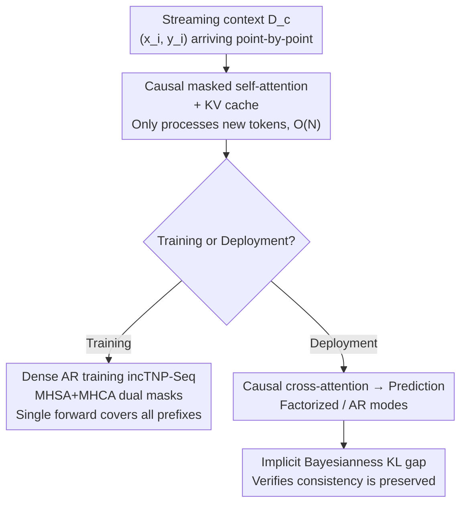

# Incremental Transformer Neural Processes

**Conference**: ICML 2026  
**arXiv**: [2602.18955](https://arxiv.org/abs/2602.18955)  
**Code**: https://github.com/philipmortimer/incTNP-code  
**Area**: Time Series / Neural Processes  
**Keywords**: Neural Processes, Causal Masking, KV Caching, Streaming Inference, Implicit Bayesianness

## TL;DR
By incorporating causal masking and KV caching—mechanisms common in Large Language Models—into Transformer Neural Processes (TNP), the update cost for each new observation in streaming scenarios is reduced from $\mathcal{O}(N^2)$ to $\mathcal{O}(N)$. Combined with a "dense autoregressive training" strategy that covers all context lengths in a single forward pass, incTNP maintains or exceeds the performance of standard TNP, while its "implicit Bayesianness" (prediction consistency) remains comparable to permutation-invariant TNPs.

## Background & Motivation
**Background**: Neural Processes (NPs), particularly Transformer Neural Processes (TNPs), demonstrate strong performance in spatiotemporal prediction and tabular modeling. They share a meta-learning framework with Prior-Data Fitted Networks (PFNs), outputting predictive distributions for target points based on a context set $\mathcal{D}^c$.

**Limitations of Prior Work**: Many real-world applications are inherently **streaming**—real-time sensor readings or continuous database updates. An ideal model should perform **inexpensive incremental updates** as each new observation arrives, rather than recomputing internal representations from scratch. However, the self-attention in standard TNP has quadratic complexity relative to the number of context points and **requires a full recalculation whenever the context changes**: every new observation triggers an $\mathcal{O}(N^2)$ overhead, making high-frequency updates prohibitively expensive. This is worse in autoregressive (AR) deployment, where the entire history must be re-encoded to generate each target point, repeating an expensive inference loop at every step.

**Key Challenge**: The bidirectional attention in standard TNP causes every new token to change the representations of previous tokens, thereby **invalidating the cache**—the root cause of its inability to perform incremental updates. Since the valued "context permutation invariance" of the NP family requires this all-to-all bidirectional attention, a tension exists between "cacheable incremental updates" and "permutation invariance."

**Goal**: Equip TNP with linear-time incremental update capabilities while addressing two questions: Does this sacrifice predictive accuracy? Does it break the probabilistic consistency required for "rational belief updates" in NPs?

**Key Insight**: The authors observe that LLMs have long achieved $\mathcal{O}(N)$ incremental processing via **causal masking + KV caching**. Under causal attention, representations of past tokens remain static, making the cache valid. This mechanism can be ported to the NP framework.

**Core Idea**: Add causal masks to the TNP encoder and cache Key-Value (KV) pairs to create the incrementally updatable incTNP. Then, utilize a dense autoregressive training objective to compute losses for "every prefix context" simultaneously in a single forward pass. This compensates for the data efficiency loss of the causal structure and uses an "implicit Bayesianness" metric to prove that causal masking does not sacrifice consistency.

## Method

### Overall Architecture
incTNP modifies the standard TNP structure—which typically employs self-attention on context and cross-attention between targets and context—by replacing the context self-attention with a **causally masked** version. This allows freezing historical representations using a KV cache, processing only the new token when a new observation arrives. The input consists of a context stream $\mathcal{D}^c$ that grows over time and target points $\mathbf{X}^t$ to be predicted. The key change is that the marginal cost of "updating the context" drops from $\mathcal{O}(N_c^2)$ to $\mathcal{O}(N_c)$. On top of this, the authors use dense autoregressive training (incTNP-Seq) to improve data efficiency and evaluate the impact of the causal structure on probabilistic consistency using a KL gap metric.

### Key Designs

**1. Causal Masked Self-Attention + KV Cache: Reducing Updates from Quadratic to Linear**

Standard TNP uses bidirectional self-attention to process context $\mathbf{Z}_l^t=\text{MHCA}(\mathbf{Z}_{l-1}^t,\text{MHSA}(\mathbf{Z}_{l-1}^c))$. The problem is that a new token re-encodes all old tokens, invalidating the KV cache and requiring $\mathcal{O}(N_c^2)$ recomputation. incTNP introduces a lower-triangular causal mask $M^{\text{causal}}$ (where token $i$ only attends to $j \le i$), replacing context self-attention with the masked version:

$$\mathbf{Z}_l^t=\text{MHCA}\!\left(\mathbf{Z}_{l-1}^t,\ \text{M-MHSA}(\mathbf{Z}_{l-1}^c,M^{\text{causal}})\right)$$

The causal structure ensures past token representations are static, allowing historical K and V matrices to be cached. When a new observation arrives, the model only processes that specific step. The marginal update cost is reduced from $\mathcal{O}(N_c^2)$ to $\mathcal{O}(N_c)$, migrating the mechanism LLMs use for high-frequency decoding into the NP framework for streaming updates.

**2. incTNP-Seq Dense Autoregressive Training: Single Forward Pass for All Context Lengths**

The meta-learning objective of standard CNPs typically computes gradients for only one fixed context size $N_c$ per task, leading to high variance and low sample efficiency. Inspired by LLM training, the authors treat data as a single sequence $\mathcal{D}^{\text{seq}}=[(\mathbf{x}_1,\mathbf{y}_1),\dots,(\mathbf{x}_N,\mathbf{y}_N)]$, constructing parallel "context" and "target" streams (distinguished by binary flags). They apply causal masking **to both self-attention and cross-attention**:

$$\mathbf{Z}_l^t=\text{M-MHCA}\!\left(\mathbf{Z}_{l-1}^t,\ \text{M-MHSA}(\mathbf{Z}_{l-1}^c,M^{\text{causal}}),\ M^{\text{causal}}\right)$$

The masked MHCA forces the $n$-th target to depend only on the first $n$ historical points $(\mathbf{x}_{1:n},\mathbf{y}_{1:n})$. Consequently, **a single forward pass computes losses for every prefix context simultaneously**, amortizing training costs across all context sizes and improving data efficiency and generalization. This training paradigm is only possible with incTNP's causal structure; standard TNP-D would "cheat" in this setup as target tokens could attend to future context tokens in the stream.

**3. Implicit Bayesianness (KL gap): Proving Causal Masking Does Not Sacrifice Consistency**

The cost of causal masking is the loss of context permutation invariance—incTNP's predictions are sensitive to context order. The authors **quantify** this rather than avoiding it. Based on the concept of implicit Bayesianness by Mlodozeniec et al., a non-permutation-invariant prediction rule $q$ can be averaged over all permutations to get an "exchangeable" version $\hat q$. The KL divergence between the true distribution $p$ and $q$ can be decomposed as:

$$D_{\text{KL}}(q_{1:n}\Vert p)=D_{\text{KL}}(\hat q_{1:n}\Vert p)+\underbrace{D_{\text{KL}}(q_{1:n}\Vert \hat q_{1:n})}_{\text{KL gap}}$$

The second term, the KL gap, measures the "performance lost due to non-exchangeability," equaling zero if and only if $q$ is perfectly exchangeable (i.e., implicitly Bayesian). Using a teacher-forcing streaming protocol where ground truth is added point-by-point, the authors estimate this KL gap via Monte Carlo. They report this alongside average negative log-likelihood (NLL), as a useless prediction rule can easily achieve a zero gap. The results show incTNP’s KL gap is comparable to the permutation-invariant TNP-D, reaping the computational benefits of causal masking without losing probabilistic consistency.

### Loss & Training
The objective remains the meta-learning log-likelihood of CNP, but it is supervised densely across every prefix for factorized models (see Design 2). Regarding complexity: for factorized deployment, each update is $\mathcal{O}(N_s)$ for incTNP vs $\mathcal{O}(N_s^2)$ for TNP. For AR deployment, incTNP is $\mathcal{O}(N_t \cdot N_s)$ vs $\mathcal{O}(N_t \cdot N_s^2)$. The total cumulative cost for a stream of length $N$ is reduced from $\mathcal{O}(N^3)$ for TNP to $\mathcal{O}(N^2)$ for incTNP. The persistent VRAM for the KV cache is $\mathcal{O}(L D_z N_s)$, where $L$ is the number of layers and $D_z$ is the embedding dimension.

## Key Experimental Results

### Main Results
Test log-likelihood comparison on synthetic and real tasks (higher is better). TNP-D serves as the baseline; $\Delta$ represents the difference relative to TNP-D. Orange highlights indicate transfer scenarios (Sim-to-Real tabular, temperature forecasting).

| Dataset | TNP-D (Ref) | incTNP $\Delta$ | incTNP-Seq $\Delta$ | CNP $\Delta$ | LBANP $\Delta$ |
|--------|------|------|------|------|------|
| 1D GP | 0.431 | −0.013 | −0.002 | −0.230 | **+0.004** |
| Tabular (Synthetic) | 0.154 | −0.020 | **+0.007** | −0.330 | −0.058 |
| Skillcraft | −0.954 | +0.002 | **+0.008** | −0.134 | −0.031 |
| Protein | −1.152 | −0.028 | **+0.036** | −0.188 | −0.024 |
| Temperature (Interp) | −1.703 | −0.011 | **+0.018** | −0.533 | −0.090 |
| Temperature (Forecast) | −2.571 | +0.030 | **+0.690** | +0.181 | +0.268 |

incTNP-Seq matches or exceeds TNP-D on held-out tasks and significantly leads in transfer scenarios (especially +0.690 in temperature forecasting).

### Complexity / AR Inference Cost

| Mode | Single-step update cost | Total cumulative cost across stream |
|------|------|------|
| Standard TNP (Factorized) | $\mathcal{O}(N_s^2)$ | $\mathcal{O}(N^3)$ |
| incTNP (Factorized) | $\mathcal{O}(N_s)$ | $\mathcal{O}(N^2)$ |
| Standard TNP (AR) | $\mathcal{O}(N_t\cdot N_s^2)$ | Infeasible in streaming |
| incTNP (AR) | $\mathcal{O}(N_t\cdot N_s)$ | Feasible in streaming |

In AR deployment, incTNP offers orders-of-magnitude faster inference compared to other models, making high-fidelity autoregressive inference feasible for the first time in real-time streaming scenarios with long histories.

### Key Findings
- **Causal masking barely hurts accuracy**: incTNP / incTNP-Seq perform similarly to or better than the fully bidirectional TNP-D, suggesting that "all-to-all" connectivity is not essential for accuracy in NPs.
- **Dense AR training is the primary driver of gains**: incTNP-Seq (with dense prefix supervision) generally outperforms incTNP with only causal masking, particularly in transfer scenarios.
- **Implicit Bayesianness is preserved**: The KL gap of incTNP is comparable to the permutation-invariant TNP-D, indicating the causal structure does not sacrifice the probabilistic consistency needed for streaming.

## Highlights & Insights
- **Transferring KV caching + causal masking from LLMs to NPs** is a clean cross-domain application that directly addresses the real computational bottleneck of NPs in streaming scenarios. This approach is directly applicable to PFNs and time-series foundation models that suffer from quadratic attention.
- **Dense AR training "covering all prefixes in one pass"** is a clever trick: it flips causal structure from an "accuracy burden" into a "data efficiency bonus," correctly noting that standard TNP cannot use this training method without "cheating."
- **Quantifying rather than avoiding the loss of permutation invariance**: Using the KL gap to measure consistency makes the impact of causal masking measurable, emphasizing that it must be viewed alongside performance (since a broken model can easily achieve a 0 gap).

## Limitations & Future Work
- The authors acknowledge that incTNP **sacrifices context permutation invariance**, as predictions are sensitive to order. While the KL gap suggests the impact is small, this might not be acceptable in scenarios requiring strict exchangeability.
- The KV cache may become a VRAM bottleneck at extreme scales (persistent $\mathcal{O}(L D_z N_s)$ usage), which was not explored in the experiments.
- Implicit Bayesianness was only evaluated in a teacher-forcing point-by-point protocol; other protocols such as batch streaming, length generalization, or error accumulation remain unexplored.
- The tasks focused on medium-to-low dimensional scenarios like tabular regression and temperature prediction; performance in higher-dimensional or more complex spatiotemporal dependencies needs verification.

## Related Work & Insights
- **vs Standard TNP-D (Nguyen & Grover, 2022)**: TNP-D uses bidirectional self-attention, ensuring permutation invariance but requiring $\mathcal{O}(N^2)$ recomputation; incTNP swaps this for causal masks + KV cache to achieve $\mathcal{O}(N)$ updates at a minor cost to invariance.
- **vs Causal AR buffer (Hassan et al., 2025)**: They use causal structures for correlated target prediction, separating a fixed initial context from a dynamic buffer. This requires periodic merging and re-encoding, reintroducing bottlenecks. incTNP applies causal masking uniformly to the entire stream, enabling indefinite $\mathcal{O}(N)$ updates.
- **vs LBANP (Feng et al., 2023)**: Uses latent tokens to compress context to a fixed length for sub-quadratic complexity, but still requires full re-encoding for updates or is only suited for static contexts.
- **vs Sparse Gaussian Processes (Bui et al., 2017; Stanton et al., 2021)**: GPs are the gold standard for Bayesian updates but are $\mathcal{O}(N^3)$; sparse online variants often sacrifice consistency due to approximations and lack the meta-learning capability and high-dimensional performance of NPs.

## Rating
- Novelty: ⭐⭐⭐⭐ Solid combination of mechanism transfer, dense AR training, and KL gap quantification.
- Experimental Thoroughness: ⭐⭐⭐⭐ Covers synthetic and real tasks, factorized/AR modes, complexity, and consistency.
- Writing Quality: ⭐⭐⭐⭐⭐ Logical progression from motivation to mechanism to trade-off analysis.
- Value: ⭐⭐⭐⭐⭐ Unlocks the usability of TNP in real-time streaming, offering direct insights for time-series/tabular foundation models.

<!-- RELATED:START -->

## Related Papers

- [\[NeurIPS 2025\] Decomposition of Small Transformer Models](../../NeurIPS2025/time_series/decomposition_of_small_transformer_models.md)
- [\[NeurIPS 2025\] Transformer Embeddings for Fast Microlensing Inference](../../NeurIPS2025/time_series/transformer_embeddings_for_fast_microlensing_inference.md)
- [\[ICLR 2026\] Relational Transformer: Toward Zero-Shot Foundation Models for Relational Data](../../ICLR2026/time_series/relational_transformer_toward_zero-shot_foundation_models_for_relational_data.md)
- [\[ICCV 2025\] VA-MoE: Variables-Adaptive Mixture of Experts for Incremental Weather Forecasting](../../ICCV2025/time_series/va-moe_variables-adaptive_mixture_of_experts_for_incremental_weather_forecasting.md)
- [\[ICLR 2026\] EVEREST: A Transformer for Probabilistic Rare-Event Anomaly Detection with Evidential and Tail-Aware Uncertainty](../../ICLR2026/time_series/everest_a_transformer_for_probabilistic_rare-event_anomaly_detection_with_eviden.md)

<!-- RELATED:END -->
