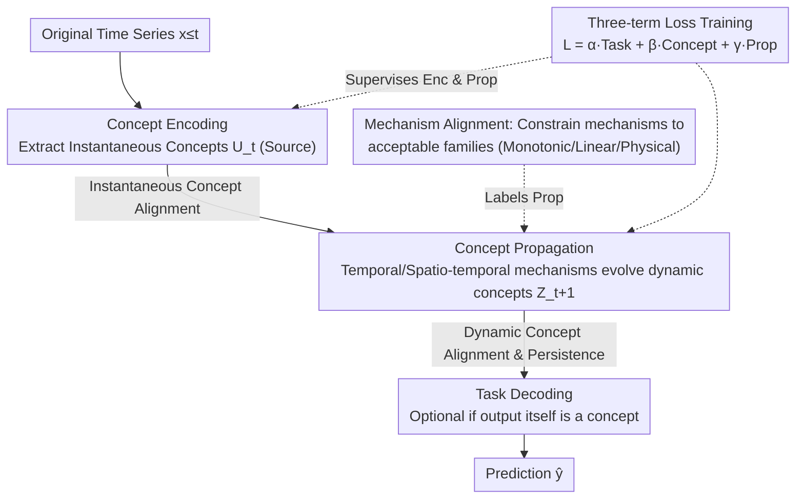

# Interpretability in Deep Time Series Models Demands Semantic Alignment

**Conference**: ICML 2026  
**arXiv**: [2602.02239](https://arxiv.org/abs/2602.02239)  
**Code**: To be confirmed  
**Area**: Time Series / Interpretability  
**Keywords**: Semantic Alignment, Interpretability, Time Series, Concept Bottleneck, Neuro-symbolic

## TL;DR
This is a **position paper**—proposing that deep time series models should enforce **semantic alignment**: making a model's internal variables and mechanisms correspond to a domain expert's reasoning rather than just explaining internal computations. The core innovation defines persistence constraints for semantic alignment regarding temporal evolution (a challenge unique to time series).

## Background & Motivation

**Background**: Deep learning has shown significant effectiveness in time series forecasting, but the black-box nature of these models limits their application in high-stakes fields such as finance and healthcare. Existing interpretability methods (attention mechanisms, post-hoc explanations, mechanistic interpretability) all attempt to explain internal model computations.

**Limitations of Prior Work**: These methods only address **structural opacity** (how to understand internal computations) but fail to resolve **semantic opacity**. For instance, a doctor cannot understand the meaning of "latent variable activation at timestep 47" because it does not map to medical concepts they understand (e.g., "tachycardia episode").

**Key Challenge**: Even if a model's predictions are accurate, users cannot meaningfully verify, debug, or intervene in the model's behavior because the conceptual level of the model's operations does not match the user's reasoning level.

**Goal**: (1) Formally define semantic alignment in time series; (2) Provide a design blueprint for interpretable time series models; (3) Discuss properties supporting trustworthiness and new design opportunities.

**Key Insight**: Inspired by Concept Bottleneck Models (CBM) in Computer Vision, but recognizing that existing CBM methods are unsuitable for time series as they lack semantic alignment guarantees regarding temporal evolution.

**Core Idea**: Extend Concept Bottleneck Models to the temporal domain by decomposing the model into [Concept Encoding → Concept Propagation → Task Decoding] and constraining the propagation mechanism to satisfy domain knowledge constraints.

## Method

### Overall Architecture
All time series models considered in this paper follow the same **Encoding-Propagation-Decoding** (Enc-Prop-Dec) template:
$$\mathbf{u}_t = \text{Enc}(\mathbf{x}_{\leq t}), \quad \mathbf{z}_{t+1} = \text{Prop}(\mathbf{z}_{\leq t}, \mathbf{u}_t), \quad \hat{\mathbf{y}} = \text{Dec}(\mathbf{z}_{t+1})$$
Where $\mathbf{u}_t$ is the instantaneous representation generated by the encoder, and $\mathbf{z}_t$ is the dynamic representation generated by the propagation layer—both of which are semantically opaque latent variables in standard deep models. The logic of this paper is to first formalize "semantic alignment" (distinguishing structural/semantic opacity, defining concepts and mechanisms, and providing instantaneous and dynamic concept alignment along with mechanism alignment constraints), and then provide an actionable **design blueprint**. The blueprint follows the same Enc-Prop-Dec skeleton but forces $\mathbf{u}_t$ to correspond to instantaneous concepts and $\mathbf{z}_{t+1}$ to correspond to dynamic concepts, applying instantaneous alignment at encoding and dynamic alignment (persistence) plus mechanism constraints at propagation, trained using a three-term loss (task + concept + propagation).

### Key Designs

**1. Formalizing Semantic Opacity: Separating "Incomprehensible Computation" from "Undefinable Domain Meaning"**

Most existing interpretability work focuses on explaining "how it computes internally," but few ask if a doctor can map "latent variable activation at timestep 47" to a medical concept like "tachycardia onset." This paper first separates the two types of opacity: structural opacity refers to the inability to see internal processes, while semantic opacity refers to the inability to express model reasoning using domain concepts. To this end, two basic objects are introduced: "Concepts" (human-interpretable random variables) and "Mechanisms" (conditional probability distributions between concepts $P(V_{\text{out}} \mid V_{\text{in}})$). Semantic alignment is then defined as the matching between model representations and domain concepts. This distinction allows the identification of blind spots in existing methods: they either focus only on structural computation or ignore how temporal evolution destroys alignment—even if aligned at time $t$, it may drift at $t+1$.

**2. Binary Classification of Instantaneous and Dynamic Concepts: Adding Temporal Persistence Constraints**

Concepts of interest to users fall into two categories, and conflating them misses the specific difficulty of time series. This paper splits them into: Instantaneous Concepts $C_t^U$, which are snapshots of the system's current state independent of temporal evolution (e.g., "current temperature exceeds threshold"), and Dynamic Concepts $C_t^Z$, which are concepts whose future values the user wants to predict and whose semantics must remain consistent over time (e.g., "heat stress accumulation"). Consequently, semantic alignment is formalized as two simultaneous constraints: $P(U_t = C_t^U \mid \mathbf{x}_{\leq t}) = 1$ and $P(Z_{t+1} = C_{t+1}^Z \mid \mathbf{x}_{\leq t}) = 1$. The second constraint has no equivalent in static models and is a unique contribution of this paper—if alignment is satisfied only at time $t$ without guaranteeing persistence at $t+1$, semantic alignment will decay exponentially, rendering the model untrustworthy after multi-step propagation.

**3. Mechanism Alignment as a Constraint Satisfaction Problem: Making "How Concepts Relate" Consistent with User Understanding**

Concept alignment alone is insufficient; the way a model expresses relationships between concepts must also be recognized by the user, otherwise, the user cannot verify or intervene in reasoning steps. This paper formalizes mechanism alignment as constraint satisfaction: requiring $P(V_{\text{out}} \mid V_{\text{in}}) \in \mathcal{M}^{(h)}_{V_{\text{out}} \mid V_{\text{in}}}$, where $\mathcal{M}^{(h)}$ is a user-acceptable family of conditional probability distributions (e.g., monotonic functions, linear relationships, or physical constraints). By restricting reasoning mechanisms to such a declarative family, users regain control over reasoning steps, creating interfaces for formal verification and human-AI interaction.

**4. Design Blueprint for Interpretable Models: Mapping Abstract Definitions to the "Enc-Prop-Dec" Skeleton**

To guide modeling, the paper provides an actionable blueprint mapping the three alignment types onto the Enc-Prop-Dec skeleton—essentially extending Concept Bottleneck Models (CBM) from CV to the temporal domain. **Concept Encoding** maps the raw window to a set of human-interpretable source concepts $c^{(k)}_{\leq t},\, k\in\mathcal{S}$ (handling instantaneous alignment); **Concept Propagation** uses two types of mechanisms to evolve concepts—Temporal Mechanisms $P(c^{(k)}_{t+1}\mid c^{(k)}_{\leq t})$ handle individual concept evolution, while Spatio-temporal Mechanisms $P(c^{(k)}_{t+1}\mid c^{(j)}_{\leq t},\dots)$ handle dependencies between concepts (handling dynamic alignment and mechanism constraints); **Task Decoding** $P(Y\mid\mathbf{c})$ maps concepts to the output (optional if the output is an interpretable concept). Training utilizes a three-term loss: $\mathcal{L}=\alpha\mathcal{L}_{\text{task}}+\beta\mathcal{L}_{\text{concept}}+\gamma\mathcal{L}_{\text{prop}}$, where the concept loss supervises the encoder and the propagation loss supervises the propagation layer—explaining why, in ablation studies, removing the propagation loss collapses concept alignment during long-term prediction. The blueprint serves as a **research guide** rather than a finalized system: achieving mechanism alignment while maintaining expressivity remains an open problem.

## Key Experimental Results

### Main Results

| Interpretability Paradigm | Instantaneous Alignment | Dynamic Alignment | Mechanism Alignment |
|-----------|-----------|-----------|--------|
| Input Importance / Proxy / Post-hoc | ✗ | ✗ | ✗ |
| Attention Mechanisms | ✗ | ✗ | ✗ |
| Koopman Linearization | ✗ | ~ | ~ |
| Symbolic Regression | ~ | ~ | ✓ |
| Mechanistic Interpretability | ✗ | ✗ | ✗ |
| Prototype Methods | ~ | ✗ | ✗ |
| Physics-Informed Constraints | ~ | ~ | ✓ |
| **Ours (Semantic Alignment)** | **✓** | **✓** | **✓** |

### Ablation Study

| Design Option | Key Property | Description |
|--------|--------|------|
| Instantaneous Only | Incomplete | Cannot guarantee semantic stability during temporal evolution |
| Adding Dynamic Alignment | Necessary | Prevents exponential decay of semantic drift |
| 3-term Loss vs. 2-term | Critical | Removing propagation loss leads to loss of concept alignment in long-term forecasting |

### Key Findings
- **Necessity of Dynamic Alignment**: If the second alignment constraint is ignored, even if concept predictions at each timestep are accurate, the model will deviate from user-understood concept trajectories after multi-step propagation—a problem specific to time series.
- **Relationship with Static CBM**: The framework is directly compatible with existing CBM advancements (probabilistic concepts, concept embeddings, etc.) but adds temporal constraints.
- **Mitigating the Accuracy-Interpretability Trade-off**: Through residual paths, concept embeddings, or unsupervised concepts, semantically aligned models can maintain accuracy comparable to black-box models.

## Highlights & Insights
- **Conceptual Framework Innovation**: Reframing interpretability from "explaining internal computation" to "ensuring concepts and mechanisms align with user thinking"—a shift insightful for the entire field.
- **Unique Time Series Challenges**: Unlike static models, time series models must maintain semantic alignment across multiple timesteps; post-hoc explanations or attention visualizations cannot solve this—it must be enforced at the design level.
- **Transferable Design Principles**: The blueprint applies to various tasks (forecasting, classification, generation) and points toward combining neuro-symbolic methods and formal verification with time series.
- **Rational Critique of Existing Methods**: Systematically demonstrating via Table 1 that existing mechanistic interpretability and linearization methods lack concept alignment, mechanism alignment, or ignore dynamic alignment.

## Limitations & Future Work
- **Annotation Bottleneck**: Achieving semantic alignment requires substantial concept-level labels; the paper acknowledges this but suggests alternatives (LLM labeling, concept discovery, formal constraints).
- **Lack of Complete Formal Theory**: The paper focuses on definitions and blueprints but does not provide a complete theory (e.g., quantifying alignment degree, formal verification algorithms).
- **Absence of Practical Systems**: As a position paper, it lacks a specific system implementation or case studies to validate the blueprint's feasibility.
- **Mechanism Alignment Trade-offs**: Enforcing constraints through physical laws or modularity may impact accuracy; the balance between satisfying constraints and maintaining expressivity needs deeper discussion.

## Related Work & Insights
- **vs. Traditional Interpretability (LIME, SHAP)**: These explain individual predictions but do not build testable, intervenable semantic structures; this paper emphasizes that post-hoc explanations cannot guarantee alignment.
- **vs. Neuro-symbolic Methods**: Combines symbolic reasoning but mostly in static or simple dynamic settings; this paper extends it to a full time-series framework.
- **vs. Koopman / Linearized Dynamics**: These methods learn spatially constrained models but are not necessarily aligned with user concepts; this paper adds concept-level constraints.
- **vs. Concept Bottleneck Models (CBM)**: CBM literature primarily targets static classification; this paper's primary contribution is the **formalization of semantic alignment in temporal propagation layers**.

## Rating
- Novelty: ⭐⭐⭐⭐⭐ Formulates semantic alignment in time series for the first time; extends CBM to dynamic domains; introduces dynamic alignment persistence constraints.
- Experimental Thoroughness: ⭐⭐⭐ As a position paper, it lacks experimental data but supports its points through comparison tables, counter-arguments, and design blueprints; a prototype system would increase persuasiveness.
- Writing Quality: ⭐⭐⭐⭐⭐ Clear logic, consistent notation, and strong motivation; the running example (industrial equipment fault diagnosis) aids understanding.
- Value: ⭐⭐⭐⭐⭐ Significant guidance for the time series interpretability community; formalizes long-neglected issues and provides an actionable blueprint with at least 5 new research directions.

<!-- RELATED:START -->

## Related Papers

- [\[ICLR 2026\] Towards Multimodal Time Series Anomaly Detection with Semantic Alignment and Condensed Interaction](../../ICLR2026/time_series/towards_multimodal_time_series_anomaly_detection_with_semantic_alignment_and_con.md)
- [\[ICLR 2026\] Semantic-Enhanced Time-Series Forecasting via Large Language Models](../../ICLR2026/time_series/semantic-enhanced_time-series_forecasting_via_large_language_models.md)
- [\[ICML 2026\] PATRA: Pattern-Aware Alignment and Balanced Reasoning for Time Series Question Answering](patra_pattern-aware_alignment_and_balanced_reasoning_for_time_series_question_an.md)
- [\[ICML 2026\] Position: Current Benchmarking Hinders Real Progress in Deep Learning for Time Series](position_current_benchmarking_hinders_real_progress_in_deep_learning_for_time_se.md)
- [\[ICML 2026\] OLIVIA: Harmonizing Time Series Foundation Models with Power Spectral Density](olivia_harmonizing_time_series_foundation_models_with_power_spectral_density.md)

<!-- RELATED:END -->
