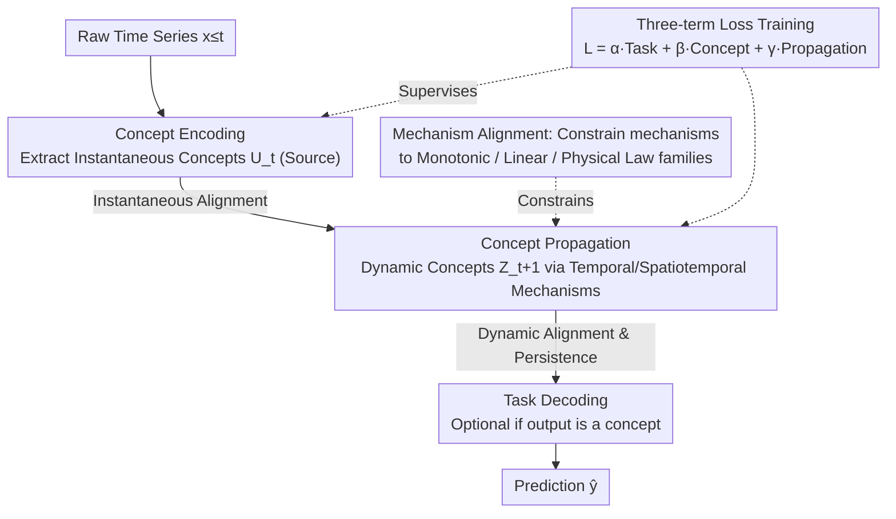

# Interpretability in Deep Time Series Models Demands Semantic Alignment

**Conference**: ICML 2026  
**arXiv**: [2602.02239](https://arxiv.org/abs/2602.02239)  
**Code**: To be confirmed  
**Area**: Time Series / Interpretability  
**Keywords**: Semantic alignment, interpretability, time series, concept bottleneck, neuro-symbolic

## TL;DR
This is a **position paper** proposing that deep time series models should enforce **semantic alignment**: ensuring that internal variables and mechanisms correspond to the reasoning processes of domain experts rather than merely explaining internal computations. The core innovation is the definition of persistence constraints for semantic alignment specific to temporal evolution, which is an issue unique to time series.

## Background & Motivation

**Background**: Deep learning has shown significant performance in time series forecasting, but the black-box nature of these models limits their application in high-risk areas such as finance and healthcare. Existing interpretability methods (attention mechanisms, post-hoc explanations, mechanistic interpretability) primarily attempt to explain internal model computations.

**Limitations of Prior Work**: These methods only address **structural opacity** (how to understand internal computations) but fail to resolve **semantic opacity**. For example, a physician cannot understand the meaning of "hidden variable activation at timestep 47" because it does not map to any medical concept they understand (e.g., "tachycardia onset").

**Key Challenge**: Even if a model's predictions are accurate, users cannot meaningfully verify, debug, or intervene in model behavior because the conceptual level of model operations does not match the user's reasoning level.

**Goal**: (1) Formally define semantic alignment in time series; (2) provide a design blueprint for interpretable time series models; and (3) discuss properties that support trustworthiness and new design opportunities.

**Key Insight**: Inspired by Concept Bottleneck Models (CBM) in computer vision, the authors argue that existing CBM methods are unsuitable for time series due to a lack of semantic alignment guarantees regarding temporal evolution.

**Core Idea**: Extend CBMs to the temporal domain by decomposing the model into [Concept Encoding → Concept Propagation → Task Decoding] and constraining the propagation mechanisms to satisfy domain knowledge.

## Method

### Overall Architecture
All time series models considered in this paper can be categorized under a single **Encoding-Propagation-Decoding** (Enc-Prop-Dec) template:
$$\mathbf{u}_t = \text{Enc}(\mathbf{x}_{\leq t}), \quad \mathbf{z}_{t+1} = \text{Prop}(\mathbf{z}_{\leq t}, \mathbf{u}_t), \quad \hat{\mathbf{y}} = \text{Dec}(\mathbf{z}_{t+1})$$
Where $\mathbf{u}_t$ is the instantaneous representation generated by the encoder, and $\mathbf{z}_t$ is the dynamic representation generated by the propagation layer. In standard deep models, both are semantically opaque latent variables. The paper's logic involves formalizing "semantic alignment" (distinguishing between structural/semantic opacity, defining concepts and mechanisms, and identifying instantaneous and dynamic concept alignment) to provide an actionable **design blueprint**. The blueprint follows the same Enc-Prop-Dec backbone but forces $\mathbf{u}_t$ to correspond to instantaneous concepts and $\mathbf{z}_{t+1}$ to dynamic concepts, applying alignment and mechanism constraints throughout.

### Key Designs

**1. Formalization of Semantic Opacity: Separating Computation from Meaning**
Most interpretability work focuses on "how the model computes," but few ask if users can map internal activations to domain concepts. This paper separates structural opacity (hidden internal logic) from semantic opacity (inability to express reasoning via domain concepts). It introduces "concepts" as interpretable random variables and "mechanisms" as conditional probability distributions $P(V_{\text{out}} \mid V_{\text{in}})$. This distinction reveals that existing methods either focus purely on structure or ignore how temporal evolution disrupts alignment over time.

**2. Binary Classification of Instantaneous and Dynamic Concepts: Persistence Constraints**
User-relevant concepts are split into two categories: Instantaneous concepts $C_t^U$ (snapshots of the system state, e.g., "temperature exceeds threshold") and Dynamic concepts $C_t^Z$ (the user's prediction targets whose semantics must persist over time, e.g., "heat stress accumulation"). Semantic alignment is formalized as the simultaneous satisfaction of: $P(U_t = C_t^U \mid \mathbf{x}_{\leq t}) = 1$ and $P(Z_{t+1} = C_{t+1}^Z \mid \mathbf{x}_{\leq t}) = 1$. The latter is unique to time series—without ensuring that alignment persists into the future, semantic clarity decays exponentially during multi-step propagation.

**3. Mechanism Alignment as Constraint Satisfaction: Aligning "How Concepts Interact"**
Aligning concepts is insufficient; the relations between concepts must also be acceptable to the user. Mechanism alignment is defined as a constraint satisfaction problem: $P(V_{\text{out}} \mid V_{\text{in}}) \in \mathcal{M}^{(h)}_{V_{\text{out}} \mid V_{\text{in}}}$, where $\mathcal{M}^{(h)}$ is a family of acceptable distributions (e.g., monotonic, linear, or physically constrained). This allows users to control the reasoning steps and enables formal verification.

**4. Design Blueprint: Projecting Definitions onto the Enc-Prop-Dec Skeleton**
The paper provides an actionable blueprint extending CBMs to the temporal domain. **Concept Encoding** maps raw windows to human-interpretable source concepts $c^{(k)}_{\leq t}$ (ensuring instantaneous alignment). **Concept Propagation** uses temporal mechanisms $P(c^{(k)}_{t+1}\mid c^{(k)}_{\leq t})$ and spatiotemporal mechanisms $P(c^{(k)}_{t+1}\mid c^{(j)}_{\leq t},\dots)$ to evolve concepts (ensuring dynamic alignment and mechanism constraints). **Task Decoding** $P(Y\mid\mathbf{c})$ maps concepts to outputs. Training involves a triple loss: $\mathcal{L}=\alpha\mathcal{L}_{\text{task}}+\beta\mathcal{L}_{\text{concept}}+\gamma\mathcal{L}_{\text{prop}}$.

## Key Experimental Results

### Main Results

| Interpretability Paradigm | Instantaneous Alignment | Dynamic Alignment | Mechanism Alignment |
|-----------|-----------|-----------|--------|
| Input Importance / Surrogate / Post-hoc | ✗ | ✗ | ✗ |
| Attention Mechanisms | ✗ | ✗ | ✗ |
| Koopman Linearization | ✗ | ~ | ~ |
| Symbolic Regression | ~ | ~ | ✓ |
| Mechanistic Interpretability | ✗ | ✗ | ✗ |
| Prototype Methods | ~ | ✗ | ✗ |
| Physics-informed Constraints | ~ | ~ | ✓ |
| **Ours (Semantic Alignment)** | **✓** | **✓** | **✓** |

### Ablation Study

| Design Options | Key Properties | Description |
|--------|--------|------|
| Instantaneous Only | Incomplete | Fails to ensure semantic stability during temporal evolution. |
| Add Dynamic Alignment | Necessary | Prevents the exponential decay of semantic alignment. |
| 3 Losses vs. 2 Losses | Crucial | Removing the propagation loss leads to misalignment in long-term forecasts. |

### Key Findings
- **Necessity of Dynamic Alignment**: If the second alignment constraint is ignored, the model's trajectory will deviate from the user's conceptual understanding after multi-step propagation, even if instantaneous predictions are accurate.
- **Relationship with Static CBM**: The framework is compatible with current CBM advancements (probabilistic concepts, embeddings) but adds dimensions of temporal constraints.
- **Mitigating Accuracy-Interpretability Trade-offs**: By utilizing residual paths, concept embeddings, or unsupervised concepts, semantically aligned models can maintain performance comparable to black-box models.

## Highlights & Insights
- **Conceptual Framework Innovation**: Reframing interpretability from "explaining internal computation" to "ensuring concepts and mechanisms match user mental models" is a significant shift for the field.
- **Time-Series Specific Challenges**: Unlike static models, time series models must maintain alignment across multiple steps. Post-hoc explanations cannot solve this; it must be enforced at the architectural level.
- **Transferable Design Principles**: The blueprint applies to prediction, classification, and generation, pointing toward the integration of neuro-symbolic methods and formal verification in time series.
- **Rational Critique of Existing Methods**: Table 1 systematically demonstrates that existing mechanistic or linearization methods lack either concept alignment, mechanism alignment, or dynamic persistence.

## Limitations & Future Work
- **Labeling Bottleneck**: Semantic alignment requires extensive concept-level annotations. The authors suggest LLM labeling or concept discovery as alternatives.
- **Lack of Complete Formal Theory**: The paper focuses on definitions and blueprints but does not provide a full theory for quantifying alignment levels or formal verification algorithms.
- **Missing Implementation**: As a position paper, it lacks a specific system implementation or case studies to validate the blueprint's feasibility.
- **Mechanism Alignment Trade-offs**: Discussion on the impact of physical constraints on model capacity and the balance between expression and constraint satisfaction is limited.

## Related Work & Insights
- **vs. Traditional Interpretability (LIME, SHAP)**: These explain individual predictions but do not build an intervenable semantic structure. 
- **vs. Neuro-symbolic Methods**: Most symbolic work is static or simplified; this paper extends it to full time series frameworks.
- **vs. Koopman / Linear Dynamics**: These constrain the learning space but not necessarily in alignment with human concepts.
- **vs. Concept Bottleneck Models (CBM)**: While CBMs target static classification, this paper's primary contribution is the **formalization of semantic alignment for temporal propagation layers**.

## Rating
- Novelty: ⭐⭐⭐⭐⭐ (Systematically formalizes semantic alignment for time series and introduces dynamic persistence constraints).
- Experimental Thoroughness: ⭐⭐⭐ (As a position paper, it lacks empirical data but uses rigorous logic and a design blueprint to support its claims).
- Writing Quality: ⭐⭐⭐⭐⭐ (Logically clear with consistent notation and a compelling running example).
- Value: ⭐⭐⭐⭐⭐ (Highly significant for the temporal interpretability community, identifying several new research directions).

<!-- RELATED:START -->

## Related Papers

- [\[ICML 2026\] PATRA: Pattern-Aware Alignment and Balanced Reasoning for Time Series Question Answering](patra_pattern-aware_alignment_and_balanced_reasoning_for_time_series_question_an.md)
- [\[ICML 2026\] Position: Current Benchmarking Hinders Real Progress in Deep Learning for Time Series](position_current_benchmarking_hinders_real_progress_in_deep_learning_for_time_se.md)
- [\[NeurIPS 2025\] SynTSBench: Rethinking Temporal Pattern Learning in Deep Learning Models for Time Series](../../NeurIPS2025/time_series/syntsbench_rethinking_temporal_pattern_learning_in_deep_learning_models_for_time.md)
- [\[ICML 2026\] OLIVIA: Harmonizing Time Series Foundation Models with Power Spectral Density](olivia_harmonizing_time_series_foundation_models_with_power_spectral_density.md)
- [\[ICML 2026\] TimeOmni-VL: Unified Models for Time Series Understanding and Generation](timeomni-vl_unified_models_for_time_series_understanding_and_generation.md)

<!-- RELATED:END -->
