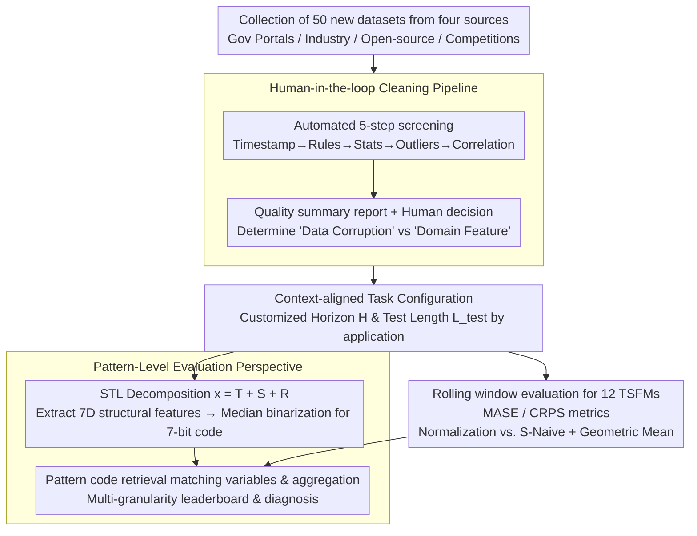

# It's TIME: Towards the Next Generation of Time Series Forecasting Benchmarks

**Conference**: ICML 2026  
**arXiv**: [2602.12147](https://arxiv.org/abs/2602.12147)  
**Code**: TBD  
**Area**: Time Series / Benchmark Design  
**Keywords**: Time Series Forecasting, Foundation Models, Zero-shot Evaluation, Benchmark Design, Pattern-level Evaluation

## TL;DR
TIME is a next-generation benchmark for **Time Series Foundation Models (TSFM)**. Through **human annotation + LLM-driven data cleaning**, **context-aligned task design**, and a **pattern-level evaluation perspective**, it overcomes four major pain points of existing benchmarks: data reuse, quality issues, improper task configurations, and coarse evaluation granularity; it evaluates 12 TSFMs across 50 entirely new datasets × 98 tasks.

## Background & Motivation

**Background**: The emergence of TSFMs has shifted the forecasting evaluation paradigm from dataset-centric to task-centric. Existing benchmarks like Monash and LSF are widely adopted but gradually reveal core limitations.

**Limitations of Prior Work**:
- **Data Reuse and Leakage Risk**: Existing benchmarks rely heavily on repeated data, creating contamination risks; new generation large-scale pre-trained models may have already ingested this legacy data.
- **Data Quality Defects**: Insufficient automated processing and lack of rigorous quality assurance; common issues include outlier explosions, excessive missing values, and constant sequences.
- **Task Configuration Detached from Reality**: Traditional benchmarks adopt a "one-size-fits-all" strategy (e.g., fixed 720-step prediction horizons), completely ignoring differences in application scenarios, frequencies, and predictability.
- **Coarse Evaluation Perspective**: Existing works aggregate by static meta-labels like dataset/frequency, hiding performance insights under similar patterns across different datasets.

**Key Challenge**: TSFMs require universal evaluation across heterogeneous data, but existing benchmarks lack sufficiently fresh data, appropriate task designs, and fine-grained analysis.

**Goal**: Build TIME (Task-centric Benchmark for Universal Forecasting Models) to thoroughly upgrade benchmarks from three dimensions: data, task, and evaluation.

**Key Insight**: Utilize LLM + human professional judgment to achieve high-fidelity data annotation and task design, performing pattern-level clustering analysis through interpretable time series features (rather than static labels).

**Core Idea**: Transform benchmark design from "dataset collection + mechanical evaluation" into a three-layer progression: "fresh data + human annotation + pattern-driven."

## Method

### Overall Architecture
TIME transforms "benchmark design" into a three-layer progression: "fresh data → human annotation → pattern-driven evaluation," targeting the four major pain points of data reuse, poor quality, one-size-fits-all tasks, and coarse evaluation. This is implemented in four stages: first, collecting 50 entirely new datasets from government portals, industrial collaborations, open-source libraries, and competitions, followed by human-in-the-loop cleaning; next, customizing prediction horizons (rather than a uniform 720 steps) based on the real-world application context of each dataset; then, performing STL decomposition on each series to extract 7-dimensional structural features binarized into pattern codes; finally, branching into two paths—one characterizing the intrinsic patterns of each variable via pattern codes, and the other running 12 TSFMs on rolling windows to obtain MASE/CRPS. These paths converge at "pattern-based retrieval + aggregation" to produce diagnostic multi-granularity leaderboards.

### Key Designs

**1. Human-in-the-loop data cleaning pipeline: Automated volume processing with human-guarded "final mile" for authenticity**

If large-scale data cleaning is fully automated, it easily misjudges "data corruption versus domain features"—deleting real spikes as outliers or leaving missing values as normal. TIME splits cleaning into five automated steps (timestamp repair → rule validation → statistical testing → outlier elimination → correlation check) plus a human decision stage: automation first generates a quality summary report, then humans combine domain knowledge and LLM insights to judge whether each suspicious item is corruption or a feature. This preserves large-scale efficiency while ensuring semantic correctness—for example, a constant segment in an electricity series might be flagged as an anomaly by automated rules, but a human can identify it as maintenance downtime rather than a data error.

**2. Context-aligned task configuration: Making prediction horizons reflect real operational needs, not academic convention**

The "one-size-fits-all 720 steps" of traditional benchmarks may be meaningless for low-frequency data and too short for high-frequency data, causing eval results to mismatch actual decision-making. TIME customizes the horizon $H$ and test length $L_{\text{test}}$ based on the application background and operational constraints of each dataset: high-frequency data is split into short/medium/long horizons, while low-frequency or sample-limited data is given a single feasible operational horizon. The test window covers full seasonal cycles, and task rationality is verified one-by-one using LLMs + domain knowledge. Thus, every task score maps directly back to a real scenario—shifting evaluation philosophy from "academic virtual settings" to "real-world orientation."

**3. Pattern-level interpretable evaluation perspective: Upgrading from "aggregation by dataset" to "aggregation by temporal pattern"**

Aggregating by static meta-labels like dataset or frequency hides insights such as "which models excel at highly seasonal sequences versus complex noise." TIME performs STL decomposition $\mathbf{x} = T + S + R$ for each variable, extracting 7-dimensional features (trend strength, linearity, seasonality strength, seasonal correlation, residual ACF, complexity, stationarity). For each continuous feature $F_k$, the median $\tilde{F}_k$ across the entire benchmark is used for binarization, assigning each variable a 7-dimensional binary code $\mathbf{B}\in\{0,1\}^7$. During evaluation, all matching variables for a target pattern are retrieved to calculate pattern-specific performance using scale-invariant MASE and CRPS. This upgrades evaluation from descriptive ("Model A ranks second on Electricity") to prescriptive ("Model A systematically dominates in strong trend + weak seasonality patterns"), revealing the true generalization boundaries of models.

### Loss & Training
Rolling window evaluation is employed. Metrics chosen are MASE (point prediction) and CRPS (probabilistic prediction) within a relative evaluation framework—normalizing all metrics relative to the Seasonal Naive (S-Naive) baseline: $\text{Metric}_{\text{model}}^{\text{norm}}(u) = \frac{\text{Metric}_{\text{model}}(u)}{\text{Metric}_{\text{S-Naive}}(u)}$. Geometric mean (instead of arithmetic mean) is used to aggregate normalized metrics across units to prevent outliers in specific tasks from dominating the rankings.

## Key Experimental Results

### Benchmark Scale and Model Coverage

| Metric | Value | Description |
|-----|------|------|
| Number of Datasets | 50 | Entirely New |
| Number of Forecasting Tasks | 98 | Combinations of frequencies and horizons |
| Number of Evaluated Models | 12 | Covers Decoders, Encoder-Decoders, etc. |
| Application Areas | 8 | Finance, System Metrics, Energy, Transport, etc. |

### Main Results

| Model | Release | Architecture | Params | MASE | CRPS | Rating |
|-----|---------|------|------|------|------|------|
| Chronos-2 | 10-25 | Enc. | 120M | 0.645 | 0.421 | ⭐⭐⭐ |
| TimesFM-2.5 | 10-25 | Dec. | 200M | 0.648 | 0.425 | ⭐⭐⭐ |
| TiRex | 05-25 | xLSTM | 35M | 0.672 | 0.438 | ⭐⭐⭐ |
| Moirai-2 | 08-25 | Dec. | 11M | 0.698 | 0.455 | ⭐⭐⭐⭐ |
| TimesFM-2.0 | 12-24 | Dec. | 500M | 0.741 | 0.489 | ⭐⭐⭐⭐ |

The latest model iterations consistently outperform predecessors, validating the true discriminative power of the benchmark.

### Pattern-Level Key Findings

| Time Series Feature | Model Differentiation | Key Insight |
|-----------|-------------|---------|
| Trend Strength | High | Chronos-2 / TimesFM-2.5 provide more significant relative gains on strong trends |
| Seasonality Strength | Medium | Models converge on weak seasonality but diverge significantly on strong seasonality |
| Seasonal Correlation | Medium-High | Early models show significant gaps between stable and unstable seasonality; latest TSFMs narrow this gap |
| Stationarity | High | Most models gain more on non-stationary data, but ranking is sensitive to stationarity |
| Complexity | High | Models "level out" on high-complexity data, while leaders pull ahead on low-complexity data |

### Key Findings
- Discrepancies exist between task-level and feature-level rankings, indicating that different aggregation granularities affect conclusions.
- Time series can present different patterns at different granularities (global spikes may be local periodicity).
- Models typically predict obvious seasonality and trends accurately but tend toward conservative predictions on high-volatility sequences—pure metric rankings mask this failure.

## Highlights & Insights
- **Data Freshness Assurance**: 50 new datasets from four different sources, historically not seen or rarely ingested by pre-training—strictly preventing data leakage and benchmark contamination.
- **Three-layer Human-Quality Assurance**: Automated 5-step → Quality summary report → Human decision—efficiently handling large scales while avoiding automation blind spots.
- **Context-Driven Task Design**: Breaks the "one-size-fits-all" dogma; prediction horizons and test lengths reflect real operational needs—shifting evaluation philosophy from "academic virtual settings" to "real-world orientation."
- **Paradigm Shift in Pattern-Level Interpretable Evaluation**: Dynamic feature clustering based on STL decomposition retains interpretability while enabling unified analysis of similar patterns across domains.
- **Symmetric Aggregation via Geometric Mean**: Relative metrics + geometric mean prevent any single extreme task from dominating rankings.

## Limitations & Future Work
- 50 datasets still offer limited coverage compared to benchmarks with tens of thousands of series.
- Pattern-level analysis is currently based on single features; complex multi-feature pattern interactions require interactive queries in the leaderboard.
- Visual analysis reveals conservative prediction issues but lacks a quantitative "prediction reliability" measure.
- MASE / CRPS are standard but may bias against real loss functions in specific application domains.
- Improvements: Multi-feature joint pattern clustering; application-customized metrics; continuous data expansion; temporal evolution analysis.

## Related Work & Insights
- **vs M4 / LSF**: Early standardized benchmarks rely heavily on legacy data and fixed settings; TIME uses entirely new sources and context-aligned tasks for fairer evaluation.
- **vs Recent Large-scale Benchmarks**: While scale increased, they still mainly reuse historical data; TIME's three major innovations directly address these pain points.
- **vs Time Series Feature Analysis**: Early works used features for classification or visualization; TIME further utilizes features for **evaluation aggregation**—an upgrade from descriptive to prescriptive analysis.

## Rating
- Novelty: ⭐⭐⭐⭐⭐ Three-dimensional benchmark design innovation (fresh data + human annotation + pattern-level evaluation) simultaneously solves four major pain points of existing benchmarks.
- Experimental Thoroughness: ⭐⭐⭐⭐⭐ 12 representative TSFMs × 98 tasks × multi-granularity analysis, covering 8 application domains and the full frequency spectrum.
- Writing Quality: ⭐⭐⭐⭐ Clear logic, informative charts; some details like LLM prompts are missing from the main text.
- Value: ⭐⭐⭐⭐⭐ Provides the TSFM community with a contamination-proof, real-world oriented next-gen benchmark; the interactive leaderboard and pattern-level analysis offer actionable diagnostic tools for model selection and improvement.

<!-- RELATED:START -->

## Related Papers

- [\[ICML 2026\] TimeOmni-VL: Unified Models for Time Series Understanding and Generation](timeomni-vl_unified_models_for_time_series_understanding_and_generation.md)
- [\[ICLR 2026\] SciTS: Scientific Time Series Understanding and Generation with LLMs](../../ICLR2026/time_series/scits_scientific_time_series_understanding_and_generation_with_llms.md)
- [\[ICML 2026\] Ellipsoidal Time Series Forecasting](ellipsoidal_time_series_forecasting.md)
- [\[ICML 2026\] Beyond Extrapolation: Knowledge Utilization Paradigm with Bidirectional Inspiration for Time Series Forecasting](beyond_extrapolation_knowledge_utilization_paradigm_with_bidirectional_inspirati.md)
- [\[ICML 2026\] Nested Spatio-Temporal Time Series Forecasting](nested_spatio-temporal_time_series_forecasting.md)

<!-- RELATED:END -->
