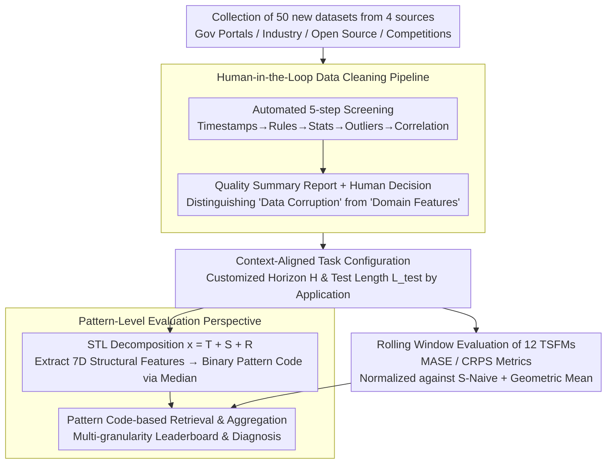

# It's TIME: Towards the Next Generation of Time Series Forecasting Benchmarks

**Conference**: ICML 2026  
**arXiv**: [2602.12147](https://arxiv.org/abs/2602.12147)  
**Code**: TBD  
**Area**: Time Series / Benchmark Design  
**Keywords**: Time Series Forecasting, Foundation Models, Zero-shot Evaluation, Benchmark Design, Pattern-level Evaluation

## TL;DR
TIME is a next-generation benchmark for **Time Series Foundation Models (TSFMs)**. It overcomes four major pain points—data reuse, quality issues, improper task configurations, and low evaluation granularity—through **human annotation + LLM-driven data cleaning**, **context-aligned task design**, and a **pattern-level evaluation perspective**. It includes 50 entirely new datasets, 98 tasks, and evaluations of 12 TSFMs.

## Background & Motivation

**Background**: The emergence of TSFMs has shifted the forecasting evaluation paradigm from dataset-centric to task-centric. Existing benchmarks such as Monash and LSF have been widely adopted but are increasingly revealing core limitations.

**Limitations of Prior Work**:
- **Data Reuse and Leakage Risk**: Existing benchmarks rely heavily on repeated datasets, creating risks of data contamination. New generation large-scale pre-trained models may have already ingested this legacy data.
- **Data Quality Defects**: Insufficient automated processing and a lack of rigorous quality assurance lead to issues like outlier explosions, excessive missing values, and constant sequences.
- **Task Configurations Detached from Reality**: Traditional benchmarks often adopt a "one-size-fits-all" strategy (e.g., a fixed 720-step forecasting horizon), ignoring differences in application scenarios, frequencies, and predictability.
- **Coarse-grained Evaluation Perspective**: Existing works aggregate by static meta-labels like dataset/frequency, hiding performance insights under similar patterns across different datasets.

**Key Challenge**: TSFMs require universal evaluation across heterogeneous data, but existing benchmarks lack sufficiently fresh data, appropriate task designs, and fine-grained analysis.

**Goal**: Construct TIME (Task-centric Benchmark for Universal Forecasting Models) to upgrade benchmarking across three dimensions: data, tasks, and evaluation.

**Key Insight**: Utilize LLMs combined with professional human judgment to achieve high-fidelity data annotation and task design, and perform pattern-level clustering analysis through interpretable time series features rather than static labels.

**Core Idea**: Transition benchmark design from "dataset collection + mechanical evaluation" to a three-level progression of "fresh data + human annotation + pattern-driven analysis."

## Method

### Overall Architecture
TIME reimagines "benchmark design" by moving beyond mechanical data collection and scoring toward a three-level progression. It addresses four pain points: data reuse, poor quality, uniform tasks, and coarse evaluation. The process consists of four stages: first, collecting 50 new datasets from government portals, industrial collaborations, open-source libraries, and competitions, followed by human-in-the-loop cleaning. Second, forecasting horizons are customized based on real-world application contexts (instead of a uniform 720 steps). Third, STL decomposition is applied to each series to extract 7-dimensional structural features, binarized into pattern codes. Finally, two paths are taken: one characterizes the intrinsic patterns of each variable via pattern codes, and the other evaluates 12 TSFMs using rolling windows to calculate MASE/CRPS. These paths converge at "pattern-based retrieval + aggregation" to produce a diagnostic multi-granularity leaderboard.

### Key Designs

**1. Human-in-the-loop data cleaning pipeline: Automated volume processing with human-guarded "authenticity" decisions**

If large-scale data cleaning is fully automated, it is prone to misjudging "data corruption vs. domain features"—deleting real spikes as outliers or leaving missing values as normal. TIME splits cleaning into five automated steps (timestamp repair → rule validation → statistical testing → outlier elimination → correlation checks) plus a human decision stage. The automation generates a quality summary report, which humans then use alongside domain knowledge and LLM insights to determine if suspicious items are corruption or features. This maintains the efficiency of large-scale processing while ensuring semantic correctness—for example, constant segments in power sequences might be flagged by automated rules, but humans can identify them as maintenance downtime rather than data errors.

**2. Context-aligned task configuration: Making forecasting horizons reflect real operational needs rather than academic conventions**

The "one-size-fits-all 720 steps" of traditional benchmarks may be meaningless for low-frequency data and too short for high-frequency data, leading to a disconnect between evaluation and practical decision-making. TIME customizes the horizon $H$ and test length $L_{\text{test}}$ based on the application background and operational constraints of each dataset. High-frequency data is assigned short/medium/long horizons, while low-frequency or sample-limited data is given a single feasible operational horizon. Test windows cover full seasonal cycles, and task rationality is verified using LLMs and domain knowledge. This allows metrics to map directly back to real-world scenarios, shifting the evaluation philosophy from "academic virtual settings" to "real-world orientation."

**3. Pattern-level interpretable evaluation perspective: Upgrading from "aggregation by dataset" to "aggregation by time series pattern"**

Aggregating by static meta-labels hides insights such as which models excel at highly seasonal sequences versus complex noise. TIME performs STL decomposition $\mathbf{x} = T + S + R$ for each variable and extracts 7-dimensional features (trend strength, linearity, seasonality strength, seasonal correlation, residual ACF, complexity, and stationarity). For each continuous feature $F_k$, a binary value is assigned based on the global benchmark median $\tilde{F}_k$, resulting in a 7-bit binary pattern code $\mathbf{B}\in\{0,1\}^7$ for each variable. During evaluation, all matching variables are retrieved for a target pattern, and scale-invariant MASE and CRPS are used to calculate pattern-specific performance. This upgrades evaluation from descriptive ("Model A ranks second on Electricity") to prescriptive ("Model A systematically dominates on patterns with strong trends and weak seasonality"), revealing the true generalization boundaries of models.

### Loss & Training
The benchmark employs rolling window evaluation. MASE (point forecasting) and CRPS (probabilistic forecasting) are selected as metrics. A relative evaluation framework is used, where all metrics are normalized against the Seasonal Naive (S-Naive) baseline: $\text{Metric}_{\text{model}}^{\text{norm}}(u) = \frac{\text{Metric}_{\text{model}}(u)}{\text{Metric}_{\text{S-Naive}}(u)}$. A geometric mean (rather than arithmetic mean) is used to aggregate normalized metrics across units to prevent a single extreme task from dominating the rankings.

## Key Experimental Results

### Benchmark Scale and Model Coverage

| Metric | Value | Description |
|-----|------|------|
| Number of Datasets | 50 | Entirely new collection |
| Number of Forecasting Tasks | 98 | Combinations of frequencies and horizons |
| Number of Evaluated Models | 12 | Covers Decoders, Encoder-Decoders, etc. |
| Application Domains | 8 | Finance, System Metrics, Energy, Transport, etc. |

### Main Results

| Model | Release | Architecture | Params | MASE | CRPS | Rating |
|-----|---------|------|------|------|------|------|
| Chronos-2 | 10-25 | Enc. | 120M | 0.645 | 0.421 | ⭐⭐⭐ |
| TimesFM-2.5 | 10-25 | Dec. | 200M | 0.648 | 0.425 | ⭐⭐⭐ |
| TiRex | 05-25 | xLSTM | 35M | 0.672 | 0.438 | ⭐⭐⭐ |
| Moirai-2 | 08-25 | Dec. | 11M | 0.698 | 0.455 | ⭐⭐⭐⭐ |
| TimesFM-2.0 | 12-24 | Dec. | 500M | 0.741 | 0.489 | ⭐⭐⭐⭐ |

The latest model iterations consistently outperform predecessors, validating the benchmark's discriminative power.

### Key Findings by Pattern Level

| Time Series Feature | Model Differentiation | Key Insight |
|-----------|-------------|---------|
| Trend Strength | High | Chronos-2 / TimesFM-2.5 show more significant relative gains on strong trends |
| Seasonality Strength| Medium | Models converge on weak seasonality but diverge on strong seasonality |
| Seasonal Correlation| Medium-High | Early models show a significant gap between stable and unstable seasons; latest TSFMs narrow this gap |
| Stationarity | High | Most models gain more on non-stationary data, but rankings are sensitive to stationarity |
| Complexity | High | Models level out on high-complexity data, while leaders pull ahead on low-complexity data |

## Key Findings
- Task-level rankings diverge from feature-level rankings, indicating that different aggregation granularities affect conclusions.
- Time series can present different patterns at different granularities (a global spike may be local periodicity).
- Models generally predict obvious seasonality and trends accurately but tend toward conservative predictions on high-volatility sequences—a failure often masked by pure metric rankings.

## Highlights & Insights
- **Data Freshness Guarantee**: 50 new datasets from four sources, ensuring history has not been or has rarely been seen during pre-training—strictly preventing data leakage and contamination.
- **Three-Level Quality Assurance**: Automated screening → Quality summary reports → Human decisions—efficiently handling large scales while avoiding automated blind spots.
- **Context-Driven Task Design**: Breaks the "one-size-fits-all" dogma, ensuring forecasting horizons and test lengths reflect real operational needs—shifting evaluation from "academic virtual settings" to "real-world orientation."
- **Paradigm Shift to Pattern-Level Evaluation**: Dynamic feature clustering based on STL decomposition maintains interpretability while allowing unified analysis of similar patterns across domains.
- **Symmetric Aggregation via Geometric Mean**: Using relative metrics and the geometric mean prevents rankings from being dominated by extreme tasks.

## Limitations & Future Work
- 50 datasets still offer limited coverage compared to benchmarks with tens of thousands of series.
- Pattern-level analysis is currently based on single features; complex multi-feature interactions require interactive querying in the leaderboard.
- While visual analysis reveals conservative prediction issues, there is a lack of quantitative "prediction reliability" measures.
- MASE/CRPS are standard but may vary from the true loss functions of specific application domains.
- Future improvements: multi-feature joint pattern clustering, application-specific metrics, continuous data expansion, and temporal evolution analysis.

## Related Work & Insights
- **vs M4 / LSF**: Early standardized benchmarks rely heavily on legacy data and fixed settings; TIME uses new data sources and context-aligned tasks for fairer evaluation.
- **vs Recent Large-scale Benchmarks**: While recent work has increased scale, they mostly reuse historical data; TIME's innovations directly address these pain points.
- **vs Time Series Feature Analysis**: Earlier work used features for classification or visualization; TIME utilizes features for **evaluation aggregation**—an upgrade from descriptive to prescriptive analysis.

## Rating
- Novelty: ⭐⭐⭐⭐⭐  The three-dimensional innovation (fresh data + human annotation + pattern-level evaluation) simultaneously addresses four major pain points of existing benchmarks.
- Experimental Thoroughness: ⭐⭐⭐⭐⭐  12 representative TSFMs × 98 tasks × multi-granularity analysis, covering 8 application domains and a full frequency spectrum.
- Writing Quality: ⭐⭐⭐⭐  Clear logic and informative charts; some details like LLM prompts are missing from the main text.
- Value: ⭐⭐⭐⭐⭐  Provides the TSFM community with a next-generation benchmark that is contamination-resistant and close to real-world practice; the leaderboard design and pattern-level analysis offer actionable diagnostic tools for model selection and improvement.

<!-- RELATED:START -->

## Related Papers

- [\[ICML 2026\] TimeOmni-VL: Unified Models for Time Series Understanding and Generation](timeomni-vl_unified_models_for_time_series_understanding_and_generation.md)
- [\[ICLR 2026\] TimeSeriesExamAgent: Creating Time Series Reasoning Benchmarks at Scale](../../ICLR2026/time_series/timeseriesexamagent_creating_time_series_reasoning_benchmarks_at_scale.md)
- [\[ICLR 2026\] SciTS: Scientific Time Series Understanding and Generation with LLMs](../../ICLR2026/time_series/scits_scientific_time_series_understanding_and_generation_with_llms.md)
- [\[ICML 2026\] Do Time Series Foundation Model Benchmarks Hide Regime-Dependent Failures? Evidence from Traffic Speed Forecasting](do_time_series_foundation_model_benchmarks_hide_regime-dependent_failures_eviden.md)
- [\[ICML 2026\] From Observations to States: Latent Time Series Forecasting](from_observations_to_states_latent_time_series_forecasting.md)

<!-- RELATED:END -->
