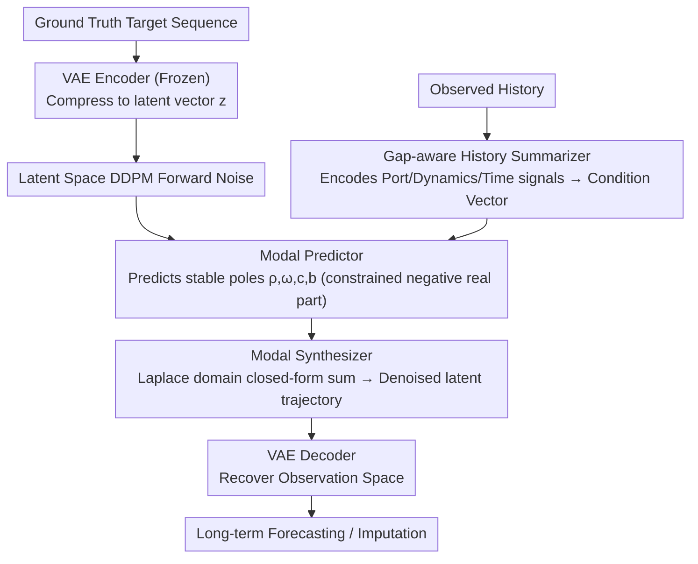

# Latent Laplace Diffusion for Irregular Multivariate Time Series

**Conference**: ICML 2026 Spotlight  
**arXiv**: [2605.19805](https://arxiv.org/abs/2605.19805)  
**Code**: To be confirmed  
**Area**: Time Series / Generative Models  
**Keywords**: Irregular Time Series, Diffusion Models, Latent Space Generation, Laplace Domain, Port-Hamiltonian Systems

## TL;DR
LLapDiff is a generative framework that performs **diffusion in latent space**. By parameterizing **stable modal evolution** with learnable complex-conjugate poles in the Laplace domain, it achieves long-term forecasting and missing value imputation for irregular time series **without step-by-step physical time integration**, achieving an average rank of 2.1±1.7 across 7 datasets.

## Background & Motivation

**Background**: Modeling irregular multivariate time series (IMTS) is typically categorized into three types: (1) Discrete pipelines that interpolate or re-grid data before using strong sequence models; (2) Continuous-time models like Neural ODEs or Continuous RNNs that naturally handle timestamps but require step-by-step numerical integration; (3) Diffusion generative models that provide uncertainty quantification but often perform denoising directly in the observation space, lacking dynamical structure and stability control.

**Limitations of Prior Work**: Discrete methods tend to distort temporal structures in severely irregular cases. The step-by-step integration of continuous-time models accumulates errors and numerical drift during long-term forecasting. Existing diffusion approaches lack explicit stability constraints, making long-term generation unstable under irregular sampling.

**Key Challenge**: How to design a long-term forecasting method that preserves timestamp fidelity, avoids numerical integration costs and error accumulation, and ensures long-term dynamical stability without aggressive grid-based reshaping?

**Goal**: Design a conditional generative model that incorporates continuous-time inductive biases without requiring ODE/SDE solvers.

**Key Insight**: Represent the target time series as a low-dimensional latent space trajectory and perform diffusion within this latent space; inspired by the energy conservation of **Stochastic Port-Hamiltonian Systems**, use stable modal parameterization (complex-conjugate poles) in the Laplace domain to guide the reverse process.

**Core Idea**: Use stable modal parameterization $\mathcal{G}(s) = \sum_{k=1}^K \frac{\omega_k \mathbf{c}_k \mathbf{b}_k^\top}{s^2 + 2 \rho_k s + (\rho_k^2 + \omega_k^2)}$ to directly evaluate generation at any query time point of the latent trajectory, avoiding step-by-step time integration.

## Method

### Overall Architecture
(1) Use a pre-trained VAE encoder to map the ground-truth target sequence to a low-dimensional latent space $\mathbf{z} = \text{VAE}_{\text{enc}}(\mathcal{Y}_{t_i})$; (2) Use a gap-aware history summarizer $\mathcal{S}_\phi$ to compress observed history $\mathcal{H}_{t_i}$ into a condition vector $\mathbf{E}_{t_i}$; (3) Execute a standard DDPM forward process in the latent space; (4) During reverse denoising, a modal predictor $\mathcal{L}_\theta$ predicts continuous-time modal parameters (decay rate $\rho_k$, oscillation frequency $\omega_k$, and residual vectors $\mathbf{c}_k, \mathbf{b}_k$) based on the current noisy latent state and history summary; a modal synthesizer $\mathcal{L}_\theta^+$ uses these poles to calculate the denoised latent trajectory $\hat{\mathbf{z}}_0(t_r) = \sum_k e^{-\hat{\rho}_k \tilde{t}_r}(\hat{\mathbf{c}}_k \cos(\hat{\omega}_k \tilde{t}_r) + \hat{\mathbf{b}}_k \sin(\hat{\omega}_k \tilde{t}_r))$ directly at any query time; (5) Use the VAE decoder to recover the observation space.

### Key Designs

**1. Port-Hamiltonian Inspired Stable Modal Parameterization: Suppressing Long-term Drift via Energy Conservation**

Existing diffusion methods mostly denoise directly in the observation space without explicit stability constraints, often leading to infinite energy growth and numerical drift in long-term generation under irregular sampling. LLapDiff starts from the energy balance equations of Stochastic Port-Hamiltonian SDEs, where the dissipation term $\mathbf{R} \succ 0$ naturally guarantees energy decay. After applying the Laplace transform to the locally linearized system, the dynamics are represented as a transfer function composed of $K$ complex-conjugate pole pairs $(-\rho_k \pm i \omega_k)$. The learner directly predicts $(\hat{\rho}_k, \hat{\omega}_k, \hat{\mathbf{c}}_k, \hat{\mathbf{b}}_k)$ and constrains $\rho_k > 0$—as long as all poles have negative real parts (Hurwitz property), the asymptotic stability of long-term forecasting is automatically locked. This encodes the "trajectories should not diverge" constraint directly into the model architecture compared to pure black-box learning.

**2. Gap-aware Conditioning from a Renewal-Averaging Perspective: Integrating Sampling Statistics into Poles**

Irregular sampling changes the dynamics seen by the model. The model must distinguish between inherent poles of the signal and artifacts introduced by sampling intervals. LLapDiff establishes this relationship via renewal theory: when sampling intervals $\Delta_j$ are i.i.d., continuous-time poles $s_k = -\rho_k + i \omega_k$ map to equivalent poles in the event domain $\lambda_k = \mathbb{E}[e^{s_k \Delta}]$, whose logarithm expands via Taylor series to $\bar{s}_k \approx s_k \mathbb{E}[\Delta] + \frac{1}{2} s_k^2 \text{Var}(\Delta)$, clearly showing how the mean and variance of intervals modulate decay and oscillation. Based on this theoretical link, the history summarizer is designed to simultaneously encode three types of signals: Port signals (observations), Dynamic signals (finite difference features), and Temporal signals (timestamps, $\Delta t$ encoding, and masks), forcing the model to learn to separate inherent dynamics from effective pole changes introduced by sampling.

**3. Dual-layer Framework of Latent Space Generation + VAE Encoding: Diffusing on Low-dimensional Trajectories to Avoid Sparse High-dimensional Denoising**

Directly diffusing on observation trajectories of size $h \times d_y$ requires dealing with sparse masks and high dimensionality simultaneously, which is unstable and expensive. LLapDiff adopts a two-layer approach: first, a pre-trained and frozen VAE compresses the target sequence into low-dimensional latent vectors $\mathbf{z} \in \mathbb{R}^{h \times d_z}$ (where $d_z$ is typically only 4–16, $d_z \ll d_y$). Diffusion runs only in this compact space, learning conditional generation $p_\theta(\mathbf{z} \mid \mathbf{E}_{t_i})$. During reverse denoising, the modal synthesizer uses predicted poles to calculate the closed-form sum $\hat{\mathbf{z}}_0(t_r) = \sum_k e^{-\hat{\rho}_k \tilde{t}_r}(\hat{\mathbf{c}}_k \cos(\hat{\omega}_k \tilde{t}_r) + \hat{\mathbf{b}}_k \sin(\hat{\omega}_k \tilde{t}_r))$ at any query time, computing all time steps at once without step-by-step integration. The VAE prior provides good initialization and regularization for diffusion, making latent space generation both stable and efficient.

### Loss & Training
The VAE is first independently pre-trained on the training set and frozen. The diffuser uses standard DDPM forward noise, and the reverse process is jointly denoised by the modal predictor and synthesizer. The history summarizer is trained end-to-end with the diffuser (ablations show that making the summarizer a separate stage outside joint training leads to significant performance degradation). The query set can include future time points for long-term forecasting or historical missing time points for causal-filtering imputation.

## Key Experimental Results

### Main Results

| Dataset | Metric | DLinear | PatchTST | TimeGrad | mTAN | NeuralCDE | ContiFormer | **LLapDiff** |
|--------|------|---------|----------|----------|------|-----------|------------|----------|
| BMS Air (h=168) | CRPS | 1.448 | 0.929 | 0.537 | 0.547 | 1.019 | 0.984 | **0.516** |
| UCI Air (h=168) | CRPS | 2.751 | 1.149 | 1.122 | 0.836 | 1.991 | 2.143 | **1.003** |
| PhysioNet (h=12) | CRPS | 0.476 | 0.486 | 0.446 | 0.452 | 0.431 | 0.420 | **0.318** |
| NOAA US (h=168) | CRPS | 0.355 | 0.333 | 0.639 | 0.869 | 0.511 | 0.468 | **0.440** |
| NOAA UK (h=168) | CRPS | 1.546 | 0.750 | 0.639 | 0.869 | 1.114 | 1.354 | **0.557** |
| US Equity (h=100) | CRPS | 0.572 | 0.565 | 0.423 | 0.417 | 0.561 | 0.563 | **0.406** |

Average rank: 2.1 ± 1.7 (significantly better than 3.0-6.6 for other diffusion methods).

### Ablation Study

| Configuration | BMS Air | NOAA US | US Equity | Description |
|------|---------|---------|-----------|------|
| Full model | 0.516 | 0.440 | 0.406 | Complete model |
| w/o conditioning | 0.816 (+0.30) | 1.450 (+1.01) | 0.466 (+0.06) | Remove history summary |
| w/o learned poles | 0.696 (+0.18) | 1.310 (+0.87) | 0.476 (+0.07) | Remove pole parameterization |
| w/o latent space | 0.666 (+0.15) | 1.030 (+0.59) | 0.446 (+0.04) | Diffusion in observation space |
| joint-trained summarizer | 0.806 (+0.29) | 1.360 (+0.92) | 0.476 (+0.07) | Separately trained summarizer |

### Key Findings
- **Significant Long-term Stability Advantage**: On the longest forecasting horizons (h=168) and highly irregular datasets, LLapDiff improves by 15-30% compared to mr-Diff, while the gain shrinks to 5-10% at h=24.
- **Practical Effect of Gap-Awareness**: Qualitative results show that LLapDiff maintains coherent trajectories and well-calibrated uncertainty even across intervals with multiple missing values.
- **Dual Efficiency in Imputation**: By including historical missing time points in the query set, LLapDiff performs causal-filtering imputation (CRPS 0.321 vs. CSDI 0.469).
- **Stress Testing**: Performance remains stable under manually induced missingness (CRPS change < 0.1 even after a 20% drop in coverage).

## Highlights & Insights
- **Physics-inspired Stability Design**: Port-Hamiltonian energy balance successfully injects second-order dynamical constraints (pole Hurwitz property) into the diffusion denoiser, forcing stability.
- **Ingenious Avoidance of Step-by-Step Integration**: By using closed-form modal summation in the Laplace domain instead of matrix exponentials, the model achieves parallelization with "one-step calculation for all time points," reducing costs from $O(h \cdot T \cdot d_z^3)$ to $O(h \cdot K)$.
- **Creative Application of Renewal Theory**: Inspired by classical tools in probability theory (renewal theory, characteristic functions), the model derives how interval statistics modulate continuous-time dynamics.
- **Unified Forecasting and Imputation**: The same model performs both tasks by simply changing the query times (future vs. history).

## Limitations & Future Work
- Latent Space Dimension Trade-off: The impact of latent dimension $d_z$ on long-term stability and computational efficiency is not fully explored.
- Gap Between Theory and Practice: Renewal-average analysis assumes i.i.d. intervals, but real-world data gaps are often non-stationary and state-dependent.
- Selection of Number of Poles $K$: The paper uses a fixed $K$, but different datasets might require different modal richness.
- Scalability to Ultra-long Forecasting (h > 500): The experiments capped at h=168.

## Related Work & Insights
- **vs. TimeGrad / mr-Diff** (Diffusion Baselines): These mostly denoise in observation space and handle irregularity via masking + time embeddings, lacking explicit dynamical constraints; LLapDiff introduces rigid energy conservation and pole stability in latent space.
- **vs. NeuralCDE / ContiFormer** (Continuous-time Baselines): Use Neural ODEs or Continuous Transformers to handle timestamps naturally but require step-by-step integration; LLapDiff completely bypasses integration via Laplace domain parameterization.
- **vs. Structured SSMs (S4, etc.)**: SSMs are efficient for long sequences but are mostly used for synchronous sampling; LLapDiff's gap-aware conditioning and modal parameterization designed specifically for irregular sampling are novel contributions.

## Rating
- Novelty: ⭐⭐⭐⭐⭐ The combination of Port-Hamiltonian inspired stability design and Laplace pole parameterization is entirely novel, naturally merging physics-inspired energy constraints with modern diffusion frameworks.
- Experimental Thoroughness: ⭐⭐⭐⭐ Seven datasets, complete ablations, stress tests, and visualizations are thorough; lacks depth in computational time comparison and ultra-long-term stability validation.
- Writing Quality: ⭐⭐⭐⭐⭐ Clear mathematical derivations, well-motivated setup, and persuasive experimental results.
- Value: ⭐⭐⭐⭐⭐ Solves the practically important problem of long-term forecasting for irregular time series; the physics-inspired nature and transferability (pole parameterization can be extended to other generative tasks) are high.

<!-- RELATED:START -->

## Related Papers

- [\[ICLR 2026\] Learning Recursive Multi-Scale Representations for Irregular Multivariate Time Series Forecasting](../../ICLR2026/time_series/learning_recursive_multi-scale_representations_for_irregular_multivariate_time_s.md)
- [\[ICML 2026\] QuITE: Query-based Irregular Time Series Embedding](quite_query-based_irregular_time_series_embedding.md)
- [\[AAAI 2026\] Revitalizing Canonical Pre-Alignment for Irregular Multivariate Time Series Forecasting](../../AAAI2026/time_series/revitalizing_canonical_pre-alignment_for_irregular_multivariate_time_series_fore.md)
- [\[ICML 2026\] From Observations to States: Latent Time Series Forecasting](from_observations_to_states_latent_time_series_forecasting.md)
- [\[NeurIPS 2025\] OmniCast: A Masked Latent Diffusion Model for Weather Forecasting Across Time Scales](../../NeurIPS2025/time_series/omnicast_a_masked_latent_diffusion_model_for_weather_forecasting_across_time_sca.md)

<!-- RELATED:END -->
