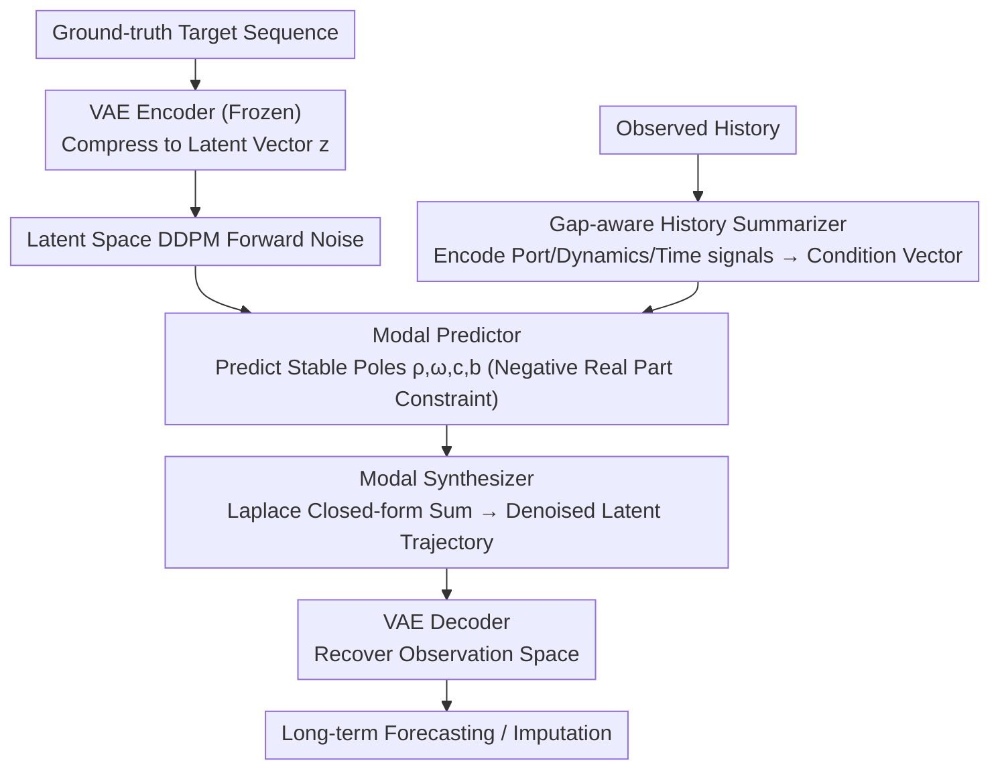

# Latent Laplace Diffusion for Irregular Multivariate Time Series

**Conference**: ICML 2026 Spotlight  
**arXiv**: [2605.19805](https://arxiv.org/abs/2605.19805)  
**Code**: To be confirmed  
**Area**: Time Series / Generative Models  
**Keywords**: Irregular Time Series, Diffusion Models, Latent Generation, Laplace Domain, Port-Hamiltonian Systems

## TL;DR
LLapDiff is a generative framework that performs **diffusion in latent space**. By parameterizing **stable modal evolution** in the Laplace domain with learnable complex conjugate poles, it achieves long-term forecasting and missing value imputation for irregular time series **without step-by-step physical time integration**; it achieved an average rank of 2.1±1.7 across 7 datasets.

## Background & Motivation

**Background**: Modeling Irregular Multivariate Time Series (IMTS) is typically categorized into three types: (1) Discrete pipelines that interpolate/re-grid data before processing with strong sequential models; (2) Continuous-time models such as Neural ODEs / Continuous RNNs that naturally handle timestamps but require step-by-step numerical integration; (3) Diffusion generative models that provide uncertainty quantization but mostly perform denoising directly in the observation space, lacking dynamical structure and stability control.

**Limitations of Prior Work**: Discrete methods tend to distort the temporal structure under severe irregularity. The step-by-step integration of continuous-time models accumulates errors and numerical drift during long-term forecasting. Existing diffusion methods lack explicit stability constraints, making long-term generation unstable under irregular sampling.

**Key Challenge**: How to design a long-term forecasting method that preserves timestamp fidelity, avoids the cost and error accumulation of numerical integration, and ensures long-term dynamical stability without aggressive grid rescaling?

**Goal**: Design a conditional generative model that incorporates continuous-time inductive biases but eliminates the need for ODE/SDE solvers.

**Key Insight**: Represent the target time series as a low-dimensional latent space trajectory and perform diffusion within that latent space; inspired by the energy conservation of **Stochastic Port-Hamiltonian Systems**, use stable modal parameterization (complex conjugate poles) in the Laplace domain to guide the reverse process.

**Core Idea**: Use a stable modal parameterization $\mathcal{G}(s) = \sum_{k=1}^K \frac{\omega_k \mathbf{c}_k \mathbf{b}_k^\top}{s^2 + 2 \rho_k s + (\rho_k^2 + \omega_k^2)}$ to directly evaluate generation at any query time point of the latent trajectory, avoiding step-by-step time integration.

## Method

### Overall Architecture
(1) Use a pre-trained VAE encoder to map the ground-truth target sequence to a low-dimensional latent space $\mathbf{z} = \text{VAE}_{\text{enc}}(\mathcal{Y}_{t_i})$; (2) Use a gap-aware history summarizer $\mathcal{S}_\phi$ to compress the observed history $\mathcal{H}_{t_i}$ into a condition vector $\mathbf{E}_{t_i}$; (3) Execute a standard DDPM forward process in the latent space; (4) During reverse denoising, a modal predictor $\mathcal{L}_\theta$ predicts continuous-time modal parameters (decay rate $\rho_k$, oscillation frequency $\omega_k$, and residual vectors $\mathbf{c}_k, \mathbf{b}_k$) based on the current noisy latent state and history summary; a modal synthesizer $\mathcal{L}_\theta^+$ uses these poles to calculate the denoised latent trajectory directly at any query time $\hat{\mathbf{z}}_0(t_r) = \sum_k e^{-\hat{\rho}_k \tilde{t}_r}(\hat{\mathbf{c}}_k \cos(\hat{\omega}_k \tilde{t}_r) + \hat{\mathbf{b}}_k \sin(\hat{\omega}_k \tilde{t}_r))$; (5) Use the VAE decoder to recover the observation space.

### Key Designs

**1. Port-Hamiltonian Inspired Stable Modal Parameterization: Preventing Long-term Drift via Energy Conservation**

Existing diffusion methods often denoise directly in the observation space without explicit stability constraints, often leading to infinite energy growth and numerical drift in long-term generation under irregular sampling. LLapDiff starts from the energy balance equation of Stochastic Port-Hamiltonian SDEs, where the dissipation term $\mathbf{R} \succ 0$ naturally guarantees energy decay. After applying the Laplace transform to the locally linearized system, the dynamics are represented as a transfer function composed of $K$ complex conjugate pole pairs $(-\rho_k \pm i \omega_k)$. The learner directly predicts $(\hat{\rho}_k, \hat{\omega}_k, \hat{\mathbf{c}}_k, \hat{\mathbf{b}}_k)$ and constrains $\rho_k > 0$—as long as the real parts of all poles are negative (Hurwitz property), the asymptotic stability of long-term forecasting is automatically guaranteed. This embeds the constraint that "trajectories should not diverge" directly into the model structure rather than relying on black-box learning.

**2. Gap-aware Conditioning from a Renewal Averaging Perspective: Incorporating Sampling Statistics into Poles**

Irregular sampling changes the dynamics perceived by the model; the model must distinguish between poles inherent to the signal and artifacts introduced by sampling intervals. LLapDiff establishes this relationship using renewal theory: when sampling intervals $\Delta_j$ are i.i.d., the continuous-time pole $s_k = -\rho_k + i \omega_k$ maps to an equivalent pole in the event domain $\lambda_k = \mathbb{E}[e^{s_k \Delta}]$, the logarithm of which is Taylor-expanded as $\bar{s}_k \approx s_k \mathbb{E}[\Delta] + \frac{1}{2} s_k^2 \text{Var}(\Delta)$. This clearly shows how the mean and variance of gaps modulate decay and oscillation. Based on this theoretical link, the history summarizer is designed to simultaneously encode three types of signals: Port signals (observations), dynamics signals (finite difference features), and temporal signals (timestamps, $\Delta t$ encoding, and masks), forcing the model to learn to separate inherent dynamics from changes in effective poles introduced by sampling.

**3. Dual-layer Framework of Latent Space Generation + VAE: Diffusing on Low-dimensional Trajectories to Avoid Sparse High-dimensional Denoising**

Directly diffusing on an observation trajectory of size $h \times d_y$ requires dealing with sparse masks and high dimensionality simultaneously, which is unstable and expensive. LLapDiff adopts a two-layer approach: first, a pre-trained and frozen VAE compresses the target sequence into a low-dimensional latent vector $\mathbf{z} \in \mathbb{R}^{h \times d_z}$ (where $d_z$ is typically 4–16, $d_z \ll d_y$). Diffusion runs only in this compact space, learning conditional generation $p_\theta(\mathbf{z} \mid \mathbf{E}_{t_i})$. During reverse denoising, the modal synthesizer uses the predicted poles to perform a closed-form summation at any query time $\hat{\mathbf{z}}_0(t_r) = \sum_k e^{-\hat{\rho}_k \tilde{t}_r}(\hat{\mathbf{c}}_k \cos(\hat{\omega}_k \tilde{t}_r) + \hat{\mathbf{b}}_k \sin(\hat{\omega}_k \tilde{t}_r))$, calculating all time points at once without step-by-step integration. The VAE prior also provides efficient initialization and regularization for diffusion, making latent space generation both stable and efficient.

### Loss & Training
The VAE is first independently pre-trained on the training set and frozen. The diffuser uses standard DDPM forward noise, while the reverse denoising is performed jointly by the modal predictor and synthesizer. The history summarizer and diffuser are trained end-to-end (ablations show that making the summarizer a separate stage instead of joint training leads to significant performance drops). The query set can contain future timestamps for long-term forecasting or historical missing timestamps for causal filter-based imputation.

## Key Experimental Results

### Main Results

| Dataset | Metric | DLinear | PatchTST | TimeGrad | mTAN | NeuralCDE | ContiFormer | **Ours** |
|--------|------|---------|----------|----------|------|-----------|------------|----------|
| BMS Air (h=168) | CRPS | 1.448 | 0.929 | 0.537 | 0.547 | 1.019 | 0.984 | **0.516** |
| UCI Air (h=168) | CRPS | 2.751 | 1.149 | 1.122 | 0.836 | 1.991 | 2.143 | **1.003** |
| PhysioNet (h=12) | CRPS | 0.476 | 0.486 | 0.446 | 0.452 | 0.431 | 0.420 | **0.318** |
| NOAA US (h=168) | CRPS | 0.355 | 0.333 | 0.639 | 0.869 | 0.511 | 0.468 | **0.440** |
| NOAA UK (h=168) | CRPS | 1.546 | 0.750 | 0.639 | 0.869 | 1.114 | 1.354 | **0.557** |
| US Equity (h=100) | CRPS | 0.572 | 0.565 | 0.423 | 0.417 | 0.561 | 0.563 | **0.406** |

Average Rank: 2.1 ± 1.7 (significantly better than other diffusion methods at 3.0-6.6).

### Ablation Study

| Configuration | BMS Air | NOAA US | US Equity | Description |
|------|---------|---------|-----------|------|
| Full model | 0.516 | 0.440 | 0.406 | Complete model |
| w/o conditioning | 0.816 (+0.30) | 1.450 (+1.01) | 0.466 (+0.06) | Remove history summary |
| w/o learned poles | 0.696 (+0.18) | 1.310 (+0.87) | 0.476 (+0.07) | Remove pole parameterization |
| w/o latent space | 0.666 (+0.15) | 1.030 (+0.59) | 0.446 (+0.04) | Diffusion in observation space |
| joint-trained summarizer | 0.806 (+0.29) | 1.360 (+0.92) | 0.476 (+0.07) | Jointly trained summarizer |

### Key Findings
- **Long-term Stability Advantage**: On the longest prediction horizon (h=168) and highly irregular datasets, LLapDiff shows a 15-30% improvement over mr-Diff, while the gain decreases to 5-10% at h=24.
- **Effectiveness of Gap-awareness**: Qualitative results indicate that LLapDiff maintains coherent trajectories and well-calibrated uncertainty across multiple intervals where missing data occurs.
- **Dual Efficacy in Imputation**: By including missing historical timestamps in the query set, LLapDiff performs causal filter-style imputation (CRPS 0.321 vs CSDI 0.469).
- **Stress Testing**: Performance remains stable under manually induced missingness (CRPS change < 0.1 even after a 20% drop in coverage).

## Highlights & Insights
- **Physics-inspired Stability Design**: Port-Hamiltonian energy balance effectively injects second-order dynamical constraints (pole Hurwitz property) into the diffusion denoiser, forcing stability from the source.
- **Ingenuity in Avoiding Stepwise Integration**: By using closed-form modal summation in the Laplace domain instead of matrix exponentials, the model achieves parallelization that "calculates all timestamps in one step," reducing cost from $O(h \cdot T \cdot d_z^3)$ to $O(h \cdot K)$.
- **Creative Application of Renewal Theory**: Drawing inspiration from classical tools in probability theory (renewal theory, characteristic functions), the work derives how gap statistics modulate continuous-time dynamics.
- **Unified Forecasting and Imputation**: The same model can perform both long-term forecasting and missing value imputation simply by changing the query timestamps (future vs. history).

## Limitations & Future Work
- Latent dimensionality trade-off: The impact of latent dimension $d_z$ on long-term stability and computational efficiency is not fully explored.
- Gap between theory and practice: The renewal averaging analysis assumes i.i.d. intervals, but real-world data gaps are often non-stationary and state-dependent.
- Selection of the number of poles $K$: The paper uses a fixed $K$, while different datasets may require varying modal richness.
- Scalability for ultra-long-term forecasting (h > 500): The longest horizon in experiments was h=168.

## Related Work & Insights
- **vs TimeGrad / mr-Diff** (Diffusion baselines): These mostly denoise in the observation space and rely on masks + time embeddings to handle irregularity, lacking explicit dynamical constraints; Ours introduces rigid energy conservation and pole stability in the latent space.
- **vs NeuralCDE / ContiFormer** (Continuous-time baselines): These use Neural ODEs or Continuous Transformers to naturally handle timestamps but require stepwise integration; Ours completely bypasses integration via Laplace domain parameterization.
- **vs Structured SSMs (S4, etc.)**: SSMs are efficient for long sequences but mostly for synchronous sampling; the gap-aware conditioning and modal parameterization designed specifically for irregular sampling in LLapDiff are novel contributions.

## Rating
- Novelty: ⭐⭐⭐⭐⭐ The combination of Port-Hamiltonian inspired stability design and Laplace pole parameterization is entirely novel, naturally merging physics-inspired energy constraints with modern diffusion frameworks.
- Experimental Thoroughness: ⭐⭐⭐⭐ Extensive testing across seven datasets, complete ablations, stress tests, and visualizations; lacks computation time comparisons and in-depth verification of ultra-long-term stability.
- Writing Quality: ⭐⭐⭐⭐⭐ Clear mathematical derivations, well-developed motivation, and persuasive experimental results.
- Value: ⭐⭐⭐⭐⭐ Resolves the practically important issue of long-term forecasting for irregular time series; the physics-inspired nature and transferability (pole parameterization ideas can be extended to other generative tasks) are high.

<!-- RELATED:START -->

## Related Papers

- [\[ICLR 2026\] Learning Recursive Multi-Scale Representations for Irregular Multivariate Time Series Forecasting](../../ICLR2026/time_series/learning_recursive_multi-scale_representations_for_irregular_multivariate_time_s.md)
- [\[ICML 2026\] QuITE: Query-based Irregular Time Series Embedding](quite_query-based_irregular_time_series_embedding.md)
- [\[ICML 2026\] From Observations to States: Latent Time Series Forecasting](from_observations_to_states_latent_time_series_forecasting.md)
- [\[AAAI 2026\] Revitalizing Canonical Pre-Alignment for Irregular Multivariate Time Series Forecasting](../../AAAI2026/time_series/revitalizing_canonical_pre-alignment_for_irregular_multivariate_time_series_fore.md)
- [\[NeurIPS 2025\] OmniCast: A Masked Latent Diffusion Model for Weather Forecasting Across Time Scales](../../NeurIPS2025/time_series/omnicast_a_masked_latent_diffusion_model_for_weather_forecasting_across_time_sca.md)

<!-- RELATED:END -->
