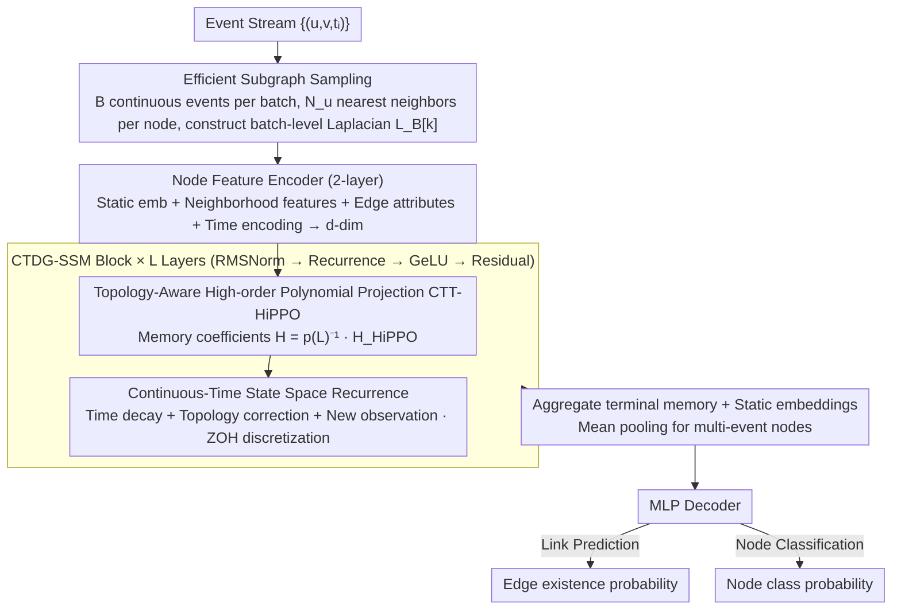

# Learning Long Range Spatio-Temporal Representations over Continuous Time Dynamic Graphs with State Space Models

**Conference**: ICML 2026  
**arXiv**: [2606.04672](https://arxiv.org/abs/2606.04672)  
**Code**: TBD  
**Area**: Time Series / Graph Learning / Dynamic Graphs  
**Keywords**: Continuous-Time Dynamic Graphs (CTDG), State Space Models (SSM), Long-Range Dependency, Spatio-Temporal Representation Learning

## TL;DR
CTDG-SSM introduces a **Topology-aware HiPPO projection** and State Space Models to simultaneously capture multi-hop Long-Range Spatial (LRS) and Long-Range Temporal (LRT) dependencies in dynamic graphs. It outperforms Prev. SOTA in link prediction and node classification while using only 1/10 of the parameters of competing methods.

## Background & Motivation

**Background**: Continuous-Time Dynamic Graphs (CTDG) provide a powerful framework for modeling evolving relational data. Existing methods primarily fall into two categories: event-driven models (TGAT, TGN), which are computationally efficient but struggle to retain history over long timescales (weak LRT), and sequence model variants (DyGFormer, DyGmamba), which capture LRT but restrict attention to 1-hop neighborhoods during preprocessing, losing multi-hop global spatial structure (weak LRS).

**Limitations of Prior Work**: No existing method simultaneously maintains LRS and LRT, which is critical in practical applications like financial fraud detection (money laundering often propagates through long transaction chains rather than isolated local interactions).

**Key Challenge**: The "Spatio-Temporal Trade-off" dilemma—either breaking the graph structure to capture LRT or limiting the temporal receptive field to utilize the graph structure.

**Goal**: To develop a unified spatio-temporal state space framework that compresses historical event information into a compact memory (LRT) while aggregating multi-hop neighborhood information via graph polynomial filters (LRS).

**Key Insight**: Extending the classical HiPPO (High-order Polynomial Projection Operator) to graph data. The key observation is that by projecting classical HiPPO coefficients onto the inverse of a Laplacian matrix polynomial, one can obtain a State Space Model that encodes both temporal and topological dynamics.

**Core Idea**: A Topology-aware High-order Polynomial Projection (CTT-HiPPO) replaces simple sequence memory mechanisms. Memory coefficients are constrained by both temporal evolution and graph structure, with efficient computation achieved via Zero-Order Hold (ZOH) discretization.

## Method

### Overall Architecture
CTDG-SSM aims to resolve the "either-or" dilemma between spatial and temporal dependencies in dynamic graphs. The approach integrates graph topology directly into the memory mechanism of the State Space Model, allowing a single recurrence to compress history (LRT) and aggregate multi-hop neighborhoods (LRS) simultaneously. When an event stream $\{(u,v,t_i)\}$ arrives, batch-level subgraph sampling is performed (constructing a Laplacian matrix $L_B[k]$ and sampling $N_u$ nearest neighbors per node). Node static embeddings, dynamic neighborhood features, edge attributes, and time encodings are projected into a $d$-dimensional latent space via a 2-layer encoder. Data then passes through multiple CTDG-SSM blocks (each containing RMSNorm → CTDG-SSM recurrence → GeLU → Residual, following a Mamba-style architecture), where Topology-aware Projection (Design 1) and State Space Recurrence (Design 2) are embedded. Finally, the last-layer hidden state and static embeddings are aggregated and passed through an MLP decoder to output link prediction scores or node classification probabilities.

### Key Designs

**1. Topology-Aware High-Order Polynomial Projection (CTT-HiPPO): Governing memory coefficients by both time and topology**

Classic HiPPO optimally compresses time series into compact memory but ignores graph structures; using it directly loses multi-hop spatial information. CTDG-SSM models the $i$-th dimension node feature $X_{:,i}(t)$ over a time window $[0,\tau]$ as $X_{:,i}(t) = p(L_\tau)H_\tau^{(i)}g(t) + r_i(t)$, where $g(t)$ represents orthogonal polynomial bases and $p(L_\tau)$ is a Laplacian matrix polynomial (graph filter). The first-order optimality condition yields $H_\tau^{(i)} = p(L_\tau)^{-1}H_\tau^{(i),\text{HiPPO}}$, which projects classical HiPPO coefficients through an inverse polynomial filter. This allows memory coefficients to inherit optimal temporal compression from HiPPO while being injected with graph topological constraints from $p(L_\tau)$. A $K$-order polynomial automatically aggregates $K$-hop neighborhoods, and as the graph evolves over time, the filter adjusts accordingly—making multi-hop aggregation a fundamental part of the memory itself rather than an external preprocessing step.

**2. Continuous-Time State Space Model (CTDG-SSM): Unifying "time decay" and "topological change" via ODE**

Static projection is insufficient as the memory coefficient $H_s$ evolves with both time and the graph. The authors prove it satisfies the differential equation $\frac{dH_s}{ds} = -\frac{H_s A^\top}{M(s)} - p(L_s)^{-1}\frac{dp(L_s)}{ds}H_s + \frac{p(L_s)^{-1}X(s)B^\top}{M(s)}$. The first term represents temporal memory decay, the second term is the correction for graph topological changes, and the third term integrates new observations. This unified evolution is discretized via Zero-Order Hold (ZOH), resulting in the computable recurrence $H[k+1] = \bar{A}_{L[k]}H[k]\bar{A} + \bar{B}(L[k],X[k])$. This unified form elegantly degenerates: when $p(L_\tau)=I$ (no graph), it becomes a classical SSM; when the graph structure is fixed, it becomes a piecewise-constant SSM. Thus, "graph + time" are not two separate pipelines but two components of the same dynamics.

**3. Efficient Discrete Implementation + Robustness Guarantees: Reducing overhead and ensuring stability**

Event stream graphs can be large and noisy, making dense Laplacian computations expensive and fragile. CTDG-SSM utilizes batch-level subgraph sampling to restrict operations to an $N_B \times N_B$ scale, combined with Residual connections and RMSNorm for training stability. Theoretically, the method proves that when the Laplacian matrix is perturbed by $\|\Delta L\|_2 \leq \epsilon$, the relative error of CTT-HiPPO coefficients is linearly bounded by $\epsilon$ (first-order), ensuring node permutation equivariance. The former allows for the simultaneous benefit of multi-hop information and manageable computational complexity, while the latter provides the engineering foundation to maintain stability under real-world graph noise, even with only 1/10 of the parameters of competing methods.

## Key Experimental Results

### Main Results (Dynamic Link Prediction, AUC ROC)

| Dataset | JODIE | TGN | DyGmamba | **CTDG-SSM** |
| :--- | :--- | :--- | :--- | :--- |
| LastFM | 70.89 | 76.64 | 93.31 | **93.79** |
| Enron | 87.77 | 88.72 | 93.34 | **94.98** |
| MOOC | 84.50 | 91.91 | 89.58 | **99.00** |
| Reddit | 98.29 | 98.61 | 99.27 | **99.48** |
| **Avg. Rank** | 7.93 | 4.57 | 2.00 | **1.86** |

CTDG-SSM leads significantly on LRT benchmarks (LastFM, MOOC, Enron), with a 9.4% relative gain over DyGmamba on the MOOC dataset.

### Ablation Study (Sequence Classification, LRD Test)

| Variant | n=3 | n=9 | n=15 | n=20 | Average |
| :--- | :--- | :--- | :--- | :--- | :--- |
| TU-SSM (No Topology) | 47.0 | 50.7 | 52.3 | 54.5 | 51.1% |
| CTDG-SSM (FO, 1st order) | 100.0 | 97.1 | 97.4 | 97.1 | 97.9% |
| **CTDG-SSM (SO, 2nd order)** | **100.0** | **98.1** | **97.8** | **98.6** | **98.6%** |

### Key Findings
- **Efficiency Comparison**: 
    - Parameters: 1/10× compared to DyGmamba.
    - Training Speed (LastFM): 6.4× faster (4.45 min vs 28.45 min per epoch).
    - GPU Memory: ~3.6× less (1.15 GB vs 4.17 GB).
- Removing the topological term (TU-SSM) causes performance to drop from 98% to 51%, confirming the critical role of structured memory updates.
- Second-order polynomials show significant improvement over first-order on long sequences (e.g., $n=20$ improved from 97.13% to 98.60%).

## Highlights & Insights
- **Theoretical Depth**: Deriving a topology-aware variant from classical HiPPO elegantly injects graph filtering into temporal memory; the derivation is more principled than heuristic designs.
- **Unified Spatio-Temporal Framework**: Rather than a "time then space" pipeline, the two are naturally coupled within memory dynamics via a single differential equation.
- **Parameter Efficiency**: Achieving SOTA using only polynomial filter coefficients and state transition matrices provides real value for model compression and edge deployment.
- **Transferable Design**: The CTT-HiPPO concept (projection via inverse filters) can be generalized to other tasks requiring joint spatio-temporal modeling.

## Limitations & Future Work
- Subgraph sampling strategy is fixed ($N_u$ nearest neighbors); future work could explore learnable sampling.
- The Zero-Order Hold assumption may be imprecise for high-frequency graph changes; higher-order discretization could be explored.
- Lack of interpretability—visual analysis of "what the learned filters represent" is missing.
- Scenarios with extreme variance in event time intervals (sparse sensor data + bursts) were not covered.

## Related Work & Insights
- **vs. DyGmamba**: The latter only captures LRT with limited structural awareness; CTDG-SSM captures both LRS and LRT via the topological term.
- **vs. GraphSSM**: Designed for discrete graphs with fixed structures; CTDG-SSM adapts to continuous event streams and dynamic topologies.
- **vs. Transformer variants (DyGFormer)**: These use attention but are limited to 1-hop; CTDG-SSM performs implicit multi-hop aggregation via graph filters with lower computational cost.

## Rating
- Novelty: ⭐⭐⭐⭐⭐ First to unify LRT and LRS from a State Space perspective with rigorous theoretical derivation.
- Experimental Thoroughness: ⭐⭐⭐⭐ Extensively validated across three task types with deep ablation and efficiency comparisons; interpretability could be improved.
- Writing Quality: ⭐⭐⭐⭐⭐ Clear logic, rigorous mathematics, and a complete closed loop from motivation to theory to experiment.
- Value: ⭐⭐⭐⭐⭐ Solves important CTDG modeling problems; parameter efficiency is valuable for deployment, and the theory is highly transferable.

<!-- RELATED:START -->

## Related Papers

- [\[ICML 2026\] FRACTAL: State Space Model with Fractional Recurrent Architecture for Computational Temporal Analysis of Long Sequences](fractal_ssm_with_fractional_recurrent_architecture_for_computational_temporal_an.md)
- [\[ICML 2026\] HiPPO Zoo: Explicit Memory Mechanisms for Interpretable State Space Models](hippo_zoo_explicit_memory_mechanisms_for_interpretable_state_space_models.md)
- [\[ICML 2026\] Nested Spatio-Temporal Time Series Forecasting](nested_spatio-temporal_time_series_forecasting.md)
- [\[NeurIPS 2025\] WaLRUS: Wavelets for Long-range Representation Using SSMs](../../NeurIPS2025/time_series/walrus_wavelets_for_long-range_representation_using_ssms.md)
- [\[NeurIPS 2025\] Structured Sparse Transition Matrices to Enable State Tracking in State-Space Models](../../NeurIPS2025/time_series/structured_sparse_transition_matrices_to_enable_state_tracking_in_state-space_mo.md)

<!-- RELATED:END -->
