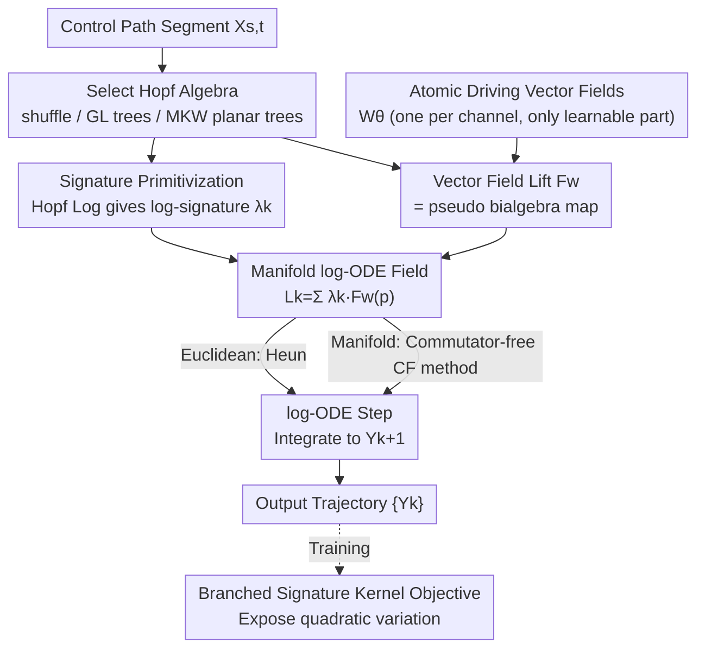

# Learning Manifold and Itô Dynamics with Branched Neural Rough Differential Equations

**Conference**: ICML2026  
**arXiv**: [2606.05272](https://arxiv.org/abs/2606.05272)  
**Code**: Roughrax (JAX package, released by the authors)  
**Area**: Time Series / Continuous-time Dynamics Modeling  
**Keywords**: Neural Rough Differential Equations, Branched Rough Paths, Itô Calculus, Manifold Dynamics, Signature Kernels

## TL;DR
Neural Rough Differential Equations (NRDE) can only handle Stratonovich dynamics due to their reliance on shuffle algebra. This paper replaces the log-ODE step of NRDE with **geometric numerical integration on Hopf algebras**: using Grossman–Larson rooted tree algebra for Euclidean Itô, Munthe–Kaas–Wright planar rooted tree algebra for ordered covariant derivatives on manifolds, and reserving shuffle algebra for classical Stratonovich. This generalizes signature methods to Itô and manifold-valued dynamics for the first time, complemented by a branched signature kernel objective that makes quadratic variation terms visible during training.

## Background & Motivation

**Background**: Learning continuous-time dynamics from time series is a fundamental problem in machine learning (robotics, molecular dynamics, quantitative finance). Neural Controlled Differential Equations (NCDE) parameterize the vector field of a controlled differential equation with a neural network, evolving a hidden state $h_t$ along a control path $X$: $h_t=h_{t_0}+\int_{t_0}^t g_\theta(h_s)\,\mathrm{d}X_s$. However, NCDEs are computationally expensive for long sequences. **Neural Rough Differential Equations (NRDE)** accelerate this via the log-ODE method: over each coarse window $I_j=[t_j,t_{j+1}]$, the finely sampled path $X$ is summarized by its **log-signature** (logarithm of iterated integrals) $\lambda_j$. The hidden state then advances over the coarse interval according to an autonomous ODE with coefficients determined by $\lambda_j$, allowing for significantly larger step sizes and fewer integration steps than standard neural ODEs.

**Limitations of Prior Work**: The efficiency of NRDE inherently relies on **shuffle algebra**, which is the algebraic counterpart of Stratonovich calculus. Stratonovich integrals preserve the standard chain rule, meaning products of iterated integrals satisfy the shuffle identity $e_i \shuffle e_j = e_i\otimes e_j + e_j\otimes e_i$. However, this dependency means NRDE **cannot expose the quadratic variation terms** required for Itô dynamics, nor can it express the ordered covariant derivatives needed for Itô flows on equipped manifolds.

**Key Challenge**: Many critical real-world scenarios are non-Stratonovich. ① **Euclidean Itô**: The Itô product rule includes a quadratic variation correction $X_{s,t}^{(i)}X_{s,t}^{(j)}=\int X^{(i)}\mathrm{d}X^{(j)}+\int X^{(j)}\mathrm{d}X^{(i)}+\langle X^{(i)},X^{(j)}\rangle_{s,t}$. This $\langle\cdot,\cdot\rangle$ term is not an independent second-order coordinate in the original $d$-dimensional word coordinates and can only be represented indirectly via lead-lag augmented paths (doubling the channel dimension). In finance, non-anticipative Itô modeling is essential to avoid look-ahead bias. ② **Manifold Itô**: Itô integrals on manifolds are defined relative to a connection $\nabla$, and their expansions involve high-order covariant derivatives. These operators generally do not commute ($\nabla_U\nabla_V\neq\nabla_V\nabla_U$), and shuffle algebra would erroneously "symmetrize away" their ordered, branched combinations via shuffle relations.

**Goal**: To create a unified framework capable of learning dynamics using the log-ODE method under **Itô integration** and on **manifolds**, strictly adhering to the geometric and causal constraints of each domain.

**Key Insight**: Replace the driving algebra—lift control paths not to the shuffle tensor algebra, but to the **Hopf algebra of rooted trees**: using the Grossman–Larson algebra $\mathcal{H}_{\text{GL}}$ for Euclidean Itô and the Munthe–Kaas–Wright algebra $\mathcal{H}_{\text{MKW}}$ for manifolds. Rooted trees naturally provide second-order/ordered coordinates that word coordinates cannot.

**Core Idea**: "Match the driving algebra to the governing calculus"—reinterpreting the log-ODE step of NRDE as **geometric numerical integration on the state-space manifold**. Tree bases represent Itô-type iterated integrals, while planar trees fix the left-to-right order of children to index ordered covariant derivatives. A pseudo bialgebra map converts algebraic elements into learned vector fields and differential operators on the manifold.

## Method

### Overall Architecture

B-NRDE generalizes log-NCDE to non-Euclidean geometries by performing a "geometric log-ODE step" over each time window. Given a selected Hopf algebra $\mathcal{H}\in\{\mathcal{H}, \mathcal{H}_{\text{GL}}, \mathcal{H}_{\text{MKW}}\}$, a truncation depth $N$, and path segments, the $\mathcal{H}$-signature is computed offline and the Hopf logarithm is taken to obtain the log-signature $\lambda_k$ in the primitive basis. The model only learns a set of "atomic driving vector fields" $\mathcal{W}_\theta$ (one per driving channel). The log-ODE field indexed by the primitive basis is then deterministically generated from these atomic fields via a vector field lift. Finally, each local log-ODE $\dot Z_\tau=L_k(Z_\tau)$ is integrated over $\tau\in[0,1]$ to obtain the local update from $Y_k$ to $Y_{k+1}$. In the manifold case, this is implemented via homogeneous spaces: the network outputs frame/Lie algebra coordinates, and the numerical flow is applied via group actions, precisely satisfying manifold constraints at each solver sub-step and avoiding extrinsic projection errors.

### Key Designs

**1. Replacing shuffle algebra with Rooted Tree Hopf Algebras: Making space for quadratic variation and ordered covariant derivatives**

This is the algebraic foundation of the work. Three integral regimes are paired with three Hopf algebras: classical Stratonovich uses the tensor algebra $\mathcal{H}$ (where the product of dual coordinates is shuffle); Euclidean Itô uses the Grossman–Larson algebra $\mathcal{H}_{\text{GL}}$, whose rooted tree basis provides a (symmetric) second-order coordinate corresponding to quadratic variation. Thus, terms like $\langle X^{(i)},X^{(j)}\rangle$, which are hidden in shuffle representations, become explicit independent coordinates in tree coordinates. Manifold Itô uses the Munthe–Kaas–Wright algebra $\mathcal{H}_{\text{MKW}}$, defined on **planar rooted trees**—fixing the left-to-right order of child nodes to index ordered iterated covariant derivatives; non-planar trees would symmetrize this order, collapsing order-sensitive flow terms. In short: different calculi require different composition laws for iterated integrals, and the Hopf algebra product $\star$ carries these laws.

**2. Signature Primitivization: Using unified Hopf logs to compress signatures across three regimes**

The log-ODE method requires expressing the signature as primitive elements. For a segment's $\mathcal{H}$-signature $\mathbb{X}^{\mathcal{H}}_{s,t}$ (a group-like element), the Hopf logarithm yields the primitive element:

$$\log_{\mathcal{H}}(g)\coloneqq\sum_{n\geq1}\frac{(-1)^{n-1}}{n}(g-1)^{\star n}$$

The key is that the product $\star$ varies by algebra: in $\mathcal{H}$, $\star$ is tensor concatenation (dual to shuffle); in $\mathcal{H}_{\text{GL}}$ and $\mathcal{H}_{\text{MKW}}$, $\star$ is the **tree grafting product**. Consequently, the same Hopf log formula, by simply changing the definition of $\star$, produces log-signatures $\{\lambda_j\}$ unified across all three regimes without needing separate pipelines for each.

**3. Atomic Vector Fields + Pseudo Bialgebra Map Lift: Learning only d fields, generating the rest recursively**

The learnable part of B-NRDE is minimal—only $d$ atomic driving vector fields $W_\theta^{(i)}(z)\in T_z\mathcal{M}$ (one per channel) are learned. The large primitive-indexed log-ODE field **is not learned directly**. It is deterministically generated via the vector field lift $F_W:\mathcal{B}_{\mathcal{H}}^{\text{prim}}\to\Gamma(TM)$, which implements the pseudo bialgebra map to send basis elements to differential operators on the manifold. Specifically: shuffle primitive elements (Lyndon words) are reconstructed via Lie brackets $F_W([u,v])=[F_W(u),F_W(v)]$; tree primitive elements are reconstructed via multi-node covariant derivatives. For a colored rooted tree, leaves take $V_v=W^{(c(v))}$, internal nodes with $k$ ordered children take $V_v=\nabla^k_{V_{u_1},\dots,V_{u_k}}W^{c(v)}$, and the root value is $F_W(p)$. This computes "elementary differentials" (Eq. 5)—applying $k$-th order covariant derivatives to basis vector fields. These intrinsic operations are evaluated numerically using forward automatic differentiation (JVP).

**4. Manifold log-ODE Method (Homogeneous Space Implementation): Precise constraint satisfaction**

The window field is written as a linear combination of primitive coordinates $L_k(Y)=\sum_{p}\lambda_k^p F_W(p)(Y)$ (Eq. 8). In the Euclidean case, the normalized ODE $\dot Z_\tau=L_k(Z_\tau)$ is solved using the Heun method, and recovers log-NCDE when $\mathcal{H}=\mathcal{H}$. For manifolds, a homogeneous space implementation is used: if a Lie group $G$ acts on $\mathcal{M}$, the fundamental vector field of $\xi\in\mathfrak{g}$ is $\xi^\#(Y)=\frac{\mathrm{d}}{\mathrm{d}\epsilon}\big|_{\epsilon=0}\exp(\epsilon\xi)\cdot Y$. The primitive evaluator returns frame coordinates $\widehat F_W(p)(Y)\in\mathfrak{g}$, and the window ODE becomes $\dot Z_\tau=\widehat L_k(Z_\tau)^\#(Z_\tau)$, solved via **commutator-free (CF) methods** such as $\mathrm{CF\text{-}EES}(2,5)$. By applying constraints to the group action, every sub-step remains exactly on the manifold, avoiding projection errors.

**5. Branched Signature Kernel Objective: Making quadratic variation visible in training**

Geometric signature kernels $k_{\text{geo}}(x,y)=\langle\text{Sig}^N(x),\text{Sig}^N(y)\rangle$ measure similarity between stochastic processes and can be used to train neural SDEs via kernel scoring. However, existing implementations compute geometric (Stratonovich) signatures: paths observed on a grid are piecewise linear with zero quadratic variation, resulting in the **quadratic covariation not being treated as a driving coordinate**. B-NRDE defines a **branched signature kernel**: for drivers $\mathbf{X},\mathbf{Y}$ augmented with quadratic variation, $k_{\text{br}}^N(\mathbf{X},\mathbf{Y})=\langle\text{Sig}_{\mathcal{H}}^N(\mathbf{X}),\text{Sig}_{\mathcal{H}}^N(\mathbf{Y})\rangle_{\mathcal{H}_{\leq N}}$, with a corresponding score objective $\mathcal{L}_{\text{br}}(\theta)$. By supplying ground-truth brackets from a simulator rather than reconstructing them from realized variation (which is noisy at order $\sqrt{\Delta_n}$), finite grid error is minimized.

### Loss & Training

A unified signature kernel score objective is used for law matching: $\mathcal{L}_{\text{geo}}$ for log-NCDE/NRDE, and $\mathcal{L}_{\text{br}}$ for B-NRDE. In the rBergomi experiment, B-NRDE is fine-tuned with the branched kernel for 3 epochs after initial $\mathcal{L}_{\text{geo}}$ training to inject quadratic variation terms. For SO(3) deterministic prediction, a Frobenius norm over the full window $\min_\theta\sum_j\|\hat R_\theta(t_j)-R(t_j)\|_F^2$ is used for pre-training. The authors release **Roughrax**, a JAX package for branched rough paths and manifold RDE solvers.

## Key Experimental Results

Three domains are mapped to Hopf algebras matching their geometry and causality. Baselines include M-NODE, NCDE variants (linear/Hermite/SG interpolation), NRDE, log-NCDE, and discrete-time models like GRU, xLSTM, and stacked xLSTM.

### Main Results

| Task | Algebra | Metric | B-NRDE | Key Comparison |
|------|------|------|--------|----------|
| rBergomi Rough Volatility Generation (Euclidean Itô) | $\mathcal{H}_{\text{GL}}$ | KS ($\times10^{-2}$, 4 marginals) | Best in 3/4 (e.g., 128: 6.89, 256: 6.91) | Outperforms NRDE / log-NCDE |
| SO(3) Sim-to-Real Rotation Prediction (Manifold Stratonovich) | $\mathcal{H}$ | RGE (deg) | Stat. 3.23 / Trans. 3.70 / Uncon. 3.33 | SG-NCDE slightly lower (2.93), but B-NRDE uses 2 vs 20 steps |
| SPD Covariance Itô Dynamics (Manifold Itô) | $\mathcal{H}_{\text{MKW}}$ | $W_1$ ($\times10^{-2}$) | 256: 5.81 / 384: 6.28 / 512: 8.35 | 56.2% avg. improvement over Euclidean log-NCDE |

In rBergomi, standard signature methods require lead-lag (Hoff) augmentation to capture Itô integrals, doubling channel dimension $d\to2d$ and causing signature size to explode. B-NRDE's $\mathcal{H}_{\text{GL}}$ formulation naturally accommodates branched rough paths without augmentation.

### Ablation Study

| Config / Setting | Key Metric | Description |
|------|---------|------|
| B-NRDE (GK) vs (BK) on rBergomi | 512 horizon: GK 9.58 / BK 8.11 | Branched kernel (BK) is better on long horizons and faster (47s vs 233s) |
| B-NRDE vs SG-NCDE on SO(3) | RGE 3.23 vs 2.93 at 2 vs 20 steps | Comparable accuracy with 1/10th the solver steps; supports rough drivers |
| GK vs BK on SPD | $W_1$ nearly identical | Branched kernel shows no significant advantage in this specific high-precision setting |
| log-NCDE (Eucl.) vs B-NRDE (Manifold) on SPD | Avg. 56.2% improvement | Gains from law matching combined with manifold constraints |

### Key Findings
- **Algebraic Matching Yields Gains**: Euclidean Itô via $\mathcal{H}_{\text{GL}}$ surpasses Stratonovich-based NRDE/log-NCDE on rBergomi; manifold Itô via $\mathcal{H}_{\text{MKW}}$ improves over Euclidean log-NCDE by 56.2% on average.
- **Extreme Efficiency with Coarse Steps**: On SO(3), B-NRDE approximates SG-NCDE accuracy with only 2 solver steps vs. 20. Permitting rough drivers allows using non-smooth extrapolators like MLPs, removing $C^1$ interpolation constraints.
- **Branched Kernels are Task-Dependent**: BK is significantly better and faster for rough volatility on long horizons, but offers no gain on SPD, suggesting the benefit depends on whether the task truly requires exposing quadratic variation.
- **Signature Limitations Persist**: Fitting near the initial condition on SPD remains challenging due to the known signature property of being invariant under starting point translations without augmentation.

## Highlights & Insights
- **"Change the Algebra, Not the Network"**: Tracing the acceleration of log-ODE methods to their algebraic root (shuffle=Stratonovich) and swapping the Hopf algebra to support Itô and manifolds is theoretically elegant—the same $\log_{\mathcal{H}}$ formula covers three regimes just by changing the product $\star$.
- **Learning $d$ Atomic Fields**: Minimizing learnable parameters and leaving the combinatorial structure to deterministic algebraic expansion ensures geometric/causal consistency—a prime example of embedding inductive bias into mathematical structure.
- **Homogeneous Spaces + Commutator-Free Solvers**: Using group actions to stay precisely on the manifold avoids the messiness of extrinsic projection/retraction.
- **Branched Signature Kernels**: Identifying that geometric kernels are "blind" to quadratic variation on finite grids and solving it with branched signatures provides a deep diagnosis of law-matching for SDEs.

## Limitations & Future Work
- **Explicit Truncation**: Unlike geometric kernels which have un-truncated PDE solvers, branched signature kernels require explicit truncation, with memory/compute scaling poorly ($d^2$) for high-dimensional states.
- **Lack of Compact Projections**: While geometric log-signatures can be projected onto a basis of Lyndon words, a similar compact projection for branched Hopf algebras is not yet known, leading to larger log-signatures.
- **Initial Condition Fitting**: Lower fidelity near $t=0$ on SPD data is an inherent signature limitation; path augmentation might be required.
- **Future Work**: The development of PDE-based solvers for branched kernels or adaptive log-ODE schemes; extending "planar branching" to regularity structures and SPDEs for $\mathbb{R}^d\to\mathcal{M}$ neural models.

## Related Work & Insights
- **vs NRDE / log-NCDE (Morrill 2021 / Walker 2024)**: These use geometric (Stratonovich) signatures and shuffle algebra; B-NRDE generalizes this to Itô and manifolds, strictly recovering log-NCDE when using shuffle algebra.
- **vs lead-lag (Hoff) Augmentation**: Traditionally, capturing Itô integrals with geometric signatures meant $d\to2d$ augmentation; $\mathcal{H}_{\text{GL}}$ exposes variation in tree coordinates without doubling channels.
- **vs Manifold Neural ODEs (M-NODE etc.)**: M-NODE errors on SO(3) are substantially higher (RGE > 100); B-NRDE uses the coarse-step advantage of signatures to be faster and more accurate on manifolds.
- **vs Geometric Signature Kernels (Issa 2023 etc.)**: Their kernels are Stratonovich-based; the branched signature kernel incorporates bracket coordinates for Itô-consistent law matching.

## Rating
- Novelty: ⭐⭐⭐⭐⭐ First use of Grossman–Larson / Munthe–Kaas–Wright Hopf algebras to generalize NRDE to Itô and manifolds.
- Experimental Thoroughness: ⭐⭐⭐⭐ Validated across three complementary domains, though SPD fitting near initial conditions is weak.
- Writing Quality: ⭐⭐⭐⭐ Algebraic motivation is clear, though Hopf algebra concepts present a high barrier for non-specialists.
- Value: ⭐⭐⭐⭐⭐ Bridges the gap for signature/rough path methods in Itô and manifold settings; releases Roughrax as a foundation for future work.

<!-- RELATED:START -->

## Related Papers

- [\[ICLR 2026\] Random Controlled Differential Equations](../../ICLR2026/time_series/random_controlled_differential_equations.md)
- [\[AAAI 2026\] AirDDE: Multifactor Neural Delay Differential Equations for Air Quality Forecasting](../../AAAI2026/time_series/airdde_multifactor_neural_delay_differential_equations_for_air_quality_forecasti.md)
- [\[NeurIPS 2025\] In-Context Learning of Stochastic Differential Equations with Foundation Inference Models](../../NeurIPS2025/time_series/in-context_learning_of_stochastic_differential_equations_with_foundation_inferen.md)
- [\[ICML 2026\] It's TIME: Towards the Next Generation of Time Series Forecasting Benchmarks](its_time_towards_the_next_generation_of_time_series_forecasting_benchmarks.md)
- [\[ICML 2026\] Time-series Forecasting Through the Lens of Dynamics](time-series_forecasting_through_the_lens_of_dynamics.md)

<!-- RELATED:END -->
