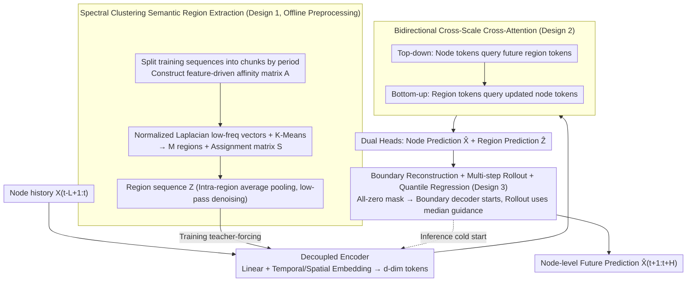

# Nested Spatio-Temporal Time Series Forecasting

**Conference**: ICML 2026  
**arXiv**: [2605.16447](https://arxiv.org/abs/2605.16447)  
**Code**: Not disclosed  
**Area**: Time Series
**Keywords**: Spatio-Temporal Forecasting, Spectral Clustering, Macro Guidance, Cross-Scale Attention, Autoregressive Rollout

## TL;DR
NeST utilizes "future macro-region trends" as top-down guidance, combined with semantic regions constructed via spectral clustering and bidirectional cross-scale attention, to achieve comprehensive improvements in accuracy, long-term stability, and near-linear complexity for node-level spatio-temporal forecasting on large-scale traffic networks.

## Background & Motivation
**Background**: Spatio-temporal forecasting (STF) is a branch of multivariate time series forecasting. Mainstream approaches organize sensors into graphs, using GNNs/Attention for spatial correlations and RNNs/TCNs for temporal correlations. This evolved from early DCRNN/STGCN with fixed topologies to GraphWaveNet/MTGNN/AGCRN with adaptive adjacency, and recently to DSTAGNN/STAEFormer/PatchSTG introducing dynamic time-varying graphs and attention.

**Limitations of Prior Work**: As graph scales increase (thousands of sensors), fine-grained full-graph modeling easily learns spurious correlations and becomes highly sensitive to local noise, missing values, and short-term anomalies. Autoregressive long-term forecasting also suffers from error accumulation. Existing hierarchical methods (HGCN, HiSTGNN, HSDGNN, etc.) introduce regional abstractions but only treat coarse-grained signals as historical auxiliary inputs, failing to address how future uncertainty is constrained by macro structures.

**Key Challenge**: Single-scale microscopic modeling in high-dimensional noisy scenarios is both inefficient and unstable; existing hierarchical frameworks use only historical macro information and cannot provide structural anchors for future trajectories.

**Goal**: (i) Unsupervised construction of regional representations semantically consistent with the future; (ii) explicit reverse guidance of node-level predictions by region-level "future trends"; (iii) maintaining stability and controllable complexity of this guidance during autoregressive rollout.

**Key Insight**: The authors observe that if a "future macro-state" is predicted first and then used to guide fine-grained node prediction, the abstract future context acts as a top-down regularization, similar to "drawing the outline before filling in the details." The key problem becomes ensuring macro representations are both high-fidelity and topologically/semantically aligned with the microscopic structure.

**Core Idea**: Construct semantically consistent regions using spectral clustering, predict future region-level trajectories as macro guidance, and use bidirectional cross-attention to constrain node-level predictions, forming a nested coarse-to-fine autoregressive framework.

## Method

### Overall Architecture
NeST handles patch-wise autoregressive prediction tasks for $N$ sensors, a history window $L$, a target horizon $H$, and a patch length $P$. The process consists of three steps:

1.  **Offline Preprocessing**: Construct a feature-driven affinity matrix $\mathbf{A}\in\mathbb{R}^{N\times N}$ from training sequences, perform spectral clustering to obtain $M$ regions ($M<N$, set to $M=0.2N$ in experiments) and an assignment matrix $\mathbf{S}\in\{0,1\}^{N\times M}$. Region-level sequences $\mathbf{Z}_{t,m}$ are obtained via intra-region average pooling.
2.  **Training Phase**: Node history $\mathbf{X}_{t-L+1:t}$ and region future $\mathbf{Z}_{t+1:t+P}$ are projected into $d$-dimensional tokens via decoupled Linear+TE+SE layers. Bidirectional cross-attention allows node tokens to query future region tokens (top-down) and region tokens to query updated node tokens (bottom-up). Two heads simultaneously output $\hat{\mathbf{X}}_{t+1:t+P}$ and $\hat{\mathbf{Z}}_{t+P+1:t+2P}$.
3.  **Inference Phase**: Since future $\mathbf{Z}$ is invisible, a boundary decoder first reconstructs $\hat{\mathbf{Z}}_{t+1:t+P}$ from all-zero mask tokens as initial guidance, followed by multi-step rollout.

### Key Designs

**1. Spectral Clustering-based Semantic Region Extraction & SNR Guarantees: Compressing Noisy Nodes into Reliable Structural Anchors**

Fine-grained full-graph modeling of thousands of sensors easily learns spurious correlations and is sensitive to local noise. Thus, the system needs stable macro anchors. NeST constructs regions using feature-driven methods rather than physical distance or static topology. Training sequences are split into $\tilde{T}$ non-overlapping chunks. An affinity matrix $\mathbf{A}_{ij}=\exp(-\frac{1}{2\sigma^2\tilde{T}}\sum_k \|\mathbf{X}_i^{(k)}-\mathbf{X}_j^{(k)}\|_2^2)$ emphasizes long-term evolution. Using the normalized Laplacian $\mathbf{L}_{\text{sym}}=\mathbf{I}-\mathbf{D}^{-1/2}\mathbf{A}\mathbf{D}^{-1/2}$, low-frequency eigenvectors are fed into K-Means to obtain the assignment matrix $\mathbf{S}$. The region representation is $\mathbf{Z}_{t,m}=\sum_i S_{i,m}\mathbf{X}_{t,i}/\sum_i S_{i,m}$. Theorem 1 provides the mathematical basis: if the intra-cluster actual signal correlation is $\rho_m$, then $\text{SNR}(\mathbf{Z}_m)\ge[1+(|\mathcal{C}_m|-1)\rho_m]\cdot\overline{\text{SNR}}_m$. Positively correlated aggregation acts as a low-pass filter, suppressing local high-frequency noise and preserving regional trends.

**2. Bidirectional Cross-Scale Cross-Attention: Regulating Node Predictions with Future Macro Trends**

Historical fine-grained dynamics and future coarse-grained trends must be coupled. NeST performs two-step bidirectional interaction: First, top-down, node tokens query future region tokens, $\tilde{\mathbf{H}}_x=\text{Attn}(\mathbf{H}_x^{\text{past}},\mathbf{H}_z^{\text{fut}},\mathbf{H}_z^{\text{fut}})$, allowing node representations to absorb macro trends. Second, bottom-up, updated nodes refine region tokens, $\tilde{\mathbf{H}}_z=\text{Attn}(\mathbf{H}_z^{\text{fut}},\tilde{\mathbf{H}}_x,\tilde{\mathbf{H}}_x)$, anchoring macro guidance back to the latest fine-grained context. Since the query targets are $M$ regions instead of $N$ nodes, the complexity is reduced from $\mathcal{O}(lN^2 d)$ to $\mathcal{O}(lNMd)$, which is near-linear when $M<N$.

**3. Boundary Reconstruction + Multi-step Rollout + Quantile Regression: Bridging Training-Inference Gap and Robustness to Guidance Error**

During training, future region tokens are visible (teacher forcing), but they are invisible during inference. NeST addresses this exposure bias in three ways: (i) Scheduled sampling during training ($P_{\text{tf}}$ probability for GT tokens, $1-P_{\text{tf}}$ for rolled-out $\hat{\mathbf{Z}}$); (ii) a boundary decoder $\hat{\mathbf{Z}}_{t+1:t+P}=\text{Proj}_{\text{bd}}(\text{Attn}(\mathbf{H}_z^{\text{zeros}},\tilde{\mathbf{H}}_x,\tilde{\mathbf{H}}_x))$ to provide a macro starting point; (iii) the region head uses quantile regression to estimate conditional quantiles $\{\tau_q\}_{q=1}^Q$, taking the median $\tau=0.5$ for guidance during inference to increase robustness against guidance errors.

### Loss & Training
End-to-end multi-task training uses $\mathcal{L}=\mathcal{L}_x+\lambda_1\mathcal{L}_z+\lambda_2\mathcal{L}_{\text{bd}}$, comprising node-level prediction loss $\mathcal{L}_x$, region-level multi-quantile pinball loss $\mathcal{L}_z$, and boundary reconstruction loss $\mathcal{L}_{\text{bd}}$. Lookback $L=12$, horizon $H=12$, with patch length $P$ for autoregressive generation. $\tilde{T}$ is aligned with data cycles, and $M=0.2N$ is optimal.

## Key Experimental Results

### Main Results
Evaluation on GBA, GLA, and CA large-scale traffic datasets from the LargeST benchmark (thousands to over ten thousand nodes).

| Dataset | Metric | NeST | PatchSTG (Prev. SOTA) | Gain |
| :--- | :--- | :--- | :--- | :--- |
| GBA (Avg horizon 12) | MAE | 18.73 | 19.50 | 3.95% |
| GBA | MAPE | 12.90% | 14.64% | 11.88% |
| GLA (Avg) | MAE | 17.89 | 18.96 | 5.65% |
| GLA | MAPE | 10.74% | 11.44% | 6.14% |
| CA (Avg) | MAE | 16.54 | 17.35 | 4.69% |
| CA | MAPE | 11.28% | 12.79% | 11.78% |

Average across three datasets: MAE +4.71%, RMSE +4.41%, MAPE +9.34%. For long-horizon forecasts (48 steps / 12h rollout) on GLA, the MAE gap between NeST and PatchSTG widened from 2.0 at step 16 to 2.4 at step 48, proving the effectiveness of macro guidance for long-term stability.

### Ablation Study

| Configuration | GBA MAE | GBA RMSE | GLA MAE | Description |
| :--- | :--- | :--- | :--- | :--- |
| NeST (Full) | **18.73** | **31.85** | **17.89** | Full model |
| w/o CA | 19.76 | 34.11 | 19.00 | Remove cross-attention (most significant drop) |
| w/o FG | 19.64 | 32.89 | 18.85 | Replace future Z with historical Z |
| w/ KM | 18.93 | 32.33 | 18.39 | Use raw-feature K-Means instead of spectral |
| w/ RP | 19.07 | 32.47 | 18.46 | Random partitioning |
| w/ DA | 18.93 | 32.22 | 18.34 | Use static geographic distance for affinity |

### Key Findings
-   **Cross-attention is core**: Without it, the model degrades to a purely local predictor. Macro top-down regularization is a critical pillar.
-   **The "Future" aspect is vital**: Using only historical regions (w/o FG) leads to significant performance drops, showing the true delta is upgrading macro signals from "historical auxiliary" to "future guidance."
-   **Semantic > Geographic**: Spectral clustering outperforms both physical proximity and standard K-Means. Functionally similar nodes in traffic networks are often geographically distant.
-   **Efficiency**: Training time on GBA reduced from 185s to 75s/epoch (-59.5%), and inference from 32s to 20s (-37.5%).

## Highlights & Insights
-   **Paradigm shift**: Predicting future macro-states to guide micro-states is a novel approach compared to traditional hierarchical methods that treat coarse scales as auxiliary history.
-   **Theory-Empiricism Coupling**: Theorem 1 explains why intra-cluster average pooling acts as a low-pass filter, elevating spectral clustering from an empirical choice to a mathematically guaranteed denoising tool.
-   **Complexity reduction**: Converting $N \times N$ self-attention to $N \times M$ cross-attention keeps complexity near-linear, which is essential for large-scale graphs.
-   **Exposure bias solution**: The boundary decoder and scheduled sampling cleanly align training and inference distributions.

## Limitations & Future Work
-   **Limitations**: (i) $\mathcal{O}(N^2)$ complexity for preprocessing the affinity matrix; (ii) static clustering assumes time-invariant spatial correlation, failing to adapt to sudden accidents or control changes; (iii) autoregressive rollout is slower than direct multi-step prediction.
-   **Future Work**: Dynamic clustering (updating $\mathbf{S}$ over time), replacing the boundary decoder with a diffusion prior, and propagating quantile uncertainty back to node heads for risk-aware decoding.

## Related Work & Insights
-   **vs. PatchSTG**: While PatchSTG uses patching and spatial management for complexity reduction, NeST uses clustering and macro guidance. Combining the two is a natural next step.
-   **vs. HiSTGNN / HSDGNN**: Traditional hierarchical methods lack the "predict future macro then guide back" closed loop that NeST completes with boundary reconstruction and rollout.
-   **vs. iTransformer / MAGE**: Channel-independent time series models are strong competitors in non-traffic data; NeST maintains an advantage by explicitly utilizing spatial structures.

## Rating
-   Novelty: ⭐⭐⭐⭐ The "future macro prediction" as top-down guidance is a genuine paradigm delta.
-   Experimental Thoroughness: ⭐⭐⭐⭐ Covers large-scale traffic and non-traffic datasets with complete ablation and long-horizon tests.
-   Writing Quality: ⭐⭐⭐⭐ Smooth narrative connecting theory (SNR), intuition, and engineering.
-   Value: ⭐⭐⭐⭐ Significant improvements in accuracy and speed on large-scale traffic benches, providing high industrial value.

<!-- RELATED:START -->

## Related Papers

- [\[ICML 2026\] Learning Long Range Spatio-Temporal Representations over Continuous Time Dynamic Graphs with State Space Models](learning_long_range_spatio-temporal_representations_over_continuous_time_dynamic.md)
- [\[NeurIPS 2025\] Learning with Calibration: Exploring Test-Time Computing of Spatio-Temporal Forecasting](../../NeurIPS2025/time_series/learning_with_calibration_exploring_test-time_computing_of_spatio-temporal_forec.md)
- [\[ACL 2026\] STReasoner: Empowering LLMs for Spatio-Temporal Reasoning in Time Series via Spatial-Aware Reinforcement Learning](../../ACL2026/time_series/streasoner_empowering_llms_for_spatio-temporal_reasoning_in_time_series_via_spat.md)
- [\[ICML 2026\] Ellipsoidal Time Series Forecasting](ellipsoidal_time_series_forecasting.md)
- [\[NeurIPS 2025\] StRap: Spatio-Temporal Pattern Retrieval for Out-of-Distribution Generalization](../../NeurIPS2025/time_series/strap_spatio-temporal_pattern_retrieval_for_out-of-distribution_generalization.md)

<!-- RELATED:END -->
