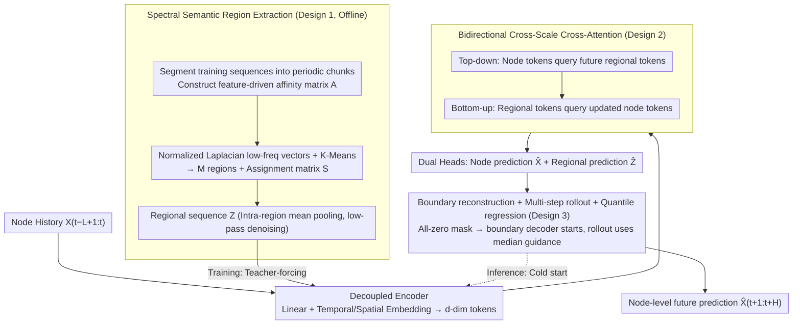

# Nested Spatio-Temporal Time Series Forecasting

**Conference**: ICML 2026  
**arXiv**: [2605.16447](https://arxiv.org/abs/2605.16447)  
**Code**: Not publicly available  
**Area**: Time Series  
**Keywords**: Spatio-temporal forecasting, spectral clustering, macro guidance, cross-scale attention, autoregressive rollout  

## TL;DR
NeST treats "future macro-region trends" as top-down guidance. Combined with semantic regions constructed via spectral clustering and bidirectional cross-scale cross-attention, it achieves comprehensive improvements in accuracy, long-range stability, and near-linear complexity for node-level spatio-temporal forecasting on large-scale traffic networks.

## Background & Motivation
**Background**: Spatio-temporal forecasting (STF) is a branch of multivariate time series forecasting. Mainstream approaches organize sensors into graphs, using GNNs/Attention to model spatial correlations and RNNs/TCNs for temporal correlations. Evolution ranges from early DCRNN/STGCN with fixed topologies to GraphWaveNet/MTGNN/AGCRN for adaptive adjacency, and recently DSTAGNN/STAEFormer/PatchSTG for dynamic time-varying graphs and attention.

**Limitations of Prior Work**: As graph scale grows (thousands of sensors), fine-grained full-graph modeling easily learns spurious correlations and is highly sensitive to local noise, missing values, and short-term anomalies. Autoregressive long-range forecasting also suffers from error accumulation. Existing hierarchical methods (HGCN, HiSTGNN, HSDGNN, etc.) introduce regional abstractions but treat coarse-grained signals only as historical auxiliary inputs, failing to address how "future uncertainty should be constrained by macro structures."

**Key Challenge**: Single-scale micro-historical modeling is both inefficient and unstable in high-dimensional noisy scenarios; existing hierarchical frameworks use only historical macro information and fail to provide structural anchors for future trajectories.

**Goal**: (i) Unsupervisedly construct regional representations consistent with future semantics from raw data; (ii) explicitly use regional-level "future trends" to back-guide node-level predictions; (iii) ensure this guidance remains stable and computationally controllable during autoregressive rollout.

**Key Insight**: The authors observe that predicting the "future macro state" first and then using it to guide fine-grained node prediction allows the abstract future context to act as a top-down regularization, similar to "outlining before filling in details." The core problem shifts to ensuring macro representations are both high-fidelity and topologically/semantically aligned with the micro-structure.

**Core Idea**: Use spectral clustering to construct semantically consistent regions, predict future regional trajectories as macro guidance, and inversely constrain node-level predictions through bidirectional cross-attention, forming a nested coarse-to-fine autoregressive framework.

## Method

### Overall Architecture
NeST handles patch-wise autoregressive prediction tasks with $N$ sensors, history window length $L$, target horizon $H$, and patch length $P$. The workflow consists of three steps:

1. **Offline Preprocessing**: Construct a feature-driven affinity matrix $\mathbf{A} \in \mathbb{R}^{N \times N}$ from training sequences. Perform spectral clustering to obtain $M$ regions ($M < N$, $M=0.2N$ in experiments) and an assignment matrix $\mathbf{S} \in \{0, 1\}^{N \times M}$. Regional sequences $\mathbf{Z}_{t,m}$ are produced via intra-region average pooling.
2. **Training Phase**: Node history $\mathbf{X}_{t-L+1:t}$ and regional future $\mathbf{Z}_{t+1:t+P}$ are projected into $d$-dimensional tokens via decoupled Linear+TE+SE layers. Bidirectional cross-attention allows node tokens to query future regional tokens (top-down), then regional tokens query updated node tokens (bottom-up). Two heads simultaneously output $\hat{\mathbf{X}}_{t+1:t+P}$ and $\hat{\mathbf{Z}}_{t+P+1:t+2P}$.
3. **Inference Phase**: Future $\mathbf{Z}$ is invisible. A boundary decoder first reconstructs $\hat{\mathbf{Z}}_{t+1:t+P}$ from all-zero mask tokens as an initial guide, followed by multi-step rollout.

### Key Designs

**1. Spectral Clustering based Semantic Region Extraction and SNR Theoretical Guarantee: Compressing Noisy Nodes into Reliable Structural Anchors**

Fine-grained full-graph modeling of thousands of sensors easily learns spurious correlations and is sensitive to local noise. The system requires stable macro anchors. NeST constructs regions based on features rather than physical distance: training sequences are split into $\tilde{T}$ non-overlapping chunks. Similarity is calculated as $\mathbf{A}_{ij}=\exp(-\frac{1}{2\sigma^2\tilde{T}}\sum_k \|\mathbf{X}_i^{(k)}-\mathbf{X}_j^{(k)}\|_2^2)$, emphasizing long-term evolution. Using the normalized Laplacian $\mathbf{L}_{\text{sym}}=\mathbf{I}-\mathbf{D}^{-1/2}\mathbf{A}\mathbf{D}^{-1/2}$, low-frequency eigenvectors are fed into K-Means to obtain the assignment matrix $\mathbf{S}$. Regional representation is $\mathbf{Z}_{t,m}=\sum_i S_{i,m}\mathbf{X}_{t,i}/\sum_i S_{i,m}$. Theorem 1 provides the theoretical guarantee: if the correlation of true signals within a cluster is $\rho_m$, then $\text{SNR}(\mathbf{Z}_m)\ge[1+(|\mathcal{C}_m|-1)\rho_m]\cdot\overline{\text{SNR}}_m$. Intra-cluster aggregation naturally acts as a low-pass filter, suppressing high-frequency noise while retaining regional trends.

**2. Bidirectional Cross-Scale Cross-Attention: Using Future Macro Trends to Regularize Node Prediction**

Historical dynamics and future macro trends must be coupled. NeST performs a two-step bidirectional interaction: first, top-down, where node tokens query future regional tokens $\tilde{\mathbf{H}}_x=\text{Attn}(\mathbf{H}_x^{\text{past}},\mathbf{H}_z^{\text{fut}},\mathbf{H}_z^{\text{fut}})$ to absorb macro trends; second, bottom-up, where updated nodes refine regional tokens $\tilde{\mathbf{H}}_z=\text{Attn}(\mathbf{H}_z^{\text{fut}},\tilde{\mathbf{H}}_x,\tilde{\mathbf{H}}_x)$ to anchor the guidance to fine-grained context. Since the query targets are $M$ regions instead of $N$ nodes, complexity is reduced from $\mathcal{O}(lN^2 d)$ to $\mathcal{O}(lNMd)$, resulting in near-linear scalability.

**3. Boundary Reconstruction + Multi-step Rollout + Quantile Regression: Bridging the Training-Inference Gap and Robustness to Guidance Errors**

To address exposure bias, NeST uses scheduled sampling, training with ground-truth regional tokens with probability $P_{\text{tf}}$ and self-generated $\hat{\mathbf{Z}}$ with $1-P_{\text{tf}}$. A boundary decoder $\hat{\mathbf{Z}}_{t+1:t+P}=\text{Proj}_{\text{bd}}(\text{Attn}(\mathbf{H}_z^{\text{zeros}},\tilde{\mathbf{H}}_x,\tilde{\mathbf{H}}_x))$ generates an initial macro anchor when future observations are absent. Furthermore, the regional head uses quantile regression to estimate $Q$ conditional quantiles; during inference, only the median $\tau=0.5$ is taken as guidance. This transforms macro guidance from point estimation to distribution estimation, enhancing robustness over long horizons (e.g., 12 hours).

### Loss & Training
End-to-end multi-task training with loss $\mathcal{L}=\mathcal{L}_x+\lambda_1\mathcal{L}_z+\lambda_2\mathcal{L}_{\text{bd}}$, consisting of node prediction loss $\mathcal{L}_x$, regional multi-quantile pinball loss $\mathcal{L}_z$, and boundary reconstruction loss $\mathcal{L}_{\text{bd}}$. Lookback $L=12$, horizon $H=12$, with patch length $P$.

## Key Experimental Results

### Main Results
Evaluated on GBA, GLA, and CA large-scale traffic datasets from the LargeST benchmark (thousands to over ten thousand nodes).

| Dataset | Metric | NeST | PatchSTG (Prev. SOTA) | Gain |
|--------|------|------|---------------------|----------|
| GBA (Avg horizon 12) | MAE | 18.73 | 19.50 | 3.95% |
| GBA | MAPE | 12.90% | 14.64% | 11.88% |
| GLA (Avg) | MAE | 17.89 | 18.96 | 5.65% |
| GLA | MAPE | 10.74% | 11.44% | 6.14% |
| CA (Avg) | MAE | 16.54 | 17.35 | 4.69% |
| CA | MAPE | 11.28% | 12.79% | 11.78% |

Average improvements across three datasets: MAE +4.71%, RMSE +4.41%, MAPE +9.34%. In long-horizon tests (48 steps), the MAE gap between NeST and PatchSTG widened from 2.0 at step 16 to 2.4 at step 48, proving the efficacy of macro guidance for long-range stability.

### Ablation Study

| Configuration | GBA MAE | GBA RMSE | GLA MAE | Description |
|------|---------|----------|---------|------|
| NeST (Full) | **18.73** | **31.85** | **17.89** | Full model |
| w/o CA | 19.76 | 34.11 | 19.00 | Remove cross-attention (largest drop: +1.04 MAE) |
| w/o FG | 19.64 | 32.89 | 18.85 | Use historical Z instead of future Z (+0.91 MAE) |
| w/ KM | 18.93 | 32.33 | 18.39 | Raw feature K-Means instead of spectral |
| w/ RP | 19.07 | 32.47 | 18.46 | Random partitioning |
| w/ DA | 18.93 | 32.22 | 18.34 | Static geographic distance affinity |

### Key Findings
- **Cross-attention is core**: Without it, the model degrades into a pure local predictor, confirming top-down macro regularization is a pillar of the architecture.
- **The "Future" aspect is vital**: Using only historical regional information (w/o FG) significantly degrades performance, showing that the shift from "historical auxiliary" to "future guidance" is the primary contribution.
- **Semantic > Geographic Clustering**: Geographic proximity performs better than random partitioning but is inferior to spectral clustering, suggesting functional similarity in large networks is often orthogonal to physical location.
- **Efficiency**: Training time on GBA reduced from 185s to 75s/epoch (-59.5%), and inference from 32s to 20s (-37.5%).

## Highlights & Insights
- **New Paradigm**: Predicting future macro states to guide micro predictions is a distinct departure from traditional hierarchical methods that treat coarse-grained data as auxiliary history.
- **Theory-Design Symmetrization**: Theorem 1 explains why intra-cluster average pooling serves as a low-pass filter, elevating the design from empirical choice to mathematically grounded denoising.
- **Linear Complexity for Large Graphs**: By replacing $N \times N$ self-attention with $N \times M$ cross-attention, the model effectively breaks the quadratic complexity barrier.
- **Exposure Bias Solution**: The combination of boundary decoding and scheduled sampling ensures distribution alignment between training and inference.

## Limitations & Future Work
- **Limitations**: (i) $\mathcal{O}(N^2)$ affinity matrix preprocessing is a bottleneck for $10^5+$ nodes; (ii) Global clustering assumes time-invariant spatial correlations, making it less adaptable to sudden topological changes (e.g., accidents); (iii) Exposure bias persists in the autoregressive rollout.
- **Future Work**: Implementing dynamic clustering ($S$ updates per window), replacing the boundary decoder with a diffusion prior, and incorporating quantile uncertainty into risk-aware node decoding.

## Related Work & Insights
- **vs PatchSTG**: While PatchSTG uses patching to manage complexity, NeST uses macro guidance. Combining the two is a natural progression.
- **vs HiSTGNN / HSDGNN**: Traditional hierarchical methods lack the "predict future macro then back-guide" closed loop that NeST establishes via boundary reconstruction.
- **vs iTransformer**: Channel-independent models are strong competitors in non-traffic domains; NeST’s advantage lies in explicitly utilizing spatial structures.

## Rating
- **Novelty**: ⭐⭐⭐⭐ Future macro prediction as top-down guidance is a genuine paradigm shift.
- **Experimental Thoroughness**: ⭐⭐⭐⭐ Covers large-scale traffic, non-traffic domains, long horizons, and runtime analysis.
- **Writing Quality**: ⭐⭐⭐⭐ Smooth transition between theory (SNR), intuition (low-pass), and engineering (boundary decoder).
- **Value**: ⭐⭐⭐⭐ High industrial value due to significant MAPE improvements and $>2\times$ faster training.

<!-- RELATED:START -->

## Related Papers

- [\[ICML 2026\] Learning Long Range Spatio-Temporal Representations over Continuous Time Dynamic Graphs with State Space Models](learning_long_range_spatio-temporal_representations_over_continuous_time_dynamic.md)
- [\[NeurIPS 2025\] Learning with Calibration: Exploring Test-Time Computing of Spatio-Temporal Forecasting](../../NeurIPS2025/time_series/learning_with_calibration_exploring_test-time_computing_of_spatio-temporal_forec.md)
- [\[ICLR 2026\] ASTGI: Adaptive Spatio-Temporal Graph Interactions for Irregular Multivariate Time Series Forecasting](../../ICLR2026/time_series/astgi_adaptive_spatio-temporal_graph_interactions_for_irregular_multivariate_tim.md)
- [\[ACL 2026\] STReasoner: Empowering LLMs for Spatio-Temporal Reasoning in Time Series via Spatial-Aware Reinforcement Learning](../../ACL2026/time_series/streasoner_empowering_llms_for_spatio-temporal_reasoning_in_time_series_via_spat.md)
- [\[ICML 2026\] Ellipsoidal Time Series Forecasting](ellipsoidal_time_series_forecasting.md)

<!-- RELATED:END -->
