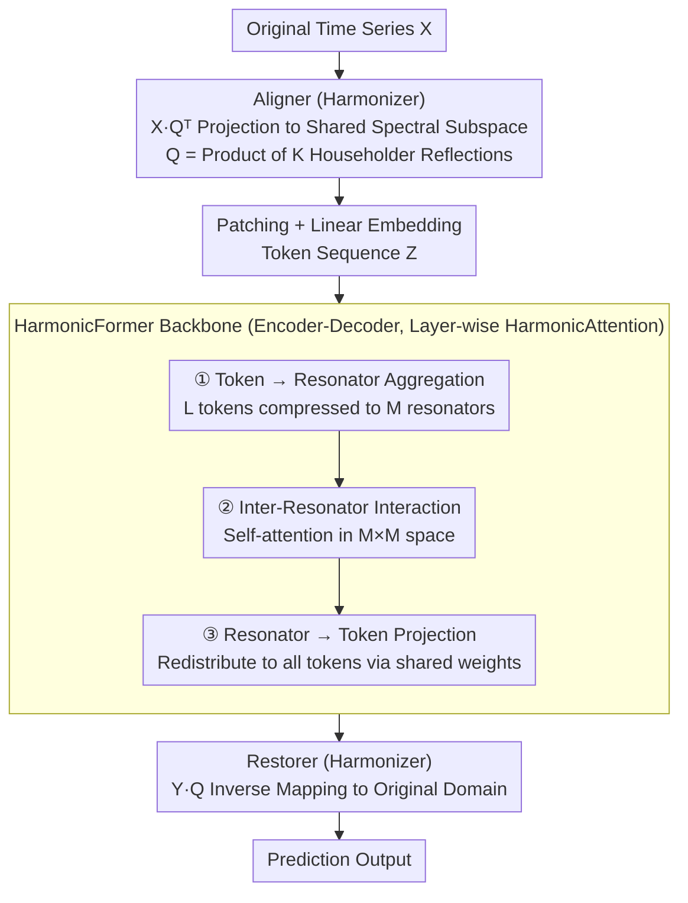

# OLIVIA: Harmonizing Time Series Foundation Models with Power Spectral Density

**Conference**: ICML 2026  
**arXiv**: [2605.17340](https://arxiv.org/abs/2605.17340)  
**Code**: TBD  
**Area**: Time Series / Foundation Models  
**Keywords**: Power Spectral Density, Time Series Foundation Models, Domain Adaptation, Attention Mechanism

## TL;DR
OLIVIA significantly improves the pre-training of time series foundation models on heterogeneous data by introducing Power Spectral Density (PSD) driven coordination mechanisms—Harmonizer (orthogonal second-order coordination based on Householder reflections) and HarmonicAttention (low-dimensional resonator interaction)—achieving SOTA across TSLib Zero-shot, GIFT-Eval, and GluonTS benchmarks.

## Background & Motivation

**Background**: Time series foundation models learn unified general representations through pre-training on large-scale multi-domain datasets—a paradigm proven effective in NLP and CV. However, existing models face severe challenges when handling heterogeneous time series.

**Limitations of Prior Work**: Time series from different domains exhibit significantly different temporal patterns (periodic structures, long-range dependencies). While this diversity is a prerequisite for learning broad temporal knowledge, it complicates pre-training: (1) Optimization level: Joint training on data with distinct temporal features often leads to slow convergence and sub-optimality; (2) Representation learning level: Models must simultaneously adapt to incompatible temporal structures, making it difficult to form a unified transferable representation.

**Key Challenge**: Existing foundation models achieve domain adaptation through architectural modularity or capacity specialization (Mixture of Experts, frequency-aware patching), but **do not explicitly resolve fundamental differences in temporal distributions**—specifically, diagnosing and harmonizing cross-domain spectral differences using the PSD concept from signal processing.

**Goal**: (1) Understand and quantify cross-domain temporal heterogeneity in a principled manner; (2) Efficiently achieve PSD consistency in large-scale pre-training without falling into direct, unstable divergence minimization.

**Key Insight**: Normalized PSD is a dataset-level descriptor that reflects the underlying second-order temporal correlation structure by capturing the distribution of temporal variations across frequencies. PSD is invariant to global temporal translation and relatively robust to local temporal misalignment, making it an ideal representation for comparing signals collected under heterogeneous conditions.

**Core Idea**: Reduce mismatch by harmonizing the PSD of each dataset in the spectral domain—reformulating from infeasible direct divergence minimization to a structural harmonization method based on **shared reparameterization of second-order temporal correlations**.

## Method

### Overall Architecture
The core problem OLIVIA addresses is that mixing multi-domain time series with varying periodicities and long-range dependencies during pre-training results in slow convergence and fragmented representations. The solution involves quantifying this heterogeneity as differences in normalized Power Spectral Density (PSD) and "harmonizing" them in the spectral domain. The pipeline follows an encoder-decoder structure: the original time series is first projected into a shared spectral space by the Aligner in the **Harmonizer**, aligning the second-order correlation structures of all datasets. The aligned representations are sent to the **HarmonicFormer** backbone for encoding and decoding, where standard attention is replaced by HarmonicAttention. Finally, the Restorer in the Harmonizer maps the results back to the original domain for prediction. Harmonizer handles "harmonization" while HarmonicFormer handles "efficient modeling," both unified by the theory of PSD consistency.

### Key Designs

**1. Harmonizer: Orthogonal Second-Order Coordination via Householder Reflections**

Directly minimizing the JS divergence between PSDs of datasets is unstable due to high gradient noise in large-scale pre-training. The authors use Proposition 1: there exists a shared orthogonal matrix $Q$ whose first $r$ columns span a subspace invariant to the second-order moment matrices of all datasets, equivalent to block-diagonalizing their respective covariance matrices. Thus, PSD harmonization is reformulated as a structural problem of "shared reparameterized second-order correlation." The Aligner projects input as $\mathcal{X} = X Q^\top$, where $Q$ is parameterized as a product of $K$ Householder reflections $Q = \prod_k H_k$, with $H_k = I - 2 V_k V_k^\top$. This ensures $Q$ remains on the orthogonal manifold during updates. The Restorer performs the inverse mapping $Y = \mathcal{Y} Q$. Orthogonality ensures energy conservation and no signal distortion, while the product of reflections stabilizes gradient flow, converting "hard-to-optimize PSD alignment" into "stably trainable subspace projection."

**2. HarmonicAttention: Linear Complexity via Resonator Bottlenecks**

Standard Transformer attention $\mathcal{O}(L^2 P)$ is prohibitive for long sequences. Based on Proposition 2, after Harmonizer alignment, the second-order moment matrix $\Sigma_\mathcal{X} = \text{diag}(\Lambda, \Phi)$ is block-diagonal, allowing the token Gram matrix to be decomposed into a dominant low-rank term and a bounded residual. HarmonicAttention introduces $M$ resonators ($M \ll L$) as intermediaries: (1) Aggregate tokens into resonators $R^{(h)} = (A^{(h)})^\top \tilde{Z}^{(h)}$; (2) Perform inter-resonator interaction $\text{ResAct}(R^{(h)}) = \text{Softmax}_{\text{res}}\big(R^{(h)} (R^{(h)})^\top / \sqrt{P}\big) R^{(h)}$; (3) Project back to all tokens $\text{Head}^{(h)} = A^{(h)} \text{ResAct}(R^{(h)})$. Global dependencies are passed through this resonator bottleneck, reducing complexity to $\mathcal{O}(L M P + M^2 P)$. Since resonators correspond to dominant energy modes in the shared subspace, this is a naturally aligned structural approximation rather than generic low-rank compression. The **HarmonicFormer** backbone stacks these layers. Different output heads are configured for various downstream tasks during pre-training and fine-tuning.

## Key Experimental Results

### Main Results (TSLib Zero-shot)

| Benchmark | Metric | Olivia | SEMPO | Time-MoE_B | Time-MoE_L | Moirai_B |
|-----------|--------|--------|-------|------------|------------|----------|
| ETTh1     | MSE    | **0.399** | 0.410 | 0.445      | 0.435      | 0.433    |
| ETTh1     | MAE    | **0.421** | 0.430 | 0.449      | 0.449      | 0.431    |
| Weather   | MSE    | **0.247** | 0.248 | 0.279      | 0.318      | 0.312    |
| Electricity| MSE    | **0.188** | 0.196 | —          | —          | 0.207    |

### Ablation Study

| Configuration        | ETTh1 MSE | Inference (s) | Model Size (M) |
|----------------------|-----------|---------------|----------------|
| **HarmonicAttention**| **0.399** | 43.051        | **5.1**        |
| w/o Harmonizer       | 0.472     | —             | —              |
| Full Attention       | 0.472     | —             | —              |
| Linear Attention     | 0.412     | —             | —              |
| Nyström Attention    | 0.488     | —             | —              |

### Key Findings
- Olivia achieves an average MSE reduction of 2.7% compared to SEMPO and 26.3% compared to the Time-MoE series on TSLib zero-shot.
- On GluonTS, it shows 11.6-32% NRMSE improvement over SEMPO and 86%+ over Time-MoE.
- Removing the Harmonizer significantly degrades MSE (0.399 → 0.472), validating the core value of PSD coordination.
- HarmonicAttention gains stem from structural matching with PSD-consistent representations rather than raw attention capacity.
- Olivia uses the fewest parameters (5.1M vs SEMPO's 6.5M and Time-MoE_B's 113M).

## Highlights & Insights
- **PSD as a Fundamental Diagnostic Tool**: Systematically introducing PSD into the heterogeneity diagnosis of foundation models is more actionable than generic "domain adaptation."
- **Elegant Transformation of Second-Order Structures**: Via Propositions 1/2, the seemingly unoptimizable PSD divergence problem is transformed into a block-diagonalization problem of second-order statistics, demonstrating how deep theoretical insight guides model design.
- **Reusable Low-dimensional Interaction Paradigm**: HarmonicAttention models global dependencies via a "resonator bottleneck," offering potential value for any domain requiring self-attention on long sequences.
- **Unification of Representation and Efficiency**: The model optimizes both simultaneously—Harmonizer improves representation learning, while HarmonicAttention improves computational efficiency.

## Limitations & Future Work
- Inference latency is slightly high (Householder reflections for orthogonal matrices introduce overhead: 43s vs SEMPO's 8s); more efficient orthogonal parameterizations (QR decomposition, Cayley transform) could be explored.
- The relationship between the number of resonators $M$ and the true signal rank $r$ is theoretically bounded, but practical alignment across diverse datasets requires further discussion.
- Applicability to heterogeneous downstream tasks like classification or anomaly detection remains to be verified.

## Related Work & Insights
- **vs SEMPO / Time-MoE / Moirai**: These use architectural modularity for generalization but lack explicit handling of fundamental cross-domain spectral differences; Olivia aligns these via PSD consistency constraints.
- **vs ROSE**: ROSE uses spectral masking to isolate domain-specific features; Olivia does the opposite—harmonizing datasets so domain-specific variations cluster in orthogonal complement subspaces.
- **vs General Low-rank Attention**: Linear / Nyström are generic approximations; HarmonicAttention's resonators are derived from PSD alignment principles, making them more sensitive to specific time series structures.

## Rating
- Novelty: ⭐⭐⭐⭐⭐ Systematically introduces PSD as a diagnostic tool for foundation model design; strong theoretical integration of HarmonicAttention and Harmonizer.
- Experimental Thoroughness: ⭐⭐⭐⭐⭐ Covers two large-scale benchmarks + 6 GluonTS datasets + comprehensive ablation + efficiency analysis with consistently significant results.
- Writing Quality: ⭐⭐⭐⭐ Clear architecture with well-argued correspondence between propositions and design; some minor details omitted.
- Value: ⭐⭐⭐⭐⭐ Provides a theory-driven breakthrough in the frontier of time series foundation models; PSD coordination ideas are transferable to other multi-source heterogeneous scenarios.

<!-- RELATED:START -->

## Related Papers

- [\[NeurIPS 2025\] Frequency Matters: When Time Series Foundation Models Fail Under Spectral Shift](../../NeurIPS2025/time_series/frequency_matters_when_time_series_foundation_models_fail_under_spectral_shift.md)
- [\[ICML 2026\] FactoryNet: A Large-Scale Dataset toward Industrial Time-Series Foundation Models](factorynet_a_large-scale_dataset_toward_industrial_time-series_foundation_models.md)
- [\[NeurIPS 2025\] How Foundational are Foundation Models for Time Series Forecasting?](../../NeurIPS2025/time_series/how_foundational_are_foundation_models_for_time_series_forecasting.md)
- [\[NeurIPS 2025\] SEMPO: Lightweight Foundation Models for Time Series Forecasting](../../NeurIPS2025/time_series/sempo_lightweight_foundation_models_for_time_series_forecasting.md)
- [\[ICLR 2026\] Adapt Data to Model: Adaptive Transformation Optimization for Domain-shared Time Series Foundation Models](../../ICLR2026/time_series/adapt_data_to_model_adaptive_transformation_optimization_for_domain-shared_time_.md)

<!-- RELATED:END -->
