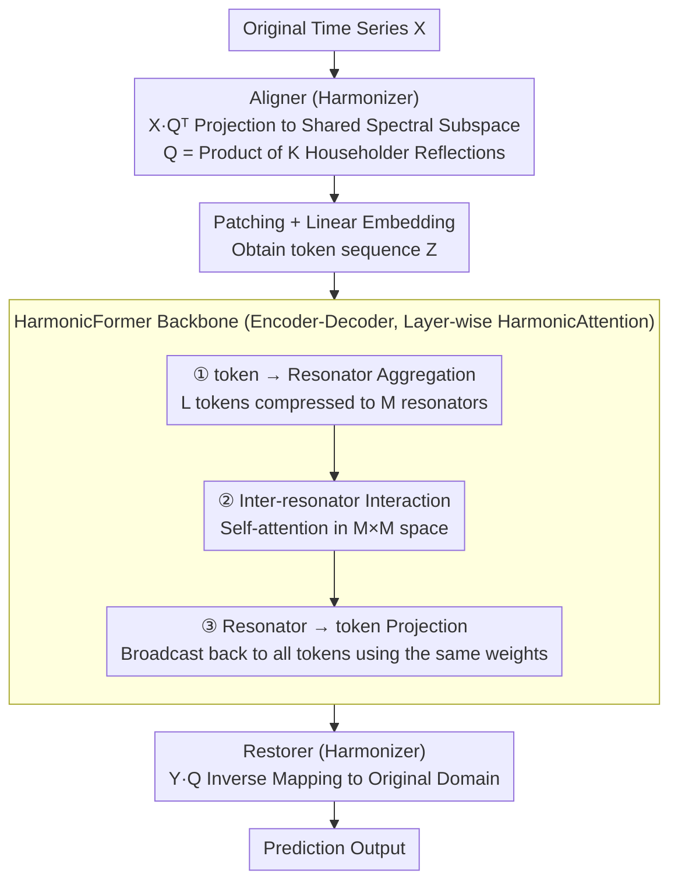

# OLIVIA: Harmonizing Time Series Foundation Models with Power Spectral Density

**Conference**: ICML 2026  
**arXiv**: [2605.17340](https://arxiv.org/abs/2605.17340)  
**Code**: TBD  
**Area**: Time Series / Foundation Models  
**Keywords**: Power Spectral Density, Time Series Foundation Models, Domain Adaptation, Attention Mechanism

## TL;DR
OLIVIA significantly improves the pre-training of time series foundation models on heterogeneous data by introducing a Power Spectral Density (PSD)-driven coordination mechanism—comprising the Harmonizer (orthogonal second-order coordination based on Householder reflections) and HarmonicAttention (low-dimensional interaction via resonators)—achieving SOTA performance across TSLib Zero-shot, GIFT-Eval, and GluonTS benchmarks.

## Background & Motivation

**Background**: Time series foundation models learn unified general representations through pre-training on large-scale multi-domain datasets—a paradigm proven effective in NLP and CV. However, existing models face severe challenges when handling heterogeneous time series.

**Limitations of Prior Work**: Time series from different domains exhibit significantly different temporal patterns (periodic structures, long-term dependencies). While this diversity is a prerequisite for learning broadly applicable temporal knowledge, it complicates pre-training: (1) At the optimization level, joint training on data with distinct temporal characteristics often leads to slow convergence and sub-optimality; (2) At the representation learning level, models struggle to adapt to incompatible temporal structures simultaneously, making it difficult to form a unified transferable representation.

**Key Challenge**: Existing foundation models achieve domain adaptation through architectural modularity or capacity specialization (Mixture-of-Experts, frequency-aware patching) but **do not explicitly address fundamental differences in temporal distributions**—specifically, diagnosing and reconciling cross-domain spectral differences using the signal processing concept of PSD.

**Goal**: (1) To understand and quantify cross-domain temporal heterogeneity in a principled manner; (2) To efficiently achieve PSD consistency during large-scale pre-training without falling into direct, unstable divergence minimization.

**Key Insight**: Normalized PSD is a dataset-level descriptor that reflects the underlying second-order temporal correlation structure by capturing the distribution of temporal variations along the frequency axis. PSD is invariant to global temporal shifts and relatively robust to local temporal misalignments, making it an ideal representation for comparing signals acquired under heterogeneous conditions.

**Core Idea**: Reduce mismatches by harmonizing the PSD of each dataset in the spectral domain—reformulating from unattainable direct divergence minimization to a structural coordination approach based on **shared reparameterization of second-order temporal correlations**.

## Method

### Overall Architecture
The core problem OLIVIA addresses is that mixing multi-domain time series with varying periodicities and long-term dependencies during pre-training leads to slow convergence and a lack of unified representations. The breakthrough lies in quantifying this heterogeneity as differences in normalized Power Spectral Density (PSD) between datasets and "harmonizing" them in the spectral domain. The entire pipeline is an encoder-decoder: original time series are first projected into a shared spectral space by the **Aligner** of the **Harmonizer**, aligning the second-order correlation structures of all datasets. The aligned representations are sent to the **HarmonicFormer** backbone for encoding and decoding, where the attention in each layer is replaced by **HarmonicAttention**. Finally, the **Restorer** of the Harmonizer maps the results back to the original domain for prediction. The Harmonizer is responsible for "harmonization," while the HarmonicFormer handles "efficient modeling," both unified by the theory of PSD consistency.

### Key Designs

**1. Harmonizer: Orthogonal Second-Order Coordination via Householder Reflections to Avoid Unstable Divergence Minimization**

The most intuitive approach would be to directly minimize the JS divergence between the PSDs of different datasets. However, in large-scale pre-training, this path suffers from high gradient noise and extreme training instability. The authors instead pivot from Proposition 1: there exists a shared orthogonal matrix $Q$ whose subspace spanned by the first $r$ columns is invariant to the second-order moment matrices of all datasets, which is equivalent to block-diagonalizing their respective covariance matrices. This means PSD coordination can be rewritten as a structural problem of "shared reparameterized second-order correlations" without touching divergence directly. Accordingly, the Aligner projects the input as $\mathcal{X} = X Q^\top$, where $Q$ is formulated as the product of $K$ Householder reflections $Q = \prod_k H_k$, with $H_k = I - 2 V_k V_k^\top$. This ensures $Q$ remains on the orthogonal group regardless of parameter updates. After decoding, the Restorer performs the inverse mapping $Y = \mathcal{Y} Q$ to restore the signal. The orthogonality constraint ensures energy conservation and no signal distortion, and the sequential reflection multiplication ensures stable gradient flow, turning "unoptimizable PSD alignment" into "stably trainable subspace projection."

**2. HarmonicAttention: Using a Small Set of "Resonators" as Bottlenecks to Achieve Linear Complexity**

Standard Transformer interaction between tokens is $\mathcal{O}(L^2 P)$, which becomes prohibitive for long sequences. The rationale here is Proposition 2: once aligned by the Harmonizer, the second-order moment matrix exhibits a block-diagonal structure $\Sigma_\mathcal{X} = \text{diag}(\Lambda, \Phi)$, and the Gram matrix of tokens can be decomposed into a dominant low-rank term plus a bounded residual. This implies that dense dependencies can be approximated using a few compact harmonic modes. HarmonicAttention introduces $M$ resonators ($M \ll L$) as intermediaries in three steps: first, aggregating tokens into resonators $R^{(h)} = (A^{(h)})^\top \tilde{Z}^{(h)}$; second, allowing resonators to interact $\text{ResAct}(R^{(h)}) = \text{Softmax}_{\text{res}}\big(R^{(h)} (R^{(h)})^\top / \sqrt{P}\big) R^{(h)}$; and finally, projecting back to all tokens $\text{Head}^{(h)} = A^{(h)} \text{ResAct}(R^{(h)})$. All global dependencies are channeled through this resonator bottleneck, reducing complexity from $\mathcal{O}(L^2 P)$ to $\mathcal{O}(L M P + M^2 P)$ (nearly linear when $M \ll L$). Because resonators correspond precisely to the dominant energy modes in the shared subspace, this is not generic low-rank compression but a structural fit with PSD alignment. Ablations show that replacing it with Full / Linear / Nyström Attention leads to performance degradation, indicating that gains stem from this structural matching rather than attention capacity itself. The **HarmonicFormer** backbone simply stacks HarmonicAttention into a Transformer-style encoder-decoder, replacing standard multi-head self-attention throughout; it has no extra "fancy" designs but serves as a deep, scalable carrier where the representation quality from the Harmonizer and the computational efficiency of HarmonicAttention complement each other. To adapt to different downstream tasks, separate output heads and optimization objectives are configured for pre-training and fine-tuning (see Appendix for specific loss functions).

## Key Experimental Results

### Main Results (TSLib Zero-shot)

| Benchmark | Metric | Olivia | SEMPO | Time-MoE_B | Time-MoE_L | Moirai_B |
|-----------|--------|--------|-------|------------|------------|----------|
| ETTh1     | MSE    | **0.399** | 0.410 | 0.445      | 0.435      | 0.433    |
| ETTh1     | MAE    | **0.421** | 0.430 | 0.449      | 0.449      | 0.431    |
| Weather   | MSE    | **0.247** | 0.248 | 0.279      | 0.318      | 0.312    |
| Electricity| MSE   | **0.188** | 0.196 | —          | —          | 0.207    |

### Ablation Study

| Configuration | ETTh1 MSE | Inference (s) | Model Size (M) |
|---------------|-----------|---------------|----------------|
| **HarmonicAttention** | **0.399** | 43.051        | **5.1**        |
| w/o Harmonizer | 0.472     | —             | —              |
| Full Attention | 0.472     | —             | —              |
| Linear Attention | 0.412   | —             | —              |
| Nyström Attention | 0.488  | —             | —              |

### Key Findings
- Olivia achieves an average MSE reduction of 2.7% compared to SEMPO and 26.3% compared to the Time-MoE series on TSLib Zero-shot.
- On GluonTS, it shows an 11.6–32% NRMSE improvement over SEMPO and 86%+ over Time-MoE.
- Removing the Harmonizer significantly worsens MSE (0.399 → 0.472), validating the core value of PSD coordination.
- The performance gains of HarmonicAttention stem from structural matching with PSD-consistent representations, not just attention capacity.
- Olivia has the smallest parameter count (5.1M vs. 6.5M for SEMPO, 113M for Time-MoE_B).

## Highlights & Insights
- **PSD as a Fundamental Diagnostic Tool**: Systematically introducing Power Spectral Density into the heterogeneity diagnosis of time series foundation models is more operational than generic "domain adaptation."
- **Elegant Transformation of Second-order Structure Coordination**: Through the dual theory of Propositions 1 & 2, the seemingly unoptimizable PSD divergence problem is cleverly transformed into a block-diagonalization problem of second-order statistics—demonstrating how deep theoretical thinking guides model design.
- **Reusable Low-dimensional Interaction Paradigm**: HarmonicAttention models efficient global dependencies via a "resonator bottleneck," offering potential value to any domain requiring self-attention over long sequences.
- **Unification of Representation Learning and Computational Efficiency**: Both are optimized simultaneously via PSD coordination—Harmonizer improves representation learning, while HarmonicAttention improves computational efficiency, acting as complements rather than trade-offs.

## Limitations & Future Work
- Inference latency is slightly higher (the construction of orthogonal matrices via Householder reflections introduces overhead: 43s vs. 8s for SEMPO); more efficient orthogonal parameterizations (QR decomposition, Cayley transform) could be explored.
- The relationship between the number of resonators $M$ and the true rank $r$ of the signal is theoretically bounded, but how to align them in practice and how they vary across datasets remains under-discussed.
- Applicability to heterogeneous downstream tasks (classification, anomaly detection) remains to be verified.

## Related Work & Insights
- **vs. SEMPO / Time-MoE / Moirai**: These achieve domain generalization through architectural modularity but lack explicit handling of fundamental cross-domain spectral differences; Olivia aligns these explicitly via PSD consistency constraints.
- **vs. ROSE**: ROSE uses spectral masking and adaptive registers to isolate domain-specific features; Olivia does the opposite—harmonizing to concentrate domain-specific variations in orthogonal complement subspaces.
- **vs. General Low-rank Attention**: Linear / Nyström are generic low-rank approximations; the resonators in HarmonicAttention are derived from PSD alignment structures, making them more sensitive to time-series-specific patterns.

## Rating
- Novelty: ⭐⭐⭐⭐⭐ Systematically introduces PSD as a diagnostic tool for foundation model design; the integration of HarmonicAttention and Harmonizer is theoretically profound.
- Experimental Thoroughness: ⭐⭐⭐⭐⭐ Covers two large-scale benchmarks + 6 additional GluonTS datasets + comprehensive ablations + efficiency analysis, with consistently significant results.
- Writing Quality: ⭐⭐⭐⭐ The paper is clearly structured, with the relationship between the two propositions and the method design well-argued; some minor details are occasionally skipped.
- Value: ⭐⭐⭐⭐⭐ Provides a theory-driven breakthrough in the frontier of time series foundation models; the idea of PSD coordination is transferable to other multi-source heterogeneous data scenarios.

<!-- RELATED:START -->

## Related Papers

- [\[NeurIPS 2025\] Frequency Matters: When Time Series Foundation Models Fail Under Spectral Shift](../../NeurIPS2025/time_series/frequency_matters_when_time_series_foundation_models_fail_under_spectral_shift.md)
- [\[ICML 2026\] FactoryNet: A Large-Scale Dataset toward Industrial Time-Series Foundation Models](factorynet_a_large-scale_dataset_toward_industrial_time-series_foundation_models.md)
- [\[NeurIPS 2025\] How Foundational are Foundation Models for Time Series Forecasting?](../../NeurIPS2025/time_series/how_foundational_are_foundation_models_for_time_series_forecasting.md)
- [\[NeurIPS 2025\] SEMPO: Lightweight Foundation Models for Time Series Forecasting](../../NeurIPS2025/time_series/sempo_lightweight_foundation_models_for_time_series_forecasting.md)
- [\[ICML 2026\] Interpretability in Deep Time Series Models Demands Semantic Alignment](interpretability_in_deep_time_series_models_demands_semantic_alignment.md)

<!-- RELATED:END -->
