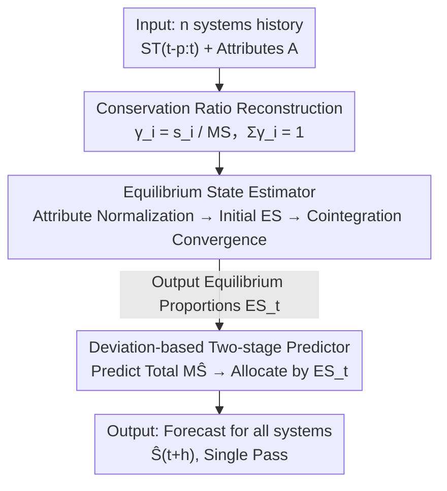

# Once-for-All: Scalable Simultaneous Forecasting via Equilibrium State Estimation

**Conference**: ICML2026  
**arXiv**: [2606.13285](https://arxiv.org/abs/2606.13285)  
**Code**: TBD  
**Area**: Time Series Forecasting  
**Keywords**: Multi-system Forecasting, Equilibrium State Estimation, Cointegration Convergence, Linear Complexity, Plug-and-play

## TL;DR
Aiming at scenarios where "multiple interacting systems must be predicted simultaneously" (e.g., exchange rates of 16 countries, new COVID-19 cases in hundreds of counties), this paper proposes Equilibrium State Estimation (ESE). It first estimates the "equilibrium state proportions" of all systems in one go, then performs single-pass forecasting based on the direction of current state deviation from equilibrium. This replaces the $O(n)$ training of repeated individual system predictions with linear-time single inference, achieving parity with SOTA accuracy while being 10–70× faster and providing a plug-and-play wrapper for any existing predictor.

## Background & Motivation
**Background**: In fields like economics and epidemiology, it is common to predict **multiple interacting** systems simultaneously—such as exchange rates for every country or new cases for every region. The mainstream approach treats each system as an independent time series, using models like ARIMA, LSTM, Informer, or PatchTST to predict them **one by one**.

**Limitations of Prior Work**: Point-by-point system prediction suffers from three issues. First, it is **redundant and expensive**: $n$ systems require $n$ training/inference cycles, causing costs to scale linearly or worse as $n$ increases. Second, it **ignores inter-system coupling**: modeling systems separately loses the mutual constraints (e.g., a rise in one exchange rate often corresponds to a fall in another). Third, it is **inflexible**: re-training is required for changes in input length, prediction horizon, or system granularity.

**Key Challenge**: The essence of the problem is that multiple systems are not $n$ independent sequences but a holistic "zero-sum" entity. However, the modeling unit of traditional time series methods is "single-system single-output," which structurally fails to express "proportion conservation between systems." While multivariate time series involve multiple variables, they belong to the **same** underlying system, which differs from the case of **multiple homogeneous systems** here.

**Goal**: Can a unified model predict all systems simultaneously in a **single pass**, saving computational resources while utilizing inter-system interactions?

**Key Insight**: The authors draw from the concept of "equilibrium" in physics and economics—when all competitive influences are balanced, the system is in an equilibrium state; once perturbed, it becomes imbalanced and evolves toward a new equilibrium. By viewing multiple systems as a "supersystem" and estimating their collective equilibrium state, one can identify the trend direction of each system, enabling joint forecasting of all members.

**Core Idea**: Use the "equilibrium state" as a shared anchor for multiple systems—first estimate the **proportional allocation** $\mathcal{ES}$ at equilibrium, then infer the future based on the "degree of current state deviation from equilibrium." This decomposes multi-system forecasting into a two-stage single-pass process: "predict the total volume first, then allocate according to equilibrium proportions."

## Method

### Overall Architecture
The input to ESE consists of target value sequences $\mathcal{ST}_{t-p:t}$ for $n$ homogeneous systems over a historical window $[t-p, t]$, plus a set of attributes $\mathcal{A}$ for each system (e.g., population, macroeconomic indicators). The output is the prediction $\widehat{\mathcal{S}}_{t+h}=(\widehat{s}_{1,t+h},\dots,\widehat{s}_{n,t+h})$ for all systems at $h$ steps ahead, completed in **one pass**.

The pipeline consists of three steps: first, reconstruct the multiple systems into a "proportion-conserving" set representation (where each system $i$ has a proportion $\gamma_i$ of the total, and $\sum \gamma_i = 1$); then, use an **Equilibrium State Estimator** to find the proportional allocation $\mathcal{ES}_t$ at equilibrium; finally, use a **Predictor** to forecast the total volume and distribute it back to individual systems according to $\mathcal{ES}_t$. The key is that individual **proportions** are much more stable than absolute values, making the "predict total + allocate by fixed proportions" approach both accurate and fast, while allowing total volume prediction to be handled by any existing model.

### Key Designs

**1. Conservation Ratio Reconstruction: Writing multiple systems as a "zero-sum" whole**

Individual system prediction ignores coupling because it treats the absolute value of each sequence as an independent target. ESE packs $n$ systems into a set $\mathcal{MS}=\sum_{i=1}^{n}s_i$, and uses the **proportion** $\gamma_i = s_i / \mathcal{MS}$ of each system as the modeling unit. This provides two immediate benefits: first, a natural conservation constraint—the sum of all proportions is always 1 ($\sum_{i=1}^{n}\gamma_i=1$), and the sum of proportion changes at any step is zero ($\sum_{i=1}^{n}\Delta\gamma_i=0$, i.e., $\Delta\gamma_i = -\sum_{j\neq i}\Delta\gamma_j$), explicitly encoding the mutual constraint where one system's rise corresponds to others' falls. Second, it is **scale-invariant**—proportions eliminate differences in dimensions and ranges (e.g., the 20,000x difference between the Indonesian Rupiah and the British Pound), making the model immune to specific value types. This step requires a fixed set of members (e.g., modeling a city's epidemic must include all its counties), which is the prerequisite for equilibrium estimation.

**2. Equilibrium State Estimator: Localizing proportions via cointegration tests**

Current proportions are insufficient; forecasting requires knowing where the system "wants to go"—the equilibrium proportions $\mathcal{ES}_t=(\gamma^{*}_{1,t},\dots,\gamma^{*}_{n,t})$. Inspired by analyzing internal competition to estimate system states in Nash equilibrium, the authors estimate equilibrium through inter-system attribute interactions. This involves three steps: normalizing the $k$-th attribute of each system based on theoretical bounds, $\alpha'_{i,k,t}=\frac{\alpha_{i,k,t}-\overline{\alpha_{k,t}}}{U(\alpha_{k,t})-L(\alpha_{k,t})}$; obtaining the initial equilibrium $\mathcal{ES}_t^{[0]}=\frac{1}{n}+\frac{1}{m}\sum_{k=1}^{m}\psi_{k,t}\,\bar{\alpha}'_{k,t}$, where attribute coefficients $\psi_k$ are fitted via Maximum Likelihood Estimation (MLE) such that $\mathcal{ST}_t\approx\mathcal{A}'_t\Psi_t$; and finally updating $\mathcal{ES}_t$ per epoch using a correction vector $\mathcal{L}$ with a damping factor $\lambda=0.5$ in Algorithm 1.

The convergence criterion is the most clever part: rather than a fixed number of iterations, it uses a **cointegration test**—a classic statistical method for testing long-term equilibrium between sequences—to determine if the estimated $\mathcal{ES}_t$ has established a stable relationship with the recent history $\mathcal{ST}_{t-p:t}$. When the p-value falls below 0.05 (confidence > 0.95), the equilibrium is considered estimated and the process stops. Note: ESE **does not** actually push systems toward equilibrium; it estimates "what the system would look like if it were in equilibrium" and uses the current state’s deviation from this to forecast. This is statistical equilibrium, not game-theoretic equilibrium. Furthermore, if attribute influences $\psi_t$ are set to zero, the process does not converge, confirming attributes as the foundation of ESE.

**3. Deviation-based Two-stage Predictor: Predict total then allocate (Plug-and-play)**

With $\mathcal{ES}_t$, the predictor uses the deviation direction from equilibrium to infer the future. The full form is $\widehat{\mathcal{S}}_{t+h}=\theta_{t+h}\,\mathcal{MS}_t\,\mathcal{ES}_t+\boldsymbol{\varepsilon}_{t+h}$, where $\theta_{t+h}$ is estimated via MLE of a linear autoregressive model on the total $\mathcal{MS}$, capturing the global trend: $\theta=1$ means no change in total, $>1$ indicates growth, and $<1$ indicates decline. Crucially, even if $\theta_{t+h}=1$ (total remains same), systems may still be in disequilibrium and require reallocation due to internal fluctuations; conversely, the total can change while internal proportions remain at equilibrium.

This leads to ESE's most practical feature: **Two-stage + Plug-and-play**. Stage one predicts the aggregate total $\widehat{\mathcal{MS}}_{t+h}$, and stage two uses the fixed proportions of $\mathcal{ES}_t$ to distribute the total across systems, simplified as $\widehat{\mathcal{S}}_{t+h}=\widehat{\mathcal{MS}}_{t+h}\,\mathcal{ES}_t$. Since the first stage only predicts **one** aggregate sequence, it can be replaced by any existing model (LSTM, SCINet, PatchTST, TimeLLM, etc.). The external model handles the global trend, while ESE handles the distribution. This grants multi-system capabilities to models originally limited to single-system prediction and drastically reduces costs by running one sequence instead of $n$ (methods like VAR that cannot do univariate prediction are integrated indirectly).

### Loss & Training
The equilibrium estimator has no explicit neural network loss; it relies on MLE for attribute influences $\psi_k$ (log-likelihood $\ell(\Psi_t,\sigma_t^2)$) and cointegration tests as stopping criteria. Trend parameters $\theta_{t+h}$ are also estimated via MLE. The overall complexity is linear with respect to the number of systems $n$, with data split 90:10 for training/testing.

## Key Experimental Results

### Main Results
Evaluated on synthetic data, 16 G20 exchange rates (vs. USD, Daily 2019.11–2024.10), and Victoria COVID-19 cases (2022, aggregated at 20/79/320 granularities), comparing against up to 13 SOTA predictors. Each baseline is tested "Without ESE" vs. "With ESE".

| Dataset (Config) | Metric | ESE Only | Best Baseline (w/o ESE) | Baseline + ESE |
|--------------|------|---------|----------------------|--------------|
| Synthetic 10 systems (20→1) | RMSE / Cost(min) | 0.248 / 0.23 | Informer 0.244 / 1.69 | Informer+ESE 0.241 / 0.40 |
| FX 16 Currencies (100→1) | RMSE / Cost(min) | 6.010 / 0.22 | DLinear 5.878 / 6.33 | DLinear+ESE **5.461** / 0.62 |
| COVID 320 Regions (100→1) | RMSE / Cost(min) | 4.83 / 2.23 | PatchTST 5.11 / 109.9 | FiLM+ESE **4.36** / 2.84 |

Key Observations: (1) ESE alone is highly competitive and never ranks last, often leading as $n$ increases (e.g., 320 regions); (2) Any baseline integrated with ESE maintains or improves accuracy; (3) The lowest error in every column is achieved by ESE alone or Baseline+ESE; (4) ESE drastically reduces baseline costs, achieving over **70× acceleration** for FiLM/SCINet on 320 regions.

### Ablation Study

| Dimension | Observation | Explanation |
|---------|------|------|
| ESE Integration Cost | SCINet 320 regions: 62.27 → 2.82 min | Replacing $n$ sequence predictions with one aggregate forecast speeds up by over an order of magnitude. |
| Zeroing Attribute Influences $\psi$ | Estimation does not converge | Attributes are the foundation of ESE; without them, convergence is impossible. |
| Long Input Robustness | Lowest RMSE for input >50 steps usually held by ESE / +ESE | ESE effectively utilizes long historical windows. |
| Granularity Scaling | Accuracy and cost remain stable across 20→79→320 regions | Linear complexity provides strong scalability; most baselines degrade. |

### Key Findings
- **Proportions are more stable than absolute values**: This is the crux of the method. Because proportions remain stable over time, "predicting total + fixed allocation" is both accurate and enables plug-and-play.
- **Clear source of acceleration**: ESE compresses multi-system prediction into a single aggregate sequence. The more systems, the greater the savings (70x+ on 320 regions), contrasting with the $O(n)$ cost of per-system prediction.
- **Attributes are indispensable**: The essential difference between ESE and traditional ARIMA/VAR is the reliance on attribute data to estimate equilibrium; the model fails to converge without them.

## Highlights & Insights
- **Using "Equilibrium" as a shared anchor**: Bringing physics/economics concepts to numerical forecasting—estimating "what if in equilibrium" and using deviations—avoids the redundancy and coupling loss of per-system modeling. This is a rare use of equilibrium for actual forecasting rather than just efficient training (as in deep equilibrium models).
- **Elegant cointegration test as convergence criterion**: It avoids arbitrary iteration counts, using statistical "is long-term equilibrium established" (p<0.05) to stop adaptively, integrating econometric tools into the estimation loop.
- **Transferable plug-and-play decomposition**: The "predict aggregate + allocate by stable proportions" trick can be extended to any "whole-part" task (e.g., total sales → stores, total traffic → pages), allowing single-sequence models to gain multi-target capability at zero cost.

## Limitations & Future Work
- Strong dependence on three assumptions: systems are **homogeneous** (sharing an attribute set), the set is fixed (no dynamic joins/leaves), and proportions are stable over time. Performance in scenarios with structural breaks or radical proportion shifts is uncertain.
- Equilibrium estimation requires attributes; setting $\psi$ to zero leads to non-convergence. This means ESE cannot be used for pure time-series scenarios (where traditional ARIMA/VAR apply) without auxiliary attributes.
- The main tables focus on 1-step snapshots; systematic comparisons for longer horizons and cross-dataset evaluations are scattered in the appendix.
- Mathematical notations for initial equilibrium $\mathcal{ES}_t^{[0]}$ and MLE are dense; ⚠️ refer to Appendix B–F for derivation details.

## Related Work & Insights
- **vs. Traditional Single-system Models (ARIMA / LSTM / PatchTST / Informer)**: These predict one by one, ignore attributes, and have costs expanding with $n$. ESE predicts all in one pass, utilizes attributes, has linear complexity, and can **wrap** these models to improve both speed and accuracy.
- **vs. Multivariate Time Series (VAR, etc.)**: Multivariate variables belong to the **same** system. ESE spans **multiple homogeneous systems**. Since VAR cannot perform univariate prediction, it cannot be directly integrated into Stage 1 of ESE.
- **vs. Deep Equilibrium Model (Bai et al., 2019)**: DEQ uses equilibrium for memory-efficient training of infinite-depth networks; ESE uses equilibrium as a **forecasting anchor**—estimating equilibrium proportions to predict via deviations—a new application for forecasting.

## Rating
- Novelty: ⭐⭐⭐⭐⭐ Bringing equilibrium estimation to multi-system forecasting with adaptive cointegration convergence is highly novel.
- Experimental Thoroughness: ⭐⭐⭐⭐ Covered synthetic, FX, and multi-scale COVID data across 13 SOTA models, but the main text is heavy on 1-step results.
- Writing Quality: ⭐⭐⭐⭐ Concepts are clear and well-defined, though formulas are dense and some details are deferred to the appendix.
- Value: ⭐⭐⭐⭐⭐ Plug-and-play + 10-70× acceleration + linear scaling makes this highly valuable for large-scale multi-system forecasting (economy/epidemiology/ops).

<!-- RELATED:START -->

## Related Papers

- [\[AAAI 2026\] Detecting the Future: All-at-Once Event Sequence Forecasting with Horizon Matching](../../AAAI2026/time_series/detecting_the_future_all-at-once_event_sequence_forecasting_with_horizon_matchin.md)
- [\[ICLR 2026\] Are Global Dependencies Necessary? Scalable Time Series Forecasting via Local Cross-Variate Modeling](../../ICLR2026/time_series/are_global_dependencies_necessary_scalable_time_series_forecasting_via_local_cro.md)
- [\[ICLR 2026\] ConvT3: Structured State Kernels for Convolutional State Space Models](../../ICLR2026/time_series/convt3_structured_state_kernels_for_convolutional_state_space_models.md)
- [\[ICML 2026\] HiPPO Zoo: Explicit Memory Mechanisms for Interpretable State Space Models](hippo_zoo_explicit_memory_mechanisms_for_interpretable_state_space_models.md)
- [\[ICLR 2026\] A General Spatio-Temporal Backbone with Scalable Contextual Pattern Bank for Urban Continual Forecasting](../../ICLR2026/time_series/a_general_spatio-temporal_backbone_with_scalable_contextual_pattern_bank_for_urb.md)

<!-- RELATED:END -->
