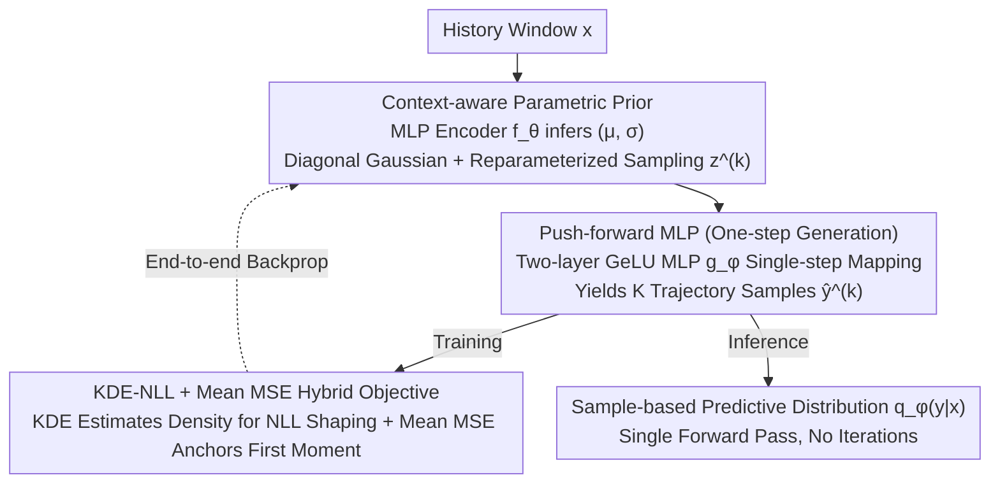

# Parametric Prior Mapping Framework for Non-stationary Probabilistic Time Series Forecasting

**Conference**: ICML 2026  
**arXiv**: [2605.23402](https://arxiv.org/abs/2605.23402)  
**Code**: https://github.com/ljl8336/PPM (Available)  
**Area**: Time Series
**Keywords**: Probabilistic Time Series Forecasting, Non-stationarity, Parametric Prior, Push-forward Mapping, KDE-NLL

## TL;DR
PPM utilizes a lightweight encoder to infer context-aware Gaussian priors from historical sequences and "pushes forward" these priors into full predictive distributions via a two-layer MLP. Optimized with a joint KDE-NLL and mean MSE loss, it outperforms diffusion models like DeepAR and NsDiff across seven benchmarks while achieving $2\times$ to $100\times$ faster inference.

## Background & Motivation
**Background**: Probabilistic forecasting for multivariate time series primarily follows two paths. The parametric approach, such as DeepAR (assuming fixed Gaussian likelihood) or BetterDeepAR (learning time-varying covariance), offers stability and efficiency through strong inductive biases. The deep generative approach, including diffusion models like TimeGrad, TMDM, and NsDiff, gradually denoises noise into future trajectories, offering flexibility but at the cost of speed and high data requirements.

**Limitations of Prior Work**: While diffusion models can theoretically approximate any distribution using arbitrary priors, **the shape of the prior significantly affects trajectory reachability** under finite samples and computation. TMDM uses $\mathcal{N}(f(\bm{x}),\mathbf{I})$ as the endpoint, forcing the variance to an identity matrix. NsDiff improves this by using sliding window variance as a prior, but the window length is a fixed hyperparameter that fails to track rapidly changing aleatoric uncertainty. The paper illustrates this with Traffic data: traffic volume variance differs drastically between early morning (trough) and evening (peak), which the fixed priors of TMDM/NsDiff fail to capture.

**Key Challenge**: Parametric methods possess strong inductive biases but weak expressiveness, while generative models are expressive but lack structural priors and suffer from slow inference. Their respective advantages are complementary yet have been treated as opposing paradigms.

**Goal**: (1) Create a data-adaptive prior that varies with the input; (2) Maintain the expressiveness of generative models to fit complex non-Gaussian conditional distributions; (3) Avoid the $T$-step iterative inference of diffusion models.

**Key Insight**: Rather than forcing a generative model to learn a transport map from uninformative noise, a parametric estimator (MLP) can be used to derive a context-aware Gaussian prior from the history window. A learned non-linear mapping then "pushes forward" this structured prior into the final predictive distribution. This significantly reduces the burden on the transport map, allowing for one-step forward generation.

**Core Idea**: Generate **adaptive priors** via parametric estimation, followed by **one-step** conditional distribution generation using a push-forward MLP. Training is conducted via a hybrid objective of KDE-based density estimation (NLL) and mean MSE to anchor the first moment.

## Method

### Overall Architecture
Given a history window $\bm{x}\in\mathbb{R}^{H\times C}$, the model outputs sample-based predictive distributions over the forecast horizon $\bm{y}\in\mathbb{R}^{L\times C}$. The pipeline consists of three stages:

1.  **Parametric Prior Induction**: An MLP encoder $f_\theta(\bm{x})$ outputs latent variables $(\bm{\mu}, \bm{\sigma})\in\mathbb{R}^{C\times D}$ for each channel, defining a diagonal Gaussian conditional prior $p_\theta(\bm{z}|\bm{x})=\mathcal{N}(\bm{z};\bm{\mu},\text{diag}(\bm{\sigma}^2))$.
2.  **Distribution Push-forward**: Using reparameterized sampling $\bm{z}^{(k)}=\bm{\mu}+\bm{\sigma}\odot\bm{\epsilon}^{(k)}$, samples are passed through a channel-independent two-layer GeLU MLP mapping $g_\phi:\mathbb{R}^{C\times D}\to\mathbb{R}^{L\times C}$ to obtain $K$ trajectory samples $\hat{\bm{y}}^{(k)}=g_\phi(\bm{z}^{(k)})$. The predictive distribution is formalized as the push-forward measure $q_\phi(\bm{y}|\bm{x})=(g_\phi)_\# p_\theta(\bm{z}|\bm{x})$.
3.  **Hybrid Objective Optimization**: Marginal densities $\hat{q}_h(y_{c,t}|\bm{x})$ are estimated via Gaussian KDE on the $K$ samples, with NLL calculated using log-sum-exp. An additional MSE term based on the sample mean anchors the first moment. Inference requires only one pass of $f_\theta$ and $K$ passes of $g_\phi$, without KDE.

### Key Designs

**1. Context-aware Parametric Prior: Adapting priors to inputs to address rigid variance in diffusion models.**

Diffusion-based forecasting can theoretically approximate any distribution, but the prior shape severely impacts trajectory reachability under limited resources. While TMDM freezes endpoint variance to $\mathcal{N}(f(\bm{x}),\mathbf{I})$ and NsDiff uses sliding windows with fixed hyperparameters, they struggle with data like Traffic, where variance oscillates between peaks and troughs. PPM uses a lightweight MLP $f_\theta$ to map history $\bm{x}$ directly to latent $(\bm{\mu}, \bm{\sigma})$, defining a diagonal Gaussian conditional prior $p_\theta(\bm{z}|\bm{x}) = \mathcal{N}(\bm{z};\bm{\mu},\text{diag}(\bm{\sigma}^2))$. Reparameterized sampling $\bm{z}^{(k)} = \bm{\mu} + \bm{\sigma}\odot\bm{\epsilon}^{(k)}$ maintains differentiability. This "input-dependent" prior addresses time-varying aleatoric uncertainty and remains backbone-agnostic.

**2. Push-forward MLP (One-step Generation): Mapping structured Gaussian priors to complex distributions, eliminating T-step iterations.**

Diffusion's $T$-step denoising bridges the gap between generic noise and complex data. Since the context is already embedded in the parametric prior, the transport map no longer requires iterative refinement. PPM uses a two-layer channel-independent GeLU MLP $g_\phi:\mathbb{R}^{C\times D}\to\mathbb{R}^{L\times C}$ to project latent codes to the prediction window in one step: $\hat{\bm{y}}^{(k)} = g_\phi(\bm{z}^{(k)})$. Theorem 5.2 guarantees that this push-forward measure $q_\phi(\bm{y}|\bm{x}) = (g_\phi)_\# p_\theta(\bm{z}|\bm{x})$ is dense in the space of conditional distributions with finite first moments, providing sufficient expressiveness for non-Gaussian and multi-modal distributions. Inference complexity is reduced from $O(BKT)$ to $O(B+BK)$.

**3. KDE-NLL + Mean MSE Hybrid Objective: Shaping distributions while anchoring point accuracy.**

Since the model only outputs samples, pure KDE-NLL can suffer from vanishing gradients early in training when samples are far from targets. PPM applies Gaussian KDE to estimate marginal densities $\hat{q}_h(y_{c,t}|\bm{x}) = \frac{1}{Kh}\sum_k\mathcal{K}(\tfrac{y_{c,t}-\hat{y}_{c,t}^{(k)}}{h})$ for NLL shaping, combined with $\mathcal{L}_{\text{MM}} = \|\bm{y}-\frac{1}{K}\sum_k\hat{\bm{y}}^{(k)}\|^2$ to anchor the first moment. The total loss is $\mathcal{L}_{\text{total}} = \alpha\mathcal{L}_{\text{NLL}} + \mathcal{L}_{\text{MM}}$ ($\alpha=0.1, h=0.3$). Theorem 5.1 expresses KDE bias ($O(h^2/\varepsilon)$) and variance ($O(1/(\varepsilon h\sqrt{K}))$) as functions of $h$ and $K$, guiding their co-tuning. MSE provides stable gradients to pull samples toward the mean, while KDE-NLL shapes the distribution using responsibility-weighted residuals.

### Loss & Training
- Training samples $K=100$ trajectories; KDE bandwidth $h=0.3$; weight $\alpha=0.1$.
- Encoder $f_\theta$ and mapping $g_\phi$ are both MLPs, trained via end-to-end backpropagation.
- Inference likewise uses 100 samples to approximate the distribution; only one pass of $f_\theta$ and a single step of $g_\phi$ are required.

## Key Experimental Results

### Main Results
Testing on seven real-world datasets (ETTh1/h2/m1/m2, Weather, Electricity, Traffic) against 6 SOTA baselines (DeepAR, TimeGrad, TimeDiff, D3VAE, DiffusionTS, TMDM, NsDiff), averaged over 5 runs.

| Dataset | Metric | PPM | 2nd Place (NsDiff) | Gain |
| :--- | :--- | :--- | :--- | :--- |
| Electricity | CRPS | 0.206 | 0.286 | **-28.0%** |
| Electricity | QICE | 2.435 | 7.595 | **-67.9%** |
| Traffic | CRPS | 0.252 | 0.367 | **-31.3%** |
| Traffic | QICE | 2.744 | 8.366 | **-67.2%** |
| ETTh1 | CRPS | 0.337 | 0.417 | -19.2% |
| ETTh2 | MSE | 0.376 | 0.448 | -16.1% |
| Weather | CRPS | 0.215 | 0.240 (TMDM) | -10.4% |

Ours achieved SOTA in CRPS across all 7 datasets and SOTA in QICE in 6 out of 7 datasets. MSE/MAE metrics also reached SOTA across all 7 benchmarks. The improvement is most significant on datasets with complex dynamics (high variance), such as Traffic (Variance=14.225).

### Ablation Study

| Config | ETTm1 MSE | ETTm1 CRPS | ETTm1 QICE | Elec MSE | Elec CRPS | Elec QICE |
| :--- | :--- | :--- | :--- | :--- | :--- | :--- |
| Full PPM | **0.381** | **0.314** | **1.782** | **0.182** | **0.206** | **2.435** |
| w/o NLL | 0.371 | 0.345 | 6.342 | 0.182 | 0.257 | 8.317 |
| w/o MM (Mean MSE) | 0.407 | 0.324 | 1.912 | 0.191 | 0.213 | 5.697 |

Prior form ablation (Table 4, Traffic): Using raw Gaussian/Uniform as the predictive distribution yielded QICE values of 2.414/3.715. With push-forward mapping, Gaussian reached 2.744 (CRPS 0.266 → 0.252) and Uniform reached 2.616 (CRPS 0.271 → 0.251), indicating that push-forward mapping is **insensitive to the prior form**.

### Key Findings
- **MM loss stabilizes point forecasting**: Removing MM significantly increases MSE (ETTm1: 0.381 → 0.407), confirming theoretical analysis of KDE-NLL's unstable early gradients.
- **NLL loss shapes the distribution**: Removing NLL severely degrades QICE (ETTm1: 1.782 → 6.342, Electricity: 2.435 → 8.317), proving that distribution calibration relies on NLL.
- **2x–100x Speedup**: By collapsing $T$-step denoising into a single-step mapping, PPM reduces complexity by a factor of $\Theta(T)$ compared to diffusion models.
- **Superiority in Non-stationarity**: On the Traffic dataset (highest Fourier variance of 14.225), PPM achieved the largest gains over NsDiff, validating the advantage of context-aware priors.
- **Higher Mutual Information**: Figure 4 shows that the lower bound of mutual information between latent $\bm{z}$ and input $\bm{x}$ is higher in PPM than in baselines, proving the prior effectively captures context.

## Highlights & Insights
- **Upgrading priors from rigid to context-aware**: This addresses a core flaw in diffusion-based forecasting where prior shapes were treated as hyperparameters. PPM allows $\bm{x}$ to determine prior parameters, solving mismatch issues in non-stationary scenarios.
- **"Less is more" - Faster and more accurate**: Folding $T$ denoising steps into a single push-forward step is a classic paradigm of trading iteration for inductive bias. This approach could transfer to other tasks like conditional image generation.
- **Complementarity of KDE-NLL and Mean MSE**: The authors interpret the division of labor between these gradients—KDE-NLL uses responsibility-weighted residuals (winner-take-all) to shape the distribution, while MM provides a dense anchor toward the mean.
- **Strong Theoretical Grounding**: Theorem 5.1 provides principled guidance for hyperparameter tuning by expressing KDE bias and variance through $h$ and $K$.

## Limitations & Future Work
- **KDE Bandwidth Sensitivity**: The authors note that a single fixed $h$ can amplify errors in extreme or rapidly changing regimes. Learned or local multi-bandwidth KDE is a natural extension.
- **Focus on Marginal Distributions**: Current NLL is calculated per $(c,t)$, without explicitly modeling joint cross-time or cross-variable dependencies. Energy scores or variogram scores could be future alternatives.
- **Limited Calibration Evaluation**: While CRPS/QICE are reported, reliability diagrams or fine-grained quantile coverage over time are missing.
- **Theoretical Assumptions**: Theorem 5.2's density is for each fixed $\bm{x}$, without providing uniform approximation rates; sample complexity for conditional distributions remains open.
- **Simpler Backbone**: The main text focuses on MLPs; while Transformers are in the appendix, maintaining speed advantages on complex architectures is a practical concern.

## Related Work & Insights
- **vs. TMDM (NeurIPS'24)**: Both treat the prior as learnable, but TMDM freezes variance to an identity matrix and uses diffusion; PPM learns variance from $\bm{x}$ and uses one-step mapping, speeding up inference by 2–100×.
- **vs. NsDiff (ICLR'25)**: NsDiff uses fixed sliding windows for variance, which works for short-term non-stationarity but fails to track fast dynamics like Traffic. PPM adaptive tracking solves this.
- **vs. Flow-based / Normalizing Flow**: Both use push-forward perspectives. NF requires invertible mappings with easy Jacobian calculations, limiting architecture; PPM uses KDE to bypass likelihood calculations, allowing for free architecture design.
- **vs. DeepAR**: DeepAR is purely parametric (RNN + fixed Gaussian). PPM retains the efficiency of parametric priors but uses a sample-based output to fit non-Gaussian distributions.
- **Insight**: The paradigm of context-aware priors + lightweight push-forward can be applied to any "slow diffusion" domain—such as conditional image or video generation—provided a cheap parametric estimator can be constructed.

## Rating
- Novelty: ⭐⭐⭐⭐ Elegantly bridges parametric and generative paths. Push-forward + context-aware prior is a clear first for probabilistic time series, though individual components are established.
- Experimental Thoroughness: ⭐⭐⭐⭐ 7 datasets and 6 strong baselines. Comprehensive ablation on objectives and prior forms. Lacks reliability diagrams and long-horizon backbone analysis in the main text.
- Writing Quality: ⭐⭐⭐⭐ Motivation in Figure 1 is clear. Theorems 5.1/5.2 align well with the method. Minor typos like "triaining" noted.
- Value: ⭐⭐⭐⭐ High practical value with SOTA accuracy and significant inference speedup. Methodologically valuable for the generative model community.

<!-- RELATED:START -->

## Related Papers

- [\[ICML 2026\] Dynamic-TMoE: A Drift-Aware Dynamic Mixture of Experts Framework for Non-Stationary Time Series](dynamic_tmoe_a_drift-aware_dynamic_mixture_of_experts_framework_for_non-stationa.md)
- [\[AAAI 2026\] Towards Non-Stationary Time Series Forecasting with Temporal Stabilization and Frequency Differencing](../../AAAI2026/time_series/towards_non-stationary_time_series_forecasting_with_temporal_stabilization_and_f.md)
- [\[ICML 2026\] CombinationTS: A Modular Framework for Understanding Time-Series Forecasting Models](combinationts_a_modular_framework_for_understanding_time-series_forecasting_mode.md)
- [\[ICML 2026\] U-Cast: A Surprisingly Simple and Efficient Frontier Probabilistic AI Weather Forecasting](u-cast_a_surprisingly_simple_and_efficient_frontier_probabilistic_ai_weather_for.md)
- [\[NeurIPS 2025\] Neural MJD: Neural Non-Stationary Merton Jump Diffusion for Time Series Prediction](../../NeurIPS2025/time_series/neural_mjd_neural_non-stationary_merton_jump_diffusion_for_time_series_predictio.md)

<!-- RELATED:END -->
