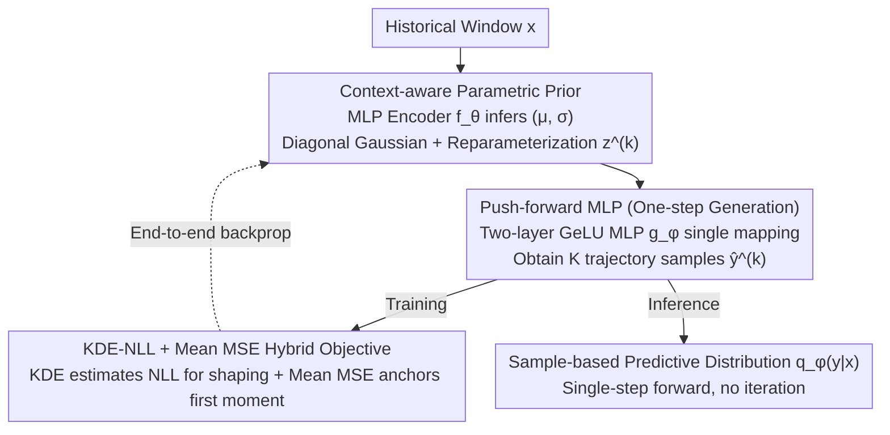

# Parametric Prior Mapping Framework for Non-stationary Probabilistic Time Series Forecasting

**Conference**: ICML 2026  
**arXiv**: [2605.23402](https://arxiv.org/abs/2605.23402)  
**Code**: https://github.com/ljl8336/PPM (Available)  
**Area**: Time Series  
**Keywords**: Probabilistic Time Series Forecasting, Non-stationarity, Parametric Prior, Push-forward Mapping, KDE-NLL

## TL;DR
PPM utilizes a lightweight encoder to infer context-aware Gaussian priors from historical sequences, then "pushes forward" this prior into a comprehensive predictive distribution using a two-layer MLP. Trained jointly with KDE-NLL and mean MSE, PPM outperforms diffusion models like DeepAR and NsDiff across seven time-series benchmarks while achieving $2 \times$ to $100 \times$ faster inference.

## Background & Motivation
**Background**: Probabilistic forecasting for multivariate time series primarily follows two paths. The first is the parametric route, such as DeepAR assuming a fixed Gaussian likelihood or BetterDeepAR learning time-varying covariance; these provide stability and efficiency through strong inductive biases. The second is the deep generative route, such as TimeGrad, TMDM, and NsDiff diffusion models, which gradually denoise noise into future trajectories; these are flexible but slow and data-intensive.

**Limitations of Prior Work**: While diffusion models can theoretically approximate any distribution from an arbitrary prior, in scenarios with limited samples and computational power, **the prior shape severely affects trajectory reachability**. TMDM uses $\mathcal{N}(f(\bm{x}),\mathbf{I})$ as an endpoint, where the variance is forcibly fixed to an identity matrix. NsDiff improves this by using a sliding window to calculate variance as a prior, but the window length is a fixed hyperparameter that cannot adapt to rapidly changing aleatoric uncertainty. The paper illustrates this using Traffic data: traffic volume variance differs drastically between 5–6 AM (trough) and 5–6 PM (peak), whereas priors in TMDM/NsDiff fail to match the true variance.

**Key Challenge**: Parametric methods possess strong inductive biases but weak expressiveness, while generative models offer expressiveness but lack structural priors and suffer from slow inference. Their strengths are complementary but have traditionally been treated as opposing approaches.

**Goal**: (1) Create a data-adaptive prior that changes with the input; (2) Retain the expressiveness of generative models to fit complex non-Gaussian conditional distributions; (3) Avoid the $T$-step iterative process of diffusion during inference.

**Key Insight**: Instead of making a generative model learn a transport mapping from uninformative noise, it is more efficient to "leverage" a context-aware Gaussian prior from the historical window using a parametric estimator (MLP). Then, a learned non-linear mapping "pushes forward" this structured prior into the final predictive distribution—significantly reducing the burden on the transport mapping and enabling single-step forward generation.

**Core Idea**: Construct **adaptive priors** via parametric estimation, then perform **one-step** conditional distribution generation using a push-forward MLP, utilizing a hybrid training strategy of KDE density estimation and mean MSE to anchor the first moment.

## Method

### Overall Architecture
Given a historical window $\bm{x}\in\mathbb{R}^{H\times C}$, the model outputs a sample-based predictive distribution over the forecast horizon $\bm{y}\in\mathbb{R}^{L\times C}$. The pipeline is divided into three stages:

1. **Parametric Prior Induction**: An MLP encoder $f_\theta(\bm{x})$ outputs latent variables $(\bm{\mu}, \bm{\sigma})\in\mathbb{R}^{C\times D}$ for each channel, defining a diagonal Gaussian conditional prior $p_\theta(\bm{z}|\bm{x})=\mathcal{N}(\bm{z};\bm{\mu},\text{diag}(\bm{\sigma}^2))$.
2. **Distribution Push-forward**: Using reparameterized sampling $\bm{z}^{(k)}=\bm{\mu}+\bm{\sigma}\odot\bm{\epsilon}^{(k)}$, the latent codes are mapped through a channel-independent two-layer GeLU MLP $g_\phi:\mathbb{R}^{C\times D}\to\mathbb{R}^{L\times C}$ to obtain $K$ trajectory samples $\hat{\bm{y}}^{(k)}=g_\phi(\bm{z}^{(k)})$. The predictive distribution is formalized as a push-forward measure $q_\phi(\bm{y}|\bm{x})=(g_\phi)_\# p_\theta(\bm{z}|\bm{x})$.
3. **Hybrid Objective Optimization**: Gaussian KDE is applied to the $K$ samples to estimate marginal densities $\hat{q}_h(y_{c,t}|\bm{x})$, using log-sum-exp to calculate NLL. An additional MSE term based on the sample mean anchors the first moment. Inference requires only one pass through $f_\theta$ followed by $K$ passes through $g_\phi$, without KDE.

### Key Designs

**1. Context-aware Parametric Prior: Adapting priors to inputs to address rigid prior variance in diffusion models**

While diffusion-based probabilistic forecasting can theoretically approximate any distribution, finite samples and compute mean the prior shape heavily impacts trajectory reachability. TMDM freezes endpoint variance to identity $\mathcal{N}(f(\bm{x}),\mathbf{I})$, and NsDiff uses fixed-length sliding window variance, which fails on data like Traffic where variance differs significantly between troughs and peaks. PPM uses a lightweight MLP $f_\theta$ to map the historical window $\bm{x}$ directly into latent space $(\bm{\mu},\bm{\sigma})$, defining a diagonal Gaussian conditional prior $p_\theta(\bm{z}|\bm{x}) = \mathcal{N}(\bm{z};\bm{\mu},\text{diag}(\bm{\sigma}^2))$. Reparameterized sampling $\bm{z}^{(k)} = \bm{\mu} + \bm{\sigma}\odot\bm{\epsilon}^{(k)}$ maintains differentiability. The latent dimension $D$ is "over-complete" to allow the prior to encode rich context. By making the prior "follow $\bm{x}$," time-varying aleatoric uncertainty is accounted for, and the framework remains backbone-agnostic (compatible with Transformers or RNNs).

**2. Push-forward MLP (One-step Generation): Mapping structured Gaussian priors to complex distributions in one step**

Diffusion's $T$-step denoising builds a bridge between generic noise and complex data. However, since the context is already embedded into the prior via parametric estimation, the transport mapping does not require iterative refinement. PPM employs a two-layer channel-independent GeLU MLP $g_\phi:\mathbb{R}^{C\times D}\to\mathbb{R}^{L\times C}$ to project latent codes into the prediction window in a single step, yielding $\hat{\bm{y}}^{(k)} = g_\phi(\bm{z}^{(k)})$. The predictive distribution is the push-forward measure $q_\phi(\bm{y}|\bm{x}) = (g_\phi)_\# p_\theta(\bm{z}|\bm{x})$. Theorem 5.2 guarantees that this measure is dense in the $W_1$ sense for any conditional distribution with finite first moments—meaning a single step is sufficient to express complex, non-Gaussian, and multimodal distributions. Because the prior handles context modeling, the mapping burden is low, and inference complexity drops from $O(BKT)$ to $O(B+BK)$.

**3. KDE-NLL + Mean MSE Hybrid Objective: Shaping distribution while anchoring point accuracy**

The model only produces samples and cannot provide direct density; pure KDE-NLL suffers from vanishing gradients (via near-zero Gaussian kernels) when samples are far from the ground truth early in training. PPM uses Gaussian KDE for each $(c,t)$ pair to estimate marginal density $\hat{q}_h(y_{c,t}|\bm{x}) = \frac{1}{Kh}\sum_k\mathcal{K}(\tfrac{y_{c,t}-\hat{y}_{c,t}^{(k)}}{h})$ and calculates NLL for distribution shaping. Simultaneously, it adds $\mathcal{L}_{\text{MM}} = \|\bm{y}-\frac{1}{K}\sum_k\hat{\bm{y}}^{(k)}\|^2$ to anchor the first moment. The total loss is $\mathcal{L}_{\text{total}} = \alpha\mathcal{L}_{\text{NLL}} + \mathcal{L}_{\text{MM}}$ ($\alpha=0.1$, $h=0.3$). Theorem 5.1 formulates KDE bias ($O(h^2/\varepsilon)$) and variance ($O(1/(\varepsilon h\sqrt{K}))$) as functions of $h$ and $K$, indicating they must be co-tuned. The division of labor is clear: MSE anchors provide dense, stable gradients "pulling toward the mean" (Eq. 16), while KDE-NLL uses responsibility-weighted residuals (Eq. 15) to shape the distribution—a "dense anchor + sparse shaping" combination universal to sample-based likelihood learning.

### Loss & Training
- During training, $K=100$ trajectories are sampled; KDE bandwidth $h=0.3$; weight $\alpha=0.1$.
- Encoder $f_\theta$ and mapping $g_\phi$ are both MLPs, trained with end-to-end backpropagation.
- For inference, 100 samples approximate the predictive distribution; only one pass of $f_\theta$ and a single-step $g_\phi$ are required.

## Key Experimental Results

### Main Results
On seven real-world datasets (ETTh1/h2/m1/m2, Weather, Electricity, Traffic), compared against 6 SOTA baselines (DeepAR, TimeGrad, TimeDiff, D3VAE, DiffusionTS, TMDM, NsDiff), averaged over 5 runs.

| Dataset | Metric | PPM (Ours) | Runner-up (NsDiff) | Gain |
|--------|------|------|----------|------|
| Electricity | CRPS | 0.206 | 0.286 | **-28.0%** |
| Electricity | QICE | 2.435 | 7.595 | **-67.9%** |
| Traffic | CRPS | 0.252 | 0.367 | **-31.3%** |
| Traffic | QICE | 2.744 | 8.366 | **-67.2%** |
| ETTh1 | CRPS | 0.337 | 0.417 | -19.2% |
| ETTh2 | MSE | 0.376 | 0.448 | -16.1% |
| Weather | CRPS | 0.215 | 0.240 (TMDM) | -10.4% |

CRPS achieved SOTA on all 7 datasets; QICE achieved SOTA on 6/7 (slightly behind NsDiff on ETTh2). MSE/MAE are SOTA across all 7. PPM gains are most significant in datasets with complex dynamics (high Variance), such as Traffic (Variance=14.225).

### Ablation Study

| Configuration | ETTm1 MSE | ETTm1 CRPS | ETTm1 QICE | Elec MSE | Elec CRPS | Elec QICE |
|------|-----------|------------|------------|----------|-----------|-----------|
| Full PPM | **0.381** | **0.314** | **1.782** | **0.182** | **0.206** | **2.435** |
| w/o NLL | 0.371 | 0.345 | 6.342 | 0.182 | 0.257 | 8.317 |
| w/o MM (Mean MSE) | 0.407 | 0.324 | 1.912 | 0.191 | 0.213 | 5.697 |

Ablation of Prior Form (Table 4, Traffic): Using raw Gaussian/Uniform as the predictive distribution yielded QICE of 2.414/3.715. Adding push-forward improved Gaussian $\to$ 2.744 (CRPS 0.266 $\to$ 0.252) and Uniform $\to$ 2.616 (CRPS 0.271 $\to$ 0.251), indicating the push-forward is **insensitive to the prior form**.

### Key Findings
- **MM loss primarily stabilizes point prediction**: Removing MM significantly increases MSE (ETTm1: 0.381 $\to$ 0.407), confirming theoretical analysis of KDE-NLL's unstable early gradients.
- **NLL loss primarily shapes distribution**: Removing NLL severely worsens QICE (ETTm1: 1.782 $\to$ 6.342, Electricity: 2.435 $\to$ 8.317) and CRPS, showing distribution calibration depends on NLL.
- **Inference Speedup $2\times$–$100\times$**: Compared to diffusion models like TimeGrad/TMDM/NsDiff, PPM compresses $T$-step denoising into a single-step mapping, reducing theoretical complexity by $\Theta(T)$.
- **Superior in Non-stationary settings**: On Traffic, which has the highest Fourier variance (14.225), PPM achieved its largest gains over NsDiff (CRPS -31.3%, QICE -67.2%), validating the importance of context-aware priors.
- **Higher and Stable MI lower bound**: Figure 4 shows the lower bound of mutual information between latent variable $\bm{z}$ and input $\bm{x}$ is higher for PPM than baselines, proving the prior effectively "absorbs" context.

## Highlights & Insights
- **Upgrading Prior from Rigid Gaussian/Sliding Window to Learnable Context-aware Distribution**: This is a simple yet profound modification to diffusion-based forecasting. Existing methods recognize the importance of the prior but treat its "shape" as a hyperparameter; PPM lets $\bm{x}$ determine prior parameters, fundamentally resolving mismatch in non-stationary scenarios.
- **"Doing Less" is Faster and More Accurate**: Folding $T$-step denoising into single-step push-forward follows the paradigm of "exchanging iterations for inductive bias." As long as the prior handles significant context modeling, the transport mapping requires fewer refinement steps. This approach could transfer to other generative tasks (e.g., conditional image generation) by using a lightweight branch to calculate condition-aware priors.
- **Complementarity of KDE-NLL and Mean MSE**: Equations 15 and 16 elegantly explain the division of labor—KDE-NLL gradients are sparsified by responsibility weights (winner-take-all), while MM gradients are dense, constantly pulling the mean toward the truth.
- **Strong Theoretical Foundation**: Theorem 5.1 formulates KDE bias and variance as functions of $h$ and $K$, providing principled guidance for hyperparameter co-tuning rather than relying on trial and error.

## Limitations & Future Work
- **KDE Bandwidth Sensitivity**: Authors admit that in extreme/rapidly changing regimes, a single fixed $h$ amplifies estimation error. Learnable bandwidths or multi-bandwidth KDE are logical extensions.
- **Marginal vs. Joint Distribution**: Current NLL is calculated as marginal density per $(c,t)$, without explicitly modeling joint dependencies across time/variables. For path-dependent decisions (e.g., risk management), energy scores or variogram scores might be necessary.
- **Limited Calibration Evaluation**: Relies primarily on CRPS/QICE; lacks reliability diagrams or fine-grained quantile coverage evaluation over time for non-stationary calibration checks.
- **Strong Theoretical Assumptions**: Theorem 5.2's density guarantee is "per fixed $\bm{x}$" and doesn't provide uniform approximation rates; sample complexity for conditional distributions remains open.
- **Narrow Backbone Analysis**: The main text focuses on MLP; more complex backbones like Transformers are relegated to the appendix. Maintaining speed advantages with Transformers is a practical consideration.

## Related Work & Insights
- **vs TMDM (NeurIPS'24)**: Both treat the prior as learnable, but TMDM ($\mathcal{N}(f(\bm{x}),\mathbf{I})$) freezes variance to identity and uses diffusion; PPM allows variance to adapt to $\bm{x}$ and compresses denoising to a single step, speeding up inference by 2–100$\times$.
- **vs NsDiff (ICLR'25)**: NsDiff uses fixed sliding window variance as a prior, which helps with **short-term** non-stationarity but remains rigid. PPM's $\bm{\sigma}(\bm{x})$ tracks dynamics adaptively.
- **vs Flow-based / Normalizing Flow**: Both use push-forward perspectives; however, NF usually requires invertible mappings and tractable Jacobians, limiting complexity. PPM bypasses likelihood calculation via KDE, allowing freer architectures.
- **vs DeepAR**: DeepAR is purely parametric (autoregressive RNN + fixed Gaussian); PPM retains this efficiency but uses a sample-based output, enabling fitment of non-Gaussian distributions.
- **Insight**: The condition-aware prior + lightweight push-forward paradigm can transfer to any field where diffusion is "too slow"—such as conditional image or video generation—provided a cheap parametric estimator can be constructed.

## Rating
- Novelty: ⭐⭐⭐⭐ Elegantly bridges parametric and generative paths. While individual components (reparameterization, KDE-NLL) are known, their specific combination for probabilistic forecasting is novel.
- Experimental Thoroughness: ⭐⭐⭐⭐ SOTA across 7 datasets and 4 metrics; rigorous ablation of loss and prior forms; logic analysis of MI. Lacks reliability diagrams across horizons.
- Writing Quality: ⭐⭐⭐⭐ Figure 1 addresses the pain point directly; theorems align with the method. Minor typos ("triaining").
- Value: ⭐⭐⭐⭐ High practical utility—SOTA accuracy + massive speedup for production environments (energy, finance). The methodology is transferable to the broader generative model community.

<!-- RELATED:START -->

## Related Papers

- [\[ICML 2026\] Dynamic-TMoE: A Drift-Aware Dynamic Mixture of Experts Framework for Non-Stationary Time Series](dynamic_tmoe_a_drift-aware_dynamic_mixture_of_experts_framework_for_non-stationa.md)
- [\[AAAI 2026\] Towards Non-Stationary Time Series Forecasting with Temporal Stabilization and Frequency Differencing](../../AAAI2026/time_series/towards_non-stationary_time_series_forecasting_with_temporal_stabilization_and_f.md)
- [\[ICML 2026\] CombinationTS: A Modular Framework for Understanding Time-Series Forecasting Models](combinationts_a_modular_framework_for_understanding_time-series_forecasting_mode.md)
- [\[ICML 2026\] U-Cast: A Surprisingly Simple and Efficient Frontier Probabilistic AI Weather Forecasting](u-cast_a_surprisingly_simple_and_efficient_frontier_probabilistic_ai_weather_for.md)
- [\[NeurIPS 2025\] Neural MJD: Neural Non-Stationary Merton Jump Diffusion for Time Series Prediction](../../NeurIPS2025/time_series/neural_mjd_neural_non-stationary_merton_jump_diffusion_for_time_series_predictio.md)

<!-- RELATED:END -->
