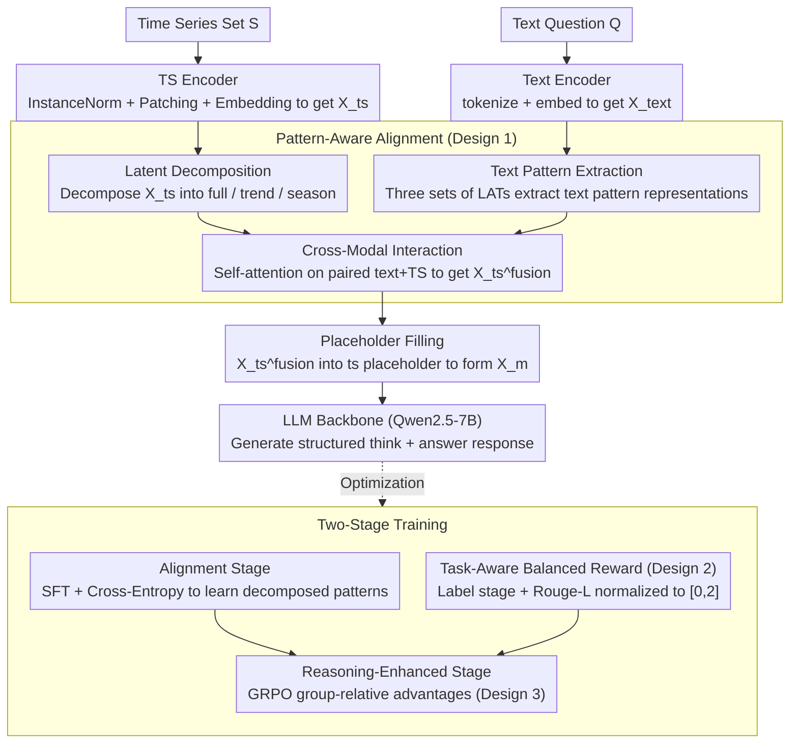

# PATRA: Pattern-Aware Alignment and Balanced Reasoning for Time Series Question Answering

**Conference**: ICML 2026  
**arXiv**: [2602.23161](https://arxiv.org/abs/2602.23161)  
**Code**: [github.com/decisionintelligence/PATRA](https://github.com/decisionintelligence/PATRA)  
**Area**: Time Series / Multimodal / Reinforcement Learning  
**Keywords**: Time Series Question Answering, Pattern-Aware Alignment, GRPO, Balanced Rewards, Cross-Modal Reasoning

## TL;DR
For Time Series Question Answering (TSQA), PATRA explicitly decomposes sequences into full / trend / season patterns at the representation level and performs deep cross-modal alignment via three sets of learnable alignment tokens. At the training stage, it utilizes a two-phase RL approach (SFT + GRPO), mapping rewards from discriminative and generative tasks into a unified $[0,2]$ range to resolve difficulty imbalance, outperforming text-only LLMs and multimodal TS-LLMs like ChatTS across four categories of TSQA tasks.

## Background & Motivation

**Background**: Time Series Question Answering (TSQA) is currently a highly focused application for time series foundation models. Two main technical routes have emerged: (a) Unimodal reasoning, where numerical sequences are directly tokenized as text for LLMs (e.g., LLMTime, DeepSeek-R1 style); (b) Multimodal shallow alignment, mimicking VLMs by patching sequences and projecting them to concatenate with text embeddings (e.g., ChatTS, ITFormer style).

**Limitations of Prior Work**: The first approach ignores fundamental differences in information density and continuity between time series and text, making it difficult for models to make precise judgments based on structural patterns like "trend / seasonality." The second approach relies on simple "image-text style concatenation," lacking explicit multi-layer dynamic modeling for time series, resulting in superficial "deep alignment." A more hidden pain point lies in the training objectives: TSQA task sets span the entire spectrum from binary classification to open-ended generation. Simple tasks reach reward saturation easily, while complex reasoning tasks have sparse rewards. Naive SFT/RL leads the model to "game simple tasks," causing reward hacking and the erosion of deep reasoning capabilities.

**Key Challenge**: The "depth" of cross-modal alignment is capped by the patch-concat paradigm; the "balance" of multi-task training is disrupted by differences in reward scales and gradient magnitudes. Neither issue can be solved by simply scaling data.

**Goal**: (1) Explicitly extract different semantic levels of time series (full / trend / seasonality) and enable the text side to learn corresponding granules of query representations for true "pattern-level" alignment; (2) Design a reward system insensitive to task difficulty to allow stable GRPO optimization across heterogeneous tasks.

**Key Insight**: The authors observe that "interpretable behaviors" in time series (e.g., financial decisions, energy scheduling) are almost entirely built upon trend and seasonality. This provides a natural inductive bias for "pattern-based decomposition and alignment." Additionally, mapping different reward distributions to the same scale in reinforcement learning can mitigate optimization imbalance under multi-task scenarios.

**Core Idea**: Use "Latent Space Pattern Decomposition + Learnable Alignment Token (LAT) Multi-way Cross-Attention" for deep alignment at the representation layer; use "Two-stage SFT $\to$ GRPO + Stage-wise label reward + Rouge-L generation reward + $[0,2]$ normalization" for balanced reasoning at the training layer.

## Method

### Overall Architecture
PATRA consists of a Text Encoder (using the LLM's default tokenizer and embedding), a TS Encoder (Instance Norm + Patching + Embedding), a Pattern-Aware Alignment module, and an LLM Backbone (Qwen2.5-7B). Text and time series are encoded separately and sent to the alignment module. The aligned TS tokens are filled back into the text sequence via `<ts>...</ts>` placeholders, and the entire sequence is processed by the LLM to generate responses in a `<think>...</think><answer>...</answer>` format. Training is divided into two stages: SFT on large-scale TSQA data (Alignment Stage), followed by GRPO with composite rewards (Reasoning-Enhanced Stage).

### Key Designs

**1. Pattern-Aware Alignment (PAA): Upgrading TS-Text Alignment to "Pattern-Level Deep Alignment"**

Approaches like ChatTS or ITFormer merely project patches and concatenate them, leading to superficial alignment where the LLM struggles to reference structural concepts like "trend" or "seasonality." PAA embeds decomposition intuition into attention in three steps. First, Latent Space Decomposition: The full component uses $X_{ts}^f$, the trend component uses moving average $X_{ts}^t = \text{Avgpool}(\text{padding}(X_{ts}))$, and the seasonal component takes the residual $X_{ts}^s = X_{ts} - X_{ts}^t$. Decomposition occurs in latent space to preserve semantic information. Second, Text-side Pattern Extraction: Three sets of Learnable Alignment Tokens (LATs) $Q_{full}, Q_{trend}, Q_{sea}$ act as queries for multi-head attention on text embeddings $X_k^{text} = \text{Attention}(Q_k, K, V)$. Third, Cross-modal Interaction: Each pair $(X_k^{text}, X_{ts}^j)$ is concatenated as a new query for self-attention, allowing TS tokens to absorb text semantics corresponding to that pattern, finally fusing into $X_{ts}^{fusion}$. This avoids "pattern entanglement," enabling the LLM to distinguish between "trend growth" and "seasonal cyclic retracement."

**2. Task-Aware Balanced Reward: Unified Reward Scales across Heterogeneous Tasks**

TSQA tasks vary from binary judgment to open generation. Simple tasks saturate rewards quickly, while complex reasoning tasks have sparse rewards. PATRA categorizes tasks for specific rewards: Labeled tasks (selection/judgment) use stage-wise rewards $r_{label} = \sum_{k=1}^K \lambda_k r_k(\text{answer})$, verifying "within candidate range $\to$ correct option" to avoid high gradient noise from binary end-to-end rewards. Generative tasks use Rouge-L as a continuous reward $r_{generation} = \text{TextScore}(\text{answer}, y^\star)$. Crucially, all rewards are **linearly mapped to the $[0,2]$ interval** and combined with format rewards: $r(\tau) = r_{format}(\tau) + r_{task}(\tau)$. Normalized scales eliminate reward variance; removing this causes Prescience Acc to drop from 52.78 to 35.18.

**3. GRPO + Composite Reward Optimization: Inducing CoT and Multi-task Reasoning**

SFT alone only leads to "answer imitation" without producing `<think>...</think>` structures (Reasoning Acc is only 13.51% with SFT only). PATRA employs Group Relative Policy Optimization (GRPO): for each prompt, a group of responses is sampled. Group-relative standardized advantages $\hat A_{group}(\tau) = (r(\tau) - \mu)/(\sigma + \epsilon)$ replace the PPO value function. This maximizes $L(\theta) = \mathbb{E}_{\tau\sim\pi_{\theta_{old}}}[\frac{\pi_\theta(\tau)}{\pi_{\theta_{old}}(\tau)}\hat A_{group}(\tau)]$ with a KL constraint. Group standardization combined with $[0,2]$ reward normalization provides dual stability, which is highly beneficial for the sparse positive samples in TSQA.

### Loss & Training
The Alignment Stage uses standard cross-entropy SFT to help the model "understand" decomposed TS patterns. The Reasoning-Enhanced Stage switches to GRPO, where all rewards are mapped to $[0,2]$ and weighted. During inference, the model generates responses in the `<think>...</think><answer>...</answer>` format, and the answer section is extracted via rules for evaluation. Training utilizes 4 A800 GPUs with Qwen2.5-7B as the backbone.

## Key Experimental Results

### Main Results
The TSQA dataset (Kong et al., 2025) contains ~200k samples across 12+ domains and four task types (Comprehension / Recognition / Reasoning / Prescience). Accuracy is used for labeled tasks, and Rouge-L for generative tasks.

| Model | Comp. Acc / Rou. | Recog. Acc / Rou. | Reason. Acc / Rou. | Presc. Acc / Rou. |
|---|---|---|---|---|
| GPT-4o (Upper Bound) | 50.86 / 11.99 | 69.65 / 4.75 | 50.00 / 7.75 | 66.66 / 6.78 |
| Qwen2.5-7B | 42.24 / 18.77 | 45.51 / 10.32 | 36.48 / 18.72 | 26.85 / 10.67 |
| ChatTS-7B | 44.83 / 13.30 | 36.00 / 13.23 | 22.97 / 15.84 | 25.92 / 13.99 |
| ITFormer-7B | 40.52 / 14.24 | 45.24 / 14.61 | 30.40 / 15.58 | 44.44 / 15.25 |
| **PATRA-7B (Ours)** | **56.03 / 25.67** | **64.69 / 25.46** | **44.59 / 27.36** | **52.78 / 27.06** |

PATRA achieves SOTA among open-source models across all 4 tasks for both Accuracy and Rouge-L. Recognition is +19.18% over the strongest text model, and Prescience is +26.86% over ChatTS, approaching GPT-4o performance. Out-of-Domain experiments (Weather/Finance excluded from training) show PATRA is SOTA across 6 Finance and 2 Weather metrics on MTBench.

### Ablation Study

| Configuration | Reason. Acc / Rou. | Presc. Acc / Rou. | Note |
|---|---|---|---|
| Full PATRA | 44.59 / 27.36 | 52.78 / 27.06 | Complete model |
| w/ Single-Pattern Alignment | 35.81 / 26.19 | 37.03 / 24.03 | Single pattern only, drop in Acc |
| w/o Pattern-Aware Alignment | 28.37 / 16.81 | 30.55 / 16.94 | No PAA module |
| w/o Reasoning-Enhanced Stage | 13.51 / 2.92 | 16.66 / 13.06 | SFT only, largest drop, proves RL criticality |
| Original (unscaled) Reward | 37.84 / 21.64 (Reason.) | 35.18 / 16.88 (Presc.) | No $[0,2]$ normalization, Prescience drops 17.6 |
| Balanced Reward | 44.59 / 27.36 | 52.78 / 27.06 | Normalized rewards |

### Key Findings
- **Reasoning-Enhanced Stage contributes most**: SFT alone yields only 13.51% Reasoning Acc; GRPO + composite rewards jump to 44.59%, proving RL is the key transition from "imitating answers" to "generating reasoning chains."
- **PAA impact on generative tasks**: Removing PAA drops Reasoning Rouge from 27.36 to 16.81, showing deep alignment allows generated paragraphs to "cite" TS patterns rather than vaguely rephrasing.
- **Reward $[0,2]$ normalization is critical**: Scaling Prescience Acc from 35.18 to 52.78 proves that cross-task reward scales are decisive for GRPO stability.
- **Case studies** show PATRA identifies cyclic retracements in non-stationary, high-volatility sequences where ChatTS / Qwen2.5 only output vague descriptions like "gradually increasing."

## Highlights & Insights
- Moving "time series decomposition" from preprocessing to the embedding space with learnable text-side LATs is a natural way to embed signal processing intuition into LLMs—preserving trend/seasonality interpretability without requiring extra spectral encoders.
- Reward $[0,2]$ normalization is a simple but powerful technique for GRPO stability in heterogeneous tasks. This can be transferred to any "multi-task RLHF" scenario (e.g., code + chat + math).
- Stage-wise label rewards provide "early dense signals," essentially adding curriculum structure to rewards, which is valuable for sparse-reward RL training.
- The `<ts>...</ts>` placeholder strategy preserves the original NL structure and avoids distribution shifts introduced by alignment tokens.

## Limitations & Future Work
- Current decomposition only uses trend/season (plus full). Its explanatory power is limited for sequences with regime changes or sudden events (e.g., financial crashes).
- PAA computation scales with sequence length and LAT count $T$; long-sequence reasoning costs are not detailed.
- Evaluation is primarily on TSQA + MTBench. While cross-task generalization is shown, zero-shot robustness to real-world production data streams remains to be investigated.
- The $[0,2]$ normalization boundaries are somewhat ad-hoc; whether they compress reward signals for extremely difficult tasks is undiscussed.
- GRPO uses rule-based rewards; exploring Process Reward Models (PRMs) for long-chain reasoning could be a future direction.

## Related Work & Insights
- **vs ChatTS / ITFormer**: They perform "shallow alignment" (patch projection + concat); PATRA explicitly decomposes patterns and aligns them multi-way, showing a +28.69% Gain in Recognition.
- **vs Time-MQA**: While Time-MQA uses a unified QA framework, it is SFT-dominated; PATRA adds RL and task balancing for more stable cross-task performance.
- **vs TimeOmni-1**: TimeOmni emphasizes interpretable reasoning chains but lacks deep alignment; PATRA embeds "patterns" into representations for data-driven interpretability.
- **vs DeepSeek-R1 (on TSQA)**: Pure text RL models show only 12.41% Acc in Recognition, indicating that without specialized TS representations, RL advantages are difficult to realize.

## Rating
- Novelty: ⭐⭐⭐⭐ Pattern-Aware Alignment combines decomposition intuition with cross-modal attention effectively.
- Experimental Thoroughness: ⭐⭐⭐⭐ Extensive evaluation across 4 tasks + OOD MTBench + thorough ablation studies.
- Writing Quality: ⭐⭐⭐⭐ Strong logic from motivation to method and ablation; clear diagrams.
- Value: ⭐⭐⭐⭐ Sets a new SOTA for TS-Language models; reward balancing is highly relevant for multi-task RL.

<!-- RELATED:START -->

## Related Papers

- [\[ACL 2026\] TSAQA: Time Series Analysis Question And Answering Benchmark](../../ACL2026/time_series/tsaqa_time_series_analysis_question_and_answering_benchmark.md)
- [\[ACL 2026\] ODTQA-FoRe: An Open-Domain Tabular Question Answering Dataset for Future Data Forecasting and Reasoning](../../ACL2026/time_series/odtqa-fore_an_open-domain_tabular_question_answering_dataset_for_future_data_for.md)
- [\[ICML 2026\] Adaptive Time Series Reasoning via Segment Selection](adaptive_time_series_reasoning_via_segment_selection.md)
- [\[ICML 2026\] Interpretability in Deep Time Series Models Demands Semantic Alignment](interpretability_in_deep_time_series_models_demands_semantic_alignment.md)
- [\[ACL 2025\] Time-MQA: Time Series Multi-Task Question Answering with Context Enhancement](../../ACL2025/time_series/time-mqa_time_series_multi-task_question_answering_with_context_enhancement.md)

<!-- RELATED:END -->
