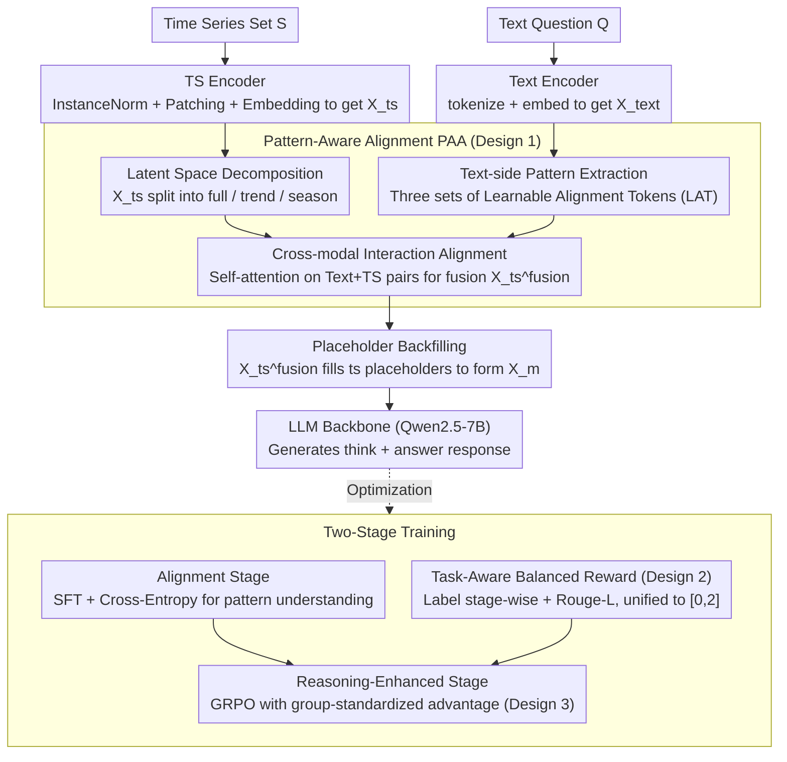

# PATRA: Pattern-Aware Alignment and Balanced Reasoning for Time Series Question Answering

**Conference**: ICML 2026  
**arXiv**: [2602.23161](https://arxiv.org/abs/2602.23161)  
**Code**: [github.com/decisionintelligence/PATRA](https://github.com/decisionintelligence/PATRA)  
**Area**: Time Series / Multimodal / Reinforcement Learning  
**Keywords**: Time Series Question Answering (TSQA), Pattern-Aware Alignment, GRPO, Balanced Reward, Cross-Modal Reasoning

## TL;DR
For Time Series Question Answering (TSQA), PATRA explicitly decomposes sequences into full / trend / season patterns at the representation level and performs deep cross-alignment with text through three sets of learnable alignment tokens. At the training stage, it utilizes a two-stage reinforcement learning (SFT + GRPO) approach that maps rewards from both discriminative and generative tasks into a unified range of $[0,2]$ to resolve reward imbalance, consistently outperforming text LLMs and multimodal TS-LLMs like ChatTS across four types of TSQA tasks.

## Background & Motivation

**Background**: Time Series Question Answering (TSQA) is currently the most prominent application for time series foundation models. Two mainstream approaches have emerged: (a) unimodal reasoning, where numerical sequences are directly tokenized into text for LLMs (similar to LLMTime or DeepSeek-R1 style); and (b) shallow multimodal alignment, which mimics VLMs by patching sequences for projection and concatenating them with text embeddings (similar to ChatTS or ITFormer).

**Limitations of Prior Work**: The first approach ignores the fundamental differences in information density and continuity between time series and text, making it difficult for models to make precise judgments based on structural patterns like "trend" or "seasonality." The second approach relies on simple "image-text style concatenation," lacking deep dynamic modeling for time series specifics, making "deep alignment" more a matter of form than function. A more subtle issue lies in the training objectives: TSQA tasks span from binary classification to open-ended generation. Simple tasks can reach reward saturation quickly, while rewards for complex reasoning tasks remain sparse. Naive SFT/RL leads to models "gaming" simple tasks, resulting in reward hacking and the atrophy of deep reasoning capabilities.

**Key Challenge**: The "depth" of cross-modal alignment is restricted by the ceiling of the patch-concat paradigm, while the "balance" of multi-task training is disrupted by variances in reward scales and gradient magnitudes. Neither can be solved by simply scaling up data.

**Goal**: (1) Explicitly extract different semantic levels (overall / trend / seasonality) from time series and enable the text side to learn corresponding query representations for true "pattern-level" alignment; (2) Design a difficulty-insensitive reward system to allow stable GRPO optimization across heterogeneous tasks.

**Key Insight**: Observations suggest that interpretable time series behaviors are almost entirely built upon trend and seasonality—financial decisions and energy scheduling rely on cycles and pullbacks. This provides a natural inductive bias for "decomposition-based alignment." Furthermore, mapping different reward distributions to a common scale in reinforcement learning can mitigate optimization imbalances in multi-task settings.

**Core Idea**: Use "latent space pattern decomposition + multi-channel cross-attention with Learnable Alignment Tokens (LAT)" for deep alignment at the representation layer; implement "two-stage SFT $\to$ GRPO + Stage-wise label reward + Rouge-L generation reward + $[0,2]$ normalization" for balanced reasoning at the training layer.

## Method

### Overall Architecture
PATRA consists of a Text Encoder (utilizing the LLM's tokenizer and embeddings), a TS Encoder (Instance Norm + Patching + Embedding), a Pattern-Aware Alignment module, and an LLM Backbone (Qwen2.5-7B). Text and sequences are encoded separately and fed into the alignment module. The aligned time series tokens backfill the `<ts>...</ts>` placeholders in the text sequence, and the entire sequence is processed by the LLM to generate a structured response in the format of `<think>...</think><answer>...</answer>`. Training is divided into two stages: SFT on large-scale TSQA data (Alignment Stage), followed by GRPO with composite rewards (Reasoning-Enhanced Stage).

### Key Designs

**1. Pattern-Aware Alignment (PAA): Upgrading alignment from "shallow concatenation" to "pattern-level deep alignment"**

Common practices like ChatTS or ITFormer replicate VLM techniques by projecting patches and concatenating them with text, which fails to allow LLMs to precisely reference structural concepts like "trends" or "seasonality." PAA embeds decomposition intuition into the attention mechanism in three steps. First, Latent Space Decomposition: the full component uses $X_{ts}^f$, the trend component uses moving average $X_{ts}^t = \text{Avgpool}(\text{padding}(X_{ts}))$, and the seasonal component is the residual $X_{ts}^s = X_{ts} - X_{ts}^t$—decomposition occurs in the latent space to preserve semantic info. Second, Text-side Pattern Extraction: three sets of Learnable Alignment Tokens (LAT) $Q_{full}, Q_{trend}, Q_{sea}$ act as queries to extract pattern-specific text representations $X_k^{text} = \text{Attention}(Q_k, K, V)$. Using LAT instead of fixed prompts allows the text side to learn pattern expressions. Third, Cross-modal Interaction: each $(X_k^{text}, X_{ts}^j)$ pair is used for self-attention, allowing TS tokens to absorb text semantics corresponding to that pattern, finally fusing into $X_{ts}^{fusion}$. This triple-stream alignment prevents "pattern entanglement," enabling the LLM to distinguish between "rising trends" and "seasonal pullbacks."

**2. Task-Aware Balanced Reward: Unifying heterogeneous task rewards to prevent reward hacking**

TSQA spans from binary judgment to open generation. Simple tasks saturate rewards easily, while complex reasoning tasks have sparse rewards. Standard SFT/RL causes the model to over-optimize simple tasks, leading to the atrophy of reasoning. PATRA categorizes tasks into two types for rewards: labeled tasks (selection/judgment) use a stage-wise reward $r_{label} = \sum_{k=1}^K \lambda_k r_k(\text{answer})$, verifying "within candidate range $\to$ correct option" to avoid high initial gradient noise from binary rewards. Generative tasks use Rouge-L as a continuous reward $r_{generation} = \text{TextScore}(\text{answer}, y^\star)$ for sequence-level alignment. Crucially, all rewards are **linearly mapped to the $[0,2]$ interval** and combined with a format reward for the total GRPO reward $r(\tau) = r_{format}(\tau) + r_{task}(\tau)$. This $[0,2]$ normalization eliminates scale differences—removing it drops Prescience Acc from 52.78 to 35.18, proving its necessity for stability.

**3. GRPO + Composite Reward Optimization: Inducing CoT and multi-task reasoning above SFT**

SFT alone allows the model to "imitate answers" but fails to generate the `<think>...</think>` reasoning structure (Reasoning Acc is only 13.51% with only SFT). PATRA employs Group Relative Policy Optimization: multiple responses are sampled per prompt, and group-standardized advantage $\hat A_{group}(\tau) = (r(\tau) - \mu)/(\sigma + \epsilon)$ replaces the PPO value function. The objective maximizes $L(\theta) = \mathbb{E}_{\tau\sim\pi_{\theta_{old}}}[\frac{\pi_\theta(\tau)}{\pi_{\theta_{old}}(\tau)}\hat A_{group}(\tau)]$ with KL constraints. Group standardization combined with $[0,2]$ normalization provides dual stability, which is particularly beneficial for sparse positive examples in TSQA.

### Loss & Training
The Alignment Stage uses standard cross-entropy SFT to help the model "read" decomposed patterns. The Reasoning-Enhanced Stage switches to GRPO, where all rewards are mapped to $[0,2]$ and weighted. During inference, the model generates responses with a `<think>...</think><answer>...</answer>` structure; the answer is extracted via rule-based methods for evaluation. Training used 4 A800 GPUs with Qwen2.5-7B as the backbone.

## Key Experimental Results

### Main Results
The TSQA dataset (Kong et al., 2025) contains ~200k samples across 12+ domains and four task types (Comprehension / Recognition / Reasoning / Prescience). Accuracy is used for labeled tasks, and Rouge-L for generative tasks.

| Model | Comp. Acc / Rou. | Recog. Acc / Rou. | Reason. Acc / Rou. | Presc. Acc / Rou. |
|---|---|---|---|---|
| GPT-4o (Upper Bound) | 50.86 / 11.99 | 69.65 / 4.75 | 50.00 / 7.75 | 66.66 / 6.78 |
| Qwen2.5-7B | 42.24 / 18.77 | 45.51 / 10.32 | 36.48 / 18.72 | 26.85 / 10.67 |
| ChatTS-7B | 44.83 / 13.30 | 36.00 / 13.23 | 22.97 / 15.84 | 25.92 / 13.99 |
| ITFormer-7B | 40.52 / 14.24 | 45.24 / 14.61 | 30.40 / 15.58 | 44.44 / 15.25 |
| **PATRA-7B** | **56.03 / 25.67** | **64.69 / 25.46** | **44.59 / 27.36** | **52.78 / 27.06** |

PATRA achieves SOTA across all four tasks for both Accuracy and Rouge-L among open-source models. Recognition improves by +19.18% over the strongest text-only model, and Prescience improves by +26.86% over ChatTS, approaching GPT-4o performance. Out-of-Domain (OOD) experiments (excluding Weather/Finance from training) show PATRA leads in MTBench metrics, including 43.70% in Finance 30-day 5-way trend prediction (vs GPT-5.2 36.05%).

### Ablation Study

| Configuration | Reason. Acc / Rou. | Presc. Acc / Rou. | Description |
|---|---|---|---|
| Full PATRA | 44.59 / 27.36 | 52.78 / 27.06 | Complete model |
| w/ Single-Pattern Alignment | 35.81 / 26.19 | 37.03 / 24.03 | Alignment on unified pattern only |
| w/o Pattern-Aware Alignment | 28.37 / 16.81 | 30.55 / 16.94 | Removal of PAA module |
| w/o Reasoning-Enhanced Stage | 13.51 / 2.92 | 16.66 / 13.06 | SFT only; underlines RL criticality |
| Original (unscaled) Reward | 37.84 / 21.64 (Reason.) | 35.18 / 16.88 (Presc.) | Without $[0,2]$ normalization |
| Balanced Reward | 44.59 / 27.36 | 52.78 / 27.06 | Complete normalization |

### Key Findings
- The Reasoning-Enhanced Stage provides the largest gain: Reasoning Acc jumps from 13.51% (SFT only) to 44.59%, proving RL is key for transitioning from "imitating answers" to "generating chain-of-thought."
- PAA significantly impacts generative tasks: removing PAA drops Reasoning Rouge from 27.36 to 16.81, indicating deep alignment allows the model to "quote" specific patterns rather than generic descriptions.
- $[0,2]$ reward normalization improved Prescience Acc from 35.18 to 52.78, proving scale consistency is vital for GRPO multi-task stability.
- Case studies show PATRA identifies cyclic pullbacks in non-stationary, high-volatility sequences where ChatTS / Qwen2.5 only output vague descriptions like "gradually increasing."

## Highlights & Insights
- Implementing "time series decomposition" within the latent space and pairing it with learnable text-side tokens (LAT) is a natural way to integrate signal processing priors into LLMs while maintaining interpretability without extra spectral encoders.
- The $[0,2]$ reward scaling is simple but highly effective for GRPO stability in heterogeneous tasks; this technique is transferable to any "multi-task RLHF" scenario, such as concurrent RL for code, dialogue, and math.
- Stage-wise label rewards provide "early dense signals," essentially adding curriculum structure to rewards, which is valuable for sparse-reward RL training.
- The `<ts>...</ts>` placeholder strategy preserves original NL structure and avoids distribution shifts introduced by alignment tokens.

## Limitations & Future Work
- Current decomposition only uses trend / season (plus full); it has limited explanatory power for sequences with regime changes or abrupt events (e.g., financial crashes).
- PAA computation scales rapidly with sequence length and the number of LAT tokens.
- Evaluation is primarily on TSQA and MTBench; zero-shot robustness on real-world industrial data streams requires further investigation.
- The choice of boundaries for $[0,2]$ normalization is somewhat ad-hoc; whether reward signals for extremely difficult tasks are overly compressed is not discussed.
- GRPO currently only uses rule-based rewards; whether process supervision (PRM) can further enhance long-chain reasoning is an area for exploration.

## Related Work & Insights
- **vs ChatTS / ITFormer**: These models perform "shallow alignment" via patch projection and concatenation; PATRA uses explicit decomposition and multi-channel alignment, improving Recognition by 28.69%.
- **vs Time-MQA**: While Time-MQA uses a unified QA framework, it is SFT-driven; PATRA adds RL and task balancing for more stable multi-task performance.
- **vs TimeOmni-1**: TimeOmni emphasizes interpretable reasoning chains but lacks deep alignment; PATRA embeds patterns into representations for data-driven interpretability.
- **vs DeepSeek-R1 (on TSQA)**: Pure text-based RL models only achieve 12.41% Acc in Recognition, indicating that without specialized TS representations, RL advantages are difficult to realize.

## Rating
- Novelty: ⭐⭐⭐⭐ Pattern-Aware Alignment integrates decomposition priors into cross-modal attention, a clear innovation in TSQA.
- Experimental Thoroughness: ⭐⭐⭐⭐ Extensive testing across 4 tasks and OOD datasets, with individual validation for reward scaling.
- Writing Quality: ⭐⭐⭐⭐ Strong logic from motivation to ablation; clear architectural diagrams.
- Value: ⭐⭐⭐⭐ Sets a new SOTA for TS-Language models; reward balancing techniques are directly applicable to other multi-task RL work.

<!-- RELATED:START -->

[1] ChatTS: Aligning Language Models with Time Series via Patch-Level Cross-Modal Learning (2024)
[2] DeepSeek-R1: Incentivizing Reasoning Capability in LLMs via Reinforcement Learning (2025)
[3] Time-MQA: A Multi-Task Question Answering Benchmark for Time Series (2025)

<!-- RELATED:END -->

## Related Papers

- [\[ACL 2026\] ODTQA-FoRe: An Open-Domain Tabular Question Answering Dataset for Future Data Forecasting and Reasoning](../../ACL2026/time_series/odtqa-fore_an_open-domain_tabular_question_answering_dataset_for_future_data_for.md)
- [\[ICML 2026\] Adaptive Time Series Reasoning via Segment Selection](adaptive_time_series_reasoning_via_segment_selection.md)
- [\[ICML 2026\] Interpretability in Deep Time Series Models Demands Semantic Alignment](interpretability_in_deep_time_series_models_demands_semantic_alignment.md)
- [\[ACL 2025\] Time-MQA: Time Series Multi-Task Question Answering with Context Enhancement](../../ACL2025/time_series/time-mqa_time_series_multi-task_question_answering_with_context_enhancement.md)
- [\[ICLR 2026\] Unlocking the Value of Text: Event-Driven Reasoning and Multi-Level Alignment for Time Series Forecasting](../../ICLR2026/time_series/unlocking_the_value_of_text_event-driven_reasoning_and_multi-level_alignment_for.md)

<!-- RELATED:END -->
