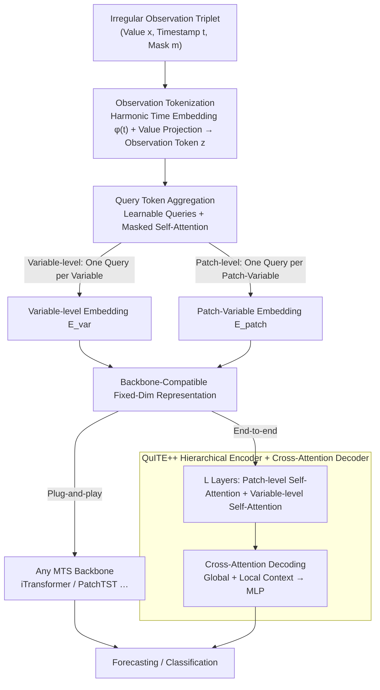

# QuITE: Query-based Irregular Time Series Embedding

**Conference**: ICML 2026  
**arXiv**: [2605.28166](https://arxiv.org/abs/2605.28166)  
**Code**: To be confirmed  
**Area**: Time Series / Irregular Sampling  
**Keywords**: Irregular Time Series, Embedding, Multivariate Forecasting, Query Tokens  

## TL;DR
QuITE is a **plug-and-play embedding module** that aggregates irregular observations into fixed-dimensional representations using learnable query tokens via self-attention. It adapts arbitrary multivariate time series (MTS) models to irregular MTS (IMTS) without architectural modifications or artificial value generation, achieving an average relative improvement of 54.7% on iTransformer + QuITE.

## Background & Motivation

**Background**: Irregular multivariate time series (IMTS) are prevalent in domains such as healthcare, climate, and industrial monitoring. Existing methods are categorized into architecture-based designs (e.g., GRU-D, Latent ODE, GNN), which develop specialized structures for irregularity, and data-adaptation methods (e.g., mTAND, IP-Nets), which interpolate IMTS onto regular grids.

**Limitations of Prior Work**: Architecture-based methods cannot leverage powerful, well-validated MTS backbones (e.g., PatchTST, iTransformer). Interpolation-based methods allow model reuse but distort true temporal dynamics by generating artificial values, leading to performance degradation. Both paradigms involve significant trade-offs.

**Key Challenge**: The primary bottleneck is **not the architecture design of the backbone, but the input embedding layer**. Traditional embedding schemes assume uniform sampling and are inherently incompatible with irregular inputs. Simple strategies like adding or concatenating time and value embeddings remain constrained by the uniform sampling paradigm. While attention mechanisms can capture interactions between irregular observations, their observation-level outputs require additional pooling to match the variable-level or patch-level representations expected by modern MTS models, which dilutes fine-grained temporal information.

**Goal**: To design a simple and efficient adaptation mechanism at the input embedding layer that enables existing MTS models to process IMTS directly without architectural changes.

**Key Insight**: Address irregularity at the embedding layer rather than at the architecture or data preprocessing level. The key observation is that learnable query tokens can serve as **structured aggregation anchors** to transform irregular observations into backbone-compatible fixed-dimensional representations via single-layer self-attention.

**Core Idea**: Use learnable **query tokens** to directly extract structured embedding representations from irregular observations through a self-attention mechanism, bypassing lossy pooling and artificial value generation.

## Method

### Overall Architecture
QuITE is a plug-and-play embedding module consisting of: (1) Observation Tokenization: Encoding each observation $(x_{n, i}, t_{n, i}, m_{n, i})$ into a token; (2) Query Token Aggregation: Using learnable query tokens to aggregate variable-level or patch-level observations through masked self-attention. The aggregation is configurable as **variable-level** (one query per variable) or **patch-level** (one query per patch-variable pair). The resulting representations are compatible with arbitrary MTS backbones (iTransformer, PatchTST, etc.) or can be processed by (3) the QuITE++ hierarchical encoder + cross-attention decoder for end-to-end forecasting.

### Key Designs

**1. Observation Tokenization: Standardizing irregular triplets into comparable tokens**

Each IMTS observation is a triplet $(x_{n, i}, t_{n, i}, m_{n, i})$—value, continuous timestamp, and mask. These are not aligned and cannot be fed into standard embedding layers. QuITE encodes them separately: continuous timestamps use harmonic time embeddings $\phi(t)[k] = \omega_0 t + \alpha_0$ ($k=0$) or $\sin(\omega_k t + \alpha_k)$ ($k>0$) with learnable frequency and phase, allowing arbitrary spans to be represented periodically. Values are mapped via linear projection $f_{\text{val}}$. The final token is $z_{n, i} = f_{\text{val}}(x_{n, i}) + \phi(t_{n, i})$. The mask $m_{n, i}$ identifies missing or padded entries for the attention mechanism to bypass. This avoids regridding and artificial values.

**2. Query Token Aggregation: Structured anchors for fixed-shaped output**

While attention captures interactions, observation-level outputs require pooling to match backbone expectations, which dilutes information. QuITE introduces learnable query tokens as structured anchors. For variable-level aggregation, a query $q_n$ per variable performs masked self-attention with all observations $Z_n$ of that variable: $H_n = \text{SelfAttn}([q_n; Z_n], A_n = [1 | m_n])$. The updated query $e_n = H_n[0]$ serves as the variable-level embedding. Patch-level aggregation follows a similar logic. This functions like a BERT [CLS] token but acts as a structured aggregator that naturally handles missingness without pooling.

**3. QuITE++ Hierarchical Encoder: An end-to-end architecture for temporal and variable dependencies**

QuITE++ extends the embedding layer with $L$ hierarchical encoder layers. Each layer contains two blocks: patch-level self-attention (modeling temporal dependencies by prefixing variable tokens) and variable-level self-attention (modeling cross-variable interactions). The decoder employs cross-attention to extract global and local contexts simultaneously, avoiding the need for flattening or specific patch constraints.

## Key Experimental Results

### Main Results: Predictive Performance Gain Across Various Backbones

| Backbone Type | Dataset | Model | MSE (w/o QuITE) | MSE (w/ QuITE) | Rel. Gain |
| :--- | :--- | :--- | :--- | :--- | :--- |
| Patch-based | Human Activity | PatchTST | 3.10 | 2.76 | +10.97% |
| Patch-based | USHCN | PatchMixer | 5.31 | 5.02 | +5.46% |
| Variable-based | PhysioNet | iTransformer | 16.48 | 4.99 | +69.72% |
| Variable-based | MIMIC-III | iTransformer | 6.05 | 1.56 | +74.19% |
| Hybrid | Human Activity | TimeXer | 2.99 | 2.53 | +15.52% |
| **Average** | **Averaged** | **iTransformer+QuITE**| 8.37 | 3.79 | **+54.70%** |

### Classification Performance

| Dataset | Metric | Baseline | PatchMixer+QuITE | iTransformer+QuITE |
| :--- | :--- | :--- | :--- | :--- |
| P12 | AUROC | 78.2 | 83.9 | 85.3 |
| P19 | AUPRC | 26.4 | 55.8 | 51.7 |
| PAM | F1 | 75.7 | 83.7 | 91.5 |

### Ablation Study (Comparison of Embedding Strategies)

| Embedding Strategy | PatchTST | iTransformer | QuITE++ | Note |
| :--- | :--- | :--- | :--- | :--- |
| Add (Time + Value) | 4.00 | 4.98 | 3.44 | Direct summation |
| Concat | 3.90 | 5.77 | 3.35 | Concatenation |
| mTAND (Latent Interp.) | 3.74 | 3.50 | 3.34 | Data-level interpolation |
| Mean Pooling | 3.75 | 3.59 | 3.31 | Average after attention |
| **QuITE (Learnable Query)** | **3.69** | **3.31** | **3.18** | **Best** |

### Key Findings
- **Backbone Agnostic**: QuITE consistently improves 6 MTS backbones, with gains ranging from 5.1% to 54.7%.
- **Differential Benefit**: Variable-level models (iTransformer, S-Mamba) benefit most (25%-74%) as they are more sensitive to sampling. Patch-level models benefit less (5%-11%).
- **Dataset Variation**: Healthcare data (MIMIC-III, PhysioNet) shows the most significant gains (30%-74%), while climate data (USHCN) shows more conservative improvements (1%-33%).
- **Robustness**: QuITE++ remains stable with 50% random observation removal; performance drops sharply beyond 75% sparsity.

## Highlights & Insights
- **Precise Problem Identification**: Recognizing the bottleneck is at the embedding layer avoids large-scale renovation of strong existing models.
- **Versatility of Query Tokens**: Using learnable queries as **structured anchors** captures irregular observations effectively without lossy pooling.
- **Plug-and-Play**: Decoupling the embedding from the architecture allows seamless integration into any MTS model, significantly lowering adoption barriers.
- **Rigorous Ablation**: Comparison against Add/Concat/Mean Pooling/mTAND validates each design choice with empirical data.
- **Transfer Potential**: The hierarchical structure and query-based aggregation could potentially extend to language models or other irregular data like point clouds.

## Limitations & Future Work
- Patch-level MTS models exhibit weaker performance on healthcare data (e.g., PhysioNet) that requires strong variable interaction.
- Actual inference time depends on backbone details and is not inherently faster.
- Performance degrades significantly when observation loss exceeds 75%.
- Future Work: Refine dependencies with multi-head hierarchical architectures; introduce sparse attention; explore zero-shot transfer via cross-dataset pre-training.

## Related Work & Insights
- **vs GRU-D / P-LSTM**: RNN methods handle missingness via decay or gating but are limited by RNN architectures. QuITE allows the use of modern Transformers.
- **vs Continuous-time ODEs**: ODE methods (Latent-ODE) are expressive but computationally expensive. QuITE uses efficient attention aggregation.
- **vs GNN methods**: Graphs can model variable-time relationships but add design complexity. QuITE's self-attention is more concise.
- **vs mTAND**: mTAND interpolates in latent space, which alters sampling patterns. QuITE processes raw observations directly.

## Rating
- Novelty: ⭐⭐⭐⭐ Simple but effective query aggregation; provides a new perspective focused on the embedding layer.
- Experimental Thoroughness: ⭐⭐⭐⭐⭐ 7 datasets, 6 backbones, 17 baselines, 4 ablation variants, and robustness analysis.
- Writing Quality: ⭐⭐⭐⭐ Clear logic and motivation; some patch-size strategy details are omitted.
- Value: ⭐⭐⭐⭐⭐ High practical value due to plug-and-play nature and substantial gains (50%-75%) in high-sparsity scenarios.

<!-- RELATED:START -->

## Related Papers

- [\[ICML 2026\] Latent Laplace Diffusion for Irregular Multivariate Time Series](latent_laplace_diffusion_for_irregular_multivariate_time_series.md)
- [\[ICLR 2026\] Learning Recursive Multi-Scale Representations for Irregular Multivariate Time Series Forecasting](../../ICLR2026/time_series/learning_recursive_multi-scale_representations_for_irregular_multivariate_time_s.md)
- [\[ACL 2025\] LETS-C: Leveraging Text Embedding for Time Series Classification](../../ACL2025/time_series/lets-c_leveraging_text_embedding_for_time_series_classification.md)
- [\[ICML 2025\] TQNet: Temporal Query Network for Efficient Multivariate Time Series Forecasting](../../ICML2025/time_series/temporal_query_network_for_efficient_multivariate_time_series_forecasting.md)
- [\[ICML 2026\] Embedding Hybrid Systems into Continuous Latent Vector Fields](embedding_hybrid_systems_into_continuous_latent_vector_fields.md)

<!-- RELATED:END -->
