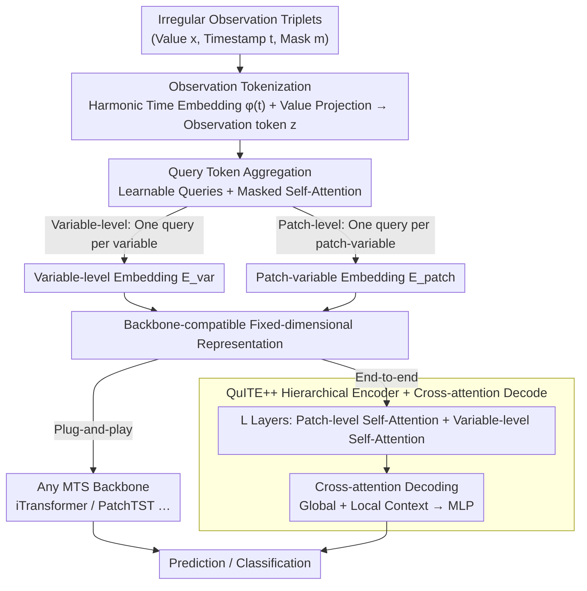

# QuITE: Query-based Irregular Time Series Embedding

**Conference**: ICML 2026  
**arXiv**: [2605.28166](https://arxiv.org/abs/2605.28166)  
**Code**: To be confirmed  
**Area**: Time Series / Irregular Sampling  
**Keywords**: Irregular time series, Embedding, Multivariate forecasting, Query tokens

## TL;DR
QuITE is a **plug-and-play embedding module** that uses learnable query tokens via self-attention to directly aggregate irregular observations. It adapts any MTS model to Irregular Multivariate Time Series (IMTS) without architectural modifications or the generation of artificial values; it achieves an average relative improvement of 54.7% in forecasting when combined with iTransformer.

## Background & Motivation

**Background**: Irregular Multivariate Time Series (IMTS) are prevalent in fields such as healthcare, climate, and industrial monitoring. Existing methods fall into two categories: architectural design (GRU-D, Latent ODE, GNN, etc.), which creates specialized architectures for irregularity, and data adaptation (mTAND, IP-Nets), which maps IMTS to a regular temporal grid through interpolation.

**Limitations of Prior Work**: Architectural design methods, while handling irregularity, cannot reuse powerful and well-validated MTS models (e.g., PatchTST, iTransformer). Interpolation methods allow model reuse but destroy real temporal dynamics by generating artificial values, ultimately leading to performance degradation. Both categories involve significant trade-offs.

**Key Challenge**: The true bottleneck of the problem **lies not in the architectural design of the backbone network, but in the input embedding layer**. Existing embedding schemes assume uniform sampling and are naturally ill-suited for irregular inputs. Simple fusion strategies (summing or concatenating temporal and value embeddings) remain constrained by the uniform sampling design paradigm. Although attention mechanisms can capture interactions between irregular observations, their observation-level outputs require additional pooling to match the variable-level or patch-level representations expected by modern MTS models, which in turn dilutes fine-grained temporal information.

**Goal**: Design a simple and efficient adaptation mechanism at the input embedding layer that enables existing MTS models to process IMTS directly without architectural changes.

**Key Insight**: Address irregularity directly at the embedding layer rather than at the architectural or data preprocessing levels. The key observation is that learnable query tokens can serve as **structured aggregation anchors**, transforming irregular observations into fixed-dimensional representations compatible with the backbone via a single layer of self-attention.

**Core Idea**: Use learnable **query tokens** through a self-attention mechanism to extract structured embedding representations directly from irregular observations. This bypasses lossy pooling and artificial value generation, allowing the output to serve directly as input for the backbone model.

## Method

### Overall Architecture
QuITE is a plug-and-play embedding module: (1) Observation Tokenization: Encodes each observation $(x_{n, i}, t_{n, i}, m_{n, i})$ into a token; (2) Query Token Aggregation: Uses learnable query tokens to aggregate variable or patch-level observations via masked self-attention, outputting fixed-dimensional representations compatible with the backbone. Aggregation can be flexibly configured as **Variable-level** (one query token per variable) or **Patch-level** (one query token per patch-variable pair). The resulting representations can be plugged into any existing MTS backbone (iTransformer, PatchTST, etc.) or processed by the (3) QuITE++ hierarchical encoder + cross-attention decoder for end-to-end prediction.

### Key Designs

**1. Observation Tokenization: Transforming irregular triplet observations into unified comparable tokens**

Each observation in IMTS is a triplet $(x_{n, i}, t_{n, i}, m_{n, i})$—value, continuous timestamp, and mask. Timestamps are unaligned, preventing direct feeding into embedding layers that assume uniform sampling. QuITE encodes these components then synthesizes them: continuous timestamps are encoded using harmonic time embeddings $\phi(t)[k] = \omega_0 t + \alpha_0$ ($k=0$) or $\sin(\omega_k t + \alpha_k)$ ($k>0$), with learnable frequency and phase so that any time span can be represented periodically. Values are projected into latent space via a linear projection $f_{\text{val}}$. The final token is $z_{n, i} = f_{\text{val}}(x_{n, i}) + \phi(t_{n, i})$. The mask $m_{n, i}$ marks missing or padded observations, allowing subsequent attention layers to skip them. This step preserves the original sampling patterns without re-gridding or creating artificial values.

**2. Query Token Aggregation: Using learnable anchors to output backbone-required shapes, bypassing lossy pooling**

While attention captures interactions between irregular observations, its output is observation-level, requiring pooling to match the variable-level or patch-level representations expected by the backbone, which dilutes fine-grained temporal information. QuITE overcomes this by introducing learnable query tokens as structured aggregation anchors. For variable-level aggregation, each variable is assigned a query token $q_n$, which performs masked self-attention with all observations $Z_n$ of that variable: $H_n = \text{SelfAttn}([q_n; Z_n], A_n = [1 | m_n])$. The updated output of the query token $e_n = H_n[0]$ serves as the variable-level embedding. Similarly, for patch-level aggregation, a query token is assigned to each (patch, variable) pair, resulting in a patch-variable matrix $E_{\text{patch}} \in \mathbb{R}^{M \times N \times D}$. This approach resembles the [CLS] token in BERT, but here the query is not a generic de-semanticized token; it directly aggregates irregular observations into backbone-compatible fixed-dimensional representations. The mask naturally skips missing values, and the lack of additional pooling minimizes information loss.

**3. QuITE++ Hierarchical Encoder: Expanding the embedding module into a full architecture for explicit temporal and variable dependency modeling**

QuITE itself is an embedding layer; end-to-end prediction requires a backbone. QuITE++ stacks $L$ hierarchical encoder layers on top, each containing two attention blocks: patch-level self-attention prefixes variable tokens to patch sequences to model temporal dependencies, and variable-level self-attention models cross-variable interactions among all variable tokens. The decoder uses cross-attention to extract global and local contexts simultaneously. This hierarchical structure captures local temporal patterns within patches as well as global and cross-variable dependencies via variable tokens, while cross-attention decoding avoids restrictions imposed by flattening patches or additional designs.

## Key Experimental Results

### Main Results: Prediction Performance Gains Across Different Backbones

| Backbone Type | Dataset | Model | MSE w/o QuITE | MSE w/ QuITE | Relative Gain |
| :--- | :--- | :--- | :--- | :--- | :--- |
| Patch-level | Human Activity | PatchTST | 3.10 | 2.76 | +10.97% |
| Patch-level | USHCN | PatchMixer | 5.31 | 5.02 | +5.46% |
| Variable-level | PhysioNet | iTransformer | 16.48 | 4.99 | +69.72% |
| Variable-level | MIMIC-III | iTransformer | 6.05 | 1.56 | +74.19% |
| Hybrid | Human Activity | TimeXer | 2.99 | 2.53 | +15.52% |
| **Average** | **All Datasets** | **iTransformer+QuITE** | 8.37 | 3.79 | **+54.70%** |

### Classification Performance

| Dataset | Metric | w/o QuITE | PatchMixer+QuITE | iTransformer+QuITE |
| :--- | :--- | :--- | :--- | :--- |
| P12 | AUROC | 78.2 | 83.9 | 85.3 |
| P19 | AUPRC | 26.4 | 55.8 | 51.7 |
| PAM | F1 | 75.7 | 83.7 | 91.5 |

### Ablation Study (Comparison of Embedding Strategies)

| Embedding Strategy | PatchTST | iTransformer | QuITE++ | Notes |
| :--- | :--- | :--- | :--- | :--- |
| Add (Time + Value) | 4.00 | 4.98 | 3.44 | Direct addition |
| Concat | 3.90 | 5.77 | 3.35 | Concatenation |
| mTAND (Latent Interpolation) | 3.74 | 3.50 | 3.34 | Data-level interpolation |
| Mean Pooling | 3.75 | 3.59 | 3.31 | Mean after attention |
| **QuITE (Learnable Query)** | **3.69** | **3.31** | **3.18** | **Best** |

### Key Findings
- **Backbone Agnostic**: QuITE provides consistent improvements across 6 MTS backbones, ranging from 5.1% to 54.7% on average.
- **Differential Gains**: Variable-level models (iTransformer, S-Mamba) benefit the most (25%-74%) as they are more sensitive to irregular sampling. Patch-level models benefit less (5%-11%) as they model variables independently.
- **Dataset Variance**: Improvements are most significant in healthcare data (MIMIC-III, PhysioNet, 30%-74%) and more conservative in climate data (USHCN, 1%-33%).
- **Robustness**: QuITE++ performance remains stable even when 50% of observations are randomly removed; performance drops sharply after 75% removal, indicating a practical sparsity limit of approximately 50%.

## Highlights & Insights
- **Precise Problem Positioning**: Identified that the bottleneck lies in the embedding layer rather than the architecture, avoiding large-scale modification of established powerful models—significant gains are achieved simply by replacing the input module.
- **Versatility of Query Tokens**: While drawing inspiration from the BERT [CLS] token, the innovation lies in using learnable queries as **structured anchors** rather than de-semanticized general tokens, directly aggregating irregular observations without extra pooling.
- **Plug-and-Play**: QuITE is completely decoupled from the backbone architecture and can be seamlessly inserted into the front end of any MTS model, significantly lowering the barrier to application. The fact that 6 different types of backbones benefit proves its generality and robustness.
- **Ablation Design**: Validated each design choice with data by comparing Add / Concat / Mean Pooling / mTAND.
- **Transfer Potential**: The hierarchical encoding structure can be extended to other sequential models (e.g., language models handling multi-rate or variable-length text). The learnable token aggregation paradigm can be generalized to other irregularly sampled data (point clouds, dynamic graphs).

## Limitations & Future Work
- Patch-level MTS models exhibit weaker performance on healthcare data (e.g., PhysioNet, MIMIC-III) that requires variable interactions (a limitation of the patch-level models themselves).
- Actual runtime depends on backbone implementation details and is not necessarily always faster.
- Robustness tests show rapid performance degradation when observation loss exceeds 75%; extreme sparsity scenarios may remain unresolved.
- Improvements: Extend to multi-head hierarchical architectures to refine dependencies between variables and patches; introduce sparse attention to reduce computational complexity; implement cross-dataset pre-training for zero-shot transfer.

## Related Work & Insights
- **vs GRU-D / P-LSTM**: RNN methods handle missing values through decay or gating but are constrained by the RNN architecture. QuITE's advantage is the ability to reuse modern, powerful backbones like Transformers.
- **vs Continuous-Time ODE (Latent-ODE, ContiFormer)**: ODE methods learn continuous dynamics between observations, offering high expressivity but high computational complexity. QuITE is more efficient through direct attention aggregation.
- **vs GNN Methods (GraFITi, tPatchGNN)**: Graph neural networks can model variable-time bipartite graph relationships but introduce design complexity in graph construction. QuITE's self-attention is more concise.
- **vs Interpolation Methods (mTAND, IP-Nets)**: mTAND interpolates in latent space to avoid explicit artificial values but still alters the true sampling patterns. QuITE processes raw observations directly to maintain integrity.

## Rating
- Novelty: ⭐⭐⭐⭐ The query token aggregation concept is simple yet effective; it provides a new perspective on the irregular sequence adaptation problem by shifting focus from architecture/data to the embedding layer.
- Experimental Thoroughness: ⭐⭐⭐⭐⭐ Comprehensive experimental design including 7 datasets, 6 backbone categories, 17 baselines, 4 ablation comparisons, and robustness analysis.
- Writing Quality: ⭐⭐⭐⭐ Logical clarity with deep articulation of problem motivation and design rationale. Some experimental details (patch partitioning strategies) were not fully discussed.
- Value: ⭐⭐⭐⭐⭐ The plug-and-play characteristic significantly lowers the barrier for practical applications. Huge improvements (50%-75%) in high-sparsity scenarios like healthcare/climate represent significant application value.

<!-- RELATED:START -->

## Related Papers

- [\[ICML 2026\] Latent Laplace Diffusion for Irregular Multivariate Time Series](latent_laplace_diffusion_for_irregular_multivariate_time_series.md)
- [\[ICLR 2026\] Learning Recursive Multi-Scale Representations for Irregular Multivariate Time Series Forecasting](../../ICLR2026/time_series/learning_recursive_multi-scale_representations_for_irregular_multivariate_time_s.md)
- [\[ACL 2025\] LETS-C: Leveraging Text Embedding for Time Series Classification](../../ACL2025/time_series/lets-c_leveraging_text_embedding_for_time_series_classification.md)
- [\[AAAI 2026\] Revitalizing Canonical Pre-Alignment for Irregular Multivariate Time Series Forecasting](../../AAAI2026/time_series/revitalizing_canonical_pre-alignment_for_irregular_multivariate_time_series_fore.md)
- [\[ICML 2025\] TQNet: Temporal Query Network for Efficient Multivariate Time Series Forecasting](../../ICML2025/time_series/temporal_query_network_for_efficient_multivariate_time_series_forecasting.md)

<!-- RELATED:END -->
