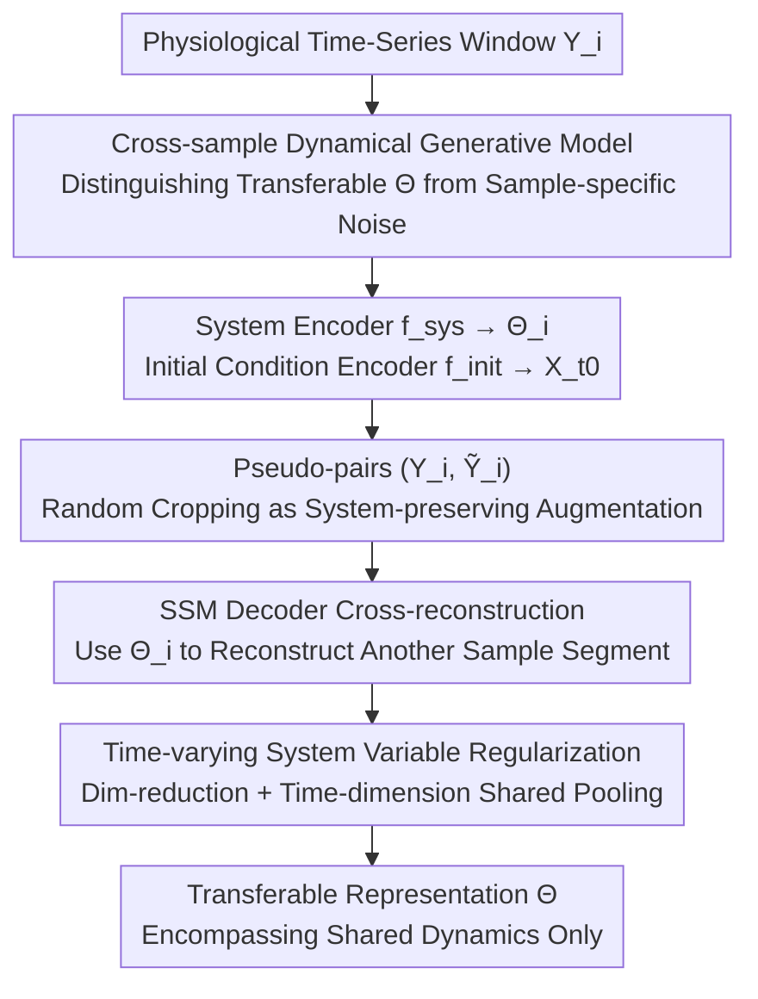

# Self-Supervised Dynamical System Representations for Physiological Time-Series

**Conference**: ICML2026  
**arXiv**: [2512.00239](https://arxiv.org/abs/2512.00239)  
**Code**: [github.com/yenhochen/PULSE](https://github.com/yenhochen/PULSE)  
**Area**: Time-Series / Self-Supervised Representation Learning / Physiological Signals  
**Keywords**: Physiological Time-Series, Self-Supervised Learning, Dynamical Systems, Cross-Reconstruction, Transferable Representations  

## TL;DR
PULSE treats physiological time-series as being generated by "transferable system parameters + non-transferable sample-specific noise." It proposes a cross-reconstruction objective—where a system representation inferred from one window is used to reconstruct another independent sample from the same system—forcing the encoder to retain only shared dynamics while discarding initial conditions and noise, thereby learning more transferable representations for clinical semantics.

## Background & Motivation
**Background**: The core goal of self-supervised learning (SSL) for physiological time-series such as ECG, PPG, and EEG is to capture the underlying physiological "identity" while filtering out irrelevant noise. Existing methods fall into two categories: weakly constrained pretexts (Contrastive Learning CL, Masked Autoencoder MAE), which focus on downstream transferability; and strongly structured Sequential Variational Autoencoders (SVAE), which explicitly model latent dynamical systems.

**Limitations of Prior Work**: Both categories have significant drawbacks. CL relies on positive pairs to define invariance, but common augmentations like jitter or scaling on physiological signals can **alter the clinical identity**, erroneously collapsing samples from different diagnoses. MAE's masking strategy allows reconstruction of past segments using future context, potentially learning non-causal shortcut relationships that violate the causal dynamics of physiological processes. Conversely, SVAE preserves causal temporal dependencies using an autoencoding ELBO but **lacks a selective denoising mechanism**—the autoencoding objective penalizes any deviation from the original input, causing the model to encode sample-specific noise (e.g., recording offsets, transient fluctuations), which obscures clinical patterns and harms transferability.

**Key Challenge**: Weakly constrained methods can denoise but may do so incorrectly and destroy dynamical structures; strongly structured methods preserve dynamical structures but fail to denoise. The advantages of both cannot be easily combined—one has a denoising mechanism without structural constraints, while the other has structural constraints without a denoising mechanism.

**Goal**: Design an SSL objective that **simultaneously** preserves temporal dependencies using a latent dynamical system model and selectively eliminates sample-specific noise.

**Key Insight**: Instead of "modeling dynamics within a single time-series" as in SVAE, the authors pivot to modeling the generative structure **among multiple similar time-series**. The key insight is that system information related to generative parameters is shared and transferable across "multiple independent sequences produced by the same process" and should be retained; however, information unique to each sample, such as initial conditions and process noise, is non-transferable and should be discarded.

**Core Idea**: Utilize a cross-reconstruction task to specifically capture system information—using the system representation inferred from $\mathbf{Y}_i$ to reconstruct another independent sample $\mathbf{Y}_j$ from the same system. Since the two samples only share system parameters, the encoder is forced to retain only shared dynamics and discard sample-specific noise. The method is called PULSE (Physiological self-sUpervised Learning using System Encoders).

## Method

### Overall Architecture
PULSE consists of three steps: first, utilizing a cross-sample dynamical system generative model to **define what information is transferable**; then, designing a practical cross-reconstruction pre-training strategy to **extract transferable information and discard noise**; and finally, providing a theoretical explanation of the conditions under which system information can be provably recovered.

The generative model (Fig. 2) assumes that each window $\mathbf{Y}_i$ in the dataset is generated by a latent system with parameters $\boldsymbol{\Theta}_i$ paired with an initial condition $\mathbf{X}_{i,t_0}$. Since physiological activities are highly stereotypical (gait has repeating phases like heel-strike/mid-stance/toe-off; normal sinus rhythm has repeating PQRST complexes), many samples are actually produced by the **same system**—denoting the set of indices produced by system $s$ as $\mathcal{I}_s$, then $\boldsymbol{\Theta}_i=\boldsymbol{\Theta}^{(s)}$ holds for all $i\in\mathcal{I}_s$. The joint distribution expands according to a State Space Model (SSM):

$$p(\mathbf{Y},\mathbf{X},\boldsymbol{\Theta})=\prod_{s}\prod_{i\in\mathcal{I}_s} p(\mathbf{X}_{i,t_0},\boldsymbol{\Theta}^{(s)})\Big[\prod_k p(\mathbf{Y}_{i,t_k}|\mathbf{X}_{i,t_k})\Big]\Big[\prod_k p(\mathbf{X}_{i,t_k}|\mathbf{X}_{i,t_{k-1}},\boldsymbol{\Theta}^{(s)})\Big]$$

This decomposition reveals a hierarchy of information: $\boldsymbol{\Theta}^{(s)}$ is shared and transferable among samples of the same system, while $\mathbf{X}_{i,t_0}$, observation noise $\epsilon$, and dynamical noise $\nu$ are sample-specific and non-transferable. An ideal representation should only retain the former.

### Key Designs

**1. Cross-Reconstruction: Using the system representation of one sample to reconstruct another sample from the same system**

Addressing the pain point: Autoencoding (reconstructing oneself) learns sample-specific noise. PULSE changes this to "reconstructing others"—given two independent samples $\mathbf{Y}_i, \mathbf{Y}_j$ ($i,j\in\mathcal{I}_s$) from the same system, use the system information inferred from $\mathbf{Y}_i$ to reconstruct $\mathbf{Y}_j$:

$$\mathcal{L}_{\rm Cross}(\mathbf{Y}_i,\mathbf{Y}_j)=\mathbb{E}_{\mathcal{P}}\Big[\sum_{k=1}^{w}\lVert \mathbf{Y}_{j,t_k}-g_y(g_x(\mathbf{X}_{j,t_{k-1}},\boldsymbol{\Theta}_{i,t_k}))\rVert^2\Big]$$

Why it works: According to the generative model, the only shared variable between $\mathbf{Y}_i$ and $\mathbf{Y}_j$ is $\boldsymbol{\Theta}^{(s)}$. If the system encoder $f_{\rm sys}$ covertly encodes sample-specific factors of $\mathbf{Y}_i$, these factors do not exist in $\mathbf{Y}_j$ and would instead increase $\mathcal{L}_{\rm Cross}$. Thus, the loss naturally forces $f_{\rm sys}$ to retain only shared system information. Note that initial conditions are estimated from $\mathbf{Y}_j$ itself by another encoder $f_{\rm init}$ ($\mathbf{X}_{j,t_0}=[f_{\rm init}(\mathbf{Y}_j)]_{t_0}$), decoupling "system estimation" from "who is being reconstructed."

**2. Dual Encoder Division of Labor + Encoding Only Dynamics: Physically isolating transferable and non-transferable information**

PULSE uses two encoders to separate information into different channels: the system encoder $f_{\rm sys}$ uses dilated convolutions covering the entire window to extract shared system parameters $\boldsymbol{\Theta}_i=f_{\rm sys}(\mathbf{Y}_i)$; the initial condition encoder $f_{\rm init}$ uses a 2-layer CNN with a receptive field centered at $t_0$ to estimate sample-specific initial conditions. On the generative side, an SSM decoder is used, where $g_x$ is a GRU and $g_y$ is a linear projection; $\boldsymbol{\Theta}_i$ serves as input to the GRU (the GRU hidden state evolves according to input-dependent gating, exactly corresponding to "input determines dynamics"). A key design decision is that $\boldsymbol{\Theta}_{i,t_k}$ **only contains parameters for $g_x$ (dynamics), not for $g_y$ (observation function)**—because in SSM form, "how to measure a process" is separate from the "dynamics of the process itself," and excluding observation parameters from transferable representations better aligns with the semantics of dynamical systems. Furthermore, following DSVAE, $\boldsymbol{\Theta}_i$ is split into a time-invariant component $\boldsymbol{\theta}_i$ (max-pooled over time) and a time-varying component $\tilde{\boldsymbol{\theta}}_{i,t_k}$ (two-layer CNN) to model non-stationary physiological behavior.

**3. PULSE Pseudo-pairs: Using system-preserving augmentations as "independent same-system samples" without labels**

$\mathcal{L}_{\rm Cross}$ requires system labels $\mathcal{I}_s$ to sample same-system pairs, but these are unavailable in unlabeled datasets. PULSE instead uses **system-preserving augmentations** to construct independent pseudo-pairs $(\mathbf{Y}_i,\widetilde{\mathbf{Y}}_i)$, where $\widetilde{\mathbf{Y}}_i\sim\mathcal{T}(\mathbf{Y}_i)$:

$$\mathcal{L}_{\rm PULSE}(\mathbf{Y}_i)=\mathbb{E}_{\widetilde{\mathbf{Y}}_i\sim\mathcal{T}}\Big[\sum_{k=1}^{w}\lVert \widetilde{\mathbf{Y}}_{i,t_k}-g_y(g_x(\mathbf{X}_{i,t_{k-1}},\boldsymbol{\Theta}_{i,t_k}))\rVert^2\Big]$$

In this context, $\mathcal{T}$ is **random cropping**—it preserves the dynamics of the time-series (same system) but introduces variation in the initial condition $\mathbf{X}_{i,t_0}$ (each cropped window starts at a different point, $t_0\sim\text{Uniform}(1,T-w)$). This perfectly matches the generative model assumption: underlying physiological states are often independent of "when the recording started." Jitter or scaling are not used because they can change clinical identity; cropping only changes initial conditions without altering system identity, making it safe. In experiments, up to 4 $\widetilde{\mathbf{Y}}_i$ are used to estimate the expectation to improve performance.

**4. Time-varying System Variable Regularization: Preventing shortcuts that "copy local signals"**

Since both encoders observe the same $\mathbf{Y}_i$, and the system representation contains a time-varying component $\boldsymbol{\theta}_{i,t_k}$ derived from the same input, the model might learn a shortcut—directly copying local signal values into $\boldsymbol{\theta}_{i,t_k}$ as "dynamics." The authors use two methods to limit its expressive power: first, reducing $\boldsymbol{\theta}_{i,t_k}$ to a **single dimension** so it lacks the capacity to represent all the diversity of initial conditions in the data; second, by **sharing max-pooled values** between adjacent steps in the time dimension to limit how fast it can change over time. Consequently, $\boldsymbol{\theta}_{i,t_k}$ can only carry slowly-varying systemic information rather than point-by-point copies.

### Loss & Training
The pre-training objective is $\mathcal{L}_{\rm PULSE}$ (the pseudo-pair approximation of cross-reconstruction), coupled with the aforementioned time-varying variable regularization. Theoretically (Theorem 3.3), the authors view cross-reconstruction as an MAE task under special masking: treating the sample pair $(\mathbf{Y}_i, \mathbf{Y}_j)$ as a single joint input, the set of minimal shared latent variables $\mathcal{C}$ between masked and unmasked regions is exactly equal to the system parameters $\{\boldsymbol{\Theta}^{(s)}\}$ **if and only if** one entire sample is masked ($\mathbf{m}_i=0,\mathbf{m}_j=1$); if a single sequence contains both masked and unmasked regions, $\mathcal{C}$ will be mixed with state variables $\mathbf{X}$, leading to the confusion of system information and sample-specific information. This provides a theoretical explanation for why $\mathcal{L}_{\rm PULSE}$ can recover system information.

## Key Experimental Results

### Synthetic Dynamical System Experiments
Data were generated using Lorenz, Thomas, and Hindmarsh-Rose random differential equations in bifurcation regions for a 5-way classification task, investigating robustness as noise $\sigma$ increases. PULSE achieved the highest classification accuracy among all practical algorithms (unlabeled pre-training); the labeled *positive oracle* consistently performed better, while the *negative oracle* performed worse, validating Theorem 3.3.

| Noise σ | SimCLR | TS2Vec | REBAR | TimeMAE | DSVAE | **PULSE** | Pos.Oracle | Neg.Oracle |
|--------|--------|--------|-------|---------|-------|-----------|-----------|-----------|
| 0 | 93.08 | 98.68 | 98.90 | 99.06 | 99.58 | **99.29** | 98.86 | 77.59 |
| 1 | 83.10 | 93.07 | 93.36 | 93.02 | 96.09 | **97.26** | 96.66 | 50.36 |
| 3 | 70.05 | 79.78 | 79.36 | 79.03 | 83.42 | **89.00** | 84.62 | 39.88 |
| 5 | 62.29 | 73.67 | 72.37 | 71.33 | 77.34 | **82.65** | 76.90 | 37.82 |

As noise increases, PULSE's advantage becomes more pronounced (leading the second-best DSVAE by about 5 points at σ=5), indicating it successfully captures system parameters robust to noise.

### Real-World Physiological Data: Linear Probing + Label Efficiency
Four real-world datasets: HAR (Accelerometer), PPG (Pressure), ECG (Arrhythmia), and EEG (Sleep staging). PULSE achieved the best linear probing results on PPG, ECG, and EEG, with a particularly significant improvement in ECG; it also led across the board in semi-supervised low-label scenarios.

| Dataset | Metric | REBAR | TimeMAE | DSVAE | **PULSE** |
|--------|------|-------|---------|-------|-----------|
| PPG | Acc↑ | 41.38 | 61.35 | 58.65 | **64.27** |
| ECG | Acc↑ | 81.54 | 69.80 | 70.42 | **87.41** |
| ECG | AUROC↑ | 91.46 | 76.61 | 82.88 | **94.93** |
| EEG | Acc↑ | 83.71 | 83.83 | 84.25 | **85.56** |
| HAR | Acc↑ | 95.35 | 92.25 | 93.55 | 93.27 |

At 1% labels in semi-supervised settings, ECG accuracy was 84.77, far exceeding the 67.60 of the second-best DSVAE. PPG and EEG also led, indicating the superior transferability of the system representation in low-labeled scenarios.

### Key Findings
- ECG is PULSE's most impressive scenario (Linear Probing +6 points, 1% labels +17 points)—this type of signal has a very strong repeating dynamical structure (PQRST complexes), perfectly matching the "multiple samples from the same system" assumption.
- On HAR linear probing, PULSE was slightly lower than SOTA but outperformed it in semi-supervised and transfer learning settings, indicating that system representations sacrifice some intra-dataset separability for stronger transferability.
- In synthetic experiments, the *negative oracle* (with mixed masked/unmasked regions) even fell below unlabeled PULSE under high noise, directly confirming the theory: system parameters can only be cleanly recovered when "an entire sample is masked."

## Highlights & Insights
- Reinterprets "positive pairs" in SSL as "independent samples generated by the same dynamical system," providing a principled criterion for augmentation selection: only system-preserving augmentations (cropping) are valid, while identity-altering augmentations (jitter/scaling) are harmful.
- Uses MAE theory (Minimal Shared Latent Set $\mathcal{C}$) to derive identifiable conditions for cross-reconstruction, grounding an empirical objective with provable recovery theory.
- Physically isolates transferable versus non-transferable information via dual encoders and deliberately excludes observation parameters $g_y$ from the system representation, demonstrating precise control over dynamical system semantics.
- The concept of "reconstructing others rather than oneself" can be transferred to any "multi-instance same-source" data (multiple experiments of the same physical process, multiple behavior segments from the same user) where the goal is to extract shared generative factors and discard instance noise.

## Limitations & Future Work
- The core assumption is that "many samples are generated by the same system and the unique shared variable is $\boldsymbol{\Theta}^{(s)}$," which may not hold for physiological signals where the number of systems is much larger than the samples or the dynamics are highly individualized (e.g., certain pathological EEGs).
- System-preserving augmentation only used random cropping; cropping assumes "physiological state is independent of the recording start," which might not be true for signals with strong non-stationarity or event-based anchoring.
- Theoretical guarantees (Theorem 3.3) rely on DAG and invertibility assumptions, and as the authors note, chaotic systems in synthetic experiments are not fully invertible—identifiability on real data is more empirically validated.
- HAR linear probing was inferior to SOTA, suggesting this representation may not be optimal for tasks where identity is determined by surface-level features; the "sweet spot" for this method is signals where dynamics dominate identity.

## Related Work & Insights
- **vs. Contrastive Learning (SimCLR/TS2Vec/REBAR)**: CL defines invariance through augmentations, but jitter/scaling can change clinical identity and erroneously collapse different diagnoses; PULSE avoids "filtering the wrong noise" via system-preserving cropping and dynamical structure constraints.
- **vs. MAE (TimeMAE/PatchTST)**: Standard masking allows using the future to reconstruct the past, leading to non-causal shortcuts; PULSE forces recovery of only causal system parameters via cross-reconstruction with "entire samples masked," supported by theoretical characterization.
- **vs. SVAE (LFADS/DSVAE)**: SVAE models dynamics within a single sequence using autoencoding ELBO; lacking a denoising mechanism, it encodes sample noise; PULSE models the generative structure **among samples**, and cross-reconstruction naturally eliminates non-transferable information, resulting in stronger transferability.

## Rating
- Novelty: ⭐⭐⭐⭐⭐ The perspective of "cross-sample dynamical systems + cross-reconstruction" is novel, and grounding it with MAE theory for identifiability is solid.
- Experimental Thoroughness: ⭐⭐⭐⭐ Comprehensive coverage from synthetic controlled experiments to 4 real-world datasets plus linear probing/label efficiency/transfer; candid about the lack of dominance in specific tasks (HAR).
- Writing Quality: ⭐⭐⭐⭐ Excellent setup of the motivation's dilemma; the flow from generative model to objective to theory is seamless.
- Value: ⭐⭐⭐⭐ Significant improvement in transferability for physiological signal SSL, with substantial gains in low-label scenarios. 

<!-- RELATED:START -->

## Related Papers

- [\[ICML 2026\] HEPA: A Self-Supervised Horizon-Conditioned Event Predictive Architecture for Time Series](hepa_a_self-supervised_horizon-conditioned_event_predictive_architecture_for_tim.md)
- [\[NeurIPS 2025\] Towards Self-Supervised Foundation Models for Critical Care Time Series](../../NeurIPS2025/time_series/towards_self-supervised_foundation_models_for_critical_care_time_series.md)
- [\[ICLR 2026\] A Spectral-Grassmann Wasserstein metric for operator representations of dynamical systems](../../ICLR2026/time_series/a_spectral-grassmann_wasserstein_metric_for_operator_representations_of_dynamica.md)
- [\[ICML 2025\] TimePoint: Accelerated Time Series Alignment via Self-Supervised Keypoint and Descriptor Learning](../../ICML2025/time_series/timepoint_accelerated_time_series_alignment_via_self-supervised_keypoint_and_des.md)
- [\[ECCV 2024\] OmniSat: Self-Supervised Modality Fusion for Earth Observation](../../ECCV2024/time_series/omnisat_self-supervised_modality_fusion_for_earth_observation.md)

<!-- RELATED:END -->
