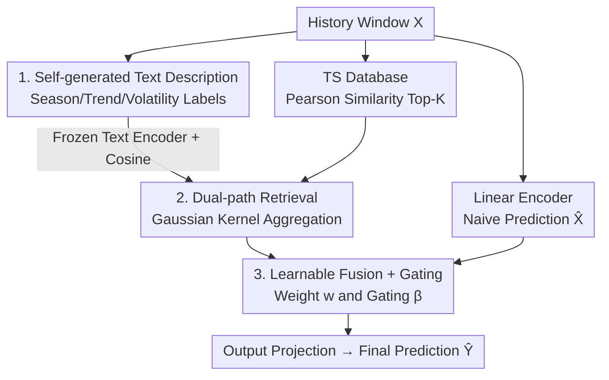

# Semantics-Enhanced Retrieval-Augmented Time Series Forecasting

**Conference**: ICML 2026  
**arXiv**: [2606.14941](https://arxiv.org/abs/2606.14941)  
**Code**: To be confirmed  
**Area**: Time Series Forecasting / Retrieval-Augmentation  
**Keywords**: Time Series Forecasting, Retrieval-Augmented Generation, Multi-modal Retrieval, Semantic Retrieval, Non-stationary  

## TL;DR
SERAF adds a "semantic retrieval" path to retrieval-augmented time series forecasting: it automatically translates each historical time series segment into a structured text description (season/trend/volatility). By retrieving two sets of "similar past + corresponding future" based on both numerical and text semantic similarity and adaptively fusing them, the model can identify historical patterns that are "numerically dissimilar but inherently isomorphic" in non-stationary series. It outperforms pure numerical retrieval SOTAs across seven real-world datasets.

## Background & Motivation

**Background**: Multivariate time series forecasting has evolved from traditional models like ARIMA to deep predictors such as DLinear and PatchTST. Recently, LLM-based methods (e.g., Time-LLM, GPT4TS) have emerged, using text context to inject background knowledge. Inspired by RAG, several works (RAFT, TimeRAG, TS-RAG, TimeRAF) have begun constructing "historical databases" to retrieve historical segments similar to the current input and their subsequent trends, explicitly guiding future predictions with historical segments.

**Limitations of Prior Work**: The vast majority of these retrieval-based methods rely solely on **time series similarity** for recall. The issue is that in non-stationary sequences, two segments with significant differences in raw numerical values or local shapes may share higher-level attributes—the same season, identical upward trends, or similar volatility levels. Pure numerical similarity (e.g., point-wise distance, correlation coefficients) often misses these "inherently isomorphic but numerically dissimilar" historical segments. A few multimodal approaches (e.g., TRACE) depend on massive external text corpora or on-the-fly LLM generation, which is inefficient and difficult to scale.

**Key Challenge**: The recall quality of retrieval is limited by the definition of "similarity." Relying only on numerical values results in a narrow recall; introducing semantics often requires the burden of external text and large models. Can a time series "describe" its own semantics without relying on external labels?

**Goal**: To provide a semantic retrieval path for retrieval-augmented forecasting without introducing external text or calling LLMs, and to adaptively fuse numerical and semantic retrieval results.

**Key Insight**: The authors observe that high-level attributes of a time series (time period, season, main trend, main volatility) can be **extracted directly from the sequence and its timestamps**. These can be formatted into a templated natural language description and embedded into a retrievable vector using a frozen text encoder. Thus, the semantic index is derived naturally from the data with zero external dependency.

**Core Idea**: Expand "numerical similarity retrieval" into a "dual-path numerical + semantic retrieval" framework. The semantic path uses self-generated text descriptions to recall historical futures that match semantically even when they are not numerical nearest neighbors. These results are then complementarily fused with the prediction via a gating mechanism.

## Method

### Overall Architecture

The input to SERAF is a historical window $\mathbf{X}_{t-L+1:t}\in\mathbb{R}^{L\times C}$ of length $L$ and channels $C$, with the goal of predicting the future $H$ steps $\mathbf{Y}_{t+1:t+H}$. The process retrieves history from both **time series** and **semantic** perspectives, then fuses the retrieved "futures" with a naive prediction.

Specifically: the input sequence passes through a trainable linear encoder to obtain a naive prediction $\hat{\mathbf{X}}^j$. Simultaneously, the Top-$K$ similar historical segments and their futures are recalled from a time series database $D_T$ using Pearson correlation. In parallel, the input sequence is translated into a text description, embedded by a frozen text model, and used to recall Top-$K$ semantically similar items from an aligned description database $D_S$ via cosine similarity. The futures retrieved from both paths are aggregated using Gaussian kernel weights, fused via a learnable weight $w$, combined with the naive prediction through a gating mechanism, and finally projected as the ultimate prediction. The entire pipeline is lightweight and requires no external annotations or domain text.

### Key Designs

**1. Self-generated Text Descriptions: Making Time Series Speak Retrievable Semantics**

Numerical retrieval misses "numerically dissimilar but inherently isomorphic" history, while external text is expensive. SERAF's solution uses a **predefined template** to extract attributes from the sequence itself into a structured description. Each description includes four items: time period, season, main trend, and main volatility. Time period and season are derived from timestamps; trend and volatility are taken from the "most frequent channel-wise pattern"—trends are discretized into upward/downward/stable, and volatility into high/medium/low.

When building the database, a sliding window with a stride of 1 is used to cut historical segments $\mathbf{P}_T^i$ from the training set, paired with their subsequent future $\mathbf{F}_T^i$ to form $D_T=\{(\mathbf{P}_T^i,\mathbf{F}_T^i)\}_{i=1}^{N}$. Descriptions are generated for each pair to form $D_S=\{\mathbf{Q}_S^i\}_{i=1}^{N}$, where $\mathbf{Q}_S^i$ corresponds one-to-one with $\mathbf{P}_T^i$. Key point: the semantic index is **completely data-derived**, requiring no LLM calls or external corpora.

**2. Dual-path Top-K Retrieval + Gaussian Aggregation: Complementary Recall**

SERAF performs Top-$K$ retrieval in two spaces. In the numerical path, similarity $\rho_{ij}=sim(\mathbf{X}^j,\mathbf{P}_T^i)$ is calculated using **Pearson correlation**, which offsets scale changes and numerical shifts to highlight consistent monotonic trends. During training, overlapping segments are removed to prevent leakage. In the semantic path, the description $\mathbf{Q}^j$ is generated for the input, embedded as $\mathbf{E}^j$ via a frozen text encoder, and **cosine similarity** $s_{ij}$ is calculated against the database embeddings $\mathbf{E}_S^i$.

Both sets of recalled segments are weighted using a **Gaussian kernel**:

$$\alpha_T^{kj}=\frac{\exp\!\left(-\frac{(1-\rho_{kj})^2}{2\tau^2}\right)}{\sum_{i\in\mathcal{K}^j}\exp\!\left(-\frac{(1-\rho_{ij})^2}{2\tau^2}\right)}$$

where $\tau$ is the bandwidth. This results in the "retrieved future" for each path: $\hat{\mathbf{F}}_T^j$ for numerical and $\hat{\mathbf{F}}_S^j$ for semantic. Note that both paths **retrieve real historical futures $\mathbf{F}_T^k$ from $D_T$**—the semantic retrieval simply provides an alternative way to find similar pasts.

**3. Learnable Fusion + Gating: Adaptive Synthesis**

The contributions are not fixed; SERAF first fuses the two retrieved futures using a **learnable scalar weight** $w\in(0,1)$: $\hat{\mathbf{F}}^j=w\,\hat{\mathbf{F}}_S^j+(1-w)\,\hat{\mathbf{F}}_T^j$. This allows the model to decide which path is more reliable for a given dataset.

Since retrieved "historical futures" are not always superior to direct extrapolation, a **gating mechanism** combines the naive prediction $\hat{\mathbf{X}}^j$ and the fused retrieval $\hat{\mathbf{F}}^j$:

$$\mathbf{G}^j=\beta\,\hat{\mathbf{X}}^j+(1-\beta)\hat{\mathbf{F}}^j,\quad \beta=\sigma\!\left(W[\hat{\mathbf{X}}^j;\hat{\mathbf{F}}^j]\right)$$

The gating coefficient $\beta$ is **input-dependent**, allowing the model to determine dynamically whether to trust the naive prediction or the retrieval more.

### Loss & Training
The model is trained to minimize the Mean Squared Error (MSE) between predictions and ground truth. Trainable parameters include the linear encoder, fusion weight $w$, gating projection $W$, and output projection. The text encoder is **frozen**, and the Gaussian bandwidth $\tau$ is a hyperparameter. All experiments use an input length of 720, averaging results across 96/192/336/720 horizons.

## Key Experimental Results

### Main Results
On seven datasets (ETTh1, ETTh2, ETTm1, ETTm2, Exchange, Weather, Electricity), SERAF is compared against RAFT and deep predictors.

| Dataset | SERAF | RAFT | CycleNet | PatchTST | DLinear | TimeMixer |
|--------|-------|------|----------|----------|---------|-----------|
| ETTh1 | **0.417** | 0.418 | 0.437 | 0.696 | 0.521 | 0.447 |
| ETTh2 | **0.348** | 0.358 | 0.368 | 0.472 | 0.445 | 0.365 |
| ETTm1 | **0.346** | 0.347 | 0.365 | 0.551 | 0.400 | 0.381 |
| ETTm2 | **0.252** | 0.257 | 0.285 | 0.354 | 0.290 | 0.275 |
| Weather | 0.235 | 0.241 | **0.224** | 0.232 | 0.238 | 0.240 |
| Exchange | 0.419 | 0.449 | **0.403** | 0.436 | 0.465 | 0.504 |
| Electricity | 0.156 | 0.160 | 0.157 | 0.216 | 0.225 | 0.169 |

SERAF achieves the lowest MSE on five out of seven datasets (ETT series and Electricity). It shows stable improvements over the strongest retrieval baseline, RAFT (e.g., ETTh2 improves from 0.358 to 0.348). On Weather and Exchange, CycleNet performs slightly better, suggesting that semantic retrieval might not be as dominant in strongly periodic or specific financial sequences.

### Ablation Study
The contribution of core components:

| Component | Addressed Issue | Expected Impact if Removed |
|-------|-------|-------|
| Self-generated Description | Numerical retrieval misses "isomorphic" history | Degenerates to pure numerical retrieval; narrower recall |
| Dual-path Gaussian Retrieval | Single similarity recall is incomplete | Loss of semantic/numerical complementarity; worse on non-stationary segments |
| Learnable Fusion + Gating | Retrieved future may be worse than naive extrapolation | Lower robustness; cannot adaptively choose between retrieval and naive prediction |

### Key Findings
- **Value of semantic retrieval is highest in non-stationary segments**: The most stable gains occur in the ETT series (which features time shifts), validating that semantic recall via season/trend/volatility fills numerical blind spots.
- **Pearson correlation is superior to point-wise distance**: Using Pearson instead of Euclidean distance offsets scale and shift, focusing on trend consistency.
- **Gating is more critical than fixed fusion**: While $w$ balances the two retrieval paths, the input-dependent gate $\beta$ acts as a safety valve against "misleading retrieval."

## Highlights & Insights
- **Zero-external dependency semantic indexing**: Translating time series into templated text derived from data itself (timestamps + statistics) makes the method much more practical and scalable than LLM-heavy approaches.
- **Clever use of "same target, different metrics"**: The semantic path doesn't introduce new prediction sources but uses text as a different "ruler" to find identical historical futures, ensuring controlled risk and natural complementarity.
- **Transferable dual-perspective retrieval paradigm**: This approach of "content similarity + attribute semantic similarity" can be transferred to other retrieval-augmented tasks like anomaly detection or load forecasting.

## Limitations & Future Work
- **Description granularity is template-limited**: Using only four discrete labels limits expressive power; fine-grained patterns like bimodal peaks or abrupt change points remain unencoded.
- **Dependence on timestamp quality**: Season and time period depend on timestamps, which may be problematic for irregularly sampled sequences.
- **Retrieval cost scales with history**: Stride-1 sliding windows create large $N$, making retrieval overhead linear with training size; approximate nearest neighbor search might be needed for very large histories.

## Related Work & Insights
- **vs RAFT**: RAFT uses multi-periodicity for retrieval but remains numerical-only. SERAF's semantic path consistently improves over RAFT on ETT datasets.
- **vs TRACE (Multimodal)**: TRACE relies on aligning external text with time series, which is inefficient. SERAF is a lighter, self-contained alternative.
- **vs Time-LLM / GPT4TS**: These use LLMs to *understand* single sequences; SERAF uses text *to index and retrieve* history, representing a different architectural role for language.

## Rating
- Novelty: ⭐⭐⭐⭐ Self-generated text for semantic retrieval with zero external dependency is a clean, new perspective.
- Experimental Thoroughness: ⭐⭐⭐ Strong results on seven datasets, though more detailed ablation numbers would be beneficial.
- Writing Quality: ⭐⭐⭐⭐ Logical flow and clear correspondence between formulas and modules.
- Value: ⭐⭐⭐⭐ Lightweight and scalable; highly practical for non-stationary time series.

<!-- RELATED:START -->

<!-- RELATED:END -->

## Related Papers

- [\[ICLR 2026\] GTM: A General Time-series Model for Enhanced Representation Learning](../../ICLR2026/time_series/gtm_a_general_time-series_model_for_enhanced_representation_learning_of_time-series.md)
- [\[ICML 2026\] Simulation-Augmented Multi-Step Split Conformal Prediction for Aggregated Forecasts](simulation-augmented_multi-step_split_conformal_prediction_for_aggregated_foreca.md)
- [\[AAAI 2026\] Task-Aware Retrieval Augmentation for Dynamic Recommendation](../../AAAI2026/time_series/task-aware_retrieval_augmentation_for_dynamic_recommendation.md)
- [\[NeurIPS 2025\] NSW-EPNews: A News-Augmented Benchmark for Electricity Price Forecasting with LLMs](../../NeurIPS2025/time_series/nsw-epnews_a_news-augmented_benchmark_for_electricity_price_forecasting_with_llm.md)
- [\[ACL 2026\] Temporal Leakage in Search-Engine Date-Filtered Web Retrieval: A Retrospective Forecasting Case Study](../../ACL2026/time_series/temporal_leakage_in_search-engine_date-filtered_web_retrieval_a_retrospective_fo.md)

<!-- RELATED:END -->
