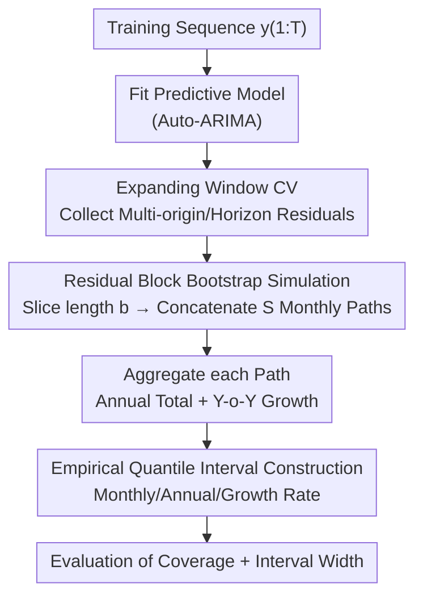

# Simulation-Augmented Multi-Step Split Conformal Prediction for Aggregated Forecasts

**Conference**: ICML2026  
**arXiv**: [2606.16356](https://arxiv.org/abs/2606.16356)  
**Code**: To be confirmed  
**Area**: Time Series / Conformal Prediction / Uncertainty Quantification  
**Keywords**: Conformal Prediction, Aggregated Forecasts, Block Bootstrap, Multi-step Prediction Intervals, Year-over-Year Growth

## TL;DR
Addressing aggregated forecast targets such as "annual totals" and "Year-over-Year (Y-o-Y) growth rates," this paper proposes SA-MSCP. The method collects residuals via expanding window cross-validation and simulates numerous future paths using block bootstrap. Prediction intervals are then constructed from the empirical quantiles of the aggregated trajectories. On M4 and a private dataset, this approach significantly improves empirical coverage for aggregated targets, albeit with a noticeable increase in interval width.

## Background & Motivation
**Background**: Providing "prediction intervals" alongside point forecasts is a core requirement in retail and financial time series scenarios. Conformal Prediction (CP) provides distribution-free coverage guarantees under exchangeability assumptions. Extensive work has extended CP to handle temporal dependencies, online adaptation, weighted quantiles, and distribution shifts.

**Limitations of Prior Work**: Many business applications prioritize **aggregated metrics**—such as total annual sales or **Y-o-Y growth rates**—over monthly pointwise forecasts. These targets pose two challenges: first, aggregation (sums, ratios) couples errors across time steps, meaning **pointwise intervals cannot simply be added to form a valid aggregated interval**; second, growth rates involve non-linear transformations (division of annual totals), where CP coverage guarantees do not automatically propagate in multi-step, dependent settings.

**Key Challenge**: If one attempts to run standard split conformal at the "annual aggregation" level—by summing monthly data into annual data and calibrating there—one encounters data scarcity. Aggregating a sequence to annual levels leaves very few calibration points, leading to statistical instability and low efficiency. Thus, a dilemma exists between "pointwise CP cannot directly synthesize aggregated intervals" and "annual-level CP lacks sufficient calibration samples."

**Goal**: To construct empirically reliable prediction intervals for monthly forecasts, annual totals, and Y-o-Y growth rates simultaneously within a univariate time series framework.

**Key Insight**: Since analytical propagation of uncertainty is difficult, **simulation is used to replace analytical derivation**. By characterizing the residual dependency structure at the monthly level, a large number of future monthly paths are generated via Monte Carlo. Aggregation and non-linear transformations then "occur naturally on the samples," allowing the final interval to be obtained by taking empirical quantiles of the simulated aggregated quantities.

**Core Idea**: The method combines multi-step split conformal with "simulation-augmented residual block bootstrap." It uses block bootstrap on monthly residuals to preserve temporal dependencies and generates $S$ future paths. Intervals are derived from empirical quantiles after aggregating into annual/growth metrics. The authors candidly acknowledge that this approach **lacks finite-sample guarantees** and focuses on improving empirical coverage.

## Method

### Overall Architecture
SA-MSCP (Simulation-Augmented Multi-Step Split Conformal Prediction) follows a pipeline of "Fitting → Cross-validation to collect residuals → Block bootstrap path simulation → Aggregation → Quantile-based intervals." The input is a training sequence $y_{1:T}$, and the outputs are prediction intervals for monthly forecasts $y_{T+1:T+H}$, annual totals, and Y-o-Y growth rates at multiple confidence levels.

The critical pivot is: **Calibration is not performed at the annual level; instead, the "residual distribution + temporal dependency" is characterized at the monthly level, allowing aggregation to occur naturally on each simulated path.** Specifically, a predictive model (Auto-ARIMA in the implementation) is fitted to the training sequence, and residuals are collected across different forecast origins and horizons via expanding window cross-validation. These residuals are de-meaned step-wise and sliced into continuous blocks of length $b$. Through bootstrap sampling, $S$ future monthly residual sequences are concatenated and superimposed onto point forecasts to obtain $S$ monthly paths. Each path is summed into annual totals $\widehat{Y}_s=\sum_{m=1}^{12}\widehat{y}_{s,m}$ and used to calculate Y-o-Y growth rates $\widehat{G}_s=(\widehat{Y}_{s,\text{year}}-\widehat{Y}_{s,\text{year}-1})/\widehat{Y}_{s,\text{year}-1}$. Finally, empirical upper and lower quantiles are taken across the $S$ samples for each target and confidence level.

### Key Designs

**1. Expanding Window CV for Multi-step Residuals: Covering Errors Across Origins and Horizons**

Standard split conformal assumes exchangeable residuals, but temporal dependency structures violate this. A single calibration set is insufficient to characterize multi-step forecast errors. SA-MSCP employs **expanding window cross-validation** across multiple forecast origins $k$ and horizons $h$ to collect residuals $\hat{\varepsilon}_{k,h}=y_{k+h}-\hat{y}_{k+h}$. In the implementation, the initial calibration window is 10 observations, increasing by 1 observation at each step, with the subsequent $h$ points used for validation. This yields a residual matrix "partitioned by horizon" rather than a set of homogeneous scalar residuals—preserving the structure where "error scales with forecast horizon."

**2. Block Bootstrap for Future Path Simulation: Preserving Local Temporal Dependency**

Independently resampling residuals for each horizon would destroy monthly correlations, resulting in unrealistic paths and unreliable aggregated intervals. SA-MSCP first **de-means** the residual columns for each horizon and then extracts all valid **continuous residual blocks** of length $b$. During simulation, these blocks are sampled with replacement and concatenated along the forecast horizon until length $H$ (truncated at $H$) is reached. By moving continuous blocks, the **local dependencies are preserved intact**. Block length is a key trade-off: for M4, $b=12$ is used to match its 36-month forecast period and preserve intra-year dependency; for private data with a 12-month period, $b=3$ is used to preserve intra-quarter dependency while maintaining sufficient resampling diversity.

**3. Post-Aggregation Simulation Calibration: Natural Non-linear Transformation on Samples**

Since pointwise intervals cannot be summed and growth rates are non-linear, analytical propagation of uncertainty is nearly impossible. SA-MSCP cleverly reverses the order: **aggregation and transformation are completed on each simulated path first, followed by empirical quantile calculation**. Each path $s$ is summed for annual totals and used for growth rates (with the previous year's total initialized from the end of the training data). The $S$ paths thus provide an empirical distribution for annual totals and growth rates. Taking empirical quantiles across $s=1,\dots,S$ for each target and level $q$ provides the bounds. This way, the dependency coupling of sums and the non-linearity of division are "automatically computed within the samples" without analytical approximations. The implementation uses $S=10,000$ paths and evaluates significant differences in coverage relative to the baseline using the Wilcoxon signed-rank test.

### Loss & Training
This work is not a learning-based method and has no trainable loss. The overall process is described by Algorithm 1: Pre-processing → Fit Model → Expanding Window CV to collect residuals → De-mean + Slice Blocks → Loop $S$ times (Bootstrap paths, aggregate totals, calculate growth) → Take empirical quantiles for each target/level → Return intervals and coverage/width statistics. The predictor uses Auto-ARIMA from the `fable` package, and future paths are generated via a modified `generate()` function injecting block bootstrap residuals.

## Key Experimental Results

### Main Results
Evaluated on M4 monthly sales data, the primary targets are **Aggregated Sales (Annual Total)** and **Y-o-Y Sales Growth**, with Raw Sales forecasts provided for reference. The baseline is a "simulated path baseline" (conditional simulation without CV-based residual calibration). The table below lists empirical coverage (headings 10%/5%/1% correspond to 90%/95%/99% nominal coverage targets).

| Target (M4) | Level | SA-MSCP Coverage | Baseline Coverage | Gain |
|-----------|------|-------------|--------------|---------|
| Raw Sales | 90% | 88.8% | 75.2% | +13.6% |
| Aggregated Sales | 90% | 83.1% | 65.6% | +17.5% |
| Aggregated Sales | 95% | 85.8% | 70.9% | +15.0% |
| Aggregated Sales | 99% | 88.9% | 78.4% | +10.4% |
| Y-o-Y Sales Growth | 90% | 89.9% | 75.2% | +14.7% |
| Y-o-Y Sales Growth | 95% | 92.0% | 80.5% | +11.5% |

Results on the private dataset of 2,000 sequences were consistent with even higher coverage: aggregated sales reached 89.3% at the 90% level with SA-MSCP, while the baseline reached only 75.3%. All improvements were significant according to the Wilcoxon signed-rank test.

### Interval Width / Coverage Cost
The improvement in coverage is not free: SA-MSCP intervals are significantly wider than the baseline. The authors use "Coverage Cost" to describe the increase in width required for each unit of coverage gain.

| Target (M4) | Level | SA-MSCP Width | Baseline Width | Coverage Cost |
|-----------|------|-------------|--------------|---------|
| Aggregated Sales | 90% | $5.5\times10^{4}$ | $1.9\times10^{4}$ | 10.8 |
| Aggregated Sales | 99% | $7.5\times10^{4}$ | $2.9\times10^{4}$ | 14.7 |
| Y-o-Y Sales Growth | 90% | $1.6$ | $4.5\times10^{-1}$ | 17.2 |
| Y-o-Y Sales Growth | 99% | $6.6$ | $7.3\times10^{-1}$ | 113.1 |

### Key Findings
- **Aggregated targets benefit most**: Annual totals saw a +17.5% coverage gain at the 90% level, higher than the +13.6% for raw monthly sales, indicating that block bootstrap simulation effectively addresses "aggregation-induced dependency."
- **Wider intervals are the trade-off**: For Y-o-Y growth at the 99% level, the coverage cost reached 113.1, showing that width expands rapidly to cover high-confidence, non-linear targets—practitioners must balance "coverage" and "interval utility."
- **Under-coverage of nominal levels persists**: Despite improvements, M4 aggregated sales at the 90% nominal level only reached 83.1% empirically. This method claims "improved empirical coverage relative to the baseline" rather than finite-sample guarantees.
- **Block length requires tuning by forecast horizon**: The choices of $b=12$ for M4 and $b=3$ for the private data reflect the trade-off of "blocks long enough to preserve dependency but short enough to allow sufficient bootstrap combinations."

## Highlights & Insights
- **Reversing the order to "Aggregate then Quantile" is clever**: By offloading dependency coupling (sums) and non-linearity (ratios) to Monte Carlo samples, it bypasses the difficulties of analytical uncertainty propagation and remains generalizable to any operator.
- **Block bootstrap directly interfaces with residual matrices**: It repurposes the "residual-by-horizon" structure from multi-step CP and adds a layer of block bootstrap. This is cost-effective to implement, essentially swapping the residual injection method in an ARIMA simulation pipeline.
- **Honesty regarding guarantees**: The authors are explicit that this is a "practical method with no finite-sample guarantees, targeting empirical coverage only." The use of Wilcoxon tests for significance makes the conclusions more credible.
- **Transferable**: The "monthly → annual" framework can be swapped for "daily → weekly/quarterly/annual," and the sum operator can be replaced with others (max, weighted sum), making the simulation-quantile framework reusable.

## Limitations & Future Work
- **Lack of theoretical guarantees**: The method bypasses exchangeability and relies on empirical coverage, often failing to meet nominal levels. It may not be suitable for high-risk scenarios requiring strict guarantees.
- **Excessive interval width**: The width expansion for high-confidence, non-linear targets (99% Y-o-Y growth) is severe, which may limit practical utility.
- **Heavy dependence on base model and residual quality**: The procedure relies on Auto-ARIMA point forecasts and residuals. If the base model is misspecified or residuals are non-stationary, block bootstrap cannot compensate.
- **Narrow evaluation scope**: Primary validation is on M4 monthly sales and a private retail dataset. It lacks stress testing on more non-stationary or structurally-changing scenarios like finance or energy. Choice of block length $b$ currently requires manual setting based on horizon rather than an automated criterion.

## Related Work & Insights
- **vs. Direct CP on Aggregated Data**: Directly calibrating annual data suffers from small sample sizes and statistical instability. SA-MSCP performs simulation at the monthly level and aggregates on samples, avoiding the scarcity of calibration points.
- **vs. Naive "Path Simulation Baseline"**: The baseline uses conditional simulation without CV-residual calibration or block bootstrap. SA-MSCP adds these two steps, resulting in consistently higher coverage (at the cost of wider intervals).
- **vs. Copula Joint Calibration / Interval Arithmetic / Hierarchical Reconciliation**: Those works address joint coverage of multiple variables or sum-consistency across levels under group exchangeability. This paper focuses specifically on **temporal aggregation within a single variable's sequence**, a different problem setting.

## Rating
- Novelty: ⭐⭐⭐ Combines multi-step CP with block bootstrap for aggregated intervals; clear logic using established building blocks.
- Experimental Thoroughness: ⭐⭐⭐ M4 and 2,000 private sequences with Wilcoxon tests are solid, though retail-focused and lacking high-non-stationarity stress tests.
- Writing Quality: ⭐⭐⭐⭐ Transparent explanation of motivation, method, and costs; clearly notes the lack of theoretical guarantees.
- Value: ⭐⭐⭐ Provides a deployable solution for business targets like annual totals and growth rates, though its value is capped by interval width and a lack of guarantees.

<!-- RELATED:START -->

## Related Papers

- [\[ICLR 2026\] Flow-based Conformal Prediction for Multi-dimensional Time Series](../../ICLR2026/time_series/flow-based_conformal_prediction_for_multi-dimensional_time_series.md)
- [\[ICLR 2026\] ResCP: Reservoir Conformal Prediction for Time Series Forecasting](../../ICLR2026/time_series/rescp_reservoir_conformal_prediction_for_time_series_forecasting.md)
- [\[ICLR 2026\] Quadratic Direct Forecast for Training Multi-Step Time-Series Forecast Models](../../ICLR2026/time_series/quadratic_direct_forecast_for_training_multi-step_time-series_forecast_models.md)
- [\[ICML 2026\] Semantics-Enhanced Retrieval-Augmented Time Series Forecasting](semantics-enhanced_retrieval-augmented_time_series_forecasting.md)
- [\[ICML 2026\] DistMatch: Adaptive Binning via Distribution Matching for Robust Sequential Conformal](distmatch_adaptive_binning_via_distribution_matching_for_robust_sequential_confo.md)

<!-- RELATED:END -->
