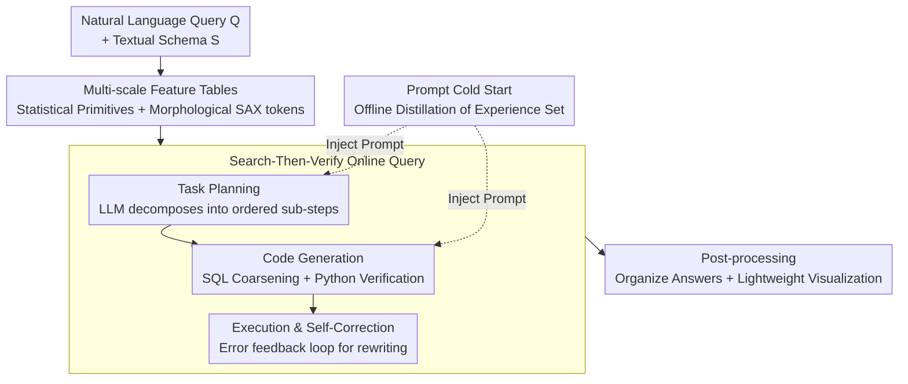

# Sonar-TS: Search-Then-Verify Natural Language Querying for Time Series Databases

**Conference**: ICML 2026  
**arXiv**: [2602.17001](https://arxiv.org/abs/2602.17001)  
**Code**: https://github.com/Atlamtiz/Sonar-TS  
**Area**: Time Series / Natural Language Querying / Neuro-symbolic Systems  
**Keywords**: Time-series databases, natural language querying, neuro-symbolic, Text-to-SQL, morphological retrieval

## TL;DR
Addressing the new problem of "querying morphological intent using natural language on massive Time Series Databases (TSDB)," this paper proposes the **Sonar-TS** neuro-symbolic framework. Much like active sonar, it first "pings" to coarsely filter candidate windows using SQL on multi-scale feature indices, then "locks on" to raw signals for precise verification using LLM-generated Python programs (Search-Then-Verify). Accompanied by **NLQTSBench**, the first benchmark for library-level long histories, Sonar-TS significantly outperforms traditional Text-to-SQL and Time-series Foundation Models on complex queries (average 0.61 vs. 0.16 for the strongest baseline).

## Background & Motivation

**Background**: IoT, finance, and AIOps have led to an explosion of time-series data, making TSDBs the storage standard. However, it remains difficult for non-expert users to extract meaningful insights—their interests often lie in **morphological features** (e.g., "when did the data rise rapidly and then fall slowly") rather than simple numerical lookups like "maximum value in May."

**Limitations of Prior Work**: Existing approaches lack critical capabilities. ① **Text-to-SQL** (DIN-SQL, MAC-SQL, CHASE-SQL, etc.) translates natural language into SQL. While schema linking is mature, standard SQL is built on strict Boolean logic and fixed thresholds, lacking **native primitives to describe continuous morphology**. Writing "fast rise" as `WHERE slope > 60` is fragile and context-dependent. ② **Time-series Question Answering (TSQA)** (Time-LLM, ChatTS, etc.) can align text with raw signals to understand morphology but is **handicapped by the Transformer context window**. Real-world TSDBs can contain millions of high-frequency monitoring points per year, far exceeding a few thousand tokens.

**Key Challenge**: Solving NLQ4TSDB requires three simultaneous capabilities: Morphological Primitives (handling continuous shapes), Massive Scalability (ingesting library-level long histories), and NL Grounding (understanding fuzzy intent). Text-to-SQL lacks MP, TSQA lacks MS, and Time-series Similarity Search (KV-Match, SAX) lacks NLG (as it follows "query-by-example" rather than "query-by-language"). **No single paradigm possesses all three.**

**Goal**: Formally define the NLQ4TSDB problem, where a system must ground high-level semantic intent into operations executable on massive, unsegmented time-series records. It addresses three specific challenges: C1 representation gap (shape intent vs. point-wise storage), C2 context scale limits (millions of points vs. limited windows), and C3 semantic grounding conflicts (fuzzy terms vs. precise thresholds).

**Key Insight**: Instead of performing full scans on raw history (computationally heavy) or relying solely on SQL (lacking morphological expression), the system mimics **active sonar**. It first uses cheap symbolic indices to "ping" a small number of candidate windows, then "locks on" to these candidates for expensive but precise raw signal verification.

**Core Idea**: A "Search-Then-Verify" pipeline combining "coarse-grained symbolic search + fine-grained algorithmic verification." Morphological expressiveness is assigned to Python operators, scalability to SQL indices, and language grounding to the LLM planner, allowing each capability to reside in its optimal place.

## Method

### Overall Architecture

Sonar-TS decomposes TSDB querying into a three-stage workflow. The core principle is to let the symbolic layer (SQL/indices) handle "needle-in-a-haystack search space reduction," the neural layer (LLM) handle "intent understanding and code synthesis," and the algorithmic layer (Python operators) handle "point-wise rigorous verification":

- **Offline Data Processing**: Pre-processes raw time series into multi-scale **Feature Tables** that serve as searchable semantic indices, making continuous shapes searchable via SQL.
- **Online Querying**: Given a query and library schema, the LLM performs task planning and generates a hybrid SQL+Python program. SQL coarsely filters candidates on feature tables, while Python pulls raw segments for precise verification. Domain heuristics are injected via an offline **Prompt Cold Start**.
- **Post-processing**: Organizes execution outputs (timestamps, intervals, scalars) into human-readable answers, with optional light visualization for manual inspection.

The overall flow is as follows:

### Key Designs

**1. Multi-scale Feature Tables: Compressing continuous shapes into SQL-searchable symbolic indices**

To address C1/C2 and avoid full scans at query time, Sonar-TS materializes feature rows offline for each numerical channel along hierarchical windows (year/month/day). Each row stores window metadata and two types of descriptors: ① **Statistical Primitives** (e.g., slope, std_val) serve as cheap pruning signals. This allows the system to prioritize candidate windows using simple SQL (e.g., `ORDER BY std_val DESC LIMIT 1`) without aggregating raw points at runtime. ② **Morphological Tokens** discretize continuous shapes into strings using SAX (Symbolic Aggregate approXimation) as "symbolic search handles." This enables "monotonic rise" to be approximated with standard SQL regex: `WHERE regexp_like(sax, '[ab]+.*[de]+')`. The original TSDB remains the source of truth, accessed only during local precise calculations. The authors emphasize that SAX is a replaceable instance, not a hard dependency.

**2. Search-Then-Verify Workflow: Symbolic coarsening + Algorithmic verification**

This is the framework's backbone, connecting planning, generation, and execution. **Step 1 Task Planning**: The LLM acts as a Task Planner, decomposing complex queries into ordered sub-steps with defined logic and operator types. **Step 2 Code Generation**: Uses two mechanisms: *SQL-based Search* uses SAX tokens for coarse filtering on feature tables (e.g., a "fast rise then fall" trend becomes a fuzzy regex `WHERE regexp_like(sax, '[ab]+.*[de]+.*[ab]+')`). *Operator-based Verification* addresses SAX's inherent information loss by synthesizing Python code to pull raw segments for precise mathematical checks—using functions like `calc_trend_slope` or `detect_changepoints`. A "fast" rise is verified by checking if the candidate slope falls within a high percentile of the historical slope distribution. The authors encapsulate classic algorithms into an executable operator library (see table below) to ground fuzzy language into rigorous, context-aware mathematics. **Step 3 Execution & Self-Correction**: SQL and Python execute sequentially. Runtime failures (empty SQL results, Python syntax errors) trigger a feedback loop, feeding the traceback/summary back to the Code Generator for rewriting.

| Verification Operator | Mathematical Basis |
|----------|----------|
| `detect_period` | Autocorrelation Function (ACF) for periodicity |
| `find_best_match` | Dynamic Time Warping (DTW) for subsequence matching |
| `detect_changepoints` | PELT algorithm for structural segmentation |
| `calc_trend_slope` | Theil-Sen estimator + Local slope distribution |
| `calc_correlation` | Pearson correlation for causal links |

**3. Prompt Cold Start: Offline distilled domain experiences**

To address C3, as NLQ4TSDB is knowledge-intensive, it requires domain heuristics (e.g., correct operator usage, effective SAX patterns). Sonar-TS maintains an **Experiences** set: compact, high-level insights distilled from past executions, injected into the Planner and Generator prompts as an "expert handbook." These experiences are built **entirely offline** on a profiling dataset, ensuring no query-time updates—saving fine-tuning costs and avoiding unpredictable online memory updates. Construction follows a "Reward-Summarize-Update" loop: executions are scored, an Experience Summarizer distills 1–3 skills from the trace, and an Experience Updater manages the global set with a strict capacity limit (e.g., 20 items) to control context overhead.

### Loss & Training
Sonar-TS is a **training-free** framework, using DeepSeek-V3 as the default backbone without fine-tuning. Online execution complexity is $O(R \cdot T_{\text{LLM}} + M + K \cdot f(w))$, where $R$ is the retry limit, $T_{\text{LLM}}$ is the LLM call cost, $M$ is the number of feature table rows scanned, $K$ is the number of candidate windows, and $f(w)$ is the operator complexity for a single window. **Crucially, it is decoupled from the sequence length $N$**: LLM prompts depend only on the schema and bounded experiences, Python verification depends only on $K$, and $M$ grows with feature tables rather than raw data, avoiding $O(N)$ or $O(N^2)$ scans inherent in end-to-end models.

## Key Experimental Results

### Main Results

NLQTSBench comprises 1153 queries across four complexity levels (L1 basic operations / L2 morphological recognition / L3 semantic reasoning / L4 insight synthesis), with an average search space of ~12,000 points. Evaluation uses two tracks: the full library-level long history for query-based methods, and NLQTSBench-Lite (500 queries, 512-point window) for context-constrained Foundation Models. Evaluation metrics are chosen based on output format (IoU for intervals, accuracy for scalars/timestamps, F1 for date sets, and composite scores for free reports).

| Setting | Method | Morph. Recog. SI | Comp. Trend CT | Causal Anom. CsA | Average |
|------|------|------------|------------|-------------|------|
| Lite (Short Context) | ChatTS-14B | 0.1768 | 0.2431 | 0.1229 | 0.1818 |
| Lite (Short Context) | ITFormer-7B | 0.0736 | 0.1500 | 0.1953 | 0.1529 |
| Lite (Short Context) | **Ours** | **0.2491** | **0.2680** | **0.3615** | **0.3016** |
| Long History | MAC-SQL | 0.0419 | 0.0020 | 0.0152 | 0.1611 |
| Long History | Xiyan-SQL-32B | 0.0588 | 0.0021 | 0.0020 | 0.0582 |
| Long History | **Ours** | **0.3336** | **0.2988** | **0.3841** | **0.6144** |

Interpretation: On the full long-history benchmark, Sonar-TS averages 0.6144, nearly 4x higher than the strongest baseline MAC-SQL (0.1611); SQL baselines almost zero out on morphology-dependent tasks (CT only 0.002). Interestingly, the training-free MAC-SQL outperformed fine-tuned Xiyan/Omni-SQL, which the authors attribute to the paradigm gap between relational querying (discrete record filtering) and time-series analysis (continuous pattern reasoning).

### Ablation Study

Removing components yields the following impact (from least to most critical):

| Configuration | Average | Most Impacted Task | Conclusion |
|------|------|------------------|------|
| Full Sonar-TS | 0.6144 | — | — |
| w/o Self-Correction | 0.5930 | SW 0.78→0.73 | Robustness refinement, not core capability |
| w/o Feature Tables | 0.5430 | SI 0.33→0.16, CT 0.30→0.04 | Degrades to general SQL+Python agent |
| w/o Experiences | 0.4686 | CxA 0.48→0.25, IS 0.74→0.34 | Reasoning tasks degrade universally |
| w/o Verification | 0.2721 | PD 0.86→0.02, SM 0.94→0.04 | Near total system collapse |

### Key Findings
- **Verification (Python) is the lifeline**: Removing it drops the average score from 0.61 to 0.27. Periodicity detection and subsequence matching almost zero out—these rigorous algorithms simply cannot be expressed in pure SQL.
- **Feature Tables are the "Morphological Search" switch**: Without this symbolic index, SI/CT tasks collapse, proving that pure agent paradigms (raw SQL + Python) cannot solve NLQ4TSDB without symbolic indexing.
- **Experiences enable expert reasoning**: Removal causes scores for semantic reasoning (CxA) and insight synthesis (IS) to halve, showing that distilled heuristics bridge the gap between "general LLM logic" and "domain analysis workflows."
- **TS Foundation Models are generally weak at this task**: Even in their specialty (SI), they often fail to capture semantic constraints like "longest" (recognizing a plateau but ignoring the length constraint), exposing a lack of global reasoning.

## Highlights & Insights
- **The "Active Sonar" analogy clarifies the neuro-symbolic division**: Ping (SQL coarsening: cheap, scalable) + Lock-on (Python verification: precise, mathematically grounded). This perfectly compensates for what Text-to-SQL (morphology) and TSQA (scalability) lack.
- **SAX as "Symbolic Search Handles" is clever**: Compressing continuous shapes into strings allows "V-shape" or "monotonic rise" to be matched via standard SQL regex, allowing existing database engines to participate in morphological retrieval on massive scales.
- **Decoupling complexity from sequence length $N$** is the true source of scalability: By offloading heavy computation to SQL engines and Python operators, the LLM only observes the schema and bounded experiences, bypassing the $O(N)$ bottle-neck of end-to-end models.
- **Offline Experiences + Strict Limits**: Injects domain knowledge without the unpredictability of online memory updates, offering a more controllable "expert handbook" than standard online RAG.

## Limitations & Future Work
- Absolute scores on morphology-dependent tasks (SI, CT) are around 0.30 even for Sonar-TS. In short-context (Lite) settings, SAX information loss on short windows can actually worsen results, indicating that SAX compression fidelity remains a bottleneck.
- Ground truth labeling relies on "controlled injection" (synthetic patterns overlaid on real backgrounds like CausalRivers/ETTm1/SMD), potentially creating a gap between synthetic patterns and naturally occurring real-world distributions.
- End-to-end performance depends on a strong backbone LLM (DeepSeek-V3) for planning; robustness under weaker backbones and the cost of iterative self-correction calls require further analysis.
- Privacy and access control for sensitive industrial data remain deployment risks that require verification protocols.

## Related Work & Insights
- **vs. Text-to-SQL (MAC-SQL / CHASE-SQL / CHESS)**: These excel at schema linking and relational queries but lack morphological primitives for "V-shape/fluctuations." Sonar-TS uses SAX tokens + Python verification to fill this gap, outperforming them by ~4x on long histories.
- **vs. TSQA (Time-LLM / ChatTS)**: These can read morphology directly but are limited by context windows. Sonar-TS uses SQL indices for long-range evidence localization, moving from "passive reading" to "active evidence positioning."
- **vs. Time-series Similarity Search (KV-Match / MS-Index / SAX)**: These follow "query-by-example," requiring numerical sequences as input. This task is "query-by-language," shifting from specific numerical examples to abstract text descriptions, which fundamentally changes the retrieval problem.

## Rating
- Novelty: ⭐⭐⭐⭐⭐ Formally defines the NLQ4TSDB problem and provides the first framework + long-history benchmark.
- Experimental Thoroughness: ⭐⭐⭐⭐⭐ 1153 queries across 4 levels, dual-track comparison, and comprehensive ablation.
- Writing Quality: ⭐⭐⭐⭐ Sonar analogy is consistent, structures are clear; absolute scores on some tasks are still low.
- Value: ⭐⭐⭐⭐⭐ Establishes the problem, framework, and evaluation standards for the practical direction of NL-to-TSDB.

<!-- RELATED:START -->

## Related Papers

- [\[ICLR 2026\] TimeOmni-1: Incentivizing Complex Reasoning with Time Series in Large Language Models](../../ICLR2026/time_series/timeomni-1_incentivizing_complex_reasoning_with_time_series_in_large_language_mo.md)
- [\[ICLR 2026\] Language in the Flow of Time: Time-Series-Paired Texts Weaved into a Unified Temporal Narrative](../../ICLR2026/time_series/language_in_the_flow_of_time_time-series-paired_texts_weaved_into_a_unified_temp.md)
- [\[ICML 2026\] Building Social World Models with Large Language Models](building_social_world_models_with_large_language_models.md)
- [\[ACL 2026\] Temporal Leakage in Search-Engine Date-Filtered Web Retrieval: A Retrospective Forecasting Case Study](../../ACL2026/time_series/temporal_leakage_in_search-engine_date-filtered_web_retrieval_a_retrospective_fo.md)
- [\[ICCV 2025\] VLRMBench: A Comprehensive and Challenging Benchmark for Vision-Language Reward Models](../../ICCV2025/time_series/vlrmbench_a_comprehensive_and_challenging_benchmark_for_vision-language_reward_m.md)

<!-- RELATED:END -->
