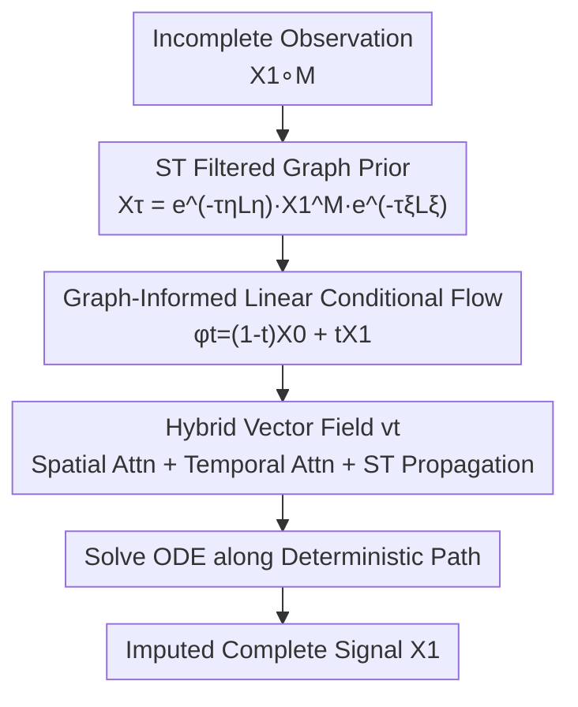

# Spatiotemporal Imputation with Graph-Informed Flow Matching

**Conference**: ICML2026  
**arXiv**: [2606.06682](https://arxiv.org/abs/2606.06682)  
**Code**: [github.com/zepengzhang/GiFlow](https://github.com/zepengzhang/GiFlow)  
**Area**: Time Series / Spatiotemporal Data / Imputation / Generative Models  
**Keywords**: Spatiotemporal Imputation, Flow Matching, Graph Prior, Spatiotemporal Filtering, Graph Neural Networks

## TL;DR
To address the issues of "error accumulation in iterative RNN/GNN propagation" and "problem-agnostic Gaussian priors and slow sampling in diffusion models" for spatiotemporal imputation, this paper proposes GiFlow. By constructing a "Graph Prior" through spatiotemporal filtering of observed signals to replace the Gaussian prior, the starting point of Flow Matching is moved closer to the target distribution with a shorter transport path. Combined with a hybrid vector field integrating spatial/temporal attention and spatiotemporal propagation, GiFlow consistently outperforms SOTA on synthetic and real-world datasets (air quality, traffic).

## Background & Motivation
**Background**: Spatiotemporal data (air quality, traffic flow) are often incomplete due to sensor failures or transmission errors, making imputation a prerequisite for downstream analysis. Dominant approaches include RNNs that propagate hidden states temporally and GNNs that propagate spatial information via graph topology.

**Limitations of Prior Work**: RNN/GNN-based methods are essentially "iterative propagation," passing estimates to future steps or neighbors. As the gap or span of missing values increases, errors tend to accumulate across time and space, often leading to information bottlenecks. Generative methods (especially diffusion models) treat this as "one-step conditional generation of the entire distribution," avoiding cumulative errors. However, they introduce two new issues: ① the use of a **problem-agnostic isotropic Gaussian prior** that ignores spatiotemporal structure; ② high sampling costs requiring many denoising steps and often multiple samples for averaging to ensure robustness.

**Key Challenge**: Iterative propagation accumulates errors, while diffusion-based generation is hindered by "naive priors and slow sampling." The root cause lies in the prior distribution being too far from the target distribution, resulting in long generation trajectories.

**Goal**: To develop a generative paradigm that avoids iterative propagation, maintains short generation paths, and utilizes spatiotemporal structure.

**Key Insight**: Flow Matching (FM) is a generalization of diffusion that follows deterministic transport paths without stochastic noise injection or mandatory Gaussian priors. **The closer the source distribution is to the target, the shorter the path and the better the generation.** Since observed signals themselves carry strong structural information, they can be used to construct a source distribution closer to the target.

**Core Idea**: Use a **Graph Prior** obtained via "adaptive spatiotemporal filtering" of observed signals as the source distribution for FM, replacing the Gaussian prior. This reduces transport costs (with theoretical guarantees) and uses a hybrid vector field to model spatiotemporal dependencies.

## Method

### Overall Architecture
GiFlow models imputation as a conditional Flow Matching problem. Instead of Gaussian noise, the source distribution is a "Graph Prior" $\mathbf{X}_\tau$ obtained by filtering incomplete observations $\mathbf{X}_1^M=\mathbf{X}_1\circ\mathbf{M}$. The target is the complete signal $\mathbf{X}_1$. These are connected via a linear conditional path. A hybrid vector field $v_t$ is trained to fit the velocity field from source to target. During inference, an ODE is solved to push the Graph Prior toward the completed result. This pipeline avoids step-by-step propagation, starts near the target, and requires no multiple-sample averaging due to the deterministic input.

### Key Designs

**1. Spatiotemporal Filtered Graph Prior: Creating a starting point close to the target**

This is the core contribution. Treating vectorized observations $\mathbf{x}_1^M=\text{vec}(\mathbf{X}_1^M)$ as signals on a spatiotemporal graph (the Cartesian product of space and time graphs), the spatiotemporal filter is defined by the Kronecker sum of the spatial Laplacian $\mathbf{L}_\eta$ and temporal Laplacian $\mathbf{L}_\xi$: $\mathbf{L}_{\eta\xi}=\tau_\xi\mathbf{L}_\xi\oplus\tau_\eta\mathbf{L}_\eta$. The filtered signal $\mathbf{x}_\tau=e^{-\mathbf{L}_{\eta\xi}}\mathbf{x}_1^M$ is expressed in matrix form as:

$$\mathbf{X}_\tau=e^{-\tau_\eta\mathbf{L}_\eta}\,\mathbf{X}_1^M\,e^{-\tau_\xi\mathbf{L}_ \xi}.$$

Intuitively, this step "diffuses" sparse observations along spatial and temporal neighbors, generating a smooth, structured initial field. The authors prove (Theorem 3.2) that the transport cost for FM using this Graph Prior is no greater than using a standard Gaussian prior. While Gaussian priors ignore structure, the Graph Prior injects spatial smoothness and temporal consistency into the starting point, leading to shorter paths.

**2. Adaptive Spatiotemporal Receptive Field: Optimizing τ for alignment and smoothness**

The filtering factors $\bm\tau=(\tau_\eta, \tau_\xi)$ are not manually tuned but solved as an optimization problem (Eq. 5) to minimize transport cost. The first term $\|\mathbf{X}_1-e^{-\tau_\eta\mathbf{L}_\eta}\mathbf{X}_1^M e^{-\tau_\xi\mathbf{L}_\xi}\|^2$ forces the filtered result to align with the ground truth, while the second term is a Laplacian smoothing regularizer. Matrix exponentials are computed efficiently via Taylor expansion truncated to $K_\eta$ spatial hops and $K_\xi$ temporal hops. Proposition 3.1 provides the truncation error bound and shows that $\bm\tau$ controls the receptive field directly.

**3. Graph-Informed Conditional Flow + Hybrid Vector Field: Modeling dependencies on the optimal path**

A linear conditional path is used (corresponding to optimal transport displacement maps): $\phi_t(\mathbf{X}\mid\mathbf{Z})=(1-t)\,e^{-\tau_\eta\mathbf{L}_\eta}\mathbf{X}_1^M e^{-\tau_\xi\mathbf{L}_\xi}+t\,\mathbf{X}_1$, inducing a vector field $u_t=\mathbf{X}_1-e^{-\tau_\eta\mathbf{L}_\eta}\mathbf{X}_1^M e^{-\tau_\xi\mathbf{L}_\xi}$. The learnable vector field $v_t$ is a **three-part hybrid model**: ① Spatial Attention: uses GNN-processed node embeddings as query/key to aggregate spatial messages; ② Temporal Attention: applies self-attention across time steps with positional encodings; ③ Spatiotemporal Propagation: concatenates spatial/temporal messages with raw features and flow-step $t$ for $L_{MP}$ message passing layers on both graphs.

### Loss & Training
The model is trained using a masked Flow Matching regression loss $\mathcal{L}_{\mathsf{GiFM}}(\bm\theta)=\mathbb{E}\big[\|\mathbf{M}\circ(v_t(\mathbf{X}_t;\bm\theta,\mathbf{M},\mathbf{L})-\mathbf{X}_1+e^{-\tau_\eta\mathbf{L}_\eta}\mathbf{X}_1^M e^{-\tau_\xi\mathbf{L}_\xi})\|^2\big]$, where the vector field is supervised only at observed positions. The filtering factors $\bm\tau$ are pre-optimized using training ground truth via SGD and fixed during inference.

## Key Experimental Results

### Main Results
On real-world datasets (Air-36, AQI, PeMS08) with $20\%$ point missingness, GiFlow achieves the best performance across three metrics (Underlined indicates the strongest baseline):

| Dataset | Metric | Prev. SOTA | GiFlow |
|--------|------|----------|--------|
| Air-36 | MAE | GRIN 9.94 | **9.54** |
| Air-36 | RMSE | GRIN 19.09 | **18.10** |
| Air-36 | MAPE | OPCR 21.61 | **21.27** |
| AQI | MAE | GRIN 7.97 | **7.83** |
| AQI | RMSE | GRIN 18.46 | **17.80** |
| AQI | MAPE | PriSTI 16.37 | **16.24** |

GiFlow outperforms RNN-based (BRITS/SAITS), ST-GNN-based (SPIN/GRIN/OPCR), and diffusion-based (PriSTI/CoSTI) baselines.

### Synthetic Data
Performance under two noise levels:

| Model | σ=0.1 MAE | σ=0.1 RMSE | σ=0.3 MAE | σ=0.3 RMSE |
|------|-----------|------------|-----------|------------|
| GRIN | 0.24 | 0.31 | 0.35 | 0.46 |
| PriSTI (Diffusion) | 0.32 | 0.36 | 0.37 | 0.47 |
| **GiFlow** | **0.23** | **0.30** | **0.34** | **0.44** |

### Key Findings
- **The prior is the game-changer**: Replacing the Gaussian prior with the spatiotemporal filtered Graph Prior results in a starting point closer to the target and a shorter path, which is the primary driver of performance and efficiency.
- **Efficiency of deterministic sampling**: GiFlow uses deterministic inputs, requiring only a single inference step rather than the multiple samples averaged in diffusion models like PriSTI.
- **Effectiveness of adaptive receptive fields**: Optimizing $\bm\tau$ allows the model to adaptively balance local vs. long-range dependencies in space and time.
- **Complementary hybrid vector field**: Attention captures global associations while message passing performs local refinement.

## Highlights & Insights
- The "constructing priors from observations" approach is clever: it converts strong structural signals (partial observations) into the FM starting point rather than forcing the model to generate from scratch, injecting domain knowledge.
- Spatiotemporal filtering using matrix exponentials of Kronecker-summed Laplacians $e^{-\tau_\eta\mathbf{L}_\eta}\mathbf{X}e^{-\tau_\xi\mathbf{L}_\xi}$ elegantly decouples space and time while remaining theoretically grounded and computationally efficient via Taylor truncation.
- The intuition that "prior quality determines path length" is mapped to a concrete construction with a theoretical guarantee (non-increasing transport cost), a strategy transferable to other structured conditional generation tasks.

## Limitations & Future Work
- The Graph Prior relies on given spatial/temporal graph structures (Laplacian); errors in graph construction may degrade prior quality.
- $\bm\tau$ is optimized on the training set and fixed; robustness to distribution shifts or varying missing patterns requires further investigation.
- Deterministic sampling sacrifices uncertainty quantification by default; noise injection is needed for stochastic sampling, and the trade-off is not fully explored.
- Validated primarily on structured scenarios (air/traffic); applicability to irregular spatiotemporal data needs verification.

## Related Work & Insights
- **vs. RNN/GNN Iterative Propagation (BRITS/GRIN)**: These methods propagate estimates step-by-step, leading to error accumulation. GiFlow generates the full distribution conditionally, avoiding this.
- **vs. Diffusion (PriSTI/CoSTI)**: Diffusion uses Gaussian priors with multi-step stochastic denoising and sample averaging. GiFlow uses Graph Priors and deterministic flows, which are more efficient.
- **vs. Vanilla Flow Matching (FM-Gauss)**: While both use deterministic flows, GiFlow shifts the source from Gaussian to the target-adjacent Graph Prior.

## Rating
- Novelty: ⭐⭐⭐⭐⭐ First to introduce Graph Priors to FM for ST imputation.
- Experimental Thoroughness: ⭐⭐⭐⭐ Extensive real-world and synthetic testing across multiple missingness modes.
- Writing Quality: ⭐⭐⭐⭐ Clear motivation linking Gaussian prior defects to the Graph Prior solution.
- Value: ⭐⭐⭐⭐ High utility for large-scale ST data due to deterministic single-pass sampling.

<!-- RELATED:START -->

## Related Papers

- [\[ICML 2026\] DistMatch: Adaptive Binning via Distribution Matching for Robust Sequential Conformal](distmatch_adaptive_binning_via_distribution_matching_for_robust_sequential_confo.md)
- [\[CVPR 2026\] Probabilistic Precipitation Nowcasting with Rectified Flow Transformers](../../CVPR2026/time_series/probabilistic_precipitation_nowcasting_with_rectified_flow_transformers.md)
- [\[ICML 2026\] HELIX: Hybrid Encoding with Learnable Identity and Cross-dimensional Synthesis for Time Series Imputation](helix_hybrid_encoding_with_learnable_identity_and_cross-dimensional_synthesis_fo.md)
- [\[ICLR 2026\] SRT: Super-Resolution for Time Series via Disentangled Rectified Flow](../../ICLR2026/time_series/srt_super-resolution_for_time_series_via_disentangled_rectified_flow.md)
- [\[ACL 2026\] STK-Adapter: Incorporating Evolving Graph and Event Chain for Temporal Knowledge Graph Extrapolation](../../ACL2026/time_series/stk-adapter_incorporating_evolving_graph_and_event_chain_for_temporal_knowledge_.md)

<!-- RELATED:END -->
