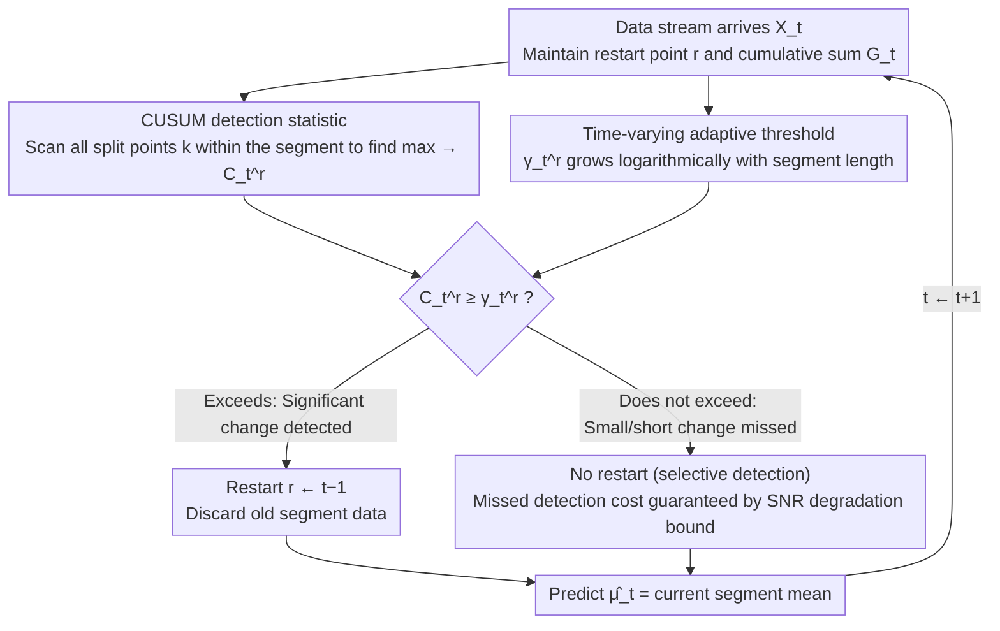

# The Cost of Learning Under Multiple Change Points

**Conference**: ICML 2026  
**arXiv**: [2602.11406](https://arxiv.org/abs/2602.11406)  
**Code**: To be confirmed  
**Area**: Time Series / Online Learning Theory  
**Keywords**: Online Learning, Change Point Detection, Dynamic Regret, Non-stationary Environments, Endogenous Confounding

## TL;DR
This paper proposes the Anytime Tracking CUSUM (ATC) algorithm, which utilizes a time-varying adaptive threshold and the "selective detection" principle to achieve near minimax-optimal dynamic regret $O(\sigma^2 (S+1) \log T)$ without **any detectability assumptions** (such as minimum spacing or minimum jump size). It also provides the first formal quantification of the logarithmic degradation bound due to "endogenous confounding from missed detections" in multi-change point scenarios.

## Background & Motivation

**Background**: Non-stationary environments in online learning have been studied for years, and high-confidence ($\delta$-PAC) theories for single change point detection (e.g., CUSUM) are mature. However, practical applications usually face an **unknown number and unknown locations** of multiple change points and require algorithms to be "anytime" (not needing to know the horizon $T$ in advance).

**Limitations of Prior Work**: Existing methods often assume "detectability"—requiring a minimum interval and a minimum jump size between change points. When these assumptions fail, two troublesome phenomena occur:
- **Endogenous confounding**: After a change point is missed, old data remains in the reference statistics, polluting the detection baseline for subsequent change points; the failure of the learner worsens future detection tasks.
- **Cascading collapse**: Confounding gradually accumulates, the detection power for subsequent change points continues to decline, and eventually, the algorithm's performance crashes. This is particularly severe in non-parametric settings where the reference distribution must be estimated from historical samples.

**Key Challenge**: How to design an algorithm that does not rely on detectability assumptions and can both adapt quickly to large changes and remain stable against small/transient changes without increasing variance due to frequent restarts?

**Goal**: Establish the learning-theoretic foundations for online learning with multiple change points—provide a lower bound for dynamic regret and design an algorithm that achieves this bound.

**Key Insight**: The authors move away from the "high-confidence detection" framework and start from **regression regret**, using dynamic regret (the cumulative squared error between predictions and the time-varying true mean) as a unified metric. This encodes the costs of detection delay, false alarms, and endogenous confounding. Key insight: **It is not necessary to detect every change point**—the regret cost of missing small/short changes is controllable; the key is using adaptive thresholds to distinguish between detectable and non-detectable changes.

**Core Idea**: The combination of a time-varying adaptive threshold, the selective detection principle, and a logarithmic upper bound on SNR degradation achieves a near minimax-optimal dynamic regret of $O(\sigma^2 (S+1) \log T)$.

## Method

### Overall Architecture
ATC extends the classical CUSUM from "single change point detection" to "multi-change point online tracking" without needing prior knowledge of the horizon $T$ or the number of change points $S$. At each time $t$, it maintains only two things: the last restart time $r$ (initially $r=1$) and the cumulative sum $G_t = \sum_{i=1}^t X_i$ (used to calculate segment means in $O(1)$ time). Each step involves detection and prediction: during detection, it calculates the CUSUM statistic $C_t^r = \max_{r<k<t}\hat{D}_{k,t}^r$ and compares it to a time-varying threshold $\gamma_t^r$. If the threshold is exceeded, $r$ is restarted to $t-1$ (discarding old segment data). During prediction, it directly outputs the mean of the last complete segment $\hat{\mu}_t = \frac{1}{t-r}\sum_{i=r}^{t-1}X_i$. The entire process is an **online loop of point-by-point arrival and alternating detection-restart-prediction**: the updated $r$ from a restart changes the detection baseline for the next step, forming a feedback loop.

### Key Designs

**1. CUSUM Detection Statistic: Scanning all possible split points within the current segment to find the strongest evidence of change**

The location of the change point is unknown, so one cannot focus on a single candidate point without risking a missed detection. ATC scans all split points $k$ within the current restart interval $[r, t)$ and calculates a normalized statistic for the difference between two segment means $\hat{D}_{k,t}^r = \frac{1}{\sigma}\sqrt{\frac{(k-r)(t-k)}{t-r}}\left|\bar{X}_{r:k-1} - \bar{X}_{k:t-1}\right|$, similar to the Generalized Likelihood Ratio (GLR) but without assuming the distributions are known. At the true change point $\tau_j$, its Signal-to-Noise Ratio (SNR) is $\text{SNR}_j^*(t) = \frac{(\tau_j - \tau_{j-1})(t-\tau_j)}{t-\tau_{j-1}}\frac{\Delta_j^2}{\sigma^2}$ (where $\Delta_j$ is the jump size). This SNR increases monotonically with $t$, meaning that as long as the change is large enough, it will be detected within a logarithmic delay. Scanning all $k$ ensures that the location is found even if unknown.

**2. Time-varying Adaptive Threshold: Using a threshold line that grows with segment length to automatically balance "stability" and "sensitivity"**

A fixed threshold presents a dilemma: if too high, reaction to true change points is slow; if too low, false alarms are frequent, and $T$ must be known. ATC allows the threshold to evolve over time: $\gamma_t^r = \sqrt{6\log(t-r) + 2\log(1/\alpha_r) + 2\log(\pi^2/3)}$, where $\alpha_r = \frac{6\alpha}{\pi^2 r^2}$ is a false alarm budget that decreases based on the restart time, satisfying $\sum_r \alpha_r \leq \alpha$. The detection condition is $C_t^r \geq \gamma_t^r$. The growth rate of $\log(t-r)$ is chosen carefully: it ensures the scanning statistic is uniformly concentrated across all $k$ and all $t$ in the current segment, preventing false alarm explosions due to multiple scanning; the convergence of the $\alpha_r$ series ensures the total anytime false alarm rate is bounded, allowing the algorithm to support true online operation without detectability assumptions.

**3. Quantification of Endogenous Confounding (SNR Degradation Bound): Proving that "missed detections drag down future detection, but not to the point of collapse"**

The most insidious trap in multi-change point scenarios is that once a change point is missed, old data stays in the reference statistic, polluting the baseline for future detections. The learner's own failure worsens future tasks, theoretically leading to cascading collapse. ATC quantifies this: if the $j$-th change point is missed, the effective reference mean becomes a mixture $\mu_{\text{pre}}^{\text{eff}}(r,j) = \frac{\sum_{\ell=i}^{j-1}n_\ell\mu_\ell}{\sum n_\ell}$. The effective jump size $\Delta_j^{\text{eff}} = |\mu_{\text{pre}}^{\text{eff}} - \mu_j|$ might be much smaller than the true $\Delta_j$, and the SNR declines accordingly. However, Proposition 3.1 shows the degradation is only **logarithmic**: $(\text{SNR}_j^*(t) - \text{SNR}_j^{\text{eff}}(t;r))_+ \leq C\log\frac{\tau_j - r + 1}{\alpha_r}$. This is the theoretical pivot of the paper—it proves that missed detections only delay subsequent detections rather than causing the algorithm to crash, justifying the "selective detection" approach.

### Loss & Training
Minimize dynamic regret $\mathcal{R}_T(\pi) = \mathbb{E}[\sum_{t=2}^T (\hat{\mu}_t - \mu_t)^2]$. There is no optimization or training; it is purely online tracking.

## Key Experimental Results

### Main Results (Theory + Synthetic + Real Data)

| Environment | Change Points $S$ | Time $T$ | ATC Regret | Theoretical Upper Bound | Theoretical Lower Bound | Notes |
|------|----------|---------|---------|--------|--------|------|
| Synthetic (Mean Shifts) | 5 | 300+ | $O(\log T)$ | $O(\sigma^2 (S+1) \log T)$ | $\Omega(\sigma^2 (S+1) \log(T/(S+1)))$ | 5000 MC trials |
| NAB AWS CPU Data | Unknown | 4000+ | Lowest Regret | ~40% lower than baselines | — | Explicit restart better than sliding window |

### Ablation Study

| Configuration | Key Metric | Description |
|------|---------|------|
| Full ATC (Log Threshold) | Balance of Regret + False Alarm Rate | Default configuration |
| Constant Threshold ATC | Regret +30% | Fixed threshold cannot adapt to segment growth; missed detections increase |
| Computationally Efficient Variant | Regret nearly unchanged, Comp. $O(\log(t-r))$ | Limits scanning candidate points; asymptotic rate preserved |

### Key Findings
- Figure 4(c) shows regret grows linearly with $\log T$ across 5000 MC trials, consistent with Theorem 4.1; the computationally efficient variant curve is parallel to the full version, differing only by a constant.
- The 5th change point was successfully detected at $t \approx 900$ even after two missed detections, verifying the "logarithmic, non-collapsing" nature of the SNR degradation bound.
- On NAB data, the method adapts immediately after large jumps compared to sliding window/discounting baselines, reducing regret by 40% at the large jump near step 4000+.
- Sensitivity to variance $\sigma$ misspecification: underestimating $\sigma$ increases false alarms but does not change the asymptotic rate.

## Highlights & Insights
- **Formalization of Endogenous Confounding**: This is the first time the hidden trap of multi-change point online learning has been written as an explicit logarithmic bound in Proposition 3.1—any restart-based online learning should refer to this analytical framework.
- **Selective Detection Principle**: The core philosophy is "not every change needs to be detected"—allowing changes below the statistical resolution to be missed (with controllable costs) achieves near minimax optimality in completely general settings. This is counter-intuitive but powerful.
- **Near Minimax Optimality**: Theorem 4.1 (upper) and Theorem 4.2 (lower) differ only by a factor of $\log(S+1)$, which is a tight characterization for an anytime algorithm.
- **Dynamic Regret Framework**: Using squared loss to track a moving target can be transferred to problems like non-stationary RL and dynamic pricing.

## Limitations & Future Work
- The upper bound is achieved completely online, but whether it can be further improved to $O(\sigma^2 S \log(T/S))$ if $T$ and $S$ were known in advance remains unsolved.
- The algorithm assumes the sub-Gaussian proxy $\sigma$ is known; in practice, it needs to be estimated online.
- For multi-dimensional extensions ($\mathbb{R}^d$), the threshold would include an additional $\sqrt{d}$ factor, potentially limiting high-dimensional efficiency.
- Exclusive to squared loss; the lower bound under $L_1$ is $\Omega(\sqrt{ST})$ (linear growth), implying a qualitative change in algorithm design is needed for other losses.

## Related Work & Insights
- **vs. Classical CUSUM (Page 1954; Lorden 1971)**: Classical CUSUM targets a single change point with known pre-distributions; this work extends it to multiple change points without detectability assumptions, with the core innovation being the handling of endogenous confounding.
- **vs. Sliding Window / Discounting (Garivier & Moulines 2011)**: Passive methods adapt by forgetting old data and require manual parameter tuning; the explicit restart in this paper automates hyperparameter optimization.
- **vs. Active Restart Multi-Armed Bandits (Liu et al. 2018; Cao et al. 2019)**: Prior work required high-confidence detection assumptions; this paper provides regret bounds without them, which could inspire new algorithms for non-stationary bandits.
- **Insight**: The trio of selective detection + adaptive threshold + SNR degradation upper bound has methodological value for all "restart-based online learning / RL."

## Rating
- Novelty: ⭐⭐⭐⭐⭐ First strict formalization of endogenous confounding + near minimax optimality in a completely general setting; a significant breakthrough in online learning theory.
- Experimental Thoroughness: ⭐⭐⭐⭐ Synthetic data clearly verifies theory; demonstrates practical advantage on NAB; solid ablation; lacks comparison on more real-world multi-change point datasets.
- Writing Quality: ⭐⭐⭐⭐⭐ The visualization of endogenous confounding in Figure 1 is intuitive and powerful; proof logic is complete in the main text; definitions are precise.
- Value: ⭐⭐⭐⭐⭐ Theoretically fills a gap in multi-change point non-stationary learning; practically applicable to demand tracking, resource management, online compression; algorithm design has general reference value.

<!-- RELATED:START -->

## Related Papers

- [\[NeurIPS 2025\] PlanU: Large Language Model Reasoning through Planning under Uncertainty](../../NeurIPS2025/time_series/planu_large_language_model_reasoning_through_planning_under_uncertainty.md)
- [\[NeurIPS 2025\] Frequency Matters: When Time Series Foundation Models Fail Under Spectral Shift](../../NeurIPS2025/time_series/frequency_matters_when_time_series_foundation_models_fail_under_spectral_shift.md)
- [\[ICML 2025\] TCP-Diffusion: A Multi-modal Diffusion Model for Global Tropical Cyclone Precipitation Forecasting with Change Awareness](../../ICML2025/time_series/tcp-diffusion_a_multi-modal_diffusion_model_for_global_tropical_cyclone_precipit.md)
- [\[ICML 2026\] Divide and Contrast: Learning Robust Temporal Features Without Augmentation](divide_and_contrast_learning_robust_temporal_features_without_augmentation.md)
- [\[ICML 2026\] Position: Current Benchmarking Hinders Real Progress in Deep Learning for Time Series](position_current_benchmarking_hinders_real_progress_in_deep_learning_for_time_se.md)

<!-- RELATED:END -->
