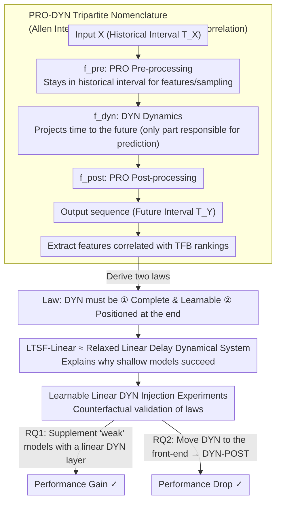

# Time-series Forecasting Through the Lens of Dynamics

**Conference**: ICML 2026  
**arXiv**: [2507.15774](https://arxiv.org/abs/2507.15774)  
**Code**: None  
**Area**: Time Series Forecasting / Model Analysis  
**Keywords**: Dynamical Systems Perspective, PRO-DYN Nomenclature, LTSF-Linear, Predictor Position, Principles of Time-series Model Design

## TL;DR
The authors utilize Allen's Interval Algebra to propose the PRO-DYN nomenclature, decomposing any time-series forecasting (TSF) model into three stages: "Pre-processing (PRO) → Dynamics (DYN) → Post-processing (PRO)." Two empirical laws are identified: (i) the DYN component must be **learnable and complete** to outperform LTSF-Linear, and (ii) the DYN component must be positioned at the **end of the pipeline** (PRE-DYN configuration) to benefit from long lookback windows. These laws are validated by enhancing Informer/FEDformer/MICN/FiLM with a linear DYN layer to consistently improve performance and by shifting the DYN component to the front-end for iTransformer/PatchTST/Crossformer, which leads to performance degradation.

## Background & Motivation
**Background**: The TSF field is dominated by Transformer-based models (Informer, FEDformer, PatchTST, iTransformer, etc.). However, since 2023, "shallow" baselines like LTSF-Linear and FITS, which consist almost entirely of a single linear mapping, have outperformed many complex deep models. Recently, state-of-the-art models like iTransformer and PatchTST have surpassed NLinear again, leaving the relationship between complexity and performance ambiguous.

**Limitations of Prior Work**: There is a lack of a unified perspective to explain why some Transformers fail while others succeed. Zeng et al. (2023) attributed failures to the attention mechanism, but PatchTST and iTransformer use attention effectively. Ke et al. (2025) analyzed only attention without explaining successful cases. Most papers argue for their specific modifications, yet the field lacks a comprehensive "model anatomy."

**Key Challenge**: The essence of time-series generation is a **dynamical system**, where data evolves according to an evolution law $x(t_n) = F(x(t_{n-1}), \dots, x(t_{n-K}))$. When natural language models are adapted for TSF, the critical question is whether the model truly learns this $F$. If prediction relies on zero-padding or non-learnable functions (e.g., the decoder initialization in Informer/FEDformer), it is not "learning dynamics" and naturally fails to compete with LTSF-Linear, which explicitly learns linear mappings.

**Goal**: (i) Establish a formal language for "how models process time" to enable structured analysis of any TSF model; (ii) identify key features that distinguish superior models; (iii) experimentally verify the causal role of these features via "minimal surgery" (adding a linear DYN layer without changing hyperparameters); and (iv) provide plug-and-play design principles for future TSF models.

**Key Insight**: Classification is based on the algebraic relationships of time intervals. Allen (1983) defined 13 basic relationships between two intervals $T_E$ and $T_F$. A function $f$ is categorized by the relationship between its input and output intervals: if the output interval remains within the input interval (e.g., contains/equals), $f$ is a PRO (Pre/Post-processing); if the output interval moves into the future (e.g., starts/overlaps/meets/before), $f$ is a DYN (Dynamics). This provides a unified analytical "scalpel."

**Core Idea**: Prediction capability is formalized through two factors: the completeness of the DYN function and its position within the pipeline. This is anchored by a theoretical interpretation of LTSF-Linear as a "relaxed version of a linear delay dynamical system."

## Method

### Overall Architecture
For any TSF model $M_\theta$, with input $X \in \mathbb R^{L\times D}$ in the historical interval $T_X$ and output $\hat Y \in \mathbb R^{H\times D}$ in the future interval $T_Y$, the model can be decomposed as:
$$M_\theta: X \xrightarrow{f^{\text{pre}}_{\theta_{\text{pre}}}} X_{\text{pre}} \xrightarrow{f^{\text{dyn}}_{\theta_{\text{dyn}}}} \tilde Y \xrightarrow{f^{\text{post}}_{\theta_{\text{post}}}} \hat Y$$
Where $f^{\text{dyn}}$ is the DYN function (in orange) that projects time from $T_X$ to $T_Y$ (responsible for future prediction), while $f^{\text{pre}}$ and $f^{\text{post}}$ are PRO functions (in blue) that remain within the input interval for feature extraction or sampling. Reversible normalization and similar components are excluded from the nomenclature. The authors classify 16 models based on DYN completeness and PRO configuration, identifying two laws by correlating with TFB benchmark rankings and validating them via counterfactual surgeries. The research workflow is as follows:

### Key Designs

**1. PRO-DYN Nomenclature: A Unified Scalpel for Temporal Processing**

**Mechanism**: Most papers justify their specific architectural changes, yet few explain why certain Transformers succeed where others fail. The authors adopt Allen's (1983) Interval Algebra to turn this into quantifiable features. By examining the relationship between the input interval $T_E$ and output interval $T_F$ of a function $f$, they distinguish between PRO (Pre/Post-processing, which performs feature extraction or sampling within the input interval) and DYN (Dynamics, which actually projects into the future). Models are then labeled as PRE-DYN (e.g., iTransformer, PatchTST), DYN-POST, PRE-DYN-POST (e.g., Informer, FEDformer), or pure DYN (e.g., NLinear). Correlating these labels with TFB benchmark rankings reveals that the "↑" group (outperforming NLinear) almost exclusively uses PRE-DYN with complete, learnable DYN, while the "↓" group (underperforming NLinear) often uses PRE-DYN-POST with partially non-learnable DYN (e.g., FEDformer's mean+0-padding initialization).

**2. Interpreting LTSF-Linear as a "Relaxed Linear Delay Dynamical System"**

**Mechanism**: If "learning dynamics" is the differentiator, why do single-layer linear mappings like LTSF-Linear outperform complex Transformers? The authors hypothesize that real-world dynamics satisfy $[x(t_n), \dots, x(t_{n-L+1})]^T = M[x(t_{n-1}), \dots, x(t_{n-L})]^T$, such that $H$-step prediction becomes $Y = (M^H)_{-H:,:} X$. The prediction layer of LTSF-Linear, $\hat Y = W_\theta X_g + b_\theta$, shares the same dimensions as $(M^H)_{-H:,:}$, making it a "relaxed dynamical system identification" without coefficient constraints. This suggests LTSF-Linear succeeds because it genuinely learns linear dynamics, whereas Informer/FEDformer force the decoder to project into the future from zero-padding. This connects empirical deep learning phenomena to fifty years of system identification theory.

**3. Learnable Linear DYN Injection Experiments**

**Mechanism**: Correlation is insufficient; the two laws must pass counterfactual testing. Two sets of "minimal surgeries" are designed: RQ1 (DYN Supplementation) replaces the zero-padding/mean initialization in Informer, FEDformer, MICN, and FiLM with a learnable linear DYN layer, keeping all other hyperparameters constant. RQ2 (Position Shifting) inserts a linear DYN layer at the front-end of PRE-DYN models (iTransformer, PatchTST, Crossformer), effectively degrading them to a DYN-POST configuration. To isolate "performance change" from "parameter increase," a PRO control group is added, using the same number of parameters but in a feed-forward layer that does not project time. Results across 25 datasets, 4 horizons, and 7 models are validated using a one-sided Wilcoxon test ($p < 0.05$).

### Loss & Training
All experiments follow the TFB benchmark training protocols, with only learning rate, epochs, and patience manually tuned. Architectural hyperparameters remain unchanged to ensure that improvements are attributed specifically to the "DYN layer insertion" rather than hyperparameter optimization. Performance is evaluated using MSE and MAE.

## Key Experimental Results

### Main Results
Classification of 16 TSF models using PRO-DYN nomenclature (Selection):

| Model | TFB Rank | Complete Learnable DYN | PRO-DYN Config | DYN Function |
|---|---|---|---|---|
| iTransformer | ↑ (Outperforms NLinear) | ✓ | PRE-DYN | Linear |
| PatchTST | ↑ | ✓ | PRE-DYN | Linear |
| Crossformer | ↑ | ✓ | PRE-DYN | Linear |
| NLinear | Baseline | ✓ | DYN | Linear |
| FITS | ↓ (Underperforms NLinear) | ✗ | PRE-DYN | Linear+0-pad |
| FEDformer | ↓ | ✗ | PRE-DYN-POST | Mean+0-pad |
| MICN | ↓ | ✗ | PRE-DYN-POST | Linear+0-pad |
| FiLM | ↓ | ✗ | PRE-DYN-POST | Legendre disc. |
| Informer | ↓ | ✗ | PRE-DYN-POST | 0-padding |

RQ1 Experiments: Normalized MSE/MAE scores compared to NLinear after adding a linear DYN layer (closer to 0 is better):

| Model | DYN added | Vanilla |
|---|---|---|
| Informer | **−0.228** | −0.333 |
| FiLM | **0.006** | −0.036 |
| MICN | **−0.164** | −0.176 |
| FEDformer | **−0.360** | −0.398 |

FiLM with DYN slightly outperforms NLinear; Informer shows the most significant improvement.

### Ablation Study

| Configuration | Key Finding | Implication |
|---|---|---|
| RQ1 Vanilla → +DYN | Performance equal or better in 80%+ of scenarios | Complete learnable DYN improves performance. |
| RQ1 +DYN vs +PRO | +DYN significantly outperforms +PRO | Gains come from "learning dynamics," not more parameters. |
| RQ2 PRE-DYN → DYN-POST | PatchTST/Crossformer significantly degrade | The PRE-DYN output position is indispensable. |
| RQ2 Positioning (iTransformer) | 51% scenarios tied | iTransformer treats time as latent; less sensitive to position. |
| Time Length Analysis | DYN gains are larger in long horizon ($H > L$) scenarios | Complete dynamics help models exploit long lookback windows. |

### Key Findings
- Performance grouping almost perfectly correlates with PRO-DYN features, suggesting the nomenclature captures the dominant factors.
- DYN must be at the end: The PRE block linearizes history variables, allowing the final linear DYN to perform system identification directly. Front-loading DYN forces prediction before feature learning is complete, which is then disrupted by non-linear PRO blocks.
- Performance gains do not stem from increased parameters; the PRO control group showed no gain, confirming "temporal projection" is the key.

## Highlights & Insights
- **Paradigm-level "Scalpel"**: Applying Allen’s Interval Algebra to TSF model analysis is an elegant cross-disciplinary approach that operates at a higher level of abstraction than discussions about "whether attention is needed."
- **Physical Interpretation of Shallow Models**: Observing that LTSF-Linear acts as a relaxed delay dynamical system provides profound theoretical grounding for empirical deep learning results.
- **Actionable Engineering Principles**: Future TSF models can be vetted by asking: (i) Is DYN complete and learnable? (ii) Is DYN at the end? These provide "free" design upgrades.

## Limitations & Future Work
- The nomenclature focuses on Family 1 (pattern-recognition models); foundation models and dynamics-based models (Family 2/3) are reserved for future work.
- Only **linear** DYN was studied; the positional sensitivity of non-linear dynamics (e.g., Koopman, Neural ODEs) remains unknown.
- Evaluation was limited to MSE/MAE, without analysis of long-term distribution shifts or probabilistic forecasting.
- Future direction: Design new TSF models using end-to-end DYN as an inductive bias.

## Related Work & Insights
- **vs. Zeng et al. (2023)**: These authors blamed the attention mechanism; Ours proves the issue is not attention itself, but whether the DYN component is complete and correctly positioned.
- **vs. Ke et al. (2025)**: While they analyzed attention failure, Ours provides a constructive solution by showing what DYN components to add.
- **vs. Koopa/Attraos**: These models explicitly model dynamics (e.g., Koopman operators). Ours does not require physical identification but emphasizes the structural requirement of a late-stage linear DYN block.

## Rating
- Novelty: ⭐⭐⭐⭐ Provides a new perspective using interval algebra and the interpretation of LTSF-Linear.
- Experimental Thoroughness: ⭐⭐⭐⭐ High coverage with 16 classification models and significant statistical testing.
- Writing Quality: ⭐⭐⭐⭐ Clear concepts and logical chain from definition to validation.
- Value: ⭐⭐⭐⭐ Offers a "model anatomy" language that will benefit future TSF model design.

<!-- RELATED:START -->

## Related Papers

- [\[ICLR 2026\] Towards Generalizable PDE Dynamics Forecasting via Physics-Guided Invariant Learning](../../ICLR2026/time_series/towards_generalizable_pde_dynamics_forecasting_via_physics-guided_invariant_lear.md)
- [\[ICML 2026\] Ellipsoidal Time Series Forecasting](ellipsoidal_time_series_forecasting.md)
- [\[NeurIPS 2025\] IonCast: A Deep Learning Framework for Forecasting Ionospheric Dynamics](../../NeurIPS2025/time_series/ioncast_a_deep_learning_framework_for_forecasting_ionospheric_total_electron_con.md)
- [\[ICML 2026\] From Observations to States: Latent Time Series Forecasting](from_observations_to_states_latent_time_series_forecasting.md)
- [\[ICML 2026\] Nested Spatio-Temporal Time Series Forecasting](nested_spatio-temporal_time_series_forecasting.md)

<!-- RELATED:END -->
