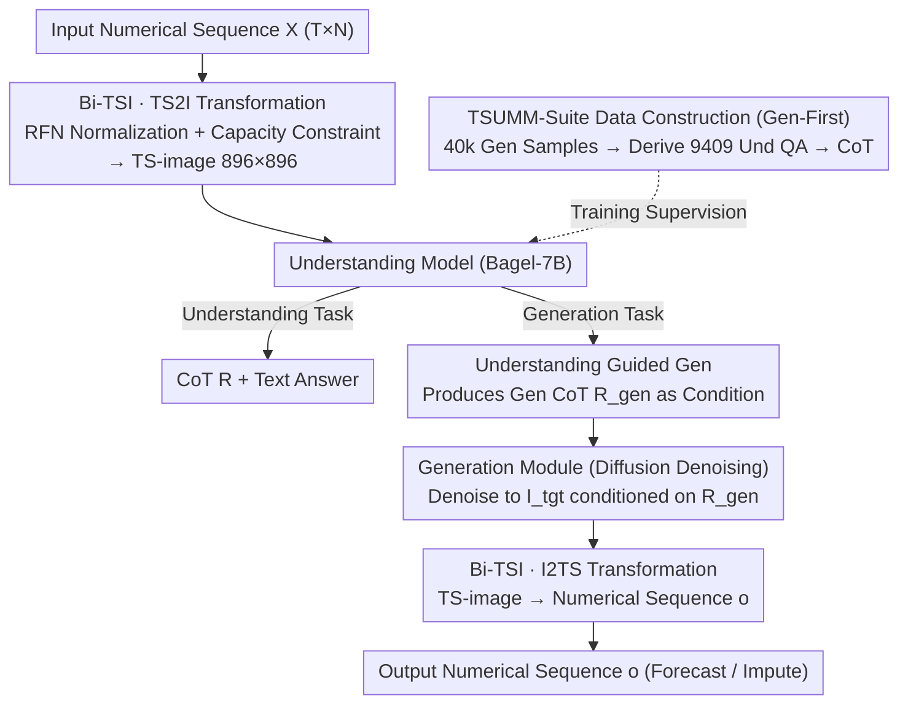

# TimeOmni-VL: Unified Models for Time Series Understanding and Generation

**Conference**: ICML 2026  
**arXiv**: [2602.17149](https://arxiv.org/abs/2602.17149)  
**Code**: To be confirmed  
**Area**: Time Series / Unified Multimodal Models  
**Keywords**: Time Series Forecasting, Time Series Imputation, Unified Multimodality, Visual Representation, Understanding-Generation

## TL;DR
TimeOmni-VL achieves the industry's best performance in forecasting and imputation by converting time series into **high-fidelity images** (Bi-TSI) and introducing an **understanding-guided generation mechanism** (CoT as diffusion conditioning). This marks the first successful unified multimodal framework that simultaneously masters time series **understanding and generation** tasks.

## Background & Motivation

**Background**: Time series modeling has long been bifurcated into two branches—**generative models** (Time Series Foundation Models, TSFMs), which pursue numerical precision focused on forecasting and imputation; and **understanding models**, which leverage LLMs to provide human-readable explanations of temporal dynamics. However, these two paths operate in isolation.

**Limitations of Prior Work**: Generative models often lack structural understanding, relying solely on shallow pattern matching. Understanding models struggle with numerical fidelity—textual tokenizers often split "123" into separate tokens "1", "2", and "3", destroying numerical continuity. While vision-based methods like VisionTS are competitive in forecasting, they essentially rely on pure pixel texture matching and overlook intrinsic properties such as periodicity and seasonality. Pure text LLMs, limited by their counting abilities, cannot reliably generate sequences with lengths of hundreds or thousands of steps.

**Key Challenge**: The vision field has achieved the fusion of understanding and generation through Unified Multimodal Models (UMMs), with the core insight that "strong understanding is the foundation for high-quality generation." However, this paradigm has not been fully explored in time series, primarily due to the lack of **bidirectional high-fidelity mapping** and a **mechanism for understanding-guided generation**.

**Goal**: Achieve time series understanding and generation within a unified visual framework, enabling the model to learn semantics while maintaining numerical precision.

**Key Insight**: Inspired by the success of vision foundation models—can we represent time series visually, thereby allowing UMMs to natively support time series understanding and generation?

**Core Idea**: Encode time series into high-fidelity images (Bi-TSI), then use Chain-of-Thought (CoT) from understanding tasks as an explicit constraint on the generation process—transforming temporal semantics into control signals for generation.

## Method

### Overall Architecture
A three-tier architecture:
1.  **Transformation Layer**: Converts sequences to TS-images (896 × 896) via Bi-TSI.
2.  **Understanding Layer**: Based on the understanding branch of Bagel-7B UMM, generating CoT for six types of tasks given the TS-image.
3.  **Generation Layer**: A diffusion decoding module conditioned on CoT, outputting the target TS-image, which is then inversely transformed back into a numerical sequence.

The key innovation lies in the **interconnection between understanding and generation**—the CoT from the understanding phase directly serves as the conditional variable for the diffusion process during generation.

### Key Designs

**1. Bi-TSI: Bidirectional fidelity mapping, enabling near-lossless round-trips between time series and images**

Methods like VisionTS simply render sequences as texture maps, relying purely on pixel pattern matching while ignoring intrinsic properties like periodicity and seasonality; furthermore, the rendering process often involves implicit downsampling and information loss. The key to Bi-TSI is the explicit management of periodical grid folding: given a time series $X \in \mathbb{R}^{T \times N}$ and a period $f$, each variable is folded into a $f \times N_p$ periodical grid ($N_p = T/f$). These are rendered as vertical strips and stacked vertically to form the final image. A "one pixel per time step" capacity constraint ($H/N \geq f$ and $W \geq L/f$) is enforced to eliminate downsampling. For numerical scaling, using Std alone is sensitive to spikes, while MAD alone fails for flat segments. Thus, Robust Fidelity Normalization (RFN) is introduced to blend both: $\sigma = \alpha \frac{\text{Median}(|X - \mu|)}{c_{\text{MAD}}} + (1 - \alpha) \text{Std}(X)$. This is then mapped via $\tanh$ to a bounded range $X_{\text{norm}} = \tanh\big(\frac{X - \mu}{\kappa \sigma}\big)$, preserving details while suppressing outliers. Combined with an ultra-high resolution of 896 × 896 (16 times the area of VisionTS++'s 224 × 224), the image truly becomes a reversible carrier of the sequence rather than a coarse thumbnail.

**2. Understanding-guided Generation: Using understanding CoT as a conditional signal for diffusion**

Pure generative models tend to focus on local numerical fitting but fail to perceive global trends such as "this period should continuously decrease." Drawing from the insight that "strong understanding is the foundation for quality generation" in unified vision models, TimeOmni-VL makes generation explicitly "consume" understanding results. For a prediction task, the model first reads the TS-image yields an understanding CoT $R = (r_1, \ldots, r_K)$ containing semantics like "upward trend at step $t$" or "seasonal period of 7 days." $R$ then acts as a condition for the diffusion process, guiding the generation module to step-by-step denoise the target TS-image, which is finally mapped back to a numerical sequence. Training uses a joint objective $\mathcal{L} = \lambda_{\text{und}} \mathcal{L}_{\text{und}} + \lambda_{\text{gen}} \mathcal{L}_{\text{gen}}$, where the understanding loss is text token prediction and the generation loss is diffusion MSE. This "understand-then-generate" pipeline transforms temporal semantics into controllable signals, resulting in an 8.2% improvement in generation quality in experiments.

**3. TSUMM-Suite: Creating paired understanding and generation data via a "Generation-First" pipeline**

To ensure the model truly learns temporal attributes, generative samples alone are insufficient; paired understanding supervision is required. Furthermore, general VLMs (like Gemini-2.5-Flash) have nearly zero accuracy on signal-level tasks for TS-images, indicating this understanding must be specifically taught. TSUMM-Suite adopts a "generation-first" strategy: it first defines 40k forecasting + 40k imputation samples, then derives 9409 understanding QA pairs from the same instances, and finally uses rules combined with LLMs to generate detailed CoTs. Understanding tasks are divided into two levels: layout-level (variable localization, period recognition) and signal-level (intra/inter-period pattern comparison, anomaly detection). This forces the model to progress from "locating variables on a map" to "recognizing non-linear dynamics," upgrading surface recognition to deep understanding of temporal structures.

## Key Experimental Results

### Main Results

| Task | Method | Short-term | Mid-term | Long-term |
|------|------|------|------|------|
| **Forecasting** | Gemini-2.5-Flash | 1.295 | 1.201 | 1.279 |
| | VisionTS++ | 0.915 | 0.682 | 0.690 |
| | **Ours** | **0.878** | **0.816** | **0.784** |
| **Imputation** | Moment-large | 1.220 | 1.400 | 1.630 |
| | Bagel (No FT) | 17.411 | 12.239 | 11.849 |
| | **Ours** | **0.713** | **0.757** | **0.842** |

### Ablation Study

| Configuration | Forecasting nMASE | Imputation nMASE | Note |
|------|---------|---------|------|
| Without understanding CoT | +8.2% degradation | +8.2% degradation | Dropout in CoT condition significantly hurts |
| Heatmap instead of Bi-TSI | > 1.0 | > 1.0 | TS2I strategy is critical for generation |
| Without RFN | Signal saturation | — | Robust normalization is necessary |

### Key Findings
- **Effectiveness of Understanding Tasks**: The base Bagel-7B had 0% accuracy on layout-level QA1-QA4; after TimeOmni-VL fine-tuning, it approached 1.0.
- **8.2% Gain from CoT**: Disabling CoT led to a consistent 8.2% nMASE drop in generation quality.
- **Criticality of TS2I Design**: Replacing Bi-TSI with Heatmaps resulted in nMASE > 1.0.
- **Long-term Forecasting Breakthrough**: Compared to pure text models (e.g., Time-R1, which fails at 480+ steps), TimeOmni-VL maintains 0.784 nMASE even at a 900-step horizon.

## Highlights & Insights
- **Conceptual Innovation**: For the first time, the vision paradigm of "understanding as a control signal for generation" is systematically migrated to time series, breaking the rigid boundary between generation and understanding; theoretically generalizable to other multimodal tasks.
- **Engineering Robustness**: Bi-TSI’s seemingly simple periodical folding elegantly solves three poorly handled problems—extremum sensitivity (RFN blending), implicit downsampling (explicit capacity constraint), and high-resolution requirements (896 × 896 represents a qualitative leap).
- **Dataset Value**: The "Layout → Signal" two-stage progressive design of TSUMM-Suite forces the model to upgrade from surface identification to deep structural understanding.
- **Practical Breakthrough**: Achieving SOTA in imputation (0.713 nMASE) means this method is production-ready for real-world missing-value completion scenarios.

## Limitations & Future Work
- LLM counting abilities still occasionally fail at horizons exceeding 500 steps.
- Performance is excellent on GIFT-Eval, but generalization to completely different domains (high-frequency finance, geophysical signals) remains untested.
- 896 × 896 images generate 3,000 visual tokens, potentially making inference latency several times higher than pure LLMs, leading to higher production deployment costs.
- The method relies on sequences having clear periodicity; adaptability to non-periodic or irregularly periodic data (event-driven sequences) is limited.
- Future improvements: Incorporate RL to correct counting biases in long sequences; explore dynamic TS-image resolution adaptation; add adaptive period detection modules for non-stationary sequences.

## Related Work & Insights
- **vs. VisionTS / VisionTS++**: Both use images for time series, but TimeOmni-VL provides superior fidelity through RFN and capacity constraints; it also introduces explicit constraints via understanding tasks.
- **vs. Time-LLM / Time-R1**: The bottleneck for pure text methods is that tokenization destroys numerical continuity; TimeOmni-VL bypasses this limitation via pixel-level representation.
- **vs. Chronos-2 / MOMENT**: Specialized time series foundation models are based on statistics + shallow regression and cannot provide semantic understanding; TimeOmni-VL unifies understanding and generation, bringing a "multi-task collaborative learning" paradigm to the LLM era.

## Rating
- Novelty: ⭐⭐⭐⭐⭐  Systematically implements the "understanding-guided generation" paradigm in the time series domain for the first time.
- Experimental Thoroughness: ⭐⭐⭐⭐⭐  Covers forecasting, imputation, understanding, and reasoning task families with deep ablation and a dataset of 11k+ QA pairs.
- Writing Quality: ⭐⭐⭐⭐  Clear structure and well-motivated; a few details (e.g., choice of MAD consistency constant in RFN) are slightly brief.
- Value: ⭐⭐⭐⭐⭐  Introduces a unified multimodal paradigm to the time series community while validating the transferability of this paradigm for the vision VLM community.

<!-- RELATED:START -->

## Related Papers

- [\[ICLR 2026\] SciTS: Scientific Time Series Understanding and Generation with LLMs](../../ICLR2026/time_series/scits_scientific_time_series_understanding_and_generation_with_llms.md)
- [\[ICML 2026\] CombinationTS: A Modular Framework for Understanding Time-Series Forecasting Models](combinationts_a_modular_framework_for_understanding_time-series_forecasting_mode.md)
- [\[ICML 2026\] It's TIME: Towards the Next Generation of Time Series Forecasting Benchmarks](its_time_towards_the_next_generation_of_time_series_forecasting_benchmarks.md)
- [\[ICLR 2026\] TimeOmni-1: Incentivizing Complex Reasoning with Time Series in Large Language Models](../../ICLR2026/time_series/timeomni-1_incentivizing_complex_reasoning_with_time_series_in_large_language_mo.md)
- [\[ICML 2026\] Interpretability in Deep Time Series Models Demands Semantic Alignment](interpretability_in_deep_time_series_models_demands_semantic_alignment.md)

<!-- RELATED:END -->
