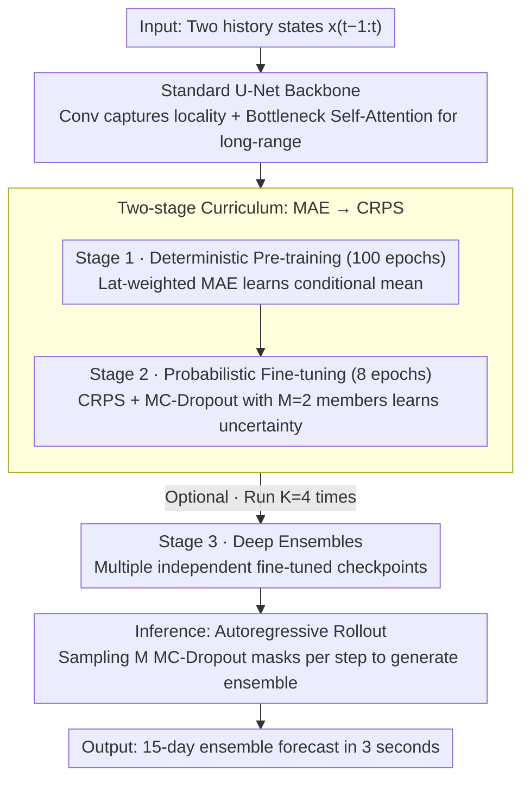

# U-Cast: A Surprisingly Simple and Efficient Frontier Probabilistic AI Weather Forecasting

**Conference**: ICML 2026  
**arXiv**: [2604.09041](https://arxiv.org/abs/2604.09041)  
**Code**: To be confirmed  
**Area**: Time Series / Weather Forecasting / Probabilistic Forecasting  
**Keywords**: Weather Forecasting, Probabilistic Ensemble Forecasting, U-Net, CRPS Loss, MC-Dropout

## TL;DR
U-Cast uses a **simple U-Net backbone** + a **two-stage training curriculum** (MAE pre-training → CRPS fine-tuning) + **MC-Dropout** to achieve probabilistic weather forecasting capabilities comparable to complex professional models (GenCast), while reducing training computation and inference latency by 10×—disrupting the industry stereotype that "frontier performance must be complex."

## Background & Motivation

**Background**: AI weather forecasting has matured to a level comparable with traditional physical models. Early deterministic models (GraphCast, Pangu) developed rapidly but suffered from "blurry forecasts"—where model outputs represent conditional means, losing physical realism. The field has shifted toward probabilistic ensemble forecasting (GenCast, FGN), which has surpassed the ECMWF operational ensemble (IFS ENS) as the new gold standard.

**Limitations of Prior Work**: Recent SOTA models adopt complex professional architectures (Graph Neural Networks, Spherical Neural Operators, 3D-Swin Transformers) + expensive training strategies. GenCast and FGN require hundreds of TPU/GPU days in computational budget, even at 1° resolution. This creates a high barrier to entry—only industry and national laboratories can participate in frontier development, while academia and resource-constrained regions are excluded.

**Key Challenge**: Is such complexity inherently necessary for frontier performance? Are Graph Neural Networks and iterative diffusion processes truly indispensable? Or does the efficiency issue stem from poorly designed training strategies?

**Goal**: To prove that a minimal general-purpose design coupled with an efficient training curriculum can also reach frontier forecasting quality.

**Key Insight**: Following the "Bitter Lesson" perspective—complexity traps often result from sub-optimal optimization rather than inherent task requirements. Hypotheses: (1) Short-term atmospheric dynamics have strong locality suitable for convolutions; (2) Learning physics (determinism) and learning uncertainty can be decoupled to accelerate training; (3) MC-Dropout is more efficient than complex noise injection.

**Core Idea**: Replace complex architectures and training schemes with a standard U-Net + MAE pre-training + CRPS fine-tuning + MC-Dropout + Muon optimizer, maintaining frontier performance while significantly reducing costs.

## Method

### Overall Architecture
A three-stage pipeline: (1) **Deterministic Pre-training** (100 epochs): MAE loss learns atmospheric dynamics, outputting conditional means; (2) **Probabilistic Fine-tuning** (8 epochs): Continues fine-tuning on the pre-trained backbone, activating MC-Dropout and using CRPS loss to learn forecast uncertainty; (3) **Deep Ensembles** (Optional): Repeats Stage 2 for $K=4$ times starting from the same Stage 1 checkpoint. During inference, it performs autoregressive rollouts on the input state $x_{t-1:t}$, generating $M$ MC-Dropout samples per step, completing a 15-day ensemble forecast in 3 seconds.

### Key Designs

**1. Standard U-Net backbone with minimal modifications: Replacing GNNs and Spherical Operators with convolutional inductive bias**

SOTA models generally assume frontier weather forecasting requires complex architectures like GNNs, Spherical Operators, or 3D-Swin, setting a threshold only industry and national labs can afford. U-Cast bets on "Bitter Lesson" simplicity: short-term atmospheric dynamics possess strong locality, matching the inductive bias of convolutions, while long-range interactions can be handled by self-attention at the bottleneck. It employs a standard 896M parameter U-Net with only four minimal modifications—increasing initial layer width to 320 channels, using circular padding along the longitude to respect Earth's periodic topology, auto-interpolation for non-power-of-two grids, and removing unused adaLN timestep conditioning from the original DiffusionUNet. Total modifications are under 300 lines of code, significantly lowering maintenance and reproduction costs compared to ~3000 lines for GNNs, while matching the accuracy of complex models.

**2. Two-stage curriculum (MAE → CRPS): Decoupling physical learning from uncertainty learning**

Training determinism and probability together under an end-to-end CRPS objective is slow and expensive. U-Cast utilizes the property that "the MAE of a single deterministic forecast equals its CRPS" to split training into two segments where the loss landscapes align smoothly. Stage 1 uses latitude-weighted L1 loss $\mathcal{L}_{\text{det}} = \frac{1}{HW} \sum_{h, w} a_h \|f_\theta(x_{t-1:t})_{h, w} - x_{t+1, h, w}\|_1$ to learn the conditional mean. Since it is low-cost (single forward pass), it can run for 100 epochs to solidly learn atmospheric physics. Stage 2 continues fine-tuning on the converged backbone with MC-Dropout enabled, generating only $M=2$ members and using CRPS loss $\mathcal{L}_{\text{prob}} = \frac{1}{HW} \sum a_h (\text{Skill} - \frac{1}{2} \text{Spread})$ to learn uncertainty (where Skill is mean MAE and Spread is ensemble dispersion). Because the backbone has already converged, the probabilistic stage reaches optimality in just 8 epochs, accounting for only ~15% of the total cost. This reduces the incremental cost per deep ensemble member to 1.2 H200-days, two orders of magnitude lower than FGN.

**3. MC-Dropout: Replacing professional noise injection with the simplest stochasticity**

Generating ensemble forecasts requires a source of randomness; professional methods typically use noise projection layers or adaLN modulation, which are heavy and parameter-intensive. U-Cast simply keeps Dropout active during inference: sampling $M$ different masks $\xi^{(m)}$ to generate $M$ forecasts $\hat{x}^{(m)} = f_\theta(x_{t-1:t}; \xi^{(m)})$. This requires no extra noise layers or adaLN and uses 5–10% fewer parameters. While earlier works criticized MC-Dropout for being overconfident with insufficient spread, the authors point out the culprit was not Dropout itself but the MSE objective, which lacks explicit rewards for ensemble dispersion. Switching to CRPS, which optimizes both Skill and Spread, allows the model to naturally utilize Dropout mask variations to produce reasonable dispersion, vindicating this classic technique.

## Key Experimental Results

### Main Results (WeatherBench 2, 1.5° Resolution)

| Model | z500_1d | z500_3d | z500_10d | 10u_1d | Gain vs IFS ENS | Gain vs GenCast |
|------|---------|---------|----------|--------|----------------|----------------|
| U-Cast | 20.3 | 55.2 | 256 | 0.349 | +5.0% | +0.21% |
| U-Cast (DE) | 19.6 | 53.5 | 253 | 0.345 | ~+6% | +0.3% |
| IFS ENS | 22.4 | 58.3 | 262 | 0.406 | baseline | -3.5% |
| GenCast | 20.2 | 54.3 | 254 | 0.332 | +7.3% | baseline |

U-Cast improves upon IFS ENS on 92.9% of variable-lead time combinations (average CRPS gain of 5.0%); it performs at parity with GenCast and even leads by 3% in short-term z500.

### Ablation Study and Efficiency Comparison

| Design Choice | CRPS Change (z500_1d) | Description |
|--------|--------|------|
| Full U-Cast | baseline | Muon + MC-Dropout + Two-stage |
| Replace Muon with AdamW | -15% | Optimizer choice is critical |
| Replace MC-Dropout with adaLN | -1.5% | Slightly better spread but worse CRPS |
| CRPS from scratch (no pre-training) | -3~5% | Curriculum strategy more important than end-to-end |

### Training / Inference Cost Comparison

| Model | Training Days | Inference Latency | Speedup |
|------|--------|--------|--------|
| U-Cast | 8.2 (H200) | 2 sec (H100) | Baseline |
| GenCast (1.5°) | ~100+ (TPUv5) | ~5 min | 150× training / 75× inference |
| FGN (1.5°) | 300 (TPUv5p) | N/A | 37× training |

U-Cast occupies the Pareto frontier—requiring only 3 days on 4 H200s for training and 3 seconds for inference.

### Key Findings
- U-Cast significantly outperforms baselines across all non-stationary modes.
- The choice of Muon vs AdamW leads to a 15% performance difference, a factor often overlooked in industry research.
- Curriculum learning converges over 3 times faster than end-to-end CRPS.
- While MC-Dropout was long considered to have insufficient spread, the paper finds the true culprit was the optimization objective (MSE does not encourage divergence)—this is naturally resolved with CRPS.

## Highlights & Insights
- **Occam's Razor in Model Design**: Disrupts industry stereotypes by proving GNNs/Spherical Operators are not prerequisites for frontier performance if optimization is handled correctly. Standard U-Net using < 300 lines of code matches > 3000 lines of GNN code, carrying profound implications for reproducibility and democratization.
- **Power of Curriculum Learning**: The MAE → CRPS two-stage approach converges 3x faster than end-to-end CRPS; this suggests future work can efficiently iterate on new probabilistic mechanisms by reusing pre-trained backbones.
- **Importance of Optimizer Choice**: The 15% performance gap between Muon and AdamW serves as a valuable lesson for other ML weather forecasting efforts.
- **Vindication of MC-Dropout**: Long dismissed in weather for insufficient spread, the paper identifies the optimization objective as the culprit—an important finding for the general uncertainty quantification community.
- **Potential for Democratized Inference**: Generating a 15-day ensemble forecast in 3 seconds (compared to 11 hours for IFS ENS on 96 CPUs) opens new spaces for applications like extreme event detection and regional fine-tuning.

## Limitations & Future Work
- Polar area artifacts—2D U-Net cannot fully capture spherical topology; future improvements could use lightweight spherical U-Net variants (e.g., based on HEALPix grids).
- Slight under-dispersion—parameter sharing leads to correlated dropout members; Deep Ensembles ($K = 4$) mitigate this.
- Long-term instability—forecasts beyond 20 days become unstable; likely due to the lack of autoregressive training, which could be addressed with an autoregressive fine-tuning stage.
- Lack of initial condition perturbations—calibration could be further improved by adding perturbations to initial conditions.

## Related Work & Insights
- **vs GraphCast / GNN Route**: U-Net balances local and global features via Conv + Self-Attention, achieving parity with 3x fewer lines of code.
- **vs GenCast / Diffusion Route**: GenCast produces realistic ensembles but requires 30+ iterations for inference; U-Cast uses a single forward pass + MC-Dropout for 3-second inference.
- **vs CRPS-from-scratch Schemes**: AIFS-CRPS and FGN require 300+ GPU days for direct CRPS training; U-Cast amortizes costs by shifting complexity to the 15% probabilistic stage.
- **Insights**: Applications of curriculum learning in other generative models (video, molecules); systematic studies of optimizer choices for forecasts across different timescales.

## Rating
- Novelty: ⭐⭐⭐⭐ Although a combination of existing techniques, the systematic exploration and empirical superiority in the weather domain constitute a new contribution; it challenges the industry's obsession with complexity.
- Experimental Thoroughness: ⭐⭐⭐⭐⭐ WeatherBench 2 benchmark (732 initial conditions) + multi-variable multi-lead results + deep ablations + detailed cost analysis.
- Writing Quality: ⭐⭐⭐⭐⭐ Clear and distinct (the title is the claim), fluent logic, standard formulas, and powerful visualizations (Pareto charts).
- Value: ⭐⭐⭐⭐⭐ Reduces costs by 10× to open frontier weather AI research; demonstrates that ML systems should start from "necessary complexity" rather than "fashionable complexity."

<!-- RELATED:START -->

## Related Papers

- [\[ICLR 2026\] Efficient Autoregressive Inference for Transformer Probabilistic Models](../../ICLR2026/time_series/efficient_autoregressive_inference_for_transformer_probabilistic_models.md)
- [\[NeurIPS 2025\] Simple and Efficient Heterogeneous Temporal Graph Neural Network](../../NeurIPS2025/time_series/simple_and_efficient_heterogeneous_temporal_graph_neural_network.md)
- [\[ICML 2026\] Parametric Prior Mapping Framework for Non-stationary Probabilistic Time Series Forecasting](parametric_prior_mapping_framework_for_non-stationary_probabilistic_time_series_.md)
- [\[CVPR 2026\] STCast: Adaptive Boundary Alignment for Global and Regional Weather Forecasting](../../CVPR2026/time_series/stcast_adaptive_boundary_alignment_for_global_and_regional_weather_forecasting.md)
- [\[ICLR 2026\] STORM: Synergistic Cross-Scale Spatio-Temporal Modeling for Weather Forecasting](../../ICLR2026/time_series/storm_synergistic_cross-scale_spatio-temporal_modeling_for_weather_forecasting.md)

<!-- RELATED:END -->
