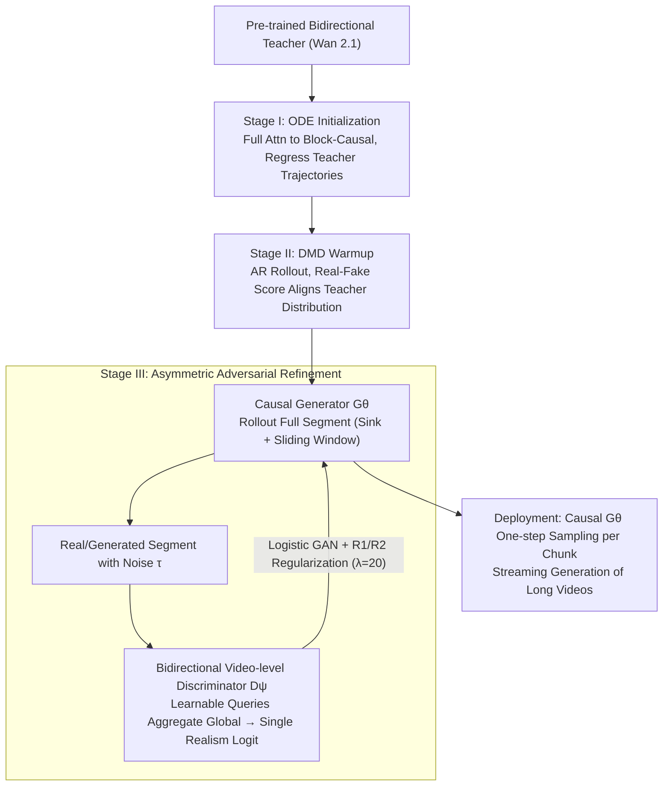

# AAD-1: Asymmetric Adversarial Distillation for One-Step Autoregressive Video Generation

**Conference**: ICML 2026  
**arXiv**: [2606.03972](https://arxiv.org/abs/2606.03972)  
**Code**: https://aad-1.github.io/  
**Area**: Video Generation  
**Keywords**: Video Generation, Autoregressive Diffusion, One-step Distillation, Adversarial Distillation, Long Video Consistency  

## TL;DR
AAD-1 utilizes asymmetric adversarial distillation featuring a "causal generator + bidirectional video-level discriminator" alongside DMD warmup to compress autoregressive image-to-video generation into a single sampling step per chunk, effectively mitigating motion collapse and long-range drift.

## Background & Motivation
**Background**: Video diffusion models typically generate short clips, but fixed lengths and multi-step sampling limit real-time streaming applications. Autoregressive video diffusion supports longer videos by generating block-by-block, reusing context and KV cache, making it suitable for games, world models, and online generation.

**Limitations of Prior Work**: Compressing autoregressive models into few or single steps is challenging. Existing methods often perform causal adaptation, autoregressive rollout, and sampling step distillation simultaneously, imposing a heavy optimization burden. Adversarial distillation, while suitable for one-step generation, tends to leave videos static near the initial frame, leading to motion collapse.

**Key Challenge**: At deployment, the generator must be strictly causal and cannot observe future frames. However, if the discriminator is also limited to the past during training, it struggles to detect drift and static replication accumulating across the entire video sequence. The generation side requires causality, while the supervision side requires a global temporal perspective.

**Goal**: The authors aim to train a one-step autoregressive I2V model that maintains streaming generation capabilities while providing training signals that penalize long-range drift and global motion failure.

**Key Insight**: The paper breaks the structural symmetry between the generator and discriminator. The generator maintains a causal structure, whereas the discriminator utilizes bidirectional spatiotemporal context during training to output a global video-level realism score.

**Core Idea**: Asymmetric adversarial distillation allows the discriminator to observe the global context while the generator remains causal, integrated with ODE initialization and DMD warmup to bring the one-step generator near a stable distribution.

## Method
The AAD-1 method follows a three-stage training recipe. The first stage transforms a pre-trained bidirectional video model into a causal student; the second stage uses distribution matching to align the one-step student with the teacher; the third stage performs adversarial refinement, using a bidirectional video-level discriminator for global temporal supervision.

### Overall Architecture
During deployment, the generator $G_\theta$ generates video chunks sequentially. In each step, it only observes the initial sink frames and the most recent sliding-window context to output the current chunk. During training, the model performs an autoregressive rollout of a complete segment, which is then fed into the discriminator. The discriminator is initialized by the Wan 2.1 T2V backbone, with cross-attention heads inserted into several transformer layers and learnable query tokens aggregating complete spatiotemporal features to output a single video-level logit.

Training consists of three steps. Stage I uses Diffusion Forcing and ODE teacher trajectories to replace the bidirectional model's full attention with block-wise causal attention, supervising the model on discrete downstream time steps. Stage II employs Self-Forcing DMD to match the teacher and student distributions under autoregressive contexts, preventing the one-step output from deviating from the data manifold. Stage III performs adversarial refinement: the full autoregressive video rollout is noise-injected and passed to the bidirectional video-level discriminator, using logistic GAN loss and approximate R1/R2 regularization for asymmetric refinement.

### Key Designs

**1. Three-phase Separated Training (ODE Initialization → DMD Warmup → Adversarial Refinement): Stabilizing the One-step Generator before Refinement**

AAD-1 decomposes "causal adaptation, one-step distribution matching, and perceptual refinement" into three sequential stages rather than a joint objective. Stage I uses Diffusion Forcing to regress on the teacher's ODE denoising trajectory, replacing bidirectional full attention with block-causal attention and supervising only real-world downstream time steps to provide a stable starting point. Stage II uses Self-Forcing DMD within an autoregressive rollout context to pull the one-step student distribution toward the teacher using the difference between real and fake scores. Sequential staging avoids the conflict where DMD pulls toward the teacher while GAN pulls toward real data, preventing training oscillation.

**2. Asymmetric Generator-Discriminator Structure: Causal Generator, Global Bidirectional Discriminator**

While the generator must be strictly causal for streaming rollout, the discriminator faces no such constraint during training. AAD-1 breaks this structural symmetry. $G_\theta$ only accesses sink frames and recent sliding-window history frames to ensure autoregressive inference and KV-cache reuse. Conversely, $D_\psi$ uses bidirectional attention to scan the full spatiotemporal volume, using learnable query tokens to aggregate global features. This addresses motion collapse—a global temporal failure where individual frames might look "real" (even if static), but the entire sequence lacks motion. Only a global view can effectively penalize "static replication" or "gradual drift."

**3. Noisy Discriminator Inputs and R1/R2 Regularization: Stabilizing 14B Scale Asymmetric Adversarial Training**

Asymmetric $G_\theta$/$D_\psi$ pairs at the 14B scale are highly prone to training collapse. Unlike APT, AAD-1 adds Gaussian noise at a random timestep $\tau$ to both real and generated segments before feeding them to the discriminator. It also utilizes approximate R1/R2 regularization with a weight of $\lambda=20$ to penalize sensitivity to small perturbations. Ablations show that $\lambda=0$ leads to collapse, while $\lambda=50$ introduces grid artifacts; an intermediate weight ensures smooth gradients.

### Loss & Training
Stage I uses ODE trajectory regression, formulated as $\|G_\theta(z_t,\tilde{x}_{ctx,t},c)-S^{ODE}_\phi(z_t,\tilde{x}_{ctx,t},c)\|_2^2$. Stage II uses the DMD gradient, involving the difference between real and fake scores multiplied by the gradient of the generated sequence. Stage III uses standard logistic GAN: the discriminator maximizes real segment scores and minimizes generated scores, while the generator maximizes the discriminator's realism judgment of generated segments. The implementation uses a Wan 2.1 14B backbone, with 2,000 steps for Stage I, ~100 steps for Stage II with early stopping, and 200 steps for Stage III.

## Key Experimental Results

### Main Results
The main experiments compare one-step AAD-1 against multi-step autoregressive baselines on VBench-I2V, using Wan 2.1 I2V (100 NFE) as a bidirectional reference.

| Method | NFE | Subject Cons.↑ | Background Cons.↑ | Dynamic Degree↑ | Imaging Quality↑ | I2V Subject↑ | I2V Background↑ |
|--------|------|------|------|------|------|------|------|
| Wan 2.1 I2V | 100 | 93.88 | 94.86 | 51.09 | 70.12 | 96.80 | 98.59 |
| CausVid | 4 | 83.45 | 89.37 | 33.80 | 70.60 | 92.91 | 83.34 |
| Self Forcing | 4 | 91.77 | 93.41 | 34.93 | 71.50 | 95.79 | 91.18 |
| AAD-1 Stage-II | 1 | 92.14 | 92.13 | 50.30 | 69.37 | 96.56 | 95.12 |
| AAD-1 Stage-III | 1 | 94.34 | 95.08 | 41.46 | 71.49 | 98.65 | 97.83 |

### Ablation Study

| Configuration | Key Metrics | Description |
|------|---------|------|
| w/o DMD warmup | Aesthetic 53.63, Imaging 62.81 | Initial one-step distribution too far; GAN refinement unstable |
| w/ DMD warmup | Aesthetic 58.64, Imaging 69.37 | Warmup significantly improves base quality before adversarial stage |
| Causal DiT + frame-wise logit | Dynamic Degree 1.08 | Degenerates into static video, typical motion collapse |
| Causal DiT + video-wise logit | Drift 7.10, Dynamics 42.07 | Motion exists but severe long-range drift occurs |
| Bidirectional DiT + frame-wise logit | Drift 4.38, Dynamics 39.04 | Bidirectional context significantly reduces drift |
| Bidirectional DiT + video-wise logit | Drift 4.02, Dynamics 39.29 | Best drift control, default configuration |
| 14B 1 NFE inference | Latency 1.134s, Throughput 14.33 FPS | Much faster than 2.822s / 5.71 FPS for 4 NFE |

### Key Findings
- Stage-III adversarial refinement improves subject/background consistency and I2V faithfulness but sacrifices some motion magnitude compared to Stage-II.
- Discriminator visibility is more critical than logit granularity: a causal backbone accumulates errors, whereas a bidirectional backbone provides a future-anchored critique.
- DMD warmup is a prerequisite for stable one-step GAN training; without it, the generator collapses if it enters the adversarial stage too early.
- Regularization coefficients have a narrow window; $\lambda=20$ strikes the best balance between stability and detail.

## Highlights & Insights
- The most clever aspect is the asymmetry: inference constraints only require the generator to be causal, while the discriminator can fully exploit future frames. this decouple "deployment structure" from "supervision structure."
- Video-level logits target the root cause of motion collapse. Frame-wise discrimination only checks marginal image distributions, whereas video-level discrimination penalizes sequences with no motion.
- The three-stage training decomposes a difficult problem: learning causality first, then one-step distribution, then perceptual refinement. This is more stable than joint loss optimization.

## Limitations & Future Work
- One-step chunk-wise generation remains prone to blurring or structural deformation in fast-motion scenes because large displacements are compressed into a single denoising step.
- Complex local structures like faces and hands require high synchronization across frames within a chunk; detail retention is still weaker than multi-step or single-frame refinement.
- Adversarial refinement was primarily trained on 5-second segments; long-term extrapolation still accumulates errors with autoregressive rollout.
- Training costs are high: approximately 3.5 days on 64 H20 GPUs. Stage III peak memory is about 1040GB, indicating high entry barriers for training despite fast inference.

## Related Work & Insights
- **vs Self Forcing / Diffusion Forcing**: These address the autoregressive train-test gap. AAD-1 adopts the self-rollout concept and compresses it into one step.
- **vs APT2**: APT2 uses a causal frame-wise discriminator. AAD-1 switches to a bidirectional video-level discriminator and proves its necessity through large-scale controlled ablations.
- **vs Wan 2.1 I2V**: Wan serves as a strong bidirectional multi-step teacher. AAD-1 utilizes its backbone and distributional knowledge to obtain a real-time friendly autoregressive model.
- **Insight**: In many generative tasks, the critic during training does not need to obey the causal constraints of inference. As long as the generator maintains deployment constraints, the critic can provide more global and computationally expensive quality oversight.

## Rating
- Novelty: ⭐⭐⭐⭐⭐ The asymmetric design of a causal generator and bidirectional video-level discriminator captures the core contradiction of one-step AR video.
- Experimental Thoroughness: ⭐⭐⭐⭐☆ Covers VBench, user preference, warmup, discriminator visibility, and efficiency; longer real-world benchmarks could be strengthened.
- Writing Quality: ⭐⭐⭐⭐☆ Clear method progression; formulas and training details are sufficient.
- Value: ⭐⭐⭐⭐⭐ Significant reference for real-time video generation and world model streaming inference, particularly the critic design logic.

<!-- RELATED:START -->

## Related Papers

- [\[ICLR 2026\] Towards One-Step Causal Video Generation via Adversarial Self-Distillation](../../ICLR2026/video_generation/towards_one-step_causal_video_generation_via_adversarial_self-distillation.md)
- [\[ICML 2026\] SGMD: Score Gradient Matching Distillation for Few-Step Video Diffusion](sgmd_score_gradient_matching_distillation_for_few-step_video_diffusion_distillat.md)
- [\[AAAI 2026\] Phased One-Step Adversarial Equilibrium for Video Diffusion Models](../../AAAI2026/video_generation/phased_one-step_adversarial_equilibrium_for_video_diffusion_models.md)
- [\[ICML 2025\] Diffusion Adversarial Post-Training for One-Step Video Generation](../../ICML2025/video_generation/diffusion_adversarial_post-training_for_one-step_video_generation.md)
- [\[ICLR 2026\] Streaming Autoregressive Video Generation via Diagonal Distillation](../../ICLR2026/video_generation/streaming_autoregressive_video_generation_via_diagonal_distillation.md)

<!-- RELATED:END -->
