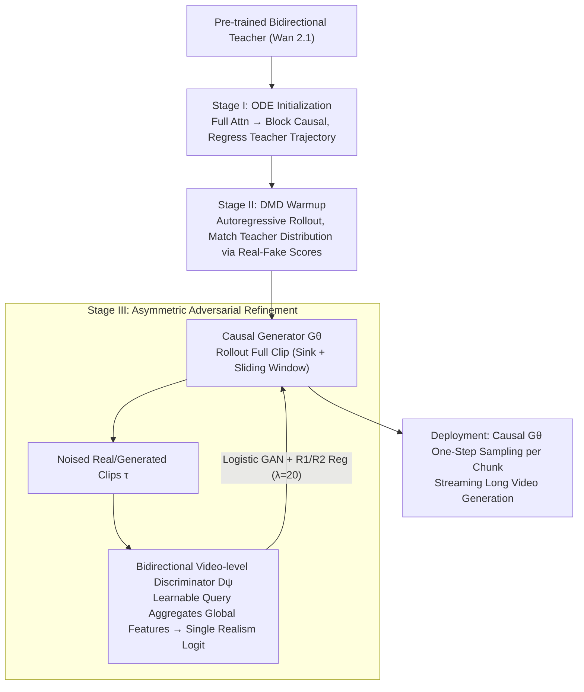

# AAD-1: Asymmetric Adversarial Distillation for One-Step Autoregressive Video Generation

**Conference**: ICML 2026  
**arXiv**: [2606.03972](https://arxiv.org/abs/2606.03972)  
**Code**: https://aad-1.github.io/  
**Area**: Video Generation  
**Keywords**: Video generation, autoregressive diffusion, one-step distillation, adversarial distillation, long-video consistency  

## TL;DR
AAD-1 utilizes asymmetric adversarial distillation with a "causal generator + bidirectional video-level discriminator" alongside DMD warmup to compress autoregressive image-to-video generation to a single sampling step per chunk, while mitigating motion collapse and long-range drift.

## Background & Motivation
**Background**: Video diffusion models typically generate short clips, but fixed lengths and multi-step sampling limit real-time streaming applications. Autoregressive video diffusion supports longer videos through block-wise generation, context reuse, and KV cache, making it suitable for games, world models, and online generation.

**Limitations of Prior Work**: Compressing autoregressive models to few or even a single step is challenging. Existing methods often perform causal adaptation, autoregressive rollout, and sampling step distillation simultaneously, leading to a heavy optimization burden. While adversarial distillation is suitable for one-step generation, it tends to make videos static near the initial frame, resulting in motion collapse.

**Key Challenge**: At deployment, the generator must be strictly causal and cannot access future frames. However, if the discriminator is also limited to the past during training, it becomes difficult to detect drift and static replication that accumulate across the entire video. The generation side requires causality, while the supervision side requires a global temporal perspective.

**Goal**: The authors aim to train a one-step autoregressive I2V model that maintains streaming capabilities while penalizing long-range drift and global motion failures through training signals.

**Key Insight**: The paper breaks the structural symmetry between the generator and the discriminator: the generator maintains a causal structure, whereas the discriminator utilizes bidirectional spatio-temporal context during training and outputs a holistic video-level realism score.

**Core Idea**: Use asymmetric adversarial distillation to allow the discriminator a global view while the generator remains causal, combined with ODE initialization and DMD warmup to bring the one-step generator near a stable distribution.

## Method
The methodology of AAD-1 can be understood as a three-stage training recipe. Stage I transforms a pre-trained bidirectional video model into a causal student; Stage II uses distribution matching to bring the one-step student closer to the teacher; Stage III performs adversarial refinement using a bidirectional video-level discriminator for global temporal supervision.

### Overall Architecture
During deployment, the generator $G_\theta$ generates video chunks sequentially. It accesses only the initial sink frames and the most recent sliding-window context to output the current chunk. During training, the model performs an autoregressive rollout of a complete clip, which is then fed into the discriminator. The discriminator is initialized from the Wan 2.1 T2V backbone, with cross-attention heads inserted into several transformer layers. These heads use learnable query tokens to aggregate complete spatiotemporal features and output a single video-level logit.

Training consists of three steps. Stage I uses Diffusion Forcing and ODE teacher trajectories to replace the full attention of the bidirectional model with block-wise causal attention, supervising the model on select downstream time steps. Stage II employs Self-Forcing DMD to match the distributions of the teacher and student under autoregressive context, ensuring one-step outputs do not deviate from the data manifold. Stage III introduces adversarial training: an entire video is rolled out autoregressively, noised, and fed into the bidirectional video-level discriminator, using logistic GAN loss with approximate R1/R2 regularization for asymmetric refinement.

### Key Designs

**1. Three-Stage Decoupled Training (ODE Initialization → DMD Warmup → Adversarial Refinement): Stabilizing the one-step generator before adversarial refinement.**

AAD-1 decouples "causal adaptation, one-step distribution matching, and perceptual refinement" into three sequential stages. Stage I uses Diffusion Forcing to regress on the teacher's ODE denoising trajectory, replacing bidirectional attention with block-causal attention. Stage II uses Self-Forcing DMD within autoregressive rollouts to pull the student distribution toward the teacher. This sequential approach avoids the instability of joint losses (like DMD2), where the teacher distribution (DMD target) and real data distribution (GAN target) may conflict. Ablations show that omitting DMD warmup causes the one-step generator to degrade rapidly during cold-start adversarial training.

**2. Asymmetric Generator-Discriminator Structure: Causal generator, bidirectional global discriminator.**

The generator must be strictly causal for streaming rollout at deployment, but the discriminator has no such constraint during training. AAD-1 breaks this symmetry. $G_\theta$ only accesses sink frames and recent sliding-window history frames to ensure autoregressive inference and KV-cache reuse. Conversely, $D_\psi$ scans the entire spatiotemporal volume using bidirectional attention during training, aggregating global features into a single video-level logit via learnable query tokens. This design targets motion collapse—a global temporal failure where frames look "real" individually (e.g., repeating the same frame), but the lack of motion or gradual drift is only visible when analyzing the entire sequence.

**3. Noised Discriminator Input & R1/R2 Regularization: Stabilizing 14B scale asymmetric adversarial training.**

Asymmetric $G_\theta$/$D_\psi$ pairs are prone to collapse at a 14B parameter scale. Unlike APT, AAD-1 feeds both real and generated clips into the discriminator after adding Gaussian noise at a random timestep $\tau$. It also employs approximate R1/R2 regularization to penalize discriminator sensitivity to small perturbations, using a weight of $\lambda=20$. Ablations indicate a narrow window for this weight: $\lambda=0$ leads to collapse, while $\lambda=50$ introduces grid artifacts. Balanced noise and regularization allow the discriminator to provide smooth gradients.

### Loss & Training
Stage I utilizes ODE trajectory regression with an objective of the form $\|G_\theta(z_t,\tilde{x}_{ctx,t},c)-S^{ODE}_\phi(z_t,\tilde{x}_{ctx,t},c)\|_2^2$. Stage II uses the DMD gradient, which involves the difference between real and fake scores multiplied by the gradient of the generated sequence. Stage III uses a standard logistic GAN objective: the discriminator maximizes real clip scores and minimizes generated scores, while the generator maximizes the realism of generated clips. The implementation uses the Wan 2.1 14B backbone, with Stage I training for 2,000 steps, Stage II DMD for ~100 steps (with early stopping), and Stage III for 200 steps.

## Key Experimental Results

### Main Results
The main experiment compares one-step AAD-1 with multi-step autoregressive baselines on VBench-I2V, using Wan 2.1 I2V (100 NFE) as a bidirectional reference.

| Method | NFE | Subject Cons.↑ | Background Cons.↑ | Dynamic Degree↑ | Imaging Quality↑ | I2V Subject↑ | I2V Background↑ |
|--------|------|------|------|------|------|------|------|
| Wan 2.1 I2V | 100 | 93.88 | 94.86 | 51.09 | 70.12 | 96.80 | 98.59 |
| CausVid | 4 | 83.45 | 89.37 | 33.80 | 70.60 | 92.91 | 83.34 |
| Self Forcing | 4 | 91.77 | 93.41 | 34.93 | 71.50 | 95.79 | 91.18 |
| AAD-1 Stage-II | 1 | 92.14 | 92.13 | 50.30 | 69.37 | 96.56 | 95.12 |
| AAD-1 Stage-III | 1 | 94.34 | 95.08 | 41.46 | 71.49 | 98.65 | 97.83 |

### Ablation Study

| Configuration | Key Metrics | Note |
|------|---------|------|
| w/o DMD warmup | Aesthetic 53.63, Imaging 62.81 | One-step distribution too far; GAN refinement unstable |
| w/ DMD warmup | Aesthetic 58.64, Imaging 69.37 | Warmup significantly improves base quality before GAN stage |
| Causal DiT + frame-wise logit | Dynamic Degree 1.08 | Degenerates to static video (motion collapse) |
| Causal DiT + video-wise logit | Drift 7.10, Dynamics 42.07 | Motion present but severe long-range drift |
| Bidirectional DiT + frame-wise logit | Drift 4.38, Dynamics 39.04 | Bidirectional context significantly reduces drift |
| Bidirectional DiT + video-wise logit | Drift 4.02, Dynamics 39.29 | Best drift control; default configuration |
| 14B 1 NFE inference | Latency 1.134s, Throughput 14.33 FPS | Much faster than 2.822s / 5.71 FPS of 4 NFE |

### Key Findings
- Stage-III adversarial refinement improves subject/background consistency and I2V faithfulness but sacrifices some motion magnitude; Stage-II exhibits higher Dynamic Degree.
- Discriminator visibility is more critical than logit granularity: a causal backbone accumulates errors, whereas a bidirectional backbone provides future-anchored critiques.
- DMD warmup is a necessary prerequisite for stable one-step GAN training; without it, the generator collapses if it enters the adversarial stage too early.
- Regularization coefficients have a narrow window: $\lambda=0$ leads to collapse, $\lambda=50$ results in grid artifacts, and $\lambda=20$ achieves the best balance.

## Highlights & Insights
- The most clever aspect is the asymmetry: inference constraints only require the generator to be causal, while the training discriminator can leverage future frames. This decouples the "deployment structure" from the "supervision structure."
- Video-level logits directly address the root cause of motion collapse. Frame-wise discrimination only checks marginal image distributions, whereas video-level discrimination penalizes sequences without motion.
- Three-stage training breaks down the complex problem: first causalization, then one-step distribution matching, followed by perceptual refinement. This is more stable than a joint loss.

## Limitations & Future Work
- One-step chunk-wise generation remains prone to blurring or structural deformation in fast-motion scenarios due to the compression of large displacements into a single denoising step.
- Complex local structures like faces and hands require high synchronization across frames within a chunk; detail retention is still weaker than multi-step or single-frame refinement.
- Adversarial refinement is primarily trained on 5-second clips; long video extrapolation still accumulates errors over autoregressive rollouts.
- Training costs are high: approximately 3.5 days on 64 H20 GPUs. Stage III peak VRAM is around 1040GB, indicating high entry barriers for training.

## Related Work & Insights
- **vs Self Forcing / Diffusion Forcing**: They address the autoregressive train-test gap; AAD-1 adopts the self-rollout approach and further compresses it to one-step.
- **vs APT2**: APT2 utilizes a causal frame-wise discriminator; AAD-1 uses a bidirectional video-level discriminator and provides large-scale controlled ablations for its necessity.
- **vs Wan 2.1 I2V**: Wan serves as the strong bidirectional multi-step teacher/reference; AAD-1 utilizes its backbone and distribution knowledge to obtain a real-time-friendly autoregressive model.
- **Insight**: In many generative tasks, the critic during training does not need to obey the causal constraints of inference; as long as the generator maintains deployment constraints, the critic can perform more global and expensive quality reviews.

## Rating
- Novelty: ⭐⭐⭐⭐⭐ The asymmetric design of the causal generator and bidirectional video-level discriminator captures the core contradiction of one-step autoregressive video.
- Experimental Thoroughness: ⭐⭐⭐⭐☆ Covers VBench, user preference, warmup, discriminator, and efficiency; benchmarks for longer real videos could be strengthened.
- Writing Quality: ⭐⭐⭐⭐☆ Clear methodology, sufficient formulas, and training details; implementation costs are in the appendix.
- Value: ⭐⭐⭐⭐⭐ Highly relevant for real-time video generation and world model streaming inference, especially the critic design philosophy.

<!-- RELATED:START -->

## Related Papers

- [\[AAAI 2026\] Phased One-Step Adversarial Equilibrium for Video Diffusion Models](../../AAAI2026/video_generation/phased_one-step_adversarial_equilibrium_for_video_diffusion_models.md)
- [\[ICML 2026\] SGMD: Score Gradient Matching Distillation for Few-Step Video Diffusion](sgmd_score_gradient_matching_distillation_for_few-step_video_diffusion_distillat.md)
- [\[ICML 2025\] Diffusion Adversarial Post-Training for One-Step Video Generation](../../ICML2025/video_generation/diffusion_adversarial_post-training_for_one-step_video_generation.md)
- [\[ICLR 2026\] Streaming Autoregressive Video Generation via Diagonal Distillation](../../ICLR2026/video_generation/streaming_autoregressive_video_generation_via_diagonal_distillation.md)
- [\[ICML 2026\] Light Forcing: Accelerating Autoregressive Video Diffusion via Sparse Attention](light_forcing_accelerating_autoregressive_video_diffusion_via_sparse_attention.md)

<!-- RELATED:END -->
