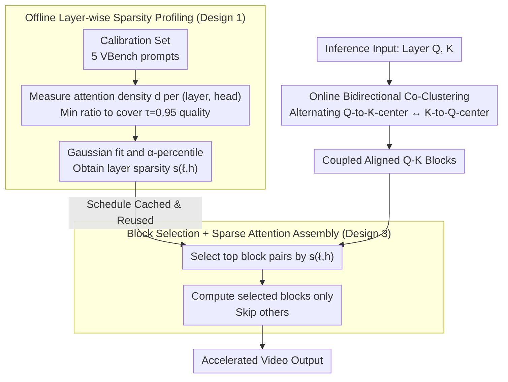

# Attention Sparsity is Input-Stable: Training-Free Sparse Attention for Video Generation via Offline Sparsity Profiling and Online QK Co-Clustering

**Conference**: ICML 2026  
**arXiv**: [2603.18636](https://arxiv.org/abs/2603.18636)  
**Code**: https://github.com/Mutual-Luo/SVOO  
**Area**: Video Generation / Diffusion Models / Model Efficiency  
**Keywords**: Sparse Attention, DiT, Video Generation Acceleration, Co-Clustering, Layer-wise Sparsity

## TL;DR
SVOO discovers that the attention sparsity of each layer in video DiT is an intrinsic property that is "input-independent within layers and significantly heterogeneous between layers." Based on this, it performs offline per-layer sparsity calibration followed by online QK bidirectional co-clustering for block partitioning. It achieves up to 1.93× speedup while maintaining a PSNR of 29 dB across 7 models (e.g., Wan, HunyuanVideo) without any training.

## Background & Motivation

**Background**: 3D DiT has become the mainstream backbone for high-fidelity video generation (isomorphic with Wan, HunyuanVideo, and Sora). However, the cost of dense 3D self-attention grows quadratically with the number of tokens; running Wan2.1-1.3B (720p, 81 frames) on a single H200 takes 417s. Recent acceleration approaches focus on "sparse attention," divided into training-based (VMoBA, VSA, DSV, BSA) and training-free (SVG, SVG2, STA, Radial, SpargeAttn, XAttention, DraftAttention, etc.). The latter is easier to deploy without retraining but generally yields inferior results compared to the former.

**Limitations of Prior Work**: The authors precisely summarize the bottlenecks of training-free sparse attention into two issues: (L1) **Overlooking layer heterogeneity**—using a uniform sparsity rate across all transformer layers ignores functional differences between layers; (L2) **Overlooking Q-K coupling**—performing independent k-means for query and key during block partitioning ignores that significant block-level patterns arise from Q-K joints. Independent partitioning fragments high-quality attention regions.

**Key Challenge**: Determination of the "sparsity ratio" requires considering layer-wise heterogeneity, whereas "how to partition blocks" must treat Q and K as a coupled system rather than independent items. Existing methods use naive uniform/independent assumptions in both dimensions, limiting the quality upper bound under fixed computational budgets.

**Goal**: Simultaneously remove the above two constraints without retraining DiT to achieve a superior quality–speed trade-off.

**Key Insight**: The authors observe and theoretically support that "layer-wise sparsity is an intrinsic property determined by $\mathbf{W}_Q\mathbf{W}_K^\top$ and is nearly insensitive to input." Thus, it can be "calibrated once offline and reused globally online." This property allows the cost of per-layer sparsity rates to be amortized to nearly zero.

**Core Idea**: Replace "uniform sparsity + independent Q/K partitioning" with **"offline layer-wise sparsity profiling + online bidirectional QK co-clustering."** Each layer's sparsity budget is fed into a block partitioning algorithm that truly considers Q-K coupling.

## Method

### Overall Architecture
SVOO is a two-stage pipeline: (i) Offline stage—using a small calibration set (a few prompt samples from VBench), a forward pass is executed on the original model to count the attention density of each (layer, head). A conservative high percentile is taken as the layer sparsity $s_{\ell,h}$. (ii) Online stage—during inference, bidirectional co-clustering is applied to queries and keys per layer and head. Based on the offline schedule, top block pairs are selected for dense computation while other blocks are skipped. The stages are independent; the schedule is a set of coefficients (<1MB) that can be cached.

### Key Designs

**1. Offline Layer-wise Sparsity Profiling: Sparsity as an Intrinsic Property**

Existing training-free methods use a uniform sparsity rate for all layers, ignoring functional differences (L1 defect). SVOO's key observation is that sparsity is determined by the weight matrix $\mathbf{W}_Q\mathbf{W}_K^\top$ and is input-insensitive. For a prompt $x^k$, the attention matrix rows for head $h$ are sorted by value; $d_{\ell,h}^{(k)}$ is the minimum ratio of elements covering a cumulative density $\tau=0.95$. A univariate Gaussian $\mathcal{N}(\mu_{\ell,h},\sigma_{\ell,h}^2)$ is fitted over $m$ calibration inputs, and a conservative density estimate $\hat d_{\ell,h}=\mu+z_\alpha\sigma$ is used ($\alpha=0.95$). Final sparsity is $s_{\ell,h}=1-\hat d_{\ell,h}$. Theorem 4.2 proves that under Bounded Token Representation, $|V(\mathbf{X})-V(\hat{\mathbf{X}})|$ is controlled by $\|\mathbf{M}\|_2^2$ and $1/\sqrt n$. Since $n$ is large in video generation, layer-wise sparsity is naturally stable across prompts.

**2. Online Bidirectional Co-Clustering: Q-K Coupled Partitioning**

Traditional methods (e.g., SVG2) perform independent k-means on queries and keys, assuming optimal key partitioning is independent of queries (L2 defect). However, block-level patterns stem from Q-K interactions. SVOO uses alternating bidirectional co-clustering: Step A uses previous query centers $\mathbf{C}_q^{(i-1)}$ as anchors to compute affinity vectors $\mathbf{P}_k=\mathcal{K}(\mathbf{C}_q)^\top$ for keys, then assigns keys to the nearest key-block centers $\bar{\mathbf{P}}_k[j]$. Step B symmetrically re-partitions queries using updated key centers $\mathbf{C}_k^{(i)}$. Using cross-affinity instead of Euclidean distance ensures that tokens within the same block share similar "cross-attention preferences." The process involves only matrix multiplications at the scale of token count × block count, which is much smaller than $n \times n$.

**3. Block Selection + Sparse Attention Assembly**

Given $s_{\ell,h}$ and coupled block partitions, the final step determines which block pairs undergo dense attention. SVOO uses block centers for coarse estimation $\hat A_{ij}=\mathbf{C}_q[i]\mathbf{C}_k[j]^\top$. For each query block, top-$\lceil(1-s_{\ell,h})K_k\rceil$ key blocks are selected via $\hat A$. Only these pairs undergo precise attention; others are treated as 0. Softmax is normalized over the remaining logits. Because co-clustering aligns high-quality attention into a few block pairs, PSNR is maintained even at low retention ratios.

### Loss & Training
Fully training-free. All changes occur in the inference path: calibration is done once with 5 VBench prompts to obtain $s_{\ell,h}$. During inference, each transformer layer performs $I_{\max}$ rounds of co-clustering (typically single digits) before sparse attention. The schedule file is negligible in size and can be distributed with the checkpoint.

## Key Experimental Results

### Main Results
Evaluation on 7 mainstream video DiTs (Wan2.1-T2V 1.3B/14B, Wan2.1-I2V-14B, Wan2.2 series, HunyuanVideo). Benchmarks use H200, 720p, 81 frames.

| Model | Method | PSNR↑ | LPIPS↓ | ImgQual↑ | Latency | Speedup |
|------|------|-------|--------|----------|------|------|
| Wan2.1-1.3B-T2V | Origin | — | — | 66.58 | 417s | 1.00× |
| Wan2.1-1.3B-T2V | SVG2 | 29.27 | 0.127 | 61.83 | 241s | 1.73× |
| Wan2.1-1.3B-T2V | **Ours** | **29.99** | **0.125** | **66.57** | **216s** | **1.93×** |
| Wan2.1-14B-T2V | SVG2 | 27.34 | 0.111 | 68.29 | 1261s | 1.57× |
| Wan2.1-14B-T2V | **Ours** | **27.79** | 0.111 | **68.92** | **1203s** | **1.64×** |
| Wan2.2-14B-T2V | SVG2 | 24.48 | 0.142 | 71.51 | 1061s | 1.52× |
| Wan2.2-14B-T2V | **Ours** | **24.85** | 0.144 | **72.92** | **984s** | **1.63×** |

Ours achieves both higher quality and faster speed across almost all metrics. ImageQuality remains comparable to the original model (66.57% vs 66.58%), whereas SVG2 drops by 4.7 points.

### Ablation Study

| Configuration | Key Metric | Description |
|------|---------|------|
| Full SVOO | PSNR 29.99 / 1.93× | Profiling + Co-clustering enabled |
| w/o Profiling (Uniform) | Significant PSNR drop | Degrades to baseline ignoring L1 heterogeneity |
| w/o Co-clustering (Independent) | Close to SVG2 | Quality–speed trade-off deteriorates; L2 defect |
| Varying $\tau$, $\alpha$ | Stable | Calibration is insensitive within reasonable ranges, verifying input-independence |

### Key Findings
- "Layer sparsity is nearly input-independent" is empirically observed and proven via Theorem 4.2. Layer differences are determined by $\mathbf{M}=\mathbf{W}_Q\mathbf{W}_K^\top$, while intra-layer variance is suppressed by $1/\sqrt n$.
- Gains from co-clustering are most evident on cluster-based baselines (SVG2). Bidirectional cross-affinity significantly improves block selection accuracy.
- Speedup is more pronounced on the 1.3B model (1.93×) vs 14B (1.64×) because the FFN ratio increases in larger models, yielding diminishing returns for attention acceleration.

## Highlights & Insights
- Transforming "sparsity selection" into a **one-time offline calibration** avoids both training and online search overhead, representing a robust "theory + engineering" design.
- By identifying the overlooked Q-K decoupling, the co-clustering solves the issue with cross-affinity iterations rather than heavy attention approximations, offering high transfer value.
- Theorem 4.2 upgrades "5-prompt calibration" from an empirical trick to a provable conclusion, mitigating concerns about domain shifts in prompts.

## Limitations & Future Work
- Experiments focused on 720p×81 frames; whether co-clustering iterations remain low for higher resolutions/longer sequences requires verification.
- $\tau=0.95$ and $\alpha=0.95$ are empirical; aggressive/conservative needs may require manual tuning. There is no differentiable optimization path from schedule to quality metrics.
- Speedup is bounded by the attention-to-total-cost ratio. In models with heavy FFNs (HunyuanVideo), benefits are lower than in Wan2.1-1.3B. Orthogonal combinations with FFN acceleration were not explored.

## Related Work & Insights
- **vs SVG2**: Both use clustering for partitioning, but SVG2 clusters Q and K independently. SVOO uses bidirectional cross-affinity for alignment and per-layer scheduling.
- **vs XAttention / SpargeAttn**: These use aggregated activation to estimate block importance. SVOO emphasizes "correct partitioning before selection."
- **vs BSA/DSV**: BSA jointly sparsifies Q and KV during training. SVOO adapts this coupling concept to a training-free inference algorithm, proving significant potential for training-free DiT routes.

## Rating
- Novelty: ⭐⭐⭐⭐ Empirical and theoretical combination for input-stable sparsity is a fresh intuition.
- Experimental Thoroughness: ⭐⭐⭐⭐⭐ Coverage of 7 DiTs, T2V/I2V tasks, and 5 baselines.
- Writing Quality: ⭐⭐⭐⭐ Logical flow from motivation to Theorem 4.2.
- Value: ⭐⭐⭐⭐⭐ Easy to deploy, orthogonal to training-based methods, and near-zero cost for existing DiT services.

<!-- RELATED:START -->

## Related Papers

- [\[ICML 2026\] DFSAttn: Dynamic Fine-Grained Sparse Attention for Efficient Video Generation](dfsattn_dynamic_fine-grained_sparse_attention_for_efficient_video_generation.md)
- [\[ICML 2026\] VEDA: Scalable Video Diffusion via Distilled Sparse Attention](veda_scalable_video_diffusion_via_distilled_sparse_attention.md)
- [\[CVPR 2026\] RAPID: Reusing Attention Sparsity with Inter-step Adaptation for Efficient Video Diffusion](../../CVPR2026/video_generation/rapid_reusing_attention_sparsity_with_inter-step_adaptation_for_efficient_video_.md)
- [\[ICML 2026\] Light Forcing: Accelerating Autoregressive Video Diffusion via Sparse Attention](light_forcing_accelerating_autoregressive_video_diffusion_via_sparse_attention.md)
- [\[CVPR 2026\] AdaCluster: Adaptive Query-Key Clustering for Sparse Attention in Video Generation](../../CVPR2026/video_generation/adacluster_adaptive_query-key_clustering_for_sparse_attention_in_video_generatio.md)

<!-- RELATED:END -->
